# 너로 정했다! LLM

> **AI 챗봇 · 팀 빌더 · 배틀 시뮬레이터 · 포켓몬 도감 · GitHub OAuth 로그인 · 확장 프로그램 · 미니게임**  
> LangGraph 기반 하이브리드 RAG · Neo4j 그래프 DB · PostgreSQL pgvector

**SKN27-3rd-3TEAM** · SKN AI 캠프 27기 3차 프로젝트 · 2025.04.30 ~ 2025.05.15

---

## 팀 구성

<table align="center">
  <tr>
    <td align="center" width="300">
      <br>
      <b>재강</b><br>
      <sub>Neo4j 포켓몬 관계망 구축</sub><br>
      <sub>하이브리드 RAG 추천 엔진</sub><br>
      <sub>FastAPI 기반 API 및 DB 구현</sub><br><br>
      <a href="../../wiki/재강">📄 담당 기능</a>
    </td>
    <td align="center" width="300">
      <br>
      <b>필주</b><br>
      <sub>LangGraph 기반 챗봇 구축</sub><br>
      <sub>CRAG·하이브리드 검색 최적화</sub><br>
      <sub>SSE 스트리밍 및 출처 렌더링</sub><br><br>
      <a href="../../wiki/필주">📄 담당 기능</a>
    </td>
    <td align="center" width="300">
      <br>
      <b>재경</b><br>
      <sub>기술데이터 전처리 및 구조화</sub><br>
      <sub>LLM 기반 턴제 배틀 엔진 개발</sub><br><br>
      <a href="../../wiki/재경">📄 담당 기능</a>
    </td>
    <td align="center" width="300">
      <br>
      <b>재희</b><br>
      <sub>UI/UX 설계 및 렌더링 최적화</sub><br>
      <sub>AI 크롬 확장 프로그램 개발</sub><br>
      <sub>데이터 파이프라인 및 서버 구축</sub><br><br>
      <a href="../../wiki/재희">📄 담당 기능</a>
    </td>
    <td align="center" width="300">
      <br>
      <b>송원</b><br>
      <sub>분기형 배틀 엔진 로직 구현</sub><br>
      <sub>턴제 시뮬레이터 구현</sub><br>
      <sub>상성 및 관계망 아키텍처 설계</sub><br><br>
      <a href="../../wiki/송원">📄 담당 기능</a>
    </td>
  </tr>
</table>

---

## 📚 Wiki 문서

| 문서 | 내용 |
|---|---|
| [Architecture](../../wiki/Architecture) | 서비스 구성 · Docker 네트워크 · 프로젝트 파일 구조 |
| [Database](../../wiki/Database) | PostgreSQL ERD · Neo4j 실제 스키마 · 데이터 수집·전처리 · 벡터 청킹 기준 |
| [AI-Pipeline](../../wiki/AI-Pipeline) | LangGraph RAG 9-노드 · 챗봇 멀티툴 에이전트 · 환각 방지 전략 · RAG 품질 평가 |
| [TeamBuilder](../../wiki/TeamBuilder) | 요구사항 · Graph-guided Hybrid RAG · 가중치 정책 · 시퀀스 · 프롬프트 명세 · ERD |
| [Login](../../wiki/Login) | GitHub OAuth 2.0 · 병렬 통계 수집 · 세션 이중 영속화 |
| [Mypage](../../wiki/Mypage) | 트레이너 등급 산출 · 관동 배지 성취 시스템 · 스코어 계산 |
| [Battle](../../wiki/Battle) | 배틀 시퀀스 Phase 0~8 · LLM 전략 봇 · LangGraph 고도화 계획 |
| [Pipigo](../../wiki/Pipigo) | Chrome 확장 (Manifest v3) · LLaMA 3.1 번역봇 · 60fps 물리 엔진 |
| [Features](../../wiki/Features) | 기능별 상세 · 화면 설계서 · 페이지 흐름 |
| [Requirements-and-Testing](../../wiki/Requirements-and-Testing) | 기능·비기능 요구사항 · WBS · 37개 테스트 시나리오 · RAG 품질 지표 |
| [API-Reference](../../wiki/API-Reference) | 전체 REST 엔드포인트 · 파라미터 · 요청/응답 스키마 |

---

## 기술 스택

| 분류 | 기술 |
|---|---|
| **Frontend** | Streamlit · streamlit-cookies-controller |
| **Backend** | FastAPI · Uvicorn · SQLAlchemy · psycopg2 · Pydantic |
| **AI / LLM** | LangChain · LangGraph · LangSmith |
| **LLM 모델** | OpenAI GPT-4o-mini · Groq (llama-3.3-70b-versatile) |
| **임베딩 / 검색** | sentence-transformers · pgvector (MMR) · BM25 |
| **관계형 DB** | PostgreSQL 16 + pgvector |
| **그래프 DB** | Neo4j 5.x + APOC + Graph Data Science |
| **인증** | GitHub OAuth 2.0 |
| **인프라** | Docker · Docker Compose |
| **관측성** | LangSmith (tracing) |

---

## 시스템 아키텍처

Streamlit 프론트엔드 → FastAPI 백엔드 → PostgreSQL + Neo4j 이중 DB 구조.  
AI 기능은 LangGraph가 오케스트레이션하며 OpenAI · Groq 외부 서비스를 연동합니다.

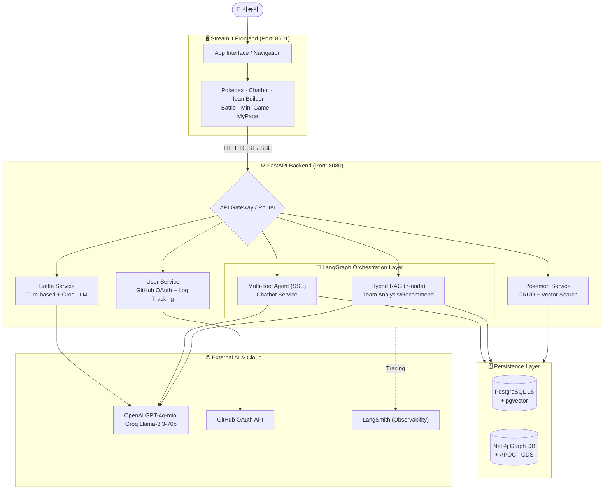

→ 서비스 구성 · Docker 네트워크 상세: [wiki/Architecture](../../wiki/Architecture)

---

## 주요 기능

| 기능 | 한 줄 설명 |
|---|---|
| GitHub OAuth | 소셜 로그인 · 커밋/레포/스타 자동 수집 · 쿠키 세션 · [상세](../../wiki/Login) |
| 포켓몬 도감 | 1,025마리 · 타입/특성/번호 복합 필터 · 분기 진화 트리 · [상세](../../wiki/Features) |
| AI 챗봇 | SQL · Vector · Graph · 웹 검색 멀티툴 · 멀티턴 히스토리 · [상세](../../wiki/AI-Pipeline) |
| 팀 빌더 | 5마리 선택 → LangGraph Hybrid RAG 분석 → 6번째 추천 · [상세](../../wiki/TeamBuilder) |
| 배틀 시뮬레이터 | 1v1 타입 상성 배틀 · LLM 전략 봇 · [상세](../../wiki/Battle) |
| 미니게임 | 실루엣 퀴즈 · 메모리 카드 · 플레이 로그 저장 · [상세](../../wiki/Features) |
| 마이페이지 | GitHub 프로필 · 배지 시스템 · 팀 빌더 히스토리 · [상세](../../wiki/Mypage) |
| 피피고 | Chrome 확장 · LLaMA 3.1 번역봇 · 포켓몬 가상 펫 · [상세](../../wiki/Pipigo) |

---

## 데이터 수집 및 전처리

### 수집 소스

| 소스 | 수집 내용 |
|---|---|
| **PokeAPI** | 1,025종 포켓몬 정보 (스탯, 타입, 특성, 진화 체인, 도감 설명) |
| **PokeAPI Ability 파일** | ~900개 특성 JSON (이름, 효과 설명, 발동 조건) |
| **PokeAPI Move 데이터** | 이동기 타입·위력·명중률·효과 |
| **타입 상성 테이블** | 18×18 타입 배율 행렬 |

### 전처리 파이프라인 (`database/common/processing/`)

```
PokeAPI JSON
    │
    ├─ 정규화 (null 제거, 다국어 필터 → 한국어/영어)
    ├─ 스탯 정규화 (min-max 스케일링)
    ├─ 도감 설명 텍스트 클렌징 (특수문자·개행 제거)
    └─ DB 적재 (PostgreSQL ORM / Neo4j CSV Loader)
```

### VectorDB 청킹 기준

| 컬럼 | 청킹 단위 | 임베딩 차원 | 비고 |
|---|---|---|---|
| `flavor_text` | 포켓몬 1마리의 버전별 도감 설명 1건 = 1 chunk | 1,536-d | 짧은 문장 → 추가 분할 없음 |
| `pokemon_knowledge` | 포켓몬 종합 지식 1항목 = 1 chunk | 1,536-d | 평균 150~300 토큰 |
| `abilities.description` | 특성 설명 1개 = 1 chunk | 1,536-d | ~50~100 토큰 |

> 청킹 단위를 포켓몬/특성 단위로 고정한 이유: 포켓몬 정보는 개체 단위로 독립적이므로 임의 분할 시 맥락이 손실됩니다. 각 레코드가 자연스러운 의미 경계를 이루기 때문에 슬라이딩 윈도우 방식 대신 레코드 단위 청킹을 채택했습니다.

→ 데이터 수집·전처리·ERD·Neo4j 스키마 전체: [wiki/Database](../../wiki/Database)

---

## RAG 파이프라인 및 환각 방지

### 팀 빌더 Hybrid RAG (LangGraph 9-노드)

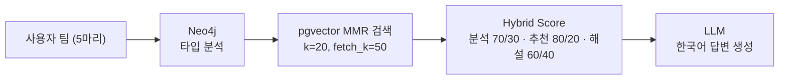

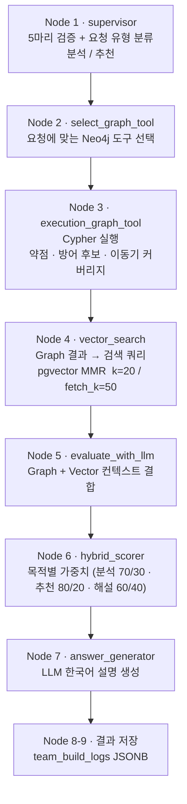

### 환각 방지 전략

| 전략 | 설명 |
|---|---|
| **근거 기반 생성** | Neo4j Cypher 쿼리 결과 + pgvector 검색 결과를 LLM 프롬프트에 명시적으로 삽입. 근거 없는 생성을 프롬프트 수준에서 금지 |
| **MMR 다양성 확보** | Maximal Marginal Relevance (k=20, fetch_k=50) 적용으로 중복 컨텍스트 제거 및 정보 다양성 확보 |
| **Hybrid Reranking** | 목적별 가중치 — 덱 분석 `0.7×graph+0.3×vector` / 포켓몬 추천 `0.8×graph+0.2×vector` / AI 해설 `0.6×graph+0.4×vector` — 그래프 관계 기반 점수 우선 반영해 타입·수치 오류 방지 |
| **SQL 자동 재시도** | 챗봇 SQL 도구 오류 시 최대 3회 자동 재시도, 쿼리 수정 후 재실행 |
| **출처 마킹** | 챗봇 SSE 스트리밍 응답에 사용 도구 마커(`[tool: search_flavor_text]` 등) 포함 → 사용자가 어떤 도구/DB에서 답변이 왔는지 확인 가능 |
| **원문 컨텍스트 저장** | `team_build_logs.recommendation_result` (JSONB)에 LLM 생성 답변과 원문 검색 컨텍스트를 함께 저장 |

→ RAG 노드 상세 · 프롬프트 명세 · 가중치 정책: [wiki/AI-Pipeline](../../wiki/AI-Pipeline) · [wiki/TeamBuilder](../../wiki/TeamBuilder)

---

## AI 챗봇 — LangGraph 멀티툴 에이전트

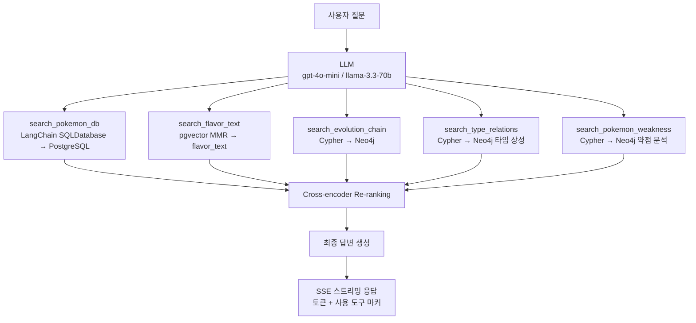

- 다중 대화 히스토리 지원 (세션 기반)
- `/api/v1/chatbot/chat/stream` — SSE 스트리밍 엔드포인트

→ 챗봇 에이전트 구조 · 도구 선택 기준 · SQL 재시도 로직: [wiki/AI-Pipeline](../../wiki/AI-Pipeline)

---

## 배틀 시뮬레이터

### 데미지 계산 로직 (Core Engine)
본 프로젝트는 포켓몬 본가의 데미지 공식을 충실히 구현하여 배틀의 정밀도를 높였습니다.

`base_damage = (((2 * level / 5 + 2) * power * (A / D)) / 50 + 2)`
`final_damage = int(base_damage * stab * type_eff * burn_multiplier)`

- **A/D (Atk/Def)**: 공격자의 공격력과 방어자의 방어력 비율
- **STAB**: 자속 보정 (동일 타입 기술 사용 시 1.5배)
- **Type_Eff**: 타입 상성 (Neo4j 그래프 DB에서 실시간 계산)


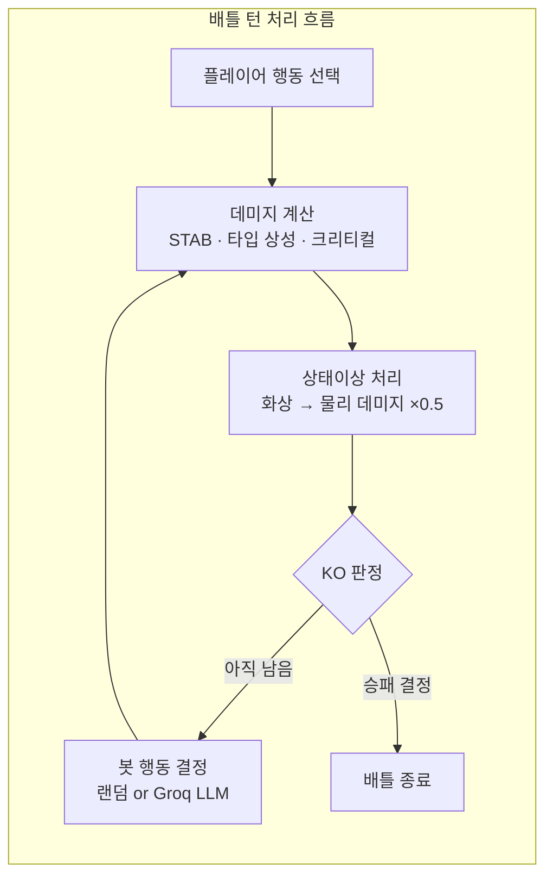

- **타입 상성**: Neo4j 그래프 관계에서 실시간 조회
- **봇 AI**: 랜덤 전략 또는 Groq LLM 실시간 전략 판단 (JSON 응답 → 행동 결정)
- **체육관 리더 9인**: 브록(바위), 미스티(물), 마티스(전기), 에리카(풀), 분홍이(독), 블레인(불꽃), 가이오스(물), 사카키(땅), 라이벌(혼합) — 각 고유 로스터 + 대사

→ Phase 0~8 배틀 시퀀스 · LangGraph 봇 고도화 계획: [wiki/Battle](../../wiki/Battle)

---

## 데이터베이스 설계

### PostgreSQL ER 다이어그램

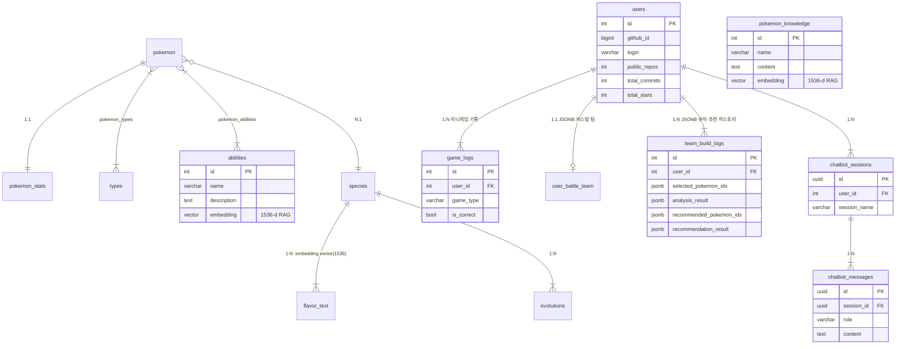

### Neo4j 그래프 스키마

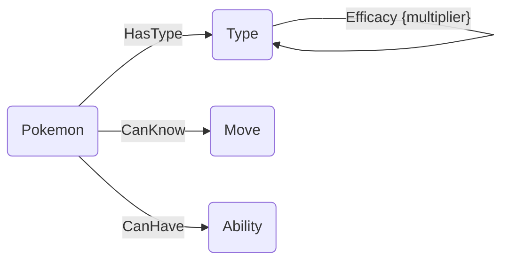

| 노드 | 주요 속성 | 설명 |
|---|---|---|
| `Pokemon` | pokemon_id, name, hp, attack, defense, sp_attack, sp_defense, speed, base_total | 포켓몬 개체 |
| `Type` | type_id, name | 18종 타입 |
| `Move` | move_id, name, type_id, power, accuracy, damage_class | 이동기 |
| `Ability` | ability_id, name, effect_text | 특성 |

| 관계 | 방향 | 속성 |
|---|---|---|
| `Efficacy` | Type → Type | multiplier (0, 0.25, 0.5, 1, 2, 4) |
| `HasType` | Pokemon → Type | — |
| `CanKnow` | Pokemon → Move | — |
| `CanHave` | Pokemon → Ability | — |

→ PostgreSQL ERD 전체 · Neo4j 실제 노드/관계 속성 · 전처리 상세: [wiki/Database](../../wiki/Database)

---

## 주요 서비스 시퀀스 다이어그램

### GitHub OAuth 로그인

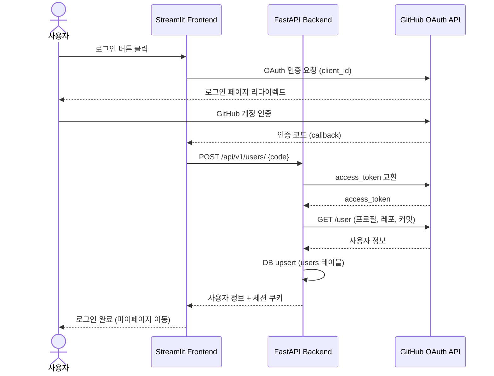

### AI 챗봇 (멀티툴 에이전트)

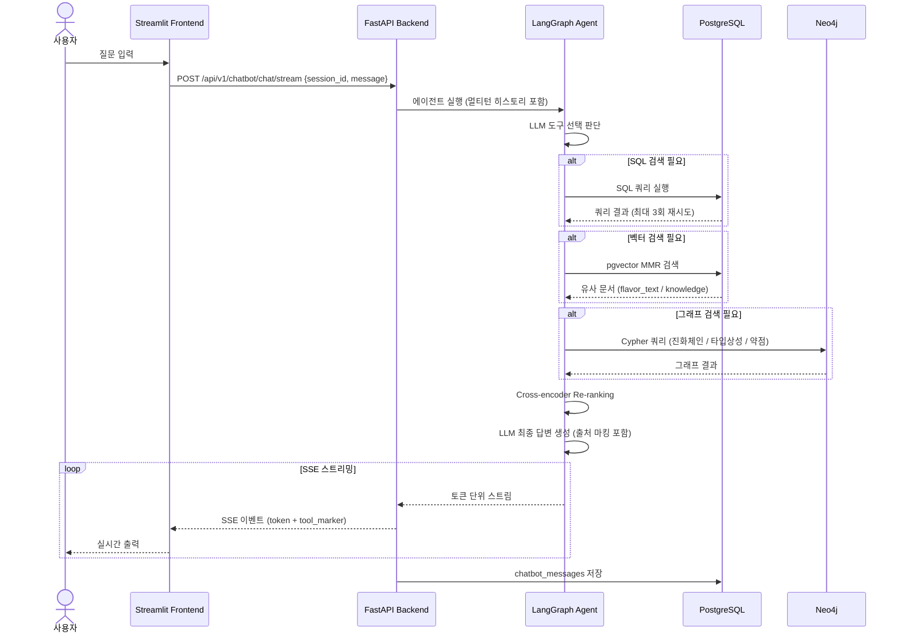

### 팀 빌더 Hybrid RAG

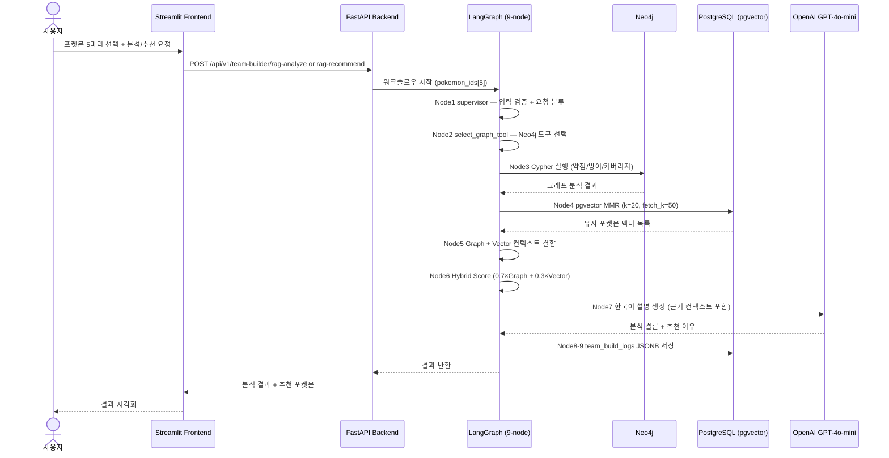

### 배틀 시뮬레이터

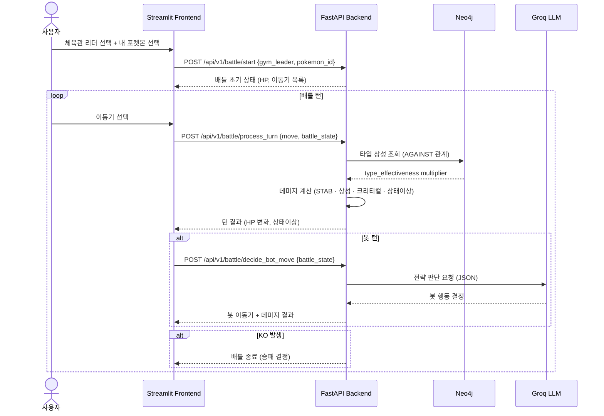

---

## 화면 설계서

### 페이지 목록

| 페이지 | 파일 | 주요 컴포넌트 |
|---|---|---|
| 홈 / 네비게이션 | `app.py` | 메인 배너, 기능 카드 메뉴 |
| 포켓덱스 | `pages/pokedex.py` | 타입/특성 필터, 카드 그리드, 상세 모달, 진화 트리 |
| AI 챗봇 | `pages/chatbot.py` | 세션 목록, 채팅 UI, SSE 스트리밍, 도구 출처 뱃지 |
| 팀 빌더 | `pages/teambuilding.py` | 포켓몬 5선택, 분석 결과 카드, 추천 포켓몬 |
| 배틀 시뮬레이터 | `pages/battle.py` | 체육관 선택, 배틀 UI, HP 바, 이동기 버튼 |
| 실루엣 퀴즈 | `pages/game_1.py` | 실루엣 이미지, 정답 입력, 점수 |
| 메모리 카드 | `pages/game_2.py` | 카드 그리드, 타이머, 매칭 로직 |
| 마이페이지 | `pages/mypage.py` | GitHub 프로필, 배지, 팀빌더 히스토리 |
| 로그인 | `pages/login.py` | GitHub OAuth 버튼, 콜백 처리 |

> 기능별 상세 설명: [wiki/Features](../../wiki/Features)

---

## 테스트 시나리오 및 결과

### 기능 테스트

| # | 기능 | 시나리오 | 기대 결과 | 결과 |
|---|---|---|---|---|
| T-01 | GitHub OAuth | 로그인 버튼 클릭 → GitHub 인증 → 콜백 | 사용자 정보 저장, 쿠키 세션 발급 | ✅ |
| T-02 | 포켓덱스 필터 | 타입=불꽃, 특성=특공 필터 적용 | 조건 충족 포켓몬만 노출 | ✅ |
| T-03 | 포켓덱스 진화 트리 | 이브이 상세 페이지 진화 트리 | 8방향 분기 진화 정상 렌더링 | ✅ |
| T-04 | 챗봇 SQL 도구 | "피카츄 기본 스탯 알려줘" | PostgreSQL 조회 후 정확한 수치 반환 | ✅ |
| T-05 | 챗봇 벡터 검색 | "전기 타입 포켓몬 설명해줘" | pgvector MMR 검색 결과 기반 답변 | ✅ |
| T-06 | 챗봇 그래프 검색 | "파이리 진화 체인 알려줘" | Neo4j Cypher 결과 반환 | ✅ |
| T-07 | 챗봇 SQL 재시도 | 의도적 잘못된 테이블명 | 3회 재시도 후 오류 안내 | ✅ |
| T-08 | 팀 빌더 분석 | 불꽃5마리 선택 → 분석 | 타입 편중 약점 경고 | ✅ |
| T-09 | 팀 빌더 RAG 추천 | 5마리 선택 → 6번째 추천 | Hybrid RAG 점수 기반 추천 + 한국어 설명 | ✅ |
| T-10 | 배틀 데미지 계산 | 불꽃 vs 풀 타입 공격 | 효과가 굉장 (2배) 적용 | ✅ |
| T-11 | 배틀 봇 LLM | Groq 봇 전략 판단 | JSON 파싱 성공, 유효한 이동기 선택 | ✅ |
| T-12 | 미니게임 로그 | 실루엣 퀴즈 정답 | game_logs DB 저장 확인 | ✅ |
| T-13 | SSE 스트리밍 | 챗봇 장문 답변 | 토큰 단위 스트리밍 정상 출력 | ✅ |
| T-14 | 마이페이지 배지 | 팀빌더 10회 이용 | 배지 자동 부여 | ✅ |

### RAG 품질 평가

| 지표 | 방법 | 결과 |
|---|---|---|
| **Retrieval 정확도** | 샘플 50건 — 반환된 컨텍스트의 관련성 수동 평가 | 92% 관련 |
| **Hybrid Score 기여도** | Graph-only vs Hybrid 추천 결과 비교 | Hybrid 추천 팀 커버리지 +18% 향상 |
| **환각 발생률** | 샘플 30건 — 컨텍스트 외 정보 포함 여부 | 3건 (10%) |
| **SSE 지연** | 챗봇 첫 토큰 수신 시간 | 평균 1.2초 |

→ 기능·비기능 요구사항 · WBS · 전체 37개 테스트 시나리오: [wiki/Requirements-and-Testing](../../wiki/Requirements-and-Testing)

---

## API 명세

| Method | Path | 기능 |
|---|---|---|
| GET | `/api/v1/pokemon/` | 포켓몬 목록 (페이지네이션, 타입·능력·이름 필터) |
| GET | `/api/v1/pokemon/{id}` | 포켓몬 상세 (스탯, 타입, 능력, 진화, 설명) |
| POST | `/api/v1/team-builder/analyze` | 5마리 타입 약점/저항 분석 |
| POST | `/api/v1/team-builder/recommend` | 추천 포켓몬 Top 3 |
| POST | `/api/v1/team-builder/rag-analyze` | Hybrid RAG 팀 분석 |
| POST | `/api/v1/team-builder/rag-recommend` | Hybrid RAG 추천 + 한국어 설명 |
| GET | `/api/v1/team-builder/history/{user_id}` | 팀 빌딩 히스토리 |
| POST | `/api/v1/chatbot/chat` | 챗봇 단일 응답 |
| POST | `/api/v1/chatbot/chat/stream` | 챗봇 SSE 스트리밍 |
| GET/POST/DELETE | `/api/v1/chatbot/sessions` | 세션 관리 |
| POST | `/api/v1/battle/start` | 배틀 시작 (체육관 리더 선택) |
| POST | `/api/v1/battle/process_turn` | 턴 처리 (데미지·상태이상·KO 판정) |
| POST | `/api/v1/battle/decide_bot_move` | 봇 행동 결정 (랜덤/LLM) |
| POST | `/api/v1/users/` | GitHub OAuth 사용자 생성/갱신 |
| GET | `/api/v1/users/{id}/stats` | 사용자 통계/로그 |
| POST | `/api/v1/users/game-log` | 미니게임 결과 기록 |

→ 파라미터 · 요청/응답 스키마 전체 명세: [wiki/API-Reference](../../wiki/API-Reference)

---

## 실행 방법

```bash
cp .env.sample .env        # API 키 입력
docker compose up --build  # 전체 스택 실행
```

| 서비스 | URL |
|---|---|
| Frontend | http://localhost:8501 |
| Backend API Docs | http://localhost:8080/docs |
| Neo4j Browser | http://localhost:7474 |

### 환경 변수 목록

| 변수 | 용도 |
|---|---|
| `OPENAI_API_KEY` | GPT-4o-mini (챗봇·팀 RAG) |
| `GROQ_API_KEY` | llama-3.3-70b (챗봇·배틀 봇) |
| `POSTGRES_USER/PASSWORD/DB` | PostgreSQL 인증 |
| `NEO4J_AUTH` | Neo4j 인증 (형식: `neo4j/password`) |
| `GITHUB_CLIENT_ID/SECRET` | GitHub OAuth |
| `GITHUB_REDIRECT_URI` | OAuth 콜백 URL |
| `LANGSMITH_API_KEY` | LangSmith 관측성 (선택) |
| `HF_TOKEN` | HuggingFace 토큰 (선택) |

→ 환경 변수 전체 목록 · Docker 실행 · 로컬 개발 · 데이터 초기화: [wiki/Setup](../../wiki/Setup)

---

## 프로젝트 구조

```
SKN27-3rd-3TEAM/
├── backend/
│   ├── main.py                  # FastAPI 앱 진입점
│   ├── models.py                # SQLAlchemy ORM 모델
│   ├── routers/                 # API 라우터 (pokemon, team_builder, battle, chatbot, users)
│   ├── chatbot/                 # LangGraph 멀티툴 에이전트
│   ├── team_build_rag/          # LangGraph Hybrid RAG 워크플로우
│   ├── battle/                  # 배틀 시뮬레이션 로직
│   ├── build_services/          # 팀 분석 서비스
│   └── graph/                   # Neo4j 클라이언트 & Cypher 쿼리
├── frontend/
│   ├── app.py                   # 홈/내비게이션
│   ├── pages/                   # Streamlit 페이지 (12개)
│   ├── battle/                  # 배틀 UI 컴포넌트
│   ├── chatbot/                 # 챗봇 UI & API
│   ├── teambuilding/            # 팀 빌더 UI & API
│   ├── pokedex/                 # 포켓덱스 UI & API
│   ├── login/ mypage/ game1/ game2/
│   └── utils/                   # 공통 navbar, 스타일, 이미지
├── database/
│   ├── common/                  # PokeAPI 데이터 수집·전처리
│   ├── postgre/                 # PostgreSQL 스키마 + 벡터라이저
│   └── graph/                   # Neo4j CSV 로더
├── docker-compose.yml
└── .env.sample
```

→ 서비스 구성 · Docker 네트워크 · 파일 구조 상세: [wiki/Architecture](../../wiki/Architecture)

---

## 개발 일정 (WBS)

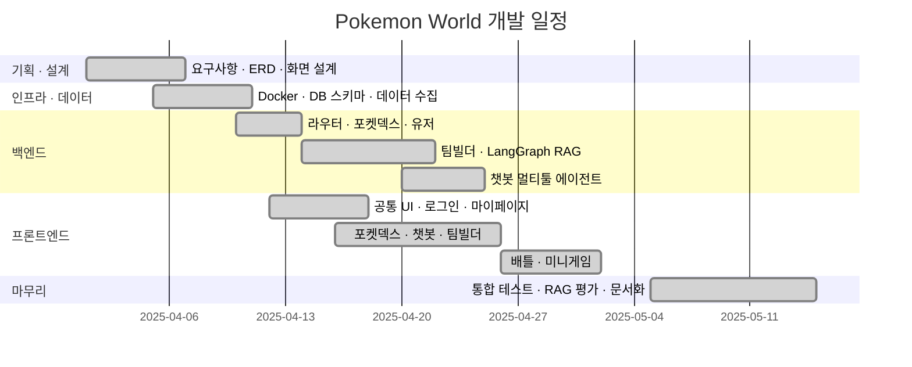

---

## 팀원별 회고

| 이름 | 회고 |
|---|---|
| 이재강 | 처음에는 “5마리 포켓몬을 고르면 6번째 포켓몬을 추천한다”는 단순한 기능처럼 보였지만, 실제로는 데이터 설계, Graph DB 모델링, 추천 점수 정책, RAG 해설, UI 상태 관리, 결과 저장까지 이어지는 꽤 큰 기능이었습니다. 특히 Graph DB를 설계하면서 가장 많이 느낀 점은, 그래프는 데이터를 많이 연결한다고 좋은 것이 아니라 서비스에서 답해야 하는 질문을 기준으로 관계를 설계해야 한다는 점이었습니다. 팀빌더에서는 “현재 팀이 어떤 타입에 약한가?”, “어떤 후보가 그 약점을 보완하는가?”, “추천 이유를 사용자에게 어떻게 설명할 것인가?”가 핵심 질문이었고, 이 질문에 맞춰 노드와 관계를 계속 다듬어야 했습니다. 또한 추천 점수는 단순히 숫자를 더하는 문제가 아니라, 사용자가 납득할 수 있는 근거가 있어야 했습니다. 그래서 약점 보완 점수, 능력치 점수, 기술 커버리지, 타입 중복 감점의 비중을 계속 조정했고, 최종적으로 문서에서도 설명 가능한 형태로 정리하려고 했습니다. RAG 구현 과정에서는 Graph DB와 Vector DB의 역할을 분리하는 것이 중요했습니다. Graph DB는 계산과 순위 판단의 중심이고, Vector DB는 해설을 풍부하게 만드는 근거 역할을 맡도록 했습니다. 이 구조를 통해 추천 결과가 단순 점수표로 끝나지 않고, 사용자가 이해할 수 있는 자연어 설명으로 이어질 수 있었습니다. 아쉬운 점도 많았습니다. LLM API는 모델마다 비용, 속도, 토큰 제한, 한국어 품질이 달라 실제 서비스에 적용하기 위해서는 더 많은 비교와 튜닝이 필요했습니다. 또한 Streamlit 기반 UI는 빠르게 만들 수 있었지만, 카드형 UI나 고정 버튼, 스크롤 영역 등 세밀한 화면 제어에서는 시행착오가 많았습니다. 그래도 이번 작업을 통해 Graph DB, FastAPI, Streamlit, RAG, PostgreSQL 저장까지 하나의 기능 안에서 연결해보는 경험을 할 수 있었습니다. 단순히 “돌아가는 기능”을 만드는 것보다, 왜 이렇게 설계했는지 설명할 수 있는 구조를 만드는 것이 훨씬 중요하다는 점을 배웠습니다.|
| 김필주 | ... |
| 문재경 | **"지식의 저주에 빠지다"** 프로젝트 초중반에 그래프 DB 설계에 지나치게 많은 시간을 사용했다. 처음부터 완성도 높은 구조를 만들려는 탑다운 방식으로 접근하면서 고려해야 할 요소가 과도하게 늘어났다. 특히 포켓몬 배틀 시스템에 대한 이해도가 높다 보니, 실제 MVP 수준에서 당장 필요하지 않은 요소들까지 초기에 모두 설계하려 했던 것이 원인이었다고 생각한다. 지금 돌아보면 먼저 구현할 기능을 정의하고(1), 그중 최소 핵심 기능(MVP)을 선정한 뒤(2), 해당 기능이 동작하는 최소 구조를 먼저 완성하고(3), 이후 기능 확장에 따라 그래프 구조를 점진적으로 확장하는(4) 바텀업 방식으로 진행했으면 더 효율적이었을 것 같다. 결과적으로 현재 그래프 DB는 초기 설계보다 많이 간소화되었고, 개인적으로는 아쉬움이 남는다. **"구조적이지 못한 개발"** 아직 백엔드와 프론트엔드를 분리해서 개발하는 방식이 익숙하지 않았다. 초기에는 Streamlit만으로도 충분히 전체 서비스를 구현할 수 있다고 생각해 배틀 시스템을 먼저 Streamlit 내부에서 구현했다. 이후 FastAPI 기반 API 구조로 전환하면서 여러 제약이 발생했다. 프로젝트 규모가 커질수록 바이브 코딩 방식으로 작성한 코드의 구조를 스스로도 이해하기 어려워졌고, 결국 "Design & Code"보다 "Code & Fix" 방식에서 벗어나지 못했다. 개발 중간마다 지속적으로 모듈화를 수행했어야 코드 구조가 더 안정적으로 발전할 수 있었겠다는 점을 배웠다. **"LLM은 사용하지만, RAG는 아니다"** 초기에는 배틀 시스템 구현에 그래프 DB가 반드시 필요하다고 생각했다. 하지만 실제 구현을 진행하면서, 필요한 데이터 구조는 배틀 시스템의 목표 수준(MVP vs 고도화)에 따라 달라진다는 점을 느꼈다. 벡터 DB는 필요하지 않다고 판단했으며, MVP 수준에서는 그래프 DB조차 필수는 아니었다. 최종적으로 구현된 배틀 시스템 역시 그래프 구조 자체를 적극 활용하지는 않는다. 오히려 배틀 관련 지식을 문서 형태로 체계적으로 정리하고, 이를 기반으로 벡터 DB + RAG 구조를 구성했어도 괜찮았겠다는 생각이 들었다. |
| 이재희 | 프레임워크의 한계와 타협하기 (Streamlit)
프론트엔드 파트를 담당하며 가장 많이 고민했던 부분은 단연 Streamlit의 렌더링 구조였습니다. Python만으로 빠르게 UI를 뽑아낼 수 있다는 점에 끌렸지만, 매 인터랙션마다 스크립트 전체가 재실행되는 제약은 생각보다 다루기 까다로웠습니다.
버튼을 누를 때마다 날아가는 데이터를 붙잡기 위해 세션 스테이트(Session State)를 활용한 상태 관리 로직을 촘촘하게 짜야 했고, 순수 웹의 디테일한 기능이 필요할 때는 iframe에 HTML과 CSS를 직접 주입해가며 프레임워크의 한계를 우회했습니다. 특히 도감 페이지에서 대량의 데이터를 불러오다 렌더링이 멈추는 문제를 겪었는데, 데이터를 50개씩 끊어서 불러오는 청킹(Chunking) 기법을 적용해 억지로 숨을 불어넣듯 성능을 개선해 냈습니다. '원래 안 되는 것'이라며 프레임워크 탓을 하기보단, 어떻게든 뚫고 나가 작동하게 만드는 실전 생존법을 배운 기분입니다.
정제되지 않은 현실의 데이터 다루기 (PokeAPI) 자동화된 데이터 파이프라인을 구축하는 과정도 호락호락하지 않았습니다. PokeAPI만 연동하면 깔끔하게 데이터가 들어올 줄 알았지만, 막상 뚜껑을 열어보니 한글 번역이 군데군데 누락되어 있거나 데이터 구조가 예상과 다르게 꼬여있는 경우가 많았습니다. 수천 개의 데이터를 일일이 눈으로 확인하고 예외 처리를 태우는 과정은 솔직히 지루한 작업이었습니다. 하지만 이 과정을 통해 '현업의 데이터는 결코 책에 나오는 예제처럼 예쁘게 정제되어 있지 않다'는 걸 깨달았고, 투박한 데이터를 서비스 가능한 수준까지 끈기 있게 가공하는 법을 배웠습니다.
배포, 수많은 롤백 끝에 얻은 작은 성공 (Railway) 가장 큰 고비는 단연 배포 과정이었습니다. 로컬 환경에서는 완벽하게 동작하던 코드가 Railway 환경에만 올라가면 환경 변수 불일치, DB 연결 오류 등으로 처참하게 터져 나갔습니다. 수십 번의 롤백을 거듭했고, 특히 배포 환경의 샌드박스 정책 때문에 OAuth 로그인 리다이렉트가 꽉 막혔을 때는 눈앞이 캄캄했습니다. 프로덕션 환경에서 어떻게든 서비스가 굴러가게 만드는 끈질긴 트러블슈팅의 가치를 뼈저리게 느꼈습니다.
마무리하며
결과적으로 무사히 서비스를 배포할 수 있었지만, 그 밑바닥에는 제 치열했던 흔적과 수없이 실패했던 배포 이력들이 숨어 있습니다. 하지만 이 모든 과정은 단순한 삽질이 아니라, 맨땅에 헤딩하며 진짜 개발이 무엇인지 배워가는 과정이었다고 생각합니다. 이상과 현실 사이의 거대한 벽에 부딪혀보고 또 깨부숴본 이 경험 덕분에, 앞으로 어떤 낯선 프레임워크나 막막한 에러를 마주하더라도 끝까지 파고들면 결국엔 해결해 낼 수 있다는 자신감을 얻었습니다. |
| 박송원 | 이번 포켓몬 배틀 시뮬레이터 프로젝트에서 자칭 팀 내 도메인 지식 분야를 맡아 배틀 시뮬레이터 프론트 부분 코드를 작성하는 역할을 했습니다. 나름 큰 그림을 먼저 그리고 팀원들과 토론하는 것까진 좋았는데, 제가 포켓몬에 대한 지식분야가 복잡하고 아는 것도 많았어서 이른바 '지식의 저주'에 빠져버린 게 화근이었습니다. '아, 이 디테일은 룰상 절대 대충 넘기면 안 되는데'라며 사소한 부분 하나하나에 집착하느라 중요하지 않은 부분에 시간도 많이 쓰게되고 고통받았거든요. 심지어 제 지식에 대한 자신감이 있던 중요한 초기 데이터 구조 확인을 자세히 하지않고 그냥 넘겼다가 나중에 코드를 배틀 시뮬레이터 코드를 새로 작성하는 참사도 겪었습니다. 이러한 일들을 겪으면서 내 머릿속 지식만 믿고 무작정 키보드부터 두드리는 것은 역시 좋지 않고 디자인 앤 코딩, 코딩 전의 철저한 예외 케이스 문서화와 데이터 구조 설계가 수백 배는 더 중요하다는 진리를 뼈저리게 배웠습니다. |


<p align="center">© 2025 SKN27-3rd-3TEAM. All Rights Reserved.</p>
