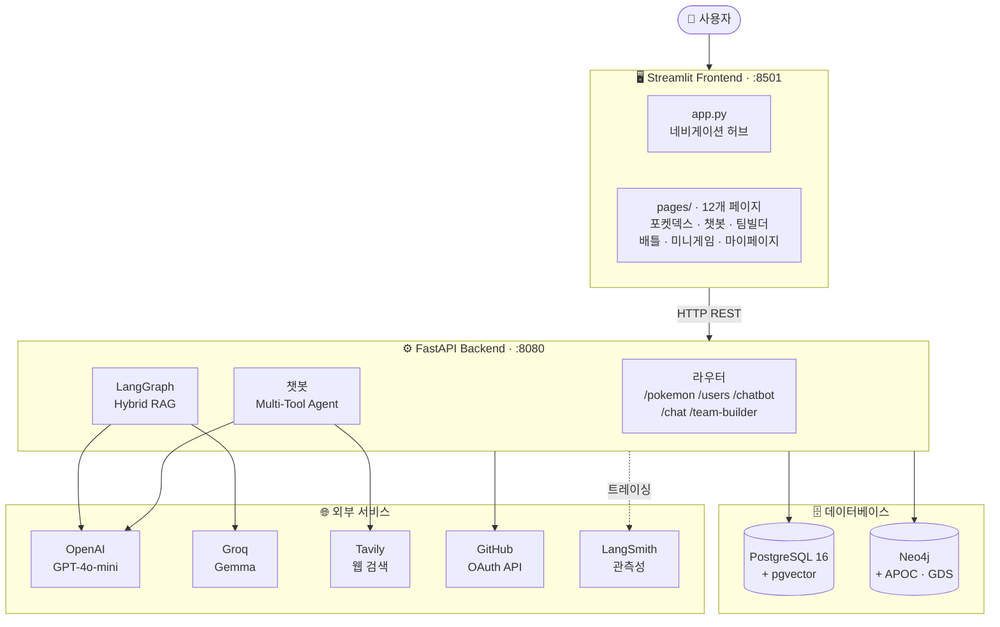
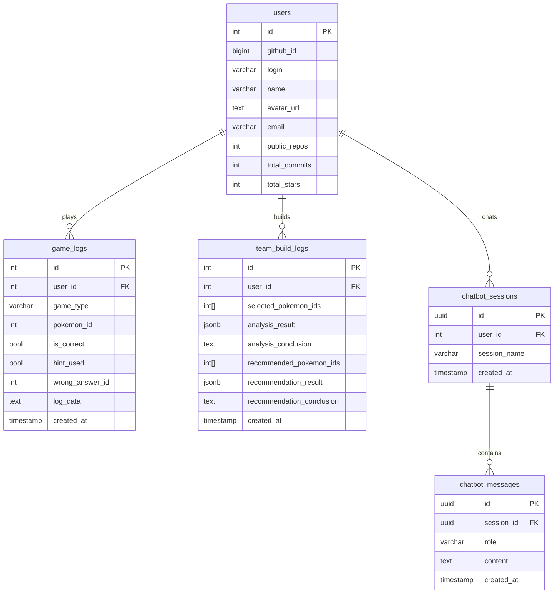
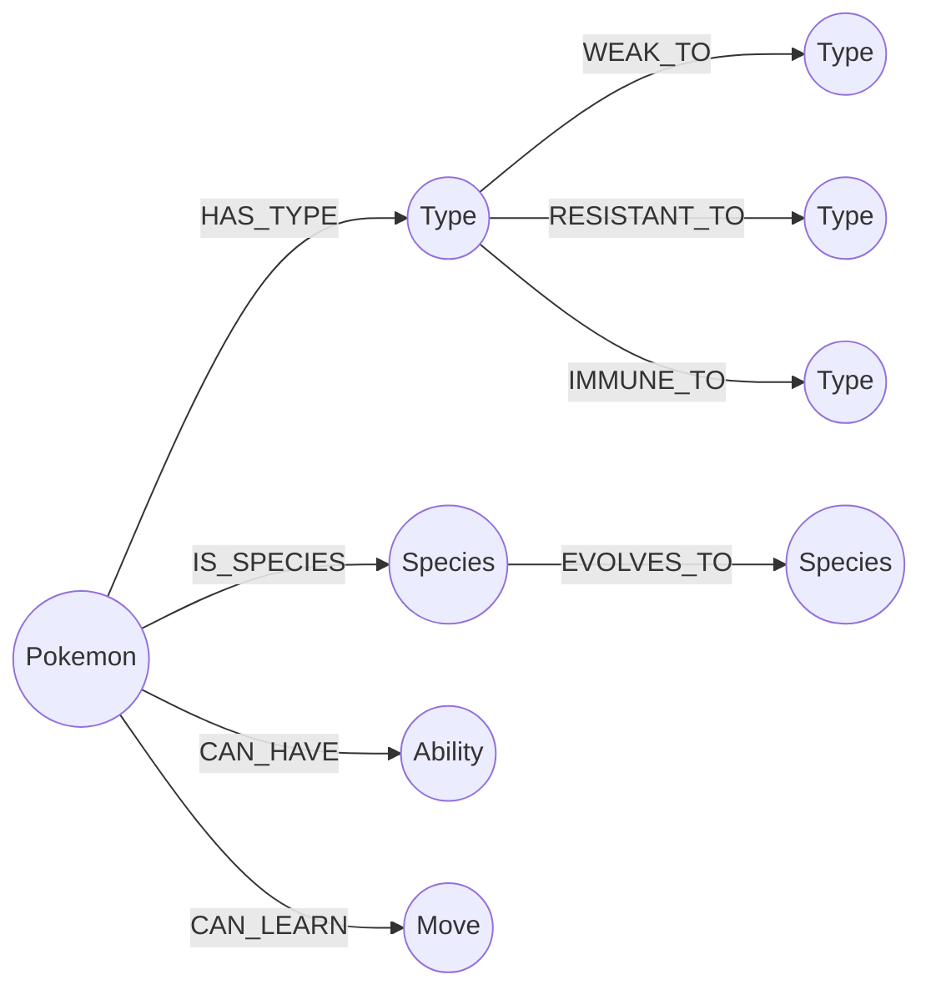
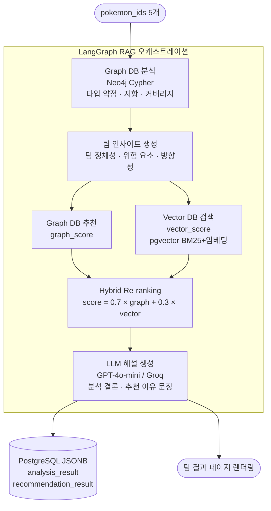
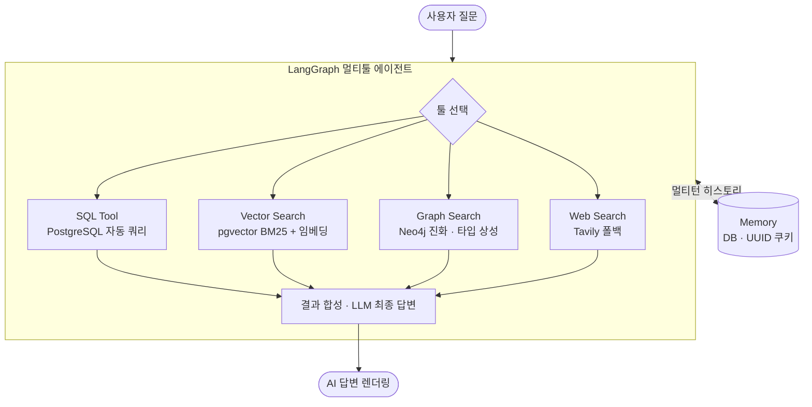
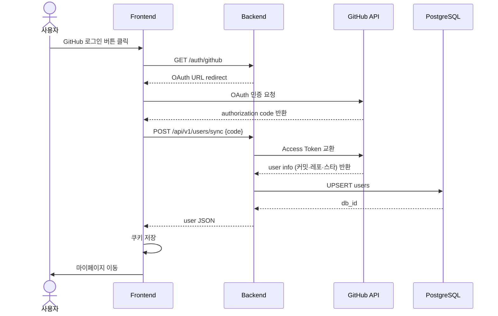
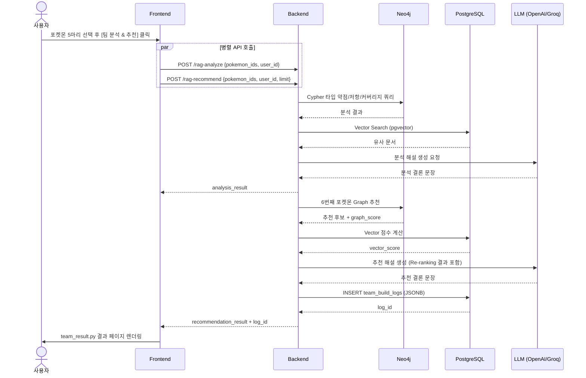
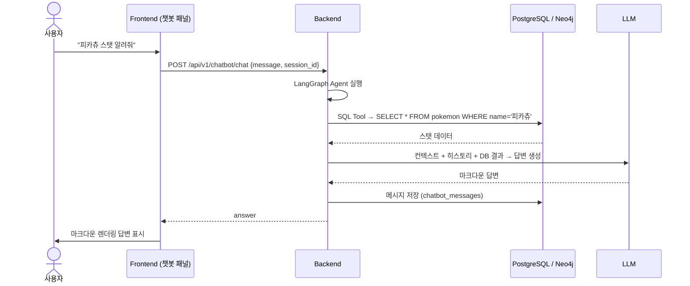
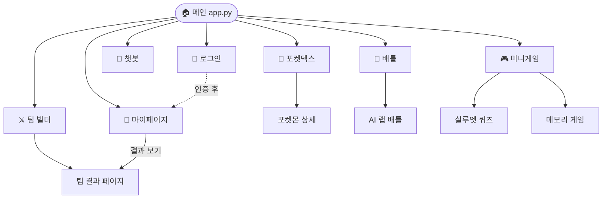
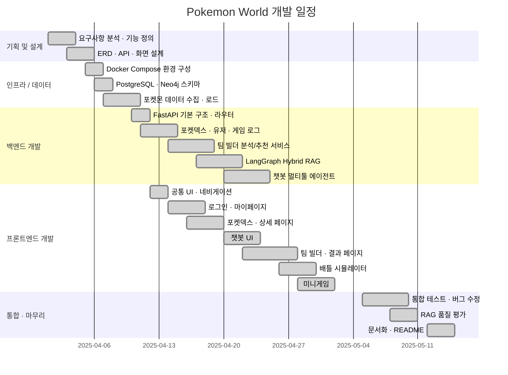

# 너로정했다! LLM — SKN27-3rd-3TEAM

> GitHub OAuth 로그인 · AI 챗봇 · 포켓몬 도감 · 팀 빌더 · 배틀 시뮬레이터 · 미니게임 · 팀 분석  
> 최신형 AI 포켓몬 서비스

---

## 목차

1. [프로젝트 개요](#1-프로젝트-개요)
2. [팀 구성](#2-팀-구성)
3. [기술 스택](#3-기술-스택)
4. [주요 기능](#4-주요-기능)
5. [시스템 아키텍처](#5-시스템-아키텍처)
6. [프로젝트 구조](#6-프로젝트-구조)
7. [ERD](#7-erd)
8. [API 명세](#8-api-명세)
9. [AI / RAG 파이프라인](#9-ai--rag-파이프라인)
10. [시퀀스 다이어그램](#10-시퀀스-다이어그램)
11. [화면 설계](#11-화면-설계)
12. [요구사항 명세](#12-요구사항-명세)
13. [실행 방법](#13-실행-방법)
14. [환경 변수](#14-환경-변수)
15. [WBS](#15-wbs)
16. [테스트](#16-테스트)

---

## 1. 프로젝트 개요

| 항목 | 내용 |
|---|---|
| 프로젝트명 | 포켓몬 월드 (Pokemon World) |
| 팀 | SKN27-3rd-3TEAM |
| 목적 | 포켓몬 IP를 활용한 AI 기반 인터랙티브 풀스택 웹 서비스 |
| 주요 대상 | 포켓몬 팬 · 게임 유저 · AI 서비스 체험자 |
| 개발 기간 | 2025.04 ~ 2025.05 |

포켓몬 월드는 단순한 도감 앱을 넘어, **LangGraph 기반 하이브리드 RAG**로 팀을 분석하고 6번째 포켓몬을 추천하는 팀 빌더, 멀티 툴 AI 챗봇, 실시간 배틀 시뮬레이터, 미니게임, GitHub 연동 마이페이지까지 갖춘 종합 포켓몬 플랫폼입니다.

---

## 2. 팀 구성

| 이름 | 역할 |
|---|---|
| 이준혁 (EJ-pro) | 팀장 · 팀 빌더 · 마이페이지 · 전체 UI/UX |
| 팀원 2 | 포켓덱스 · 배틀 시뮬레이터 |
| 팀원 3 | AI 챗봇 · RAG 파이프라인 |
| 팀원 4 | 미니게임 · 로그인 · DB 설계 |
| 팀원 5 | 인프라 · Docker · 데이터 수집 |

---

## 3. 기술 스택

| 분류 | 기술 |
|---|---|
| **Backend** | FastAPI · Uvicorn · SQLAlchemy · psycopg2 |
| **Frontend** | Streamlit · streamlit-cookies-controller |
| **AI / LLM** | LangChain · LangGraph · LangSmith |
| **LLM 모델** | OpenAI GPT-4o-mini · Groq (Gemma) · Ollama |
| **임베딩 / 검색** | sentence-transformers · pgvector · BM25 |
| **웹 검색** | Tavily |
| **관계형 DB** | PostgreSQL 16 + pgvector |
| **그래프 DB** | Neo4j + APOC + Graph Data Science |
| **인증** | GitHub OAuth 2.0 |
| **인프라** | Docker · Docker Compose |

---

## 4. 주요 기능

### 4-1. GitHub OAuth 로그인
- GitHub OAuth 2.0 소셜 로그인
- 로그인 시 커밋 수 · 레포 수 · 스타 · 팔로워 자동 수집 및 DB 저장
- `streamlit-cookies-controller` 쿠키 기반 세션 영속화
- 비로그인 사용자도 포켓덱스 · 챗봇 · 배틀 이용 가능

### 4-2. 포켓덱스
- 1,025마리 전체 목록 페이지네이션
- **복합 필터**: 이름/번호 · 타입 · 특성 · 도감번호 범위 슬라이더
- **상세 페이지**: 기본 스탯 · 타입 상성 · 도감 설명 · 분기 진화 트리 · 형태 전환

### 4-3. AI 챗봇 (오박사)
포켓몬 전문 AI 어시스턴트와의 멀티턴 대화

| 툴 | 설명 |
|---|---|
| SQL Tool | 자연어 → SQL 자동 생성 후 PostgreSQL 조회 |
| Vector Search | pgvector BM25 + 임베딩 하이브리드 검색 |
| Graph Search | Neo4j 진화 체인 · 타입 상성 탐색 |
| Web Search | Tavily 폴백 검색 |

- LangGraph Memory 기반 멀티턴 히스토리
- 세션 저장/불러오기 (로그인: DB 저장 / 비로그인: UUID 쿠키 30일)
- LLM 선택: GPT-4o-mini / Gemma

### 4-4. 팀 빌더
5마리 선택 → LangGraph Hybrid RAG 분석 → 6번째 추천

| 단계 | 내용 |
|---|---|
| ① 포켓몬 선택 | 타입 · 지방 · 특성 · 이름 필터 + 카드 클릭 선택 |
| ② 덱 분석 | Neo4j 타입 약점 · 저항 · 커버리지 분석 |
| ③ RAG 해설 | LangGraph Graph + Vector 결합 AI 분석 문장 |
| ④ 6번째 추천 | 하이브리드 Re-ranking 1~3순위 추천 |
| ⑤ 결과 저장 | 분석 · 추천 결과 PostgreSQL JSONB 저장 |
| ⑥ 히스토리 | 마이페이지에서 과거 분석 결과 복원 |

### 4-5. 배틀 시뮬레이터
- **일반 배틀**: 1v1 타입 상성 기반 데미지 계산 · 교체 시스템
- **AI 랩 배틀**: GPT-4o-mini가 배틀 대본을 랩 가사로 생성 (스트리밍)

### 4-6. 미니게임
- **실루엣 퀴즈**: 포켓몬 실루엣 맞추기 · 힌트 시스템 · 로그 저장
- **메모리 카드**: 카드 짝 맞추기 · 결과 저장

### 4-7. 마이페이지
GitHub 연동 트레이너 프로필 · 배지 · 도감 · 팀 빌더 히스토리

---

## 5. 시스템 아키텍처



---

## 6. 프로젝트 구조

```
SKN27-3rd-3TEAM/
├── backend/
│   ├── main.py                      # FastAPI 진입점 · 스키마 마이그레이션
│   ├── models.py / schemas.py / crud.py / database.py
│   ├── routers/
│   │   ├── pokemon.py               # 포켓덱스 API
│   │   ├── users.py                 # 유저 · 게임 로그 API
│   │   ├── chatbot.py               # 챗봇 세션 · 메시지 API
│   │   ├── chat.py                  # AI 랩 배틀 (동기 · 스트리밍)
│   │   └── team_builder.py          # 팀 분석 · 추천 · 히스토리 API
│   ├── build_services/
│   │   ├── team_analysis_service.py # 타입 약점/저항/커버리지 분석
│   │   ├── team_builder_service.py  # Graph DB 추천 로직
│   │   ├── team_insight_service.py  # 팀 인사이트 요약
│   │   ├── team_rag_service.py      # LangGraph RAG 오케스트레이션
│   │   └── team_score_service.py    # 하이브리드 점수 · Re-ranking
│   ├── chatbot/                     # 챗봇 LangGraph 에이전트
│   └── graph/neo4j_client.py        # Neo4j 클라이언트
│
├── frontend/
│   ├── app.py                       # 메인 랜딩 · 네비게이션
│   ├── pages/                       # 12개 페이지 (login · mypage · pokedex ...)
│   ├── teambuilding/                # 팀 빌더 모듈화
│   │   ├── constants.py / api.py / filters.py
│   │   ├── components.py / styles.py / result_styles.py
│   ├── mypage/styles.py
│   └── utils/ui.py                  # 공통 헤더 · CSS 주입
│
├── database/
│   ├── postgre/utils/schema.sql     # PostgreSQL 초기화 스키마
│   └── graph/neo4j/                 # Neo4j 데이터 로더
│
├── docker-compose.yml
└── .env.sample
```

---

## 7. ERD

### PostgreSQL



### Neo4j 그래프 스키마



---

## 8. API 명세

### 포켓몬 `/api/v1/pokemon`

| 메서드 | 경로 | 설명 |
|---|---|---|
| GET | `/` | 목록 (skip · limit · search · type_names · ability · min_id · max_id) |
| GET | `/{id}` | 상세 (스탯 · 타입 · 특성 · 진화 체인) |
| GET | `/abilities/` | 전체 특성 목록 |

### 유저 `/api/v1/users`

| 메서드 | 경로 | 설명 |
|---|---|---|
| POST | `/sync` | GitHub OAuth 유저 생성/업데이트 |
| GET | `/{id}/stats` | 게임 통계 (퀴즈 · 메모리 · 도감 · 배지) |
| GET | `/{id}/logs` | 최근 게임 로그 |
| POST | `/game-log` | 게임 플레이 로그 저장 |
| GET/POST | `/{id}/battle-team` | 배틀 팀 조회 · 저장 |

### 팀 빌더 `/api/v1/team-builder`

| 메서드 | 경로 | 설명 |
|---|---|---|
| GET | `/pokemon-options` | 팀 빌더용 포켓몬 목록 (Neo4j) |
| POST | `/analyze` | 타입 약점 · 저항 · 커버리지 분석 |
| POST | `/recommend` | Graph DB 기반 6번째 포켓몬 추천 |
| POST | `/rag-analyze` | LangGraph Hybrid RAG 분석 해설 |
| POST | `/rag-recommend` | LangGraph Hybrid RAG 추천 해설 + DB 저장 |
| GET | `/history/{user_id}` | 팀 빌더 히스토리 조회 |

### 챗봇 `/api/v1/chatbot`

| 메서드 | 경로 | 설명 |
|---|---|---|
| POST | `/chat` | 메시지 전송 → AI 응답 |
| GET/POST | `/sessions` | 세션 목록 조회 · 생성 |
| DELETE | `/sessions/{id}` | 세션 삭제 |
| GET | `/sessions/{id}/messages` | 세션 메시지 이력 |

### AI 배틀 `/api/v1/chat`

| 메서드 | 경로 | 설명 |
|---|---|---|
| POST | `/rap-battle` | 랩 배틀 대본 생성 (동기) |
| POST | `/rap-battle/stream` | 랩 배틀 대본 생성 (스트리밍) |

---

## 9. AI / RAG 파이프라인

### 팀 빌더 LangGraph 파이프라인



### 챗봇 멀티툴 에이전트



---

## 10. 시퀀스 다이어그램

### GitHub OAuth 로그인



### 팀 빌더 RAG 분석/추천 흐름



### 챗봇 멀티턴 대화



---

## 11. 화면 설계

### 페이지 목록

| 경로 | 파일 | 기능 |
|---|---|---|
| `/` | `app.py` | 메인 네비게이션 허브 |
| `/login` | `pages/login.py` | GitHub OAuth 로그인/로그아웃 |
| `/mypage` | `pages/mypage.py` | 프로필 · 통계 · 배지 · 히스토리 |
| `/pokedex` | `pages/pokedex.py` | 포켓몬 목록 · 검색 · 필터 |
| `/pokemon_detail` | `pages/pokemon_detail.py` | 포켓몬 상세 뷰 |
| `/chatbot` | `pages/chatbot.py` | AI 챗봇 (2패널) |
| `/teambuilding` | `pages/teambuilding.py` | 팀 구성 · 분석 트리거 |
| `/team_result` | `pages/team_result.py` | 팀 분석/추천 결과 |
| `/battle` | `pages/battle.py` | 1v1 배틀 시뮬레이터 |
| `/battle2` | `pages/battle2.py` | AI 랩 배틀 (스트리밍) |
| `/mini_game` | `pages/mini_game.py` | 미니게임 허브 |
| `/game_1` | `pages/game_1.py` | 실루엣 퀴즈 |
| `/game_2` | `pages/game_2.py` | 메모리 카드 게임 |

### 페이지 내비게이션 흐름



---

## 12. 요구사항 명세

### 기능 요구사항

| ID | 기능 | 요구사항 | 우선순위 | 구현 |
|---|---|---|---|---|
| FR-01-1 | 인증 | GitHub OAuth 2.0 소셜 로그인 | 필수 | ✅ |
| FR-01-2 | 인증 | GitHub 통계 자동 수집 및 DB 저장 | 필수 | ✅ |
| FR-01-3 | 인증 | 쿠키 기반 세션 영속화 | 필수 | ✅ |
| FR-01-5 | 인증 | 비로그인 사용자 주요 기능 이용 | 필수 | ✅ |
| FR-02-1 | 포켓덱스 | 전체 목록 페이지네이션 | 필수 | ✅ |
| FR-02-2 | 포켓덱스 | 이름/ID/타입/특성 복합 필터 | 필수 | ✅ |
| FR-02-3 | 포켓덱스 | 포켓몬 상세 (스탯·타입·진화) | 필수 | ✅ |
| FR-03-1 | 챗봇 | 포켓몬 자연어 질의응답 | 필수 | ✅ |
| FR-03-2 | 챗봇 | SQL Tool Calling | 필수 | ✅ |
| FR-03-3 | 챗봇 | Vector + BM25 하이브리드 검색 | 필수 | ✅ |
| FR-03-4 | 챗봇 | Neo4j 그래프 검색 | 필수 | ✅ |
| FR-03-5 | 챗봇 | Tavily 웹 검색 폴백 | 선택 | ✅ |
| FR-03-6 | 챗봇 | 멀티턴 대화 히스토리 | 필수 | ✅ |
| FR-03-7 | 챗봇 | 세션 저장/불러오기 | 필수 | ✅ |
| FR-04-1 | 팀빌더 | 포켓몬 5마리 선택 UI | 필수 | ✅ |
| FR-04-2 | 팀빌더 | 타입 약점·저항·커버리지 분석 | 필수 | ✅ |
| FR-04-3 | 팀빌더 | LangGraph Hybrid RAG 해설 | 필수 | ✅ |
| FR-04-4 | 팀빌더 | 6번째 포켓몬 추천 + Re-ranking | 필수 | ✅ |
| FR-04-5 | 팀빌더 | 분석/추천 결과 DB 저장 | 필수 | ✅ |
| FR-04-6 | 팀빌더 | 마이페이지 히스토리 · 결과 복원 | 선택 | ✅ |
| FR-05-1 | 배틀 | 1v1 배틀 시뮬레이션 | 필수 | ✅ |
| FR-05-3 | 배틀 | AI 랩 배틀 대본 생성 | 선택 | ✅ |
| FR-05-4 | 배틀 | 스트리밍 응답 | 선택 | ✅ |
| FR-06-1 | 미니게임 | 실루엣 퀴즈 | 필수 | ✅ |
| FR-06-2 | 미니게임 | 메모리 카드 게임 | 필수 | ✅ |
| FR-06-3 | 미니게임 | 플레이 로그 DB 저장 | 선택 | ✅ |
| FR-07-1 | 마이페이지 | GitHub 프로필 카드 | 필수 | ✅ |
| FR-07-2 | 마이페이지 | 미니게임 통계 | 필수 | ✅ |
| FR-07-3 | 마이페이지 | 팀 빌더 히스토리 | 선택 | ✅ |
| FR-07-4 | 마이페이지 | 배지 시스템 (간토 8 + 관장 8) | 선택 | ✅ |

### 비기능 요구사항

| ID | 요구사항 | 상태 |
|---|---|---|
| NFR-01 | Docker Compose 단일 명령 전체 구동 | ✅ |
| NFR-02 | 백엔드 응답 p95 < 3초 (AI 제외) | ✅ |
| NFR-03 | AI API 타임아웃 60초 | ✅ |
| NFR-04 | Cross-encoder Re-ranking RAG 정밀도 향상 | ✅ |
| NFR-05 | 환경 변수로 모든 자격증명 관리 (.env) | ✅ |
| NFR-06 | PostgreSQL pgvector + Neo4j 이중 DB | ✅ |
| NFR-07 | LangSmith LLM 호출 추적 | ✅ |

---

## 13. 실행 방법

### 전체 스택 (권장)

```bash
# 1. 환경 변수 설정
cp .env.sample .env
# .env 파일 열어 API 키 입력

# 2. Docker Compose 실행
docker compose up --build
```

| 서비스 | URL |
|---|---|
| Frontend | http://localhost:8501 |
| Backend API | http://localhost:8080 |
| Neo4j Browser | http://localhost:7474 |

### 로컬 개발 (백엔드)

```bash
cd backend
pip install -r requirements.txt
uvicorn main:app --host 0.0.0.0 --port 8000 --reload
```

### 로컬 개발 (프론트엔드)

```bash
cd frontend
pip install -r requirements.txt
BACKEND_URL=http://localhost:8000 streamlit run app.py --server.port 8501
```

---

## 14. 환경 변수

```env
# PostgreSQL
POSTGRES_USER=postgres
POSTGRES_PASSWORD=postgres
POSTGRES_DB=pokemon_db

# LLM
OPENAI_API_KEY=sk-...
GROQ_API_KEY=gsk_...
HF_TOKEN=hf_...

# 웹 검색
TAVILY_API_KEY=tvly-...

# LangSmith
LANGSMITH_TRACING=true
LANGSMITH_ENDPOINT=https://api.smith.langchain.com
LANGSMITH_API_KEY=lsv2_...
LANGSMITH_PROJECT=pokemon_world

# Neo4j
NEO4J_AUTH=neo4j/password

# GitHub OAuth
GITHUB_CLIENT_ID=...
GITHUB_CLIENT_SECRET=...
GITHUB_REDIRECT_URI=http://localhost:8501/login
```

---

## 15. WBS



---

## 16. 테스트

### 기능 테스트 체크리스트

| 기능 | 시나리오 | 기대 결과 |
|---|---|---|
| 로그인 | GitHub OAuth → 인증 완료 | 마이페이지 이동, 쿠키 저장 |
| 포켓덱스 | 타입 "불꽃" 필터 | 불꽃 타입만 표시 |
| 포켓덱스 | "피카츄" 검색 | 피카츄 카드 표시 |
| 팀 빌더 | 5마리 선택 → [팀 분석 & 추천] | 결과 페이지 이동, 분석+추천 카드 |
| 팀 빌더 | 로그인 후 분석 실행 | `team_build_logs`에 user_id 포함 저장 |
| 마이페이지 | Team Builder History | 이력 가로 카드 표시 |
| 마이페이지 | [결과 보기] 클릭 | team_result.py 결과 복원 |
| 챗봇 | "피카츄 스탯 알려줘" | SQL Tool 호출 후 스탯 응답 |
| 챗봇 | "리자드 진화 방법" | Graph Search 호출 후 진화 조건 응답 |
| 미니게임 | 실루엣 퀴즈 정답 | 게임 로그 저장, 도감 수집 반영 |
| 배틀 | 두 포켓몬 선택 후 배틀 | 턴제 배틀 진행, 타입 상성 데미지 |

### RAG 품질 평가 지표

| 지표 | 설명 |
|---|---|
| Faithfulness | 생성 답변이 검색 근거와 일치하는가 |
| Answer Relevancy | 질문에 적절히 응답하는가 |
| Context Recall | 필요한 근거 문서가 검색되었는가 |
| Hybrid Score 정확도 | 하이브리드 점수가 팀에 최적 포켓몬을 추천하는가 |

---

*Pokemon World — SKN27-3rd-3TEAM · SKN AI 캠프 27기 3차 프로젝트*
