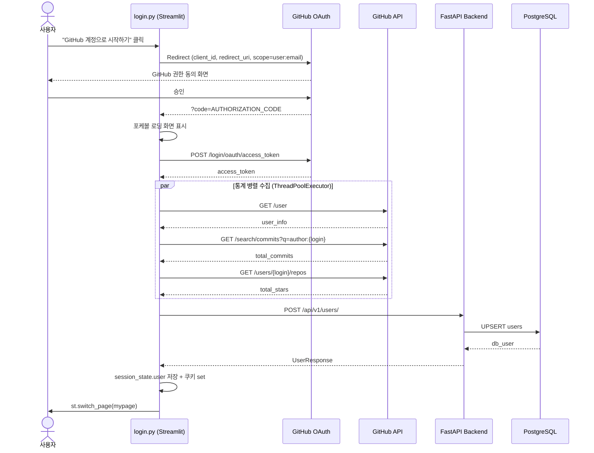
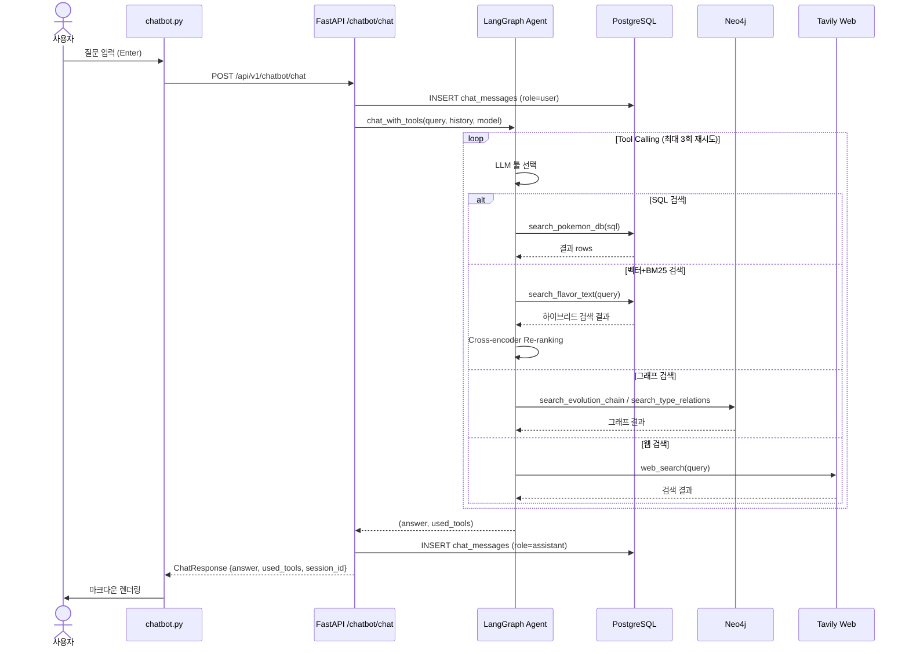
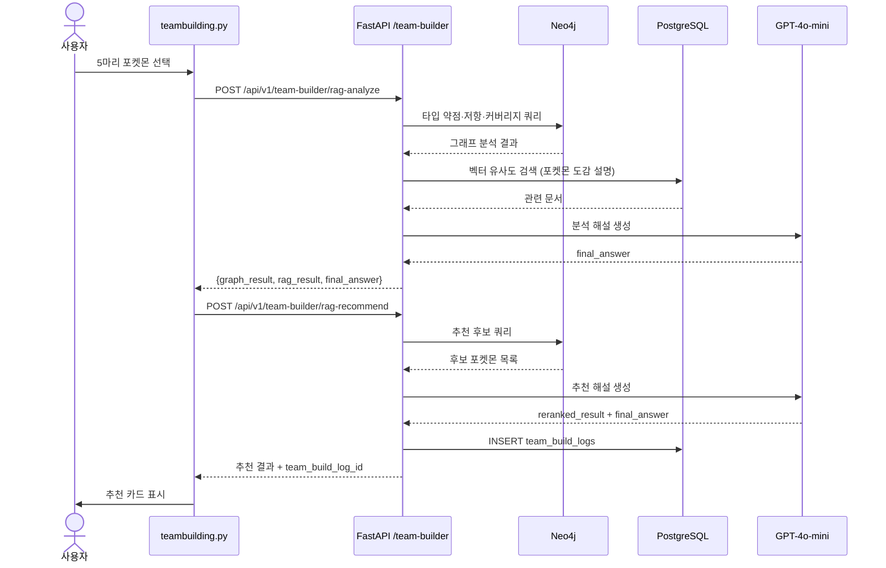
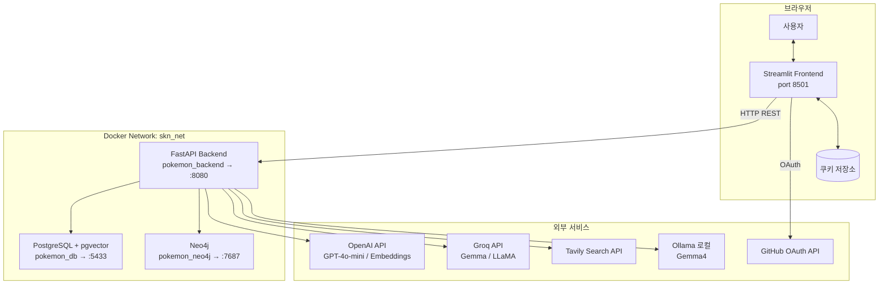

# 포켓몬 월드 — SKN27-3rd-3TEAM

> GitHub OAuth 로그인, AI 챗봇, 포켓덱스, 팀 빌더, 배틀 시뮬레이터를 통합한 포켓몬 테마 풀스택 서비스

---

## 목차

1. [요구사항 명세서](#1-요구사항-명세서)
2. [화면 설계서](#2-화면-설계서)
3. [API 명세서](#3-api-명세서)
4. [시퀀스 다이어그램](#4-시퀀스-다이어그램)
5. [ERD](#5-erd)
6. [시스템 아키텍처 구성도](#6-시스템-아키텍처-구성도)
7. [RAG / 데이터 파이프라인 설계도](#7-rag--데이터-파이프라인-설계도)
8. [프롬프트 명세서](#8-프롬프트-명세서)
9. [WBS](#9-wbs)
10. [테스트 케이스](#10-테스트-케이스)
11. [LLM / RAG 평가 계획서](#11-llm--rag-평가-계획서)

---

## 1. 요구사항 명세서

### 1-1. 프로젝트 개요

| 항목 | 내용 |
|---|---|
| 프로젝트명 | 포켓몬 월드 (Pokemon World) |
| 팀 | SKN27-3rd-3TEAM |
| 목적 | 포켓몬 IP를 활용한 AI 기반 인터랙티브 웹 서비스 |
| 주요 사용자 | 포켓몬 팬, 게임 유저, AI 서비스 체험자 |

### 1-2. 기능 요구사항

#### FR-01. 인증 (로그인/로그아웃)

| ID | 요구사항 | 우선순위 |
|---|---|---|
| FR-01-1 | GitHub OAuth 2.0으로 소셜 로그인 | 필수 |
| FR-01-2 | 로그인 시 GitHub 통계(커밋·스타·팔로워) 자동 수집 | 필수 |
| FR-01-3 | 쿠키 기반 세션 영속화 (탭·새로고침 후 복구) | 필수 |
| FR-01-4 | 로그아웃 확인 다이얼로그 | 선택 |
| FR-01-5 | 비로그인 사용자도 주요 기능 이용 가능 | 필수 |

#### FR-02. 포켓덱스

| ID | 요구사항 | 우선순위 |
|---|---|---|
| FR-02-1 | 전체 포켓몬 목록 페이지네이션 조회 | 필수 |
| FR-02-2 | 이름 / ID / 타입 / 특성 복합 필터 검색 | 필수 |
| FR-02-3 | 포켓몬 상세 (스탯, 타입, 도감 설명, 진화 트리, 형태 전환) | 필수 |
| FR-02-4 | 도감 번호 범위 필터 | 선택 |

#### FR-03. AI 챗봇

| ID | 요구사항 | 우선순위 |
|---|---|---|
| FR-03-1 | 포켓몬 관련 자연어 질의응답 | 필수 |
| FR-03-2 | SQL 자동 생성 → DB 조회 (Tool Calling) | 필수 |
| FR-03-3 | 벡터 + BM25 하이브리드 검색 (Flavor Text) | 필수 |
| FR-03-4 | Neo4j 그래프 검색 (진화 체인, 타입 상성) | 필수 |
| FR-03-5 | 웹 검색 폴백 (Tavily) | 선택 |
| FR-03-6 | 멀티턴 대화 히스토리 유지 | 필수 |
| FR-03-7 | 대화 세션 저장/불러오기 (로그인·비로그인 모두) | 필수 |
| FR-03-8 | 비로그인 사용자 UUID 쿠키로 30일 세션 관리 | 필수 |
| FR-03-9 | LLM 모델 선택 (GPT-4o-mini / Gemma) | 선택 |

#### FR-04. 팀 빌더

| ID | 요구사항 | 우선순위 |
|---|---|---|
| FR-04-1 | 포켓몬 5마리 선택 UI | 필수 |
| FR-04-2 | 타입 약점·저항·커버리지 분석 | 필수 |
| FR-04-3 | LangGraph Hybrid RAG 기반 팀 분석 해설 생성 | 필수 |
| FR-04-4 | 6번째 포켓몬 추천 (그래프 기반 + Re-ranking) | 필수 |
| FR-04-5 | 분석/추천 결과 DB 저장 | 필수 |

#### FR-05. 배틀 시뮬레이터

| ID | 요구사항 | 우선순위 |
|---|---|---|
| FR-05-1 | 1vs1 포켓몬 배틀 시뮬레이션 | 필수 |
| FR-05-2 | 상태이상 표시 및 교체 시스템 | 필수 |
| FR-05-3 | AI 랩 배틀 대본 생성 (GPT-4o-mini) | 선택 |
| FR-05-4 | 스트리밍 응답 지원 | 선택 |

#### FR-06. 미니 게임

| ID | 요구사항 | 우선순위 |
|---|---|---|
| FR-06-1 | 실루엣 퀴즈 게임 | 필수 |
| FR-06-2 | 메모리 카드 게임 | 필수 |
| FR-06-3 | 플레이 로그 DB 저장 | 선택 |

#### FR-07. 마이페이지

| ID | 요구사항 | 우선순위 |
|---|---|---|
| FR-07-1 | GitHub 프로필 카드 (아바타, 이름, 통계) | 필수 |
| FR-07-2 | 미니게임 통계 조회 | 필수 |
| FR-07-3 | 팀 빌더 기록 조회 | 선택 |

### 1-3. 비기능 요구사항

| ID | 요구사항 |
|---|---|
| NFR-01 | Docker Compose 단일 명령으로 전체 서비스 구동 |
| NFR-02 | 백엔드 응답 시간 p95 < 3초 (AI 제외) |
| NFR-03 | AI API 호출 타임아웃 60초 |
| NFR-04 | Cross-encoder Re-ranking으로 RAG 정밀도 향상 |
| NFR-05 | 환경 변수로 모든 자격증명 관리 (.env) |
| NFR-06 | PostgreSQL pgvector + Neo4j 이중 DB 구조 |

---

## 2. 화면 설계서

### 2-1. 페이지 목록

| 경로 | 파일 | 기능 |
|---|---|---|
| `/` | `app.py` | 메인 네비게이션 허브 |
| `/login` | `pages/login.py` | GitHub OAuth 로그인/로그아웃 |
| `/mypage` | `pages/mypage.py` | 사용자 프로필·통계 |
| `/pokedex` | `pages/pokedex.py` | 포켓몬 목록·검색·상세 |
| `/pokemon_detail` | `pages/pokemon_detail.py` | 포켓몬 상세 뷰 |
| `/chatbot` | `pages/chatbot.py` | AI 포켓몬 챗봇 |
| `/teambuilding` | `pages/teambuilding.py` | 팀 구성·분석 |
| `/team_result` | `pages/team_result.py` | 팀 분석/추천 결과 |
| `/battle` | `pages/battle.py` | 배틀 시뮬레이터 |
| `/battle2` | `pages/battle2.py` | AI 랩 배틀 |
| `/mini_game` | `pages/mini_game.py` | 미니게임 허브 |
| `/game_1` | `pages/game_1.py` | 실루엣 퀴즈 |
| `/game_2` | `pages/game_2.py` | 메모리 카드 게임 |

### 2-2. 챗봇 화면 구조

```
┌─────────────────────────────────────────────────────────────┐
│  Left Panel (25%)           │  Right Panel (75%)            │
│                             │                               │
│  [+ 새 채팅 시작]           │  ┌─ 메시지 영역 (스크롤) ─┐  │
│                             │  │ 🧑‍🔬 오박사              │  │
│  모델 선택                  │  │  안녕하세요!             │  │
│  ┌──────────────────┐       │  │                          │  │
│  │ gpt-4o-mini ▼   │       │  │     [사용자 질문] 😀  │  │
│  └──────────────────┘       │  │ 🧑‍🔬 AI 답변 (마크다운)  │  │
│                             │  └──────────────────────────┘ │
│  이전 대화                  │                               │
│  ├ Q: 피카츄 스탯?  [🗑]   │  ┌────── 입력창 (하단 고정) ──┐ │
│  └ Q: 진화 조건?   [🗑]   │  │ 메시지를 입력하세요...      │ │
│                             │  └────────────────────────────┘ │
└─────────────────────────────────────────────────────────────┘
```

### 2-3. 로그인 화면 구조

```
┌───────────────────────────────────┐
│  [포케볼 SVG 아이콘]              │
│                                   │
│  Pokemon World                    │
│  GitHub 계정으로 포켓몬 트레이너  │
│                                   │
│  ╔═════════════════════════════╗  │
│  ║  팀 저장   배틀 기록  AI 챗 ║  │
│  ╚═════════════════════════════╝  │
│                                   │
│  [GitHub 계정으로 시작하기]       │
└───────────────────────────────────┘
```

### 2-4. 팀 빌더 화면 구조

```
┌─────────────────────────────────────┐
│  Step 1: 포켓몬 5마리 선택          │
│  ┌──┐ ┌──┐ ┌──┐ ┌──┐ ┌──┐         │
│  │P1│ │P2│ │P3│ │P4│ │P5│  [선택] │
│  └──┘ └──┘ └──┘ └──┘ └──┘         │
│                                     │
│  Step 2: 팀 분석                    │
│  타입 약점 / 저항 / 커버리지        │
│  AI 해설 (LangGraph RAG)            │
│                                     │
│  Step 3: 6번째 포켓몬 추천          │
│  순위별 추천 카드 + 추천 이유       │
└─────────────────────────────────────┘
```

---

## 3. API 명세서

Base URL: `http://localhost:8080` (Docker) / `http://localhost:8000` (로컬)

### 3-1. 포켓몬 (`/api/v1/pokemon`)

| Method | Path | 설명 | 주요 파라미터 |
|---|---|---|---|
| GET | `/api/v1/pokemon/` | 포켓몬 목록 (페이지네이션·필터) | `skip`, `limit`, `search`, `types[]`, `min_id`, `max_id`, `ability` |
| GET | `/api/v1/pokemon/abilities` | 전체 특성 목록 | - |
| GET | `/api/v1/pokemon/{pokemon_id}` | 포켓몬 상세 (스탯·타입·진화·설명) | `pokemon_id: int` |

**GET `/api/v1/pokemon/` 응답 예시**
```json
{
  "total": 1025,
  "skip": 0,
  "limit": 20,
  "items": [
    {
      "id": 25,
      "name": "피카츄",
      "image_url": "https://...",
      "types": ["전기"],
      "hp": 35, "attack": 55, "defense": 40,
      "sp_attack": 50, "sp_defense": 50, "speed": 90
    }
  ]
}
```

### 3-2. 유저 (`/api/v1/users`)

| Method | Path | 설명 | Body / Params |
|---|---|---|---|
| POST | `/api/v1/users/` | 유저 생성 또는 업데이트 (Upsert) | `UserCreate` JSON |
| GET | `/api/v1/users/{github_id}` | 유저 조회 | `github_id: int` |
| POST | `/api/v1/users/game-log` | 미니게임 로그 저장 | `GameLogCreate` JSON |
| GET | `/api/v1/users/{user_id}/stats` | 미니게임 통계 | `user_id: int` |
| GET | `/api/v1/users/{user_id}/logs` | 최근 플레이 로그 | `user_id: int`, `limit: int` |

**POST `/api/v1/users/` Request Body**
```json
{
  "github_id": 12345678,
  "login": "octocat",
  "name": "The Octocat",
  "avatar_url": "https://avatars.githubusercontent.com/u/583231",
  "email": "octocat@github.com",
  "public_repos": 42,
  "total_commits": 1234,
  "total_stars": 56
}
```

### 3-3. AI 챗봇 (`/api/v1/chatbot`)

| Method | Path | 설명 | Body / Params |
|---|---|---|---|
| GET | `/api/v1/chatbot/models` | 지원 LLM 모델 목록 | - |
| POST | `/api/v1/chatbot/chat` | 채팅 질의 | `ChatRequest` JSON |
| GET | `/api/v1/chatbot/sessions` | 세션 목록 | `user_id: str?` |
| GET | `/api/v1/chatbot/sessions/{id}/messages` | 세션 메시지 목록 | `session_id: int` |
| DELETE | `/api/v1/chatbot/sessions/{id}` | 세션 삭제 | `session_id: int` |

**POST `/api/v1/chatbot/chat` Request Body**
```json
{
  "query": "피카츄의 스탯을 알려줘",
  "history": [
    {"role": "user", "content": "..."},
    {"role": "assistant", "content": "..."}
  ],
  "model": "gpt-4o-mini",
  "session_id": 42,
  "user_id": "uuid-or-db-id"
}
```

**Response**
```json
{
  "answer": "피카츄의 스탯은 HP: 35 ...",
  "used_tools": ["search_pokemon_db"],
  "session_id": 42
}
```

### 3-4. 팀 빌더 (`/api/v1/team-builder`)

| Method | Path | 설명 |
|---|---|---|
| GET | `/api/v1/team-builder/pokemon-options` | 선택 가능 포켓몬 목록 (Neo4j) |
| POST | `/api/v1/team-builder/analyze` | 타입 약점/커버리지 분석 |
| POST | `/api/v1/team-builder/recommend` | 6번째 포켓몬 추천 (Graph) |
| POST | `/api/v1/team-builder/rag-analyze` | LangGraph RAG 팀 분석 해설 |
| POST | `/api/v1/team-builder/rag-recommend` | LangGraph RAG 추천 해설 + DB 저장 |

**POST `/api/v1/team-builder/analyze` Request Body**
```json
{
  "pokemon_ids": [25, 6, 9, 3, 131],
  "user_id": 1
}
```

### 3-5. 배틀 (`/api/v1/chat`)

| Method | Path | 설명 |
|---|---|---|
| POST | `/api/v1/chat/rap-battle` | AI 랩 배틀 대본 생성 (동기) |
| POST | `/api/v1/chat/rap-battle/stream` | AI 랩 배틀 대본 스트리밍 |

**POST `/api/v1/chat/rap-battle` Request Body**
```json
{
  "pokemon1": "피카츄",
  "pokemon2": "파이리"
}
```

### 3-6. 공통

| Method | Path | 설명 |
|---|---|---|
| GET | `/` | API 루트 확인 |
| GET | `/health` | 헬스체크 |

---

## 4. 시퀀스 다이어그램

### 4-1. GitHub OAuth 로그인



### 4-2. AI 챗봇 질의 흐름



### 4-3. 팀 빌더 RAG 분석



---

## 5. ERD

```mermaid
erDiagram
    pokemon {
        int id PK
        string name
        int height
        int weight
        int base_exp
        string image_url
        string cry_url
        bool is_default
        int species_id FK
    }

    pokemon_stats {
        int pokemon_id PK_FK
        int hp
        int attack
        int defense
        int sp_attack
        int sp_defense
        int speed
    }

    types {
        int id PK
        string name
    }

    pokemon_types {
        int pokemon_id PK_FK
        int type_id PK_FK
        int slot
    }

    species {
        int id PK
        int pokemon_id FK
        int generation
        int capture_rate
        string classification
        int gender_rate
    }

    flavor_text {
        int id PK
        int species_id FK
        string version_name
        text content
        vector_1536 embedding
    }

    abilities {
        int id PK
        string name
        text effect_text
        vector_1536 embedding
    }

    pokemon_abilities {
        int pokemon_id PK_FK
        int ability_id PK_FK
        bool is_hidden
        int slot
    }

    evolutions {
        int id PK
        int from_species_id FK
        int to_species_id FK
        int min_level
        int trigger_item_id
    }

    pokemon_knowledge {
        int pokemon_id PK_FK
        text content
        vector_1536 embedding
    }

    users {
        int id PK
        bigint github_id UK
        string login UK
        string name
        string avatar_url
        string email
        int public_repos
        int total_commits
        int total_stars
        datetime created_at
    }

    game_logs {
        int id PK
        int user_id FK
        string game_type
        int pokemon_id FK
        bool is_correct
        bool hint_used
        int wrong_answer_id FK
        text log_data
        datetime created_at
    }

    team_build_logs {
        int id PK
        int user_id FK
        jsonb selected_pokemon_ids
        jsonb analysis_result
        text analysis_conclusion
        jsonb recommended_pokemon_ids
        jsonb recommendation_result
        text recommendation_conclusion
    }

    chat_sessions {
        int id PK
        string title
        string model
        string user_id
        datetime created_at
    }

    chat_messages {
        int id PK
        int session_id FK
        string role
        text content
        text_array used_tools
        datetime created_at
    }

    pokemon ||--o| pokemon_stats : "1:1"
    pokemon ||--o{ pokemon_types : "has"
    types ||--o{ pokemon_types : "categorizes"
    pokemon }o--o| species : "belongs to"
    species ||--o{ flavor_text : "has"
    species ||--o{ evolutions : "evolves from"
    species ||--o{ evolutions : "evolves to"
    pokemon ||--o{ pokemon_abilities : "has"
    abilities ||--o{ pokemon_abilities : "used by"
    pokemon ||--o| pokemon_knowledge : "has"
    users ||--o{ game_logs : "plays"
    users ||--o{ team_build_logs : "creates"
    chat_sessions ||--o{ chat_messages : "contains"
```

### Neo4j 그래프 스키마

```
노드 레이블:
  Pokemon   {pokemon_id, name, image_url, hp, attack, defense, sp_attack, sp_defense, speed, base_total}
  Type      {name}
  Species   {generation}
  Ability   {name}
  Item      {item_id, name}

관계:
  (Pokemon)-[:EVOLVES_TO {min_level, trigger_item_id}]->(Pokemon)
  (Pokemon)-[:HAS_TYPE]->(Type)
  (Pokemon)-[:IS_SPECIES]->(Species)
  (Pokemon)-[:CAN_HAVE]->(Ability)
  (Pokemon)-[:WEAK_AGAINST]->(Type)
  (Pokemon)-[:RESISTANT_TO]->(Type)
  (Pokemon)-[:IMMUNE_TO]->(Type)
  (Type)-[:ATTACK_EFFECTIVE {damage_factor: 0.0|0.5|1.0|2.0}]->(Type)
```

---

## 6. 시스템 아키텍처 구성도



### 서비스 포트 정리

| 서비스 | 컨테이너 내부 | 외부 노출 | 비고 |
|---|---|---|---|
| Frontend (Streamlit) | `:8501` | `:8501` | |
| Backend (FastAPI) | `:8000` | `:8080` | uvicorn |
| PostgreSQL | `:5432` | `:5433` | pgvector 확장 포함 |
| Neo4j HTTP | `:7474` | `:7474` | Browser UI |
| Neo4j Bolt | `:7687` | `:7687` | 애플리케이션 연결 |

---

## 7. RAG / 데이터 파이프라인 설계도

### 7-1. 데이터 수집 파이프라인

```
PokeAPI (REST)
    │
    ├─ pokemon, pokemon_stats, types, pokemon_types
    ├─ species, flavor_text (도감 설명)
    ├─ abilities, pokemon_abilities
    └─ evolutions
    │
    ▼
PostgreSQL (pokemon_db)
    │
    ├─ backend/chatbot/ingest.py  ← 최초 1회 실행
    │   ├─ flavor_text.embedding      OpenAI text-embedding-3-small (dim=1536)
    │   ├─ abilities.embedding         OpenAI text-embedding-3-small (dim=1536)
    │   ├─ pokemon_knowledge.embedding OpenAI text-embedding-3-small (dim=1536)
    │   └─ GIN 인덱스 생성 (BM25용 tsvector)
    │
    └─ database/graph/graph_loader.py  ← 최초 1회 실행
        └─ Neo4j 그래프 적재
            ├─ Pokemon, Type, Species, Ability, Item 노드
            └─ EVOLVES_TO, HAS_TYPE, ATTACK_EFFECTIVE 등 관계
```

### 7-2. RAG 검색 파이프라인 (챗봇)

```
사용자 질문
    │
    ▼
LangGraph Agent (Tool Calling)
    │
    ├─ [SQL Tool] search_pokemon_db
    │   └─ LLM이 SQL 자동 생성 → psycopg2 직접 실행
    │       └─ 오류 시 최대 3회 재시도 (SQL 수정)
    │
    ├─ [벡터+BM25 Tool] search_flavor_text
    │   ├─ BM25: GIN 인덱스 to_tsvector 키워드 검색 (K=20)
    │   ├─ 벡터: pgvector cosine 유사도 검색 (K=20)
    │   ├─ RRF (Reciprocal Rank Fusion) 점수 병합
    │   └─ Cross-encoder Re-ranking (BAAI/bge-reranker-v2-m3) → top-5
    │
    ├─ [그래프 Tool] search_evolution_chain
    │   └─ Neo4j Cypher: EVOLVES_TO 관계 탐색
    │
    ├─ [그래프 Tool] search_type_relations
    │   └─ Neo4j Cypher: ATTACK_EFFECTIVE 관계 탐색
    │
    └─ [웹 Tool] web_search  ← DB에 없을 때만 사용
        └─ Tavily API (max_results=3)
    │
    ▼
LLM 최종 답변 생성 (GPT-4o-mini / Gemma)
```

### 7-3. RAG 파이프라인 (팀 빌더)

```
포켓몬 5마리 선택
    │
    ▼
LangGraph Workflow (run_team_rag)
    │
    ├─ Step 1: Neo4j 그래프 분석
    │   └─ 타입 약점/저항/커버리지 Cypher 쿼리
    │
    ├─ Step 2: pgvector 벡터 검색
    │   └─ 선택 포켓몬 도감 설명 / 특성 유사도 검색
    │
    ├─ Step 3: LLM 해설 생성
    │   └─ 그래프 분석 + 벡터 컨텍스트 → GPT-4o-mini
    │
    └─ (추천 시) Step 4: Re-ranking + 추천 해설
        └─ 결과 → PostgreSQL team_build_logs 저장
```

---

## 8. 프롬프트 명세서

### 8-1. AI 챗봇 시스템 프롬프트

**목적:** 포켓몬 전문가 페르소나 설정 및 툴 사용 지침 부여

```
당신은 세계 최고의 포켓몬 박사입니다. 풍부하고 정확한 정보를 바탕으로 답변합니다.

## 답변 원칙
1. 항상 툴을 먼저 사용하세요.
2. 복합 질문은 여러 툴을 함께 활용하세요.
   - 수치/조건/비교 → search_pokemon_db (SQL)
   - 느낌/묘사/성격/배경 → search_flavor_text (벡터+BM25+Re-ranking)
   - 진화 경로/조건 → search_evolution_chain (Neo4j)
   - 타입 상성/약점 → search_type_relations (Neo4j)
3. DB에 없는 정보만 web_search 사용, "웹에서 찾은 정보입니다" 명시
4. SQL 오류 발생 시 수정 후 재시도 (최대 3회)

## 답변 스타일
- 친절하고 열정적으로 답변
- 수치 데이터는 표 형태로 정리
- 컨텍스트에 없는 내용은 절대 지어내지 않음
```

| 항목 | 값 |
|---|---|
| 모델 | GPT-4o-mini (기본) / Gemma4 (선택) |
| Temperature | 0 (정확성 우선) |
| 툴 재시도 한도 | 3회 |

### 8-2. AI 랩 배틀 시스템 프롬프트

**목적:** 포켓몬 간 유머러스한 랩 배틀 대본 생성

```
너는 포켓몬 세계의 힙합 프로듀서이자 랩 배틀 심사위원이야.
두 포켓몬이 타입 약점, 도감 설정, 외모, 기술을 활용해 찰지고 유머러스한 랩 배틀을 하도록 대본을 써줘.
각 포켓몬은 2~3마디씩 번갈아 공격하고, 마지막엔 심사평과 함께 승자를
'🏆 승자: [이름]' 형식으로 발표해줘.
한국어 힙합 느낌(쇼미더머니 스타일)으로 작성해줘.
```

| 항목 | 값 |
|---|---|
| 모델 | GPT-4o-mini |
| Temperature | 0.8 (창의성 우선) |
| 타임아웃 | 60초 |
| 스트리밍 | 지원 (SSE) |

### 8-3. 피피고 (Chrome 확장 프로그램) 번역 프롬프트

**목적:** 양방향 번역 + 질의응답

```
You are 'Pipigo', a brilliant Pokemon AI assistant.
1) If the input is a sentence/phrase, provide the most natural and context-aware translation (KO<->EN).
2) If the input is a question, answer it intelligently.
3) Keep your response concise, helpful, and friendly.
```

| 항목 | 값 |
|---|---|
| 모델 | LLaMA 3.1 8B Instant (Groq) |
| Temperature | 0.3 (일관성 우선) |

### 8-4. 팀 빌더 RAG 프롬프트 구조

| 단계 | 입력 컨텍스트 | 출력 |
|---|---|---|
| 팀 분석 | 그래프 타입 분석 결과 + 도감 설명 | 팀 약점·강점 해설 (결론: 문단 포함) |
| 추천 | 분석 결과 + 후보 포켓몬 목록 | 순위별 추천 이유 + 종합 결론 |

---

## 9. WBS

```
Pokemon World 프로젝트
│
├── 1. 환경 설정 (26.05.01)
│   ├── 1-1. Docker Compose 구성
│   ├── 1-2. GitHub OAuth App 등록 및 .env 설정
│   ├── 1-3. PokeAPI 데이터 수집 스크립트 작성
│   └── 1-4. pgvector 임베딩 초기화 (ingest.py)
│
├── 2. 백엔드 개발 (26.05.02~05)
│   ├── 2-1. SQLAlchemy 모델 정의 (models.py)
│   ├── 2-2. CRUD 함수 작성 (crud.py)
│   ├── 2-3. Pydantic 스키마 작성 (schemas.py)
│   ├── 2-4. 포켓몬 API 라우터
│   ├── 2-5. 유저 API 라우터
│   ├── 2-6. AI 챗봇 에이전트 (LangGraph Tool Calling)
│   │   ├── 2-6-1. SQL 검색 툴
│   │   ├── 2-6-2. 벡터+BM25 하이브리드 검색 툴
│   │   ├── 2-6-3. Cross-encoder Re-ranking
│   │   └── 2-6-4. Neo4j 그래프 검색 툴
│   ├── 2-7. 챗봇 세션 DB 모듈 (chat_history.py)
│   ├── 2-8. 팀 빌더 서비스 (LangGraph RAG)
│   ├── 2-9. Neo4j 그래프 로더
│   └── 2-10. 배틀 랩 배틀 API (스트리밍 포함)
│
├── 3. 프론트엔드 개발 (26.05.06~12)
│   ├── 3-1. GitHub OAuth 로그인 페이지
│   ├── 3-2. 마이페이지 (프로필 + 통계)
│   ├── 3-3. 포켓덱스 (목록 + 필터 + 상세)
│   ├── 3-4. AI 챗봇 UI
│   │   ├── 3-4-1. 레드 테마 2패널 레이아웃
│   │   ├── 3-4-2. 사용자 말풍선 + AI 마크다운 렌더링
│   │   ├── 3-4-3. 세션 저장/복구 (쿠키 기반)
│   │   └── 3-4-4. 비로그인 UUID 쿠키 (30일)
│   ├── 3-5. 팀 빌더 UI
│   ├── 3-6. 배틀 시뮬레이터 UI
│   ├── 3-7. 미니게임 (실루엣 퀴즈 + 메모리 카드)
│   └── 3-8. 피피고 Chrome 확장 프로그램
│
├── 4. 통합 테스트 (26.05.13)
│   ├── 4-1. API 엔드포인트 테스트
│   ├── 4-2. 챗봇 RAG 품질 평가
│   ├── 4-3. 팀 빌더 E2E 시나리오 테스트
│   └── 4-4. 로그인 세션 영속화 테스트
│
└── 5. 배포 및 문서화 (26.05.13~14)
    ├── 5-1. Docker 이미지 최적화
    ├── 5-2. README.md 작성
    └── 5-3. 각 기능별 문서 작성 (docs/)
```

---

## 10. 테스트 케이스

### 10-1. API 테스트

| TC-ID | 분류 | 테스트 대상 | 입력 | 기대 결과 |
|---|---|---|---|---|
| TC-API-01 | 정상 | GET `/api/v1/pokemon/25` | pokemon_id=25 | 200, 피카츄 상세 포함 JSON |
| TC-API-02 | 정상 | GET `/api/v1/pokemon/?types=전기&limit=5` | 타입 필터 | 200, 전기 타입 포켓몬 최대 5건 |
| TC-API-03 | 정상 | POST `/api/v1/users/` | 유효 UserCreate | 200, UserResponse (id 포함) |
| TC-API-04 | 오류 | GET `/api/v1/pokemon/99999` | 존재하지 않는 ID | 404 Not Found |
| TC-API-05 | 정상 | POST `/api/v1/chatbot/chat` | 유효 ChatRequest | 200, answer + used_tools + session_id |
| TC-API-06 | 오류 | POST `/api/v1/chatbot/chat` | model="invalid" | 400 Bad Request |
| TC-API-07 | 정상 | GET `/api/v1/chatbot/sessions?user_id=abc` | user_id 필터 | 200, 해당 user의 세션 목록 |
| TC-API-08 | 정상 | DELETE `/api/v1/chatbot/sessions/1` | 존재하는 session_id | 200, `{"ok": true}` |
| TC-API-09 | 정상 | POST `/api/v1/team-builder/analyze` | 5개 pokemon_ids | 200, 타입 분석 결과 |
| TC-API-10 | 오류 | POST `/api/v1/team-builder/analyze` | 4개 pokemon_ids | 422 Validation Error |
| TC-API-11 | 정상 | GET `/health` | - | 200, `{"status": "healthy"}` |

### 10-2. 프론트엔드 E2E 시나리오 테스트

| TC-ID | 시나리오 | 단계 | 기대 결과 |
|---|---|---|---|
| TC-FE-01 | GitHub 로그인 | 로그인 버튼 → GitHub 승인 → 콜백 처리 | 마이페이지 이동, 세션 쿠키 저장 |
| TC-FE-02 | 비로그인 챗봇 사용 | 챗봇 접속 → 질문 입력 | 세션 생성, UUID 쿠키 저장, 답변 수신 |
| TC-FE-03 | 세션 복구 | 챗봇 사용 → 새로고침 | 이전 대화 자동 복구 |
| TC-FE-04 | 팀 빌더 E2E | 5마리 선택 → 분석 → 추천 | 분석 해설 표시, 추천 카드 표시, DB 저장 |
| TC-FE-05 | 포켓덱스 검색 | "피카츄" 검색 → 결과 클릭 | 피카츄 상세 페이지 표시 |
| TC-FE-06 | 로그아웃 | 로그아웃 버튼 → "예" 클릭 | 세션 삭제, 로그인 화면 복귀 |

### 10-3. 챗봇 RAG 정확도 테스트

| TC-ID | 질문 유형 | 예시 질문 | 기대 툴 | 기대 키워드 |
|---|---|---|---|---|
| TC-RAG-01 | 스탯 조회 (SQL) | "피카츄 공격력은?" | search_pokemon_db | "55" |
| TC-RAG-02 | 도감 설명 (벡터) | "번개 같은 꼬리를 가진 포켓몬?" | search_flavor_text | "피카츄" |
| TC-RAG-03 | 진화 경로 (그래프) | "피카츄 진화 경로?" | search_evolution_chain | "피츄 → 피카츄 → 라이츄" |
| TC-RAG-04 | 타입 상성 (그래프) | "불꽃 타입이 약한 타입은?" | search_type_relations | "물", "바위", "땅" |
| TC-RAG-05 | 복합 질문 | "불꽃 타입이면서 공격력 100 이상?" | SQL + 벡터 | 해당 포켓몬 목록 |

---

## 11. LLM / RAG 평가 계획서

### 11-1. 평가 목표

| 항목 | 목표 기준 |
|---|---|
| 챗봇 답변 정확도 (Faithfulness) | ≥ 0.85 |
| 답변 관련성 (Answer Relevancy) | ≥ 0.80 |
| 컨텍스트 정밀도 (Context Precision) | ≥ 0.75 |
| 컨텍스트 재현율 (Context Recall) | ≥ 0.75 |
| 팀 추천 만족도 (사용자 5점 척도 평균) | ≥ 4.0 |

### 11-2. 평가 데이터셋

**챗봇 평가 Q&A 셋 (최소 50개)**

| 분류 | 비율 | 예시 |
|---|---|---|
| 스탯/수치 질의 | 30% | "피카츄 HP는?", "공격력 상위 5 포켓몬?" |
| 도감 설명 질의 | 30% | "불 꼬리를 가진 포켓몬?", "전기를 저장하는 포켓몬?" |
| 진화/타입 질의 | 25% | "이브이 진화 방법?", "드래곤 약점은?" |
| 복합 질의 | 15% | "물 타입이면서 특수공격 높은 포켓몬 3마리?" |

### 11-3. 평가 프레임워크

**RAGAS 기반 자동 평가**

```python
from ragas.metrics import (
    faithfulness,       # 답변이 컨텍스트에 근거하는가
    answer_relevancy,   # 답변이 질문과 관련 있는가
    context_precision,  # 검색된 컨텍스트가 관련 있는가
    context_recall,     # 정답 근거가 컨텍스트에 포함됐는가
)
```

**Re-ranking 효과 측정**

| 실험 조건 | MRR@5 | NDCG@5 |
|---|---|---|
| 벡터 검색만 (baseline) | 측정 예정 | 측정 예정 |
| BM25만 | 측정 예정 | 측정 예정 |
| 벡터 + BM25 RRF | 측정 예정 | 측정 예정 |
| + Cross-encoder Re-ranking | 측정 예정 | 측정 예정 |

### 11-4. 팀 빌더 추천 평가

**정성 평가 (사용자 설문)**

| 질문 | 척도 |
|---|---|
| 추천 포켓몬이 팀의 약점을 보완하나요? | 1~5점 |
| 추천 이유가 납득 가능한가요? | 1~5점 |
| 전반적인 추천 품질은? | 1~5점 |

**정량 평가**

| 지표 | 측정 방법 |
|---|---|
| 타입 커버리지 향상률 | 추천 전후 약점 타입 수 비교 |
| 종족값 균형 점수 | 추천 후 팀 스탯 표준편차 감소 여부 |

### 11-5. 평가 일정

| 단계 | 내용 | 시기 |
|---|---|---|
| 데이터셋 구축 | Q&A 50건 + Ground Truth 레이블링 | 통합 테스트 시작 전 |
| 자동 평가 실행 | RAGAS 메트릭 측정 | 통합 테스트 1주차 |
| 사용자 평가 | 팀 빌더 추천 설문 | 통합 테스트 2주차 |
| 개선 적용 | 낮은 메트릭 항목 프롬프트/파라미터 튜닝 | 통합 테스트 완료 전 |
| 최종 보고 | 전후 비교 결과 정리 | 배포 전 |

---

## 부록. 환경 설정 및 실행

### 환경 변수 (.env)

```dotenv
# PostgreSQL
POSTGRES_USER=your_user
POSTGRES_PASSWORD=your_password
POSTGRES_DB=pokemon_db

# OpenAI
OPENAI_API_KEY=sk-...

# Groq
GROQ_API_KEY=gsk_...

# GitHub OAuth
GITHUB_CLIENT_ID=your_client_id
GITHUB_CLIENT_SECRET=your_client_secret
GITHUB_REDIRECT_URI=http://localhost:8501/login

# Neo4j
NEO4J_AUTH=neo4j/your_password
GRAPH_DB_URI=bolt://neo4j:7687
GRAPH_DB_USER=neo4j
GRAPH_DB_PASSWORD=your_password

# LangSmith (선택)
LANGSMITH_TRACING=false
LANGSMITH_ENDPOINT=https://api.smith.langchain.com
LANGSMITH_API_KEY=
LANGSMITH_PROJECT=pokemon-world
```

### 실행 방법

**Docker (권장)**
```bash
cp .env.sample .env
# .env 파일에 자격증명 입력 후
docker-compose up
```

접속:
- 프론트엔드: http://localhost:8501
- 백엔드 API: http://localhost:8080/docs
- Neo4j Browser: http://localhost:7474

**임베딩 초기화 (최초 1회)**
```bash
docker-compose exec backend python -m chatbot.ingest
```

**로컬 개발**
```bash
# 백엔드
cd backend && pip install -r requirements.txt
uvicorn main:app --host 0.0.0.0 --port 8000 --reload

# 프론트엔드 (별도 터미널)
cd frontend && pip install -r requirements.txt
streamlit run app.py --server.port 8501
```

---

## 부록. 피피고 (Chrome 확장 프로그램)

Chrome 브라우저에서 동작하는 포켓몬 가상 펫 AI 번역기입니다.

- 선택한 포켓몬 캐릭터가 화면 위를 돌아다니며 말풍선으로 번역·질의응답
- Groq LLaMA 3.1 기반, 한국어↔영어 자동 감지

**설치:** `chrome://extensions` → 개발자 모드 → `pokemon_papago/` 폴더 로드

자세한 내용: [docs/확장프로그램(피피고)/pipigo.md](docs/확장프로그램(피피고)/pipigo.md)
