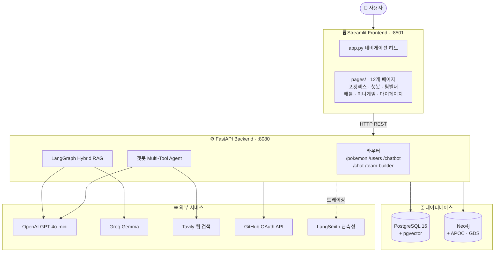
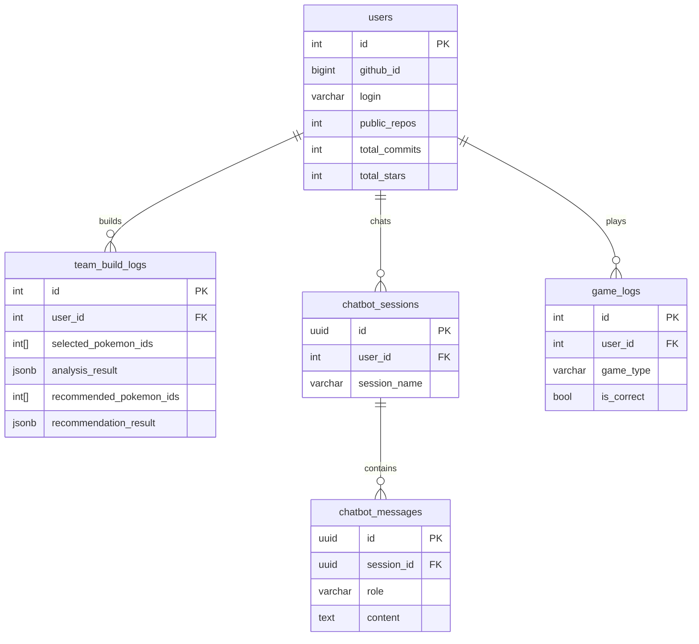
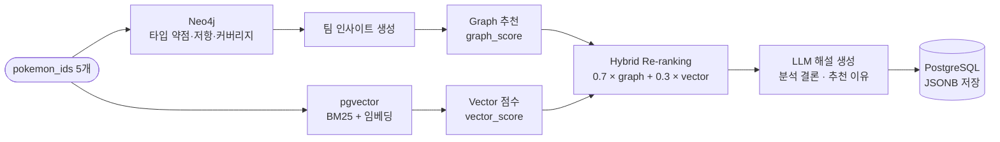
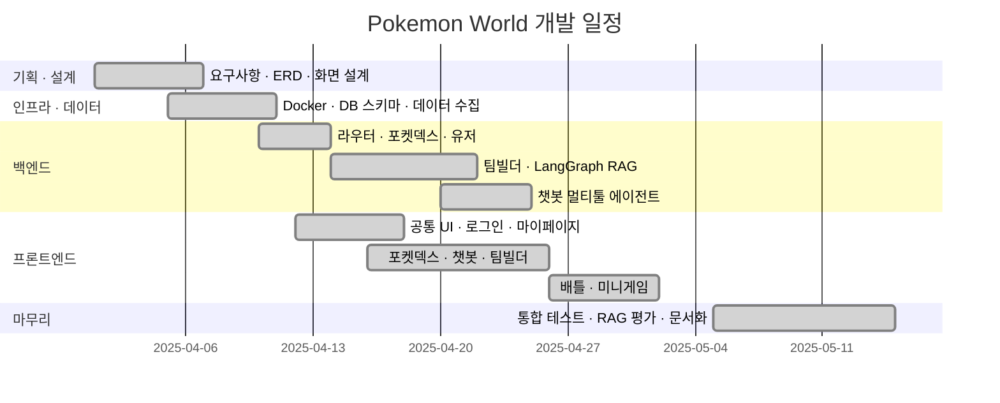

# 너로 정했다! — Pokemon World

> **GitHub OAuth 로그인 · AI 챗봇 · 포켓덱스 · 팀 빌더 · 배틀 시뮬레이터 · 미니게임**  
> LangGraph 기반 하이브리드 RAG · Neo4j 그래프 DB · PostgreSQL pgvector

**SKN27-3rd-3TEAM** · SKN AI 캠프 27기 3차 프로젝트 · 2025.04 ~ 2025.05

---

## 팀 구성

<table align="center">
  <tr>
    <td align="center" width="160">
      <br>
      <b>재강</b><br>
      <sub>역할</sub>
    </td>
    <td align="center" width="160">
      <br>
      <b>필주</b><br>
      <sub>역할</sub>
    </td>
    <td align="center" width="160">
      <br>
      <b>재경</b><br>
      <sub>역할</sub>
    </td>
    <td align="center" width="160">
      <br>
      <b>재희</b><br>
      <sub>역할</sub>
    </td>
    <td align="center" width="160">
      <br>
      <b>송원</b><br>
      <sub>역할</sub>
    </td>
  </tr>
</table>

---

## 기술 스택

| 분류 | 기술 |
|---|---|
| **Backend** | FastAPI · Uvicorn · SQLAlchemy · psycopg2 |
| **Frontend** | Streamlit · streamlit-cookies-controller |
| **AI / LLM** | LangChain · LangGraph · LangSmith |
| **LLM 모델** | OpenAI GPT-4o-mini · Groq (Gemma) · Ollama |
| **임베딩 / 검색** | sentence-transformers · pgvector · BM25 |
| **웹 검색** | Tavily |
| **관계형 DB** | PostgreSQL 16 + pgvector |
| **그래프 DB** | Neo4j + APOC + Graph Data Science |
| **인증** | GitHub OAuth 2.0 |
| **인프라** | Docker · Docker Compose |

---

## 시스템 아키텍처

Streamlit 프론트엔드 → FastAPI 백엔드 → PostgreSQL + Neo4j 이중 DB 구조.  
AI 기능은 LangGraph가 오케스트레이션하며 OpenAI · Groq · Tavily 외부 서비스를 연동합니다.



→ [프로젝트 구조 · Docker 네트워크 상세](../../wiki/Architecture)

---

## 주요 기능

| 기능 | 한 줄 설명 |
|---|---|
| 🔐 GitHub OAuth | 소셜 로그인 · 커밋/레포/스타 자동 수집 · 쿠키 세션 |
| 📖 포켓덱스 | 1,025마리 · 타입/특성/번호 복합 필터 · 분기 진화 트리 |
| 🤖 AI 챗봇 (오박사) | SQL · Vector · Graph · 웹 검색 멀티툴 · 멀티턴 히스토리 |
| ⚔️ 팀 빌더 | 5마리 선택 → LangGraph Hybrid RAG 분석 → 6번째 추천 |
| 🥊 배틀 시뮬레이터 | 1v1 타입 상성 배틀 · GPT-4o-mini AI 랩 배틀 (스트리밍) |
| 🎮 미니게임 | 실루엣 퀴즈 · 메모리 카드 · 플레이 로그 저장 |
| 👤 마이페이지 | GitHub 프로필 · 배지 시스템 · 팀 빌더 히스토리 |

→ [기능 상세 · 화면 설계 · 페이지 흐름](../../wiki/Features)

---

## 데이터베이스

PostgreSQL(관계형 + 벡터)과 Neo4j(그래프)를 병행 운용합니다.



→ [전체 ERD · Neo4j 그래프 스키마](../../wiki/Database)

---

## AI / RAG 파이프라인

팀 빌더는 Neo4j 그래프 분석과 pgvector 벡터 검색을 결합한 하이브리드 RAG로 동작합니다.  
`score = 0.7 × graph_score + 0.3 × vector_score` 로 Re-ranking 후 LLM이 해설을 생성합니다.



챗봇은 LangGraph 멀티툴 에이전트로 SQL · Vector · Graph · Web 검색을 질문에 따라 자동 선택합니다.

→ [LangGraph 상세 · 챗봇 에이전트 · 시퀀스 다이어그램](../../wiki/AI-Pipeline)

---

## API 명세

| 라우터 | 주요 엔드포인트 |
|---|---|
| `/api/v1/pokemon` | GET 목록 · GET 상세 · GET 특성 목록 |
| `/api/v1/users` | POST sync · GET 통계/로그 · POST 게임로그 |
| `/api/v1/team-builder` | POST analyze · POST recommend · POST rag-analyze · POST rag-recommend · GET history |
| `/api/v1/chatbot` | POST chat · GET/POST/DELETE sessions · GET messages |
| `/api/v1/chat` | POST rap-battle · POST rap-battle/stream |

→ [전체 엔드포인트 파라미터 · 요청/응답 명세](../../wiki/API-Reference)

---

## 실행 방법

```bash
cp .env.sample .env        # API 키 입력
docker compose up --build  # 전체 스택 실행
```

| 서비스 | URL |
|---|---|
| Frontend | http://localhost:8501 |
| Backend API | http://localhost:8080 |
| Neo4j Browser | http://localhost:7474 |

→ [로컬 개발 · 환경 변수 전체 목록](../../wiki/Setup)

---

## 개발 일정 (WBS)



→ [요구사항 명세 · 테스트 체크리스트 · RAG 품질 지표](../../wiki/Requirements-and-Testing)

---

## 회고

프로젝트를 마치며 각 팀원이 담당 기능 개발 경험, 기술적 도전, 배운 점을 정리했습니다.

<table align="center">
  <tr>
    <td align="center" width="160">
      <a href="../../wiki/재강">
        <br>
        <b>재강</b>
      </a><br>
      <sub><a href="../../wiki/재강">회고 보기 →</a></sub>
    </td>
    <td align="center" width="160">
      <a href="../../wiki/필주">
        <br>
        <b>필주</b>
      </a><br>
      <sub><a href="../../wiki/필주">회고 보기 →</a></sub>
    </td>
    <td align="center" width="160">
      <a href="../../wiki/재경">
        <br>
        <b>재경</b>
      </a><br>
      <sub><a href="../../wiki/재경">회고 보기 →</a></sub>
    </td>
    <td align="center" width="160">
      <a href="../../wiki/재희">
        <br>
        <b>재희</b>
      </a><br>
      <sub><a href="../../wiki/재희">회고 보기 →</a></sub>
    </td>
    <td align="center" width="160">
      <a href="../../wiki/송원">
        <br>
        <b>송원</b>
      </a><br>
      <sub><a href="../../wiki/송원">회고 보기 →</a></sub>
    </td>
  </tr>
</table>
