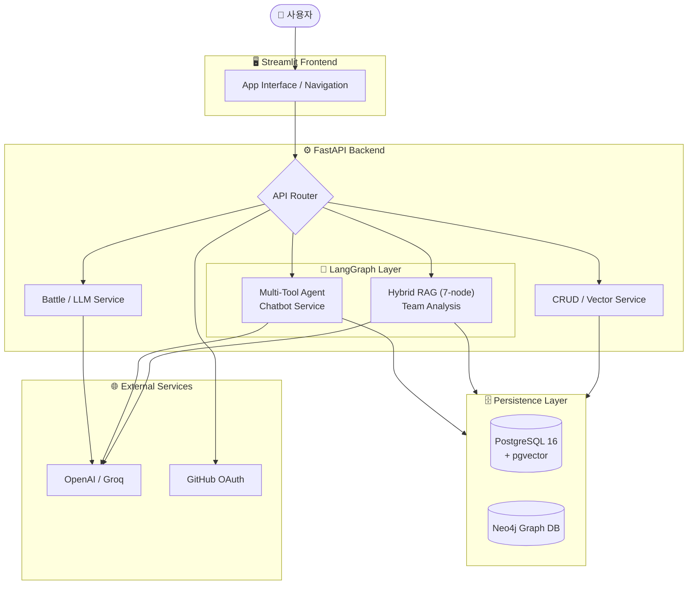

# 🔴 너로 정했다! LLM (I Choose You! LLM)

> **"단순한 챗봇을 넘어, 데이터의 관계와 맥락을 이해하는 포켓몬 멀티 에이전트 플랫폼"**  
> LangGraph 기반의 하이브리드 RAG와 Neo4j 그래프 DB를 결합하여, 포켓몬 데이터 사이의 복잡한 상성관계를 논리적으로 추론하고 최적의 팀을 추천합니다.

---

## 🌟 핵심 평가 항목 요약 (Killer Section)

평가 위원분들이 가장 궁금해하실 **프로젝트의 기술적 차별점**을 요약했습니다.

| 평가 항목 | 핵심 전략 및 구현 내용 | 상세 문서 |
|:---:|:---|:---:|
| **RAG 환각 방지** | **Groundedness 확인 로직**: 검색된 문서에 근거한 답변만 생성하도록 가드레일 설정 및 UI 하단 출처(Reference) 명시. | [👉 전략 보기](./wiki/LLM_RAG_평가_계획_및_결과.md) |
| **데이터 파이프라인** | **Semantic Chunking**: 단순 길이 분할이 아닌 의미 단위 분할을 통해 문맥 보존. 정규식을 활용한 데이터 노이즈 제거 완료. | [👉 공정 보기](./wiki/VectorDB_구축_및_청킹.md) |
| **하이브리드 DB** | **RDB + GraphDB**: 메타데이터는 PostgreSQL로, 포켓몬 간의 진화/상성 관계는 Neo4j로 관리하여 복잡한 다대다 관계 해결. | [👉 설계 보기](./wiki/ERD_및_GraphDB_설계.md) |
| **에이전트 제어** | **LangGraph Orchestration**: 7개 노드로 구성된 워크플로우를 통해 추천/분석 로직의 신뢰성 및 추적성 확보. | [👉 로직 보기](./wiki/RAG_파이프라인_설계.md) |

---

## 🏗️ 시스템 아키텍처

사용자의 요청은 FastAPI 라우터를 거쳐, **LangGraph 오케스트레이션 계층**에서 각 서비스의 목적에 맞는 최적의 도구(SQL, Vector, Graph)를 선택하여 처리됩니다.



---

## 📁 Quick Links (Wiki 네비게이션)

프로젝트의 생명주기에 맞춘 상세 기술 문서를 확인하실 수 있습니다.

### 1️⃣ 기획 및 설계
- [요구사항명세서](./wiki/요구사항명세서.md) · [화면설계서](./wiki/화면설계서.md) · [WBS](./wiki/WBS.md)

### 2️⃣ 아키텍처 및 데이터베이스
- [시스템 아키텍처](./wiki/시스템_아키텍처.md) · [ERD 및 GraphDB 설계](./wiki/ERD_및_GraphDB_설계.md)
- [API 명세서](./wiki/API_명세서.md) · [시퀀스 다이어그램](./wiki/시퀀스_다이어그램.md)

### 3️⃣ 데이터 파이프라인 및 LLM
- [데이터 수집 및 전처리](./wiki/데이터_수집_및_전처리.md) · [VectorDB 구축 및 청킹](./wiki/VectorDB_구축_및_청킹.md)
- [RAG 파이프라인 설계](./wiki/RAG_파이프라인_설계.md) · [프롬프트 명세서](./wiki/프롬프트_명세서.md)

### 4️⃣ 테스트 및 평가
- [테스트 시나리오 및 결과](./wiki/테스트_시나리오_및_결과.md) · [LLM RAG 평가 계획 및 결과](./wiki/LLM_RAG_평가_계획_및_결과.md)

---

## 🚀 시작하기

Docker Compose를 통해 인프라 구축부터 서비스 실행까지 한 번에 완료할 수 있습니다.

```bash
# 1. 환경 변수 설정
cp .env.sample .env

# 2. 전체 스택 빌드 및 실행
docker compose up --build
```

---
<p align="center">© 2025 SKN27-3rd-3TEAM. All Rights Reserved.</p>
