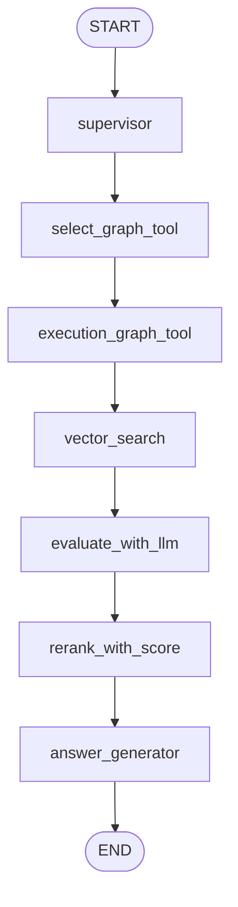

# Team Build RAG 모듈 설명

이 폴더는 팀 빌딩 기능에 특화된 Hybrid Graph RAG 구조입니다.

일반 RAG가 문서 검색 중심이라면, 이 구조는 Neo4j 그래프 분석 결과와 Vector DB 검색 결과를 함께 사용해서 팀 분석과 포켓몬 추천 이유를 설명합니다.

---

## 1. 이 폴더를 따로 만든 이유

처음에는 `backend/rag` 같은 일반적인 이름도 가능했지만, 프로젝트의 다른 팀원 작업과 겹칠 수 있습니다.

그래서 팀 빌딩 전용 RAG라는 의미가 명확하도록 `backend/team_build_rag` 폴더로 분리했습니다.

이 폴더는 “팀 추천/분석 전용 RAG”만 담당합니다.

---

## 2. 전체 워크플로우

현재 워크플로우는 다음 순서로 실행됩니다.

```text
START
  -> supervisor
  -> select_graph_tool
  -> execution_graph_tool
  -> vector_search
  -> evaluate_with_llm
  -> rerank_with_score
  -> answer_generator
  -> END
```

### Mermaid 구조



---

## 3. 파일별 역할

| 파일 | 핵심 역할 |
| --- | --- |
| `state.py` | LangGraph에서 공유하는 상태 타입 정의 |
| `graph_tools.py` | 분석/추천 중 어떤 그래프 도구를 쓸지 선택하고 실행 |
| `vector_search.py` | PostgreSQL pgvector 기반 문서 검색 |
| `hybrid_retriever.py` | 그래프 결과와 벡터 검색 결과를 하나의 컨텍스트로 결합 |
| `reranker.py` | 추천 후보 순위를 다시 정렬 |
| `answer_generator.py` | 그래프/벡터 근거를 바탕으로 최종 AI 해설 생성 |
| `workflow.py` | LangGraph 워크플로우 구성 |
| `workflow_diagram.md` | 워크플로우 시각화와 설명 문서 |

---

## 4. `state.py`

### 목적

LangGraph의 각 노드가 공유하는 상태 구조를 정의합니다.

워크플로우가 여러 단계로 나뉘기 때문에, 각 단계가 같은 데이터 구조를 보고 작업해야 합니다.

### 주요 상태 값

| 키 | 의미 |
| --- | --- |
| `pokemon_ids` | 사용자가 선택한 5마리 포켓몬 ID |
| `request_type` | `analysis` 또는 `recommendation` |
| `graph` | Neo4j 클라이언트 |
| `limit` | 추천 후보 개수 |
| `selected_graph_tool` | 선택된 그래프 도구 이름 |
| `graph_result` | 그래프 DB 기반 분석/추천 결과 |
| `vector_query` | 벡터 검색에 사용할 검색 문장 |
| `vector_documents` | Vector DB에서 검색된 문서 |
| `llm_evaluation` | 그래프 결과와 문서 근거를 합친 컨텍스트 |
| `reranked_result` | 재정렬된 추천 결과 |
| `final_answer` | 최종 AI 해설 |
| `errors` | 워크플로우 중 발생한 에러 목록 |

### 설계 의도

LangGraph는 각 노드가 상태 일부를 업데이트하는 방식으로 동작합니다.

그래서 `state.py`는 전체 RAG 파이프라인의 공통 데이터 계약서 역할을 합니다.

---

## 5. `graph_tools.py`

### 목적

사용자의 요청이 팀 분석인지 추천인지 판단하고, 알맞은 그래프 서비스를 실행합니다.

### 주요 함수

| 함수 | 설명 |
| --- | --- |
| `select_graph_tool()` | `request_type`에 따라 분석 도구 또는 추천 도구 선택 |
| `execute_graph_tool()` | 선택된 도구에 맞춰 실제 서비스 함수 실행 |
| `build_vector_query_from_graph()` | 그래프 결과를 바탕으로 벡터 검색용 문장 생성 |

### 요청 타입별 실행

| request type | 실행 서비스 |
| --- | --- |
| `analysis` | `team_analysis_service.analyze_team()` |
| `recommendation` | `team_builder_service.recommend_team_member()` |

### 설계 의도

RAG의 첫 근거는 그래프 DB입니다.

팀의 약점, 저항, 추천 후보 같은 정량 근거는 Neo4j에서 먼저 가져오고, 그 결과를 바탕으로 벡터 검색을 이어갑니다.

---

## 6. `vector_search.py`

### 목적

그래프 결과만으로 부족한 설명을 보강하기 위해 Vector DB에서 관련 문서를 검색합니다.

현재는 PostgreSQL의 pgvector를 사용합니다.

### 검색 대상

| 테이블 | 활용 목적 |
| --- | --- |
| `pokemon_knowledge` | 포켓몬 관련 설명 문서 |
| `flavor_text` | 포켓몬 도감 설명 |
| `abilities` | 특성 설명 |
| `moves` | 기술 설명 |

### 검색 방식

1. 그래프 분석 결과를 문장으로 변환합니다.
2. OpenAI Embedding API로 검색 문장을 벡터화합니다.
3. pgvector의 거리 계산으로 관련 문서를 찾습니다.
4. 그래프 결과 자체도 문서 형태로 함께 넣습니다.

### 환경변수

| 환경변수 | 의미 |
| --- | --- |
| `OPENAI_API_KEY` | 임베딩 생성에 사용 |
| `TEAM_BUILD_RAG_EMBEDDING_MODEL` | 임베딩 모델명 |

기본 임베딩 모델은 `text-embedding-3-small` 기준입니다.

### 설계 의도

Neo4j는 관계와 수치 근거를 잘 찾습니다.

반면 기술 설명, 특성 설명, 도감 문장 같은 자연어 근거는 Vector DB가 더 잘 찾습니다.

그래서 둘을 함께 사용하는 Hybrid RAG 구조로 설계했습니다.

---

## 7. `hybrid_retriever.py`

### 목적

그래프 결과와 벡터 검색 결과를 하나의 컨텍스트로 묶습니다.

### 주요 함수

| 함수 | 설명 |
| --- | --- |
| `build_hybrid_context()` | `graph_result`와 `vector_documents`를 합쳐 `llm_evaluation` 생성 |

### 결과 구조

| 키 | 의미 |
| --- | --- |
| `graph_result` | Neo4j 기반 정량 분석 |
| `evidence_documents` | Vector DB 검색 문서 |
| `evidence_count` | 검색된 문서 개수 |
| `notes` | 해설 생성 시 참고할 내부 메모 |

### 설계 의도

LLM에게 데이터를 넘길 때 그래프 근거와 문서 근거가 따로 흩어져 있으면 프롬프트 구성이 어려워집니다.

이 파일은 두 근거를 한 번에 사용할 수 있는 형태로 정리합니다.

---

## 8. `reranker.py`

### 목적

추천 후보의 순위를 최종적으로 정리합니다.

현재는 그래프 서비스에서 계산한 `score`를 기준으로 정렬합니다.

### 주요 함수

| 함수 | 설명 |
| --- | --- |
| `rerank_with_score()` | 추천 후보를 점수순으로 정렬하고 순위를 부여 |

### 설계 의도

처음에는 그래프 점수만 사용하지만, 나중에는 아래 요소를 함께 반영할 수 있습니다.

| 추가 가능 요소 | 설명 |
| --- | --- |
| 벡터 검색 점수 | 관련 문서와의 의미 유사도 |
| LLM 평가 점수 | 추천 이유의 타당성 평가 |
| 배틀 역할 점수 | 어태커/탱커/서포터 역할 적합도 |
| 기술 품질 점수 | 실제 유용한 기술 보유 여부 |

---

## 9. `answer_generator.py`

### 목적

그래프 결과와 벡터 검색 근거를 바탕으로 최종 AI 해설을 생성합니다.

RAG에서 사용자가 직접 보는 최종 문장을 만드는 파일입니다.

### 주요 흐름

```text
graph_result + vector_documents
  -> prompt 생성
  -> LLM 호출
  -> final_answer 반환
```

### 주요 함수

| 함수 | 설명 |
| --- | --- |
| `_build_analysis_prompt()` | 팀 분석용 프롬프트 생성 |
| `_build_recommendation_prompt()` | 추천 해설용 프롬프트 생성 |
| `_call_llm()` | 설정된 LLM Provider 호출 |
| `_build_fallback_analysis_answer()` | LLM 실패 시 기본 분석 문장 생성 |
| `_build_fallback_recommendation_answer()` | LLM 실패 시 기본 추천 문장 생성 |
| `generate_answer()` | 최종 답변 생성 노드 |

### LLM Provider

| 환경변수 | 의미 |
| --- | --- |
| `TEAM_BUILD_RAG_LLM_PROVIDER` | `groq` 또는 `openai` |
| `GROQ_API_KEY` | Groq 사용 시 필요 |
| `OPENAI_API_KEY` | OpenAI 사용 시 필요 |
| `TEAM_BUILD_RAG_GROQ_MODEL` | Groq 모델명 |
| `TEAM_BUILD_RAG_OPENAI_MODEL` | OpenAI 모델명 |

### 주의할 점

LLM API 키가 없거나 호출이 실패하면 fallback 문장이 사용됩니다.

이 경우 진짜 LLM 기반 RAG 해설이 아니라, 그래프 결과를 기반으로 한 규칙형 설명에 가깝습니다.

---

## 10. `workflow.py`

### 목적

LangGraph 워크플로우를 실제로 구성하고 컴파일합니다.

### 주요 구성

| 구성 | 설명 |
| --- | --- |
| `supervisor()` | 입력값 검증 |
| `vector_search_node()` | 벡터 검색 실행 |
| `evaluate_with_llm()` | 그래프/벡터 근거 결합 |
| `build_hybrid_rag_workflow()` | 전체 LangGraph 생성 |
| `hybrid_rag_app` | 서비스에서 호출하는 컴파일된 앱 |

### 설계 의도

처음부터 LangGraph 구조로 만든 이유는 단계가 명확히 분리되기 때문입니다.

분석, 검색, 재정렬, 답변 생성을 각각 독립 노드로 나누면 나중에 중간 단계를 바꾸거나 추가하기 쉽습니다.

---

## 11. `workflow_diagram.md`

### 목적

워크플로우를 문서와 다이어그램으로 확인하기 위한 파일입니다.

이 파일은 개발자가 현재 RAG 흐름을 한눈에 볼 수 있도록 돕습니다.

### 사용 방법

Markdown Preview에서 Mermaid가 지원되면 그래프 형태로 볼 수 있습니다.

지원되지 않는 환경에서는 Mermaid 코드를 Mermaid Live Editor에 붙여 넣어 확인할 수 있습니다.

---

## 12. Hybrid Graph RAG에서 각 단계의 의미

| 단계 | 의미 |
| --- | --- |
| `supervisor` | 요청이 분석인지 추천인지, 입력이 유효한지 확인 |
| `select_graph_tool` | 어떤 그래프 서비스를 쓸지 선택 |
| `execution_graph_tool` | Neo4j 기반 분석/추천 실행 |
| `vector_search` | 그래프 결과를 바탕으로 자연어 문서 검색 |
| `evaluate_with_llm` | 그래프 근거와 문서 근거를 하나로 정리 |
| `rerank_with_score` | 추천 후보 순위 정리 |
| `answer_generator` | 최종 AI 해설 생성 |

---

## 13. 현재 구조의 장점

| 장점 | 설명 |
| --- | --- |
| 그래프 근거가 명확함 | 약점, 저항, 기술 타입 관계를 Neo4j에서 직접 조회 |
| 자연어 보강 가능 | Vector DB에서 기술/특성/도감 설명을 가져올 수 있음 |
| 단계별 확장 쉬움 | LangGraph 노드 단위로 기능 추가 가능 |
| fallback 가능 | LLM 실패 시에도 기본 해설 반환 가능 |
| 프론트와 연결 쉬움 | `/rag-analyze`, `/rag-recommend` API로 호출 가능 |

---

## 14. 앞으로 개선할 수 있는 부분

| 개선 포인트 | 설명 |
| --- | --- |
| 추천 후보별 기술 설명 강화 | 후보가 어떤 기술로 어떤 약점을 보완하는지 더 구체화 |
| 특성 반영 | 부유, 저수, 타오르는불꽃 같은 특성을 추천 이유에 포함 |
| 아이템 반영 | 메가스톤, 진화 아이템, 배틀 아이템 조건 반영 |
| 실제 배틀 역할 반영 | 물리/특수 어태커, 탱커, 스위퍼 역할 판단 |
| LLM 평가 노드 강화 | 추천 후보별 장단점을 LLM이 비교 평가 |
| 프론트 출력 개선 | `final_answer`를 카드별 문단으로 나누어 표시 |

---

## 15. 핵심 요약

이 폴더는 단순 문서 검색 RAG가 아닙니다.

Neo4j 그래프 분석을 먼저 수행하고, 그 결과를 바탕으로 Vector DB 문서를 검색한 뒤, LLM이 해설을 생성하는 Hybrid Graph RAG 구조입니다.

현재 팀 빌딩 기능에서는 다음 두 가지에 사용됩니다.

| 기능 | API |
| --- | --- |
| 선택한 5마리 팀 분석 해설 | `/api/v1/team-builder/rag-analyze` |
| 부족한 1마리 추천 해설 | `/api/v1/team-builder/rag-recommend` |
