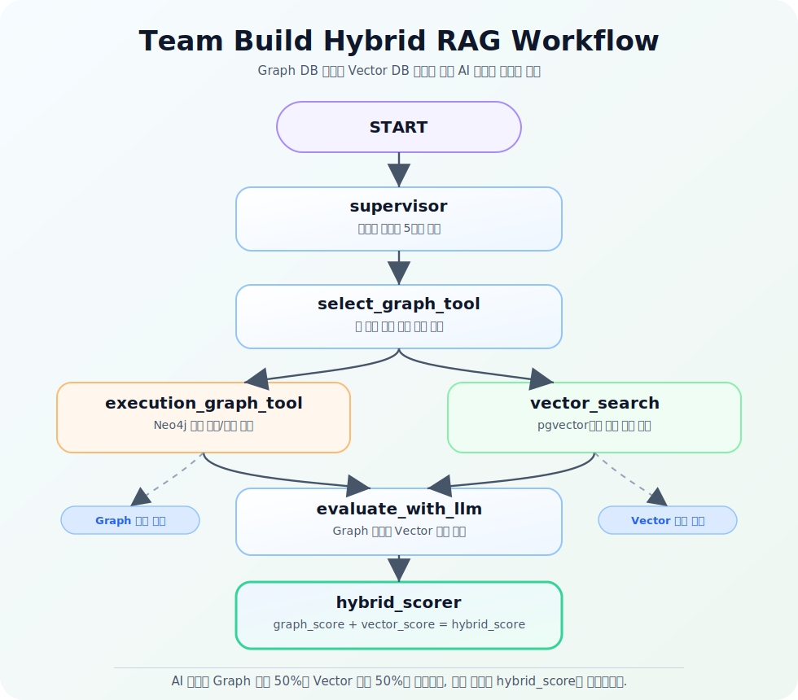
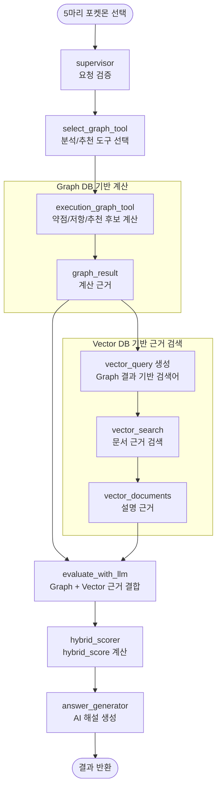

# Team Build Hybrid RAG Workflow

이 문서는 팀 빌딩 RAG가 어떤 순서로 실행되는지 보기 위한 시각화 문서입니다.

## Mermaid 원본

아래 Mermaid 코드는 SVG를 다시 만들거나 구조를 수정할 때 참고하기 위한 원본입니다.
실제 실행은 순차형이지만, 이해하기 쉽도록 Graph DB 계산 근거와 Vector DB 검색 근거를 좌우로 분리해 표현했습니다.

## 노드 역할

- `supervisor`: 사용자가 보낸 `pokemon_ids`가 5마리인지 확인합니다.
- `select_graph_tool`: 요청이 덱 분석인지, 6번째 포켓몬 추천인지 판단합니다.
- `execution_graph_tool`: Neo4j Graph DB로 타입 약점, 저항, 추천 후보를 계산합니다.
- `vector_search`: Graph 결과를 검색 문장으로 바꾸고 pgvector에서 설명 근거 문서를 찾습니다.
- `evaluate_with_llm`: Graph 결과와 Vector 문서를 하나의 RAG context로 묶습니다.
- `hybrid_scorer`: `graph_score`와 `vector_score`를 가중치로 합쳐 `hybrid_score`를 만듭니다.
- `answer_generator`: `hybrid_score`, Graph 근거, Vector 근거를 LLM 프롬프트로 넘겨 자연어 해설을 생성합니다.

## 점수 흐름

- `graph_score`: 팀 약점 보완, 종족값, 기술 타입 커버리지 같은 Graph DB 계산 기반 점수입니다.
- `vector_score`: 후보 이름, 타입, 기술명과 Vector DB 문서가 얼마나 잘 매칭되는지 계산한 근거 점수입니다.
- `hybrid_score`: 실제 RAG 추천 순위에 사용하는 최종 점수입니다.

## 현재 가중치

- 덱 분석: Graph 60%, Vector 40%
- 포켓몬 추천: Graph 70%, Vector 30%
- AI 답변 생성: Graph 50%, Vector 50%

가중치를 바꾸고 싶으면 [scoring_policy.py](scoring_policy.py)를 수정하면 됩니다.
