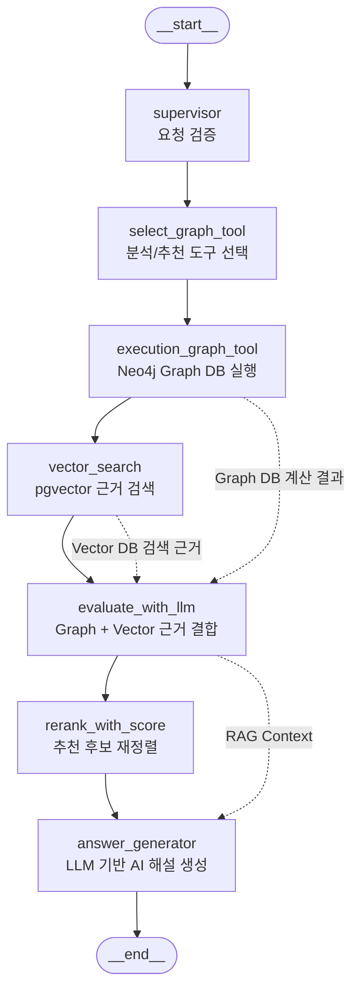

# Team Build Hybrid RAG Workflow

이 문서는 팀 빌딩 RAG가 어떤 순서로 실행되는지 시각적으로 확인하기 위한 다이어그램입니다.

## 노드 역할

- `supervisor`: 요청이 팀 빌딩 RAG에서 처리 가능한 형태인지 확인합니다.
- `select_graph_tool`: 덱 분석 요청인지, 6번째 포켓몬 추천 요청인지에 따라 사용할 Graph 도구를 고릅니다.
- `execution_graph_tool`: Neo4j Graph DB를 사용해서 팀 약점, 방어 안정 타입, 추천 후보를 계산합니다.
- `vector_search`: Graph 결과를 검색 문장으로 바꾸고 pgvector에서 설명 근거를 찾습니다.
- `evaluate_with_llm`: Graph 계산 결과와 Vector 검색 문서를 하나의 RAG context로 묶습니다.
- `rerank_with_score`: 추천 요청일 때 후보 포켓몬을 점수 기준으로 다시 정렬합니다.
- `answer_generator`: RAG context를 LLM 프롬프트에 넣고 사용자에게 보여줄 AI 해설을 생성합니다.
