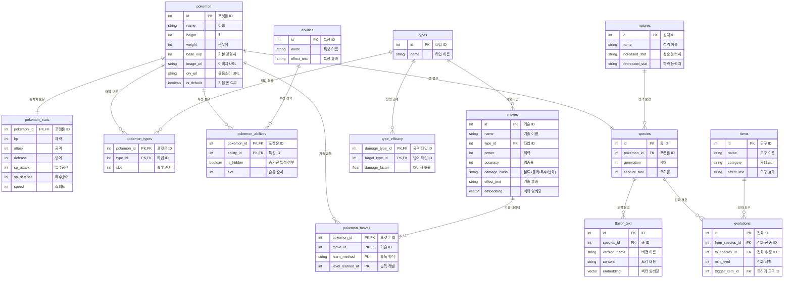

# 📑 Pokemon RAG Database Pipeline

> **LLM 및 RAG 시스템 구축을 위한 하이브리드 포켓몬 데이터 파이프라인 (전체 세대 지원)**

이 프로젝트는 PokeAPI를 활용하여 포켓몬의 정형 데이터(종족값, 타입, 진화, 기술, 도구)와 비정형 데이터(도감 설명)를 수집, 정제하여 **PostgreSQL (pgvector)** 기반의 지식 베이스를 구축하는 파이프라인입니다.

## 🛠 Tech Stack

- **Language**: Python 3.x
- **Database**: PostgreSQL with `pgvector` extension
- **Libraries**: `requests`, `psycopg2-binary`, `python-dotenv`, `tqdm`, `schedule`
- **Infrastructure**: Docker & Docker Compose

---

## 🏗 아키텍처 및 스키마 구조

데이터베이스는 RAG(검색 증강 생성) 및 Text-to-SQL에 최적화된 5가지 도메인으로 설계되었습니다.

1. **핵심 정형 데이터**: `pokemon`, `pokemon_stats`
2. **속성 및 특성 시스템**: `types`, `pokemon_types`, `abilities`, `pokemon_abilities`, `type_efficacy`
3. **RAG 핵심 지식 베이스**: `species`, `flavor_text`, `natures` (성격 보정 데이터 포함)
4. **진화 파이프라인**: `evolutions` (전 세대 진화 조건 및 도구 매핑)
5. **전투 및 도구**: `moves` (물리/특수 구분 포함), `items`

### ERD (Entity Relationship Diagram)



---

## 🚀 실행 파이프라인 (How to Run)

전체 파이프라인은 **환경 설정 ➡️ DB 구동 ➡️ 수집 ➡️ 정제 ➡️ 적재**의 5단계로 진행됩니다.

### Step 1. 환경 설정 및 의존성 설치

Python 환경에 필요한 라이브러리를 설치합니다.

```bash
pip install -r requirements.txt
```

루트 디렉토리에 `.env` 파일을 생성하거나 확인합니다. (기본값 설정됨)

```env
POSTGRES_USER=postgres
POSTGRES_PASSWORD=postgres
POSTGRES_DB=pokemon_db
POSTGRES_PORT=5433
```

### Step 2. PostgreSQL (pgvector) DB 구동

Docker Compose를 사용하여 `pgvector` 확장이 포함된 PostgreSQL 컨테이너를 실행합니다.
(로컬 포트 충돌 방지를 위해 기본적으로 `5433` 포트에 바인딩되어 있습니다.)

```bash
docker-compose up -d
```

> **참고:** 컨테이너가 처음 실행될 때 `database/schema.sql`이 자동으로 마운트되어 테이블이 생성됩니다.

### Step 3. 데이터 수집 (Collection)

PokeAPI를 호출하여 전 세대 포켓몬 관련 Raw JSON 데이터를 수집하여 `data/raw/` 폴더에 저장합니다.
(수집 대상: 포켓몬 ~1025마리, 속성 18개, 기술 ~950개, 도구 ~2250개, 특성 ~307개, 성격 25개, 진화 트리 ~550개)

```bash
python collectors/api_collector.py
```

### Step 4. 데이터 정제 (Processing)

수집된 Raw 데이터를 DB 스키마에 맞게 정제 및 매핑합니다.
특히 한국어 이름 및 도감 설명(`flavor_text`)을 필터링하여 추출합니다. 정제된 결과는 `data/processed/` 폴더에 저장됩니다.

```bash
python processing/data_processor.py
```

### Step 5. DB 적재 (Loading)

정제된 JSON 데이터를 PostgreSQL 데이터베이스에 삽입합니다. 중복 방지 로직(`ON CONFLICT DO UPDATE`)이 적용되어 있어 여러 번 실행해도 안전합니다.

```bash
python database/db_loader.py
```

> **Tip:** `db_loader.py`는 실행 시 `database/schema.sql`을 참조하여 새로운 테이블이나 컬럼(예: `damage_class`)이 있을 경우 자동으로 DB에 반영(Sync)합니다.

### Step 6. 자동 업데이트 설정 (Automation)

매일 아침 9시에 자동으로 수집 및 업데이트를 진행하려면 스케줄러를 실행합니다.

```bash
# 스케줄러 실행
python scheduler.py
```

### Step 7. 데이터 벡터화 (Vectorization & RAG)
OpenAI 임베딩 모델을 사용하여 기술, 특성, 도감 설명을 벡터로 변환합니다.

```bash
python database/vectorizer.py
```

> [!IMPORTANT]
> **데이터 휴대성 (Portability):** `vectorizer.py`는 생성된 임베딩 값을 `data/processed/` 폴더 내의 JSON 파일들에 자동으로 동기화합니다. 이 폴더만 복사하면 다른 PC(노트북 등)에서도 **추가적인 OpenAI API 호출 비용 없이** `db_loader.py`만으로 임베딩이 포함된 DB를 즉시 구축할 수 있습니다.

---

## 🛠 유틸리티 및 파이프라인 스크립트

- `main_pipeline.py`: 수집 ➡️ 정제 ➡️ 적재 ➡️ 벡터화를 한 번에 실행하는 통합 스크립트입니다.
- `scheduler.py`: `main_pipeline.py`를 매일 특정 시간에 실행하는 스케줄러입니다.
- `database/vectorizer.py`: 텍스트 데이터를 벡터로 변환하고 JSON 파일과 동기화합니다.
- `scratch/check_counts.py`: PokeAPI의 실시간 데이터 개수를 확인하는 유틸리티입니다.

---

## 🗂 프로젝트 구조

```text
Pokemon_DB_Collection/
├── collectors/           
│   └── api_collector.py  # PokeAPI 호출 로직
├── processing/
│   └── data_processor.py # 한글 추출 및 RDBMS 스키마 매핑
├── database/             
│   ├── schema.sql        # pgvector 포함 ERD 기반 설계
│   ├── db_loader.py      # PostgreSQL DB 적재 로직 (Schema Sync 기능 포함)
│   └── vectorizer.py     # OpenAI 임베딩 생성 및 JSON 동기화 로직
├── data/                 
│   ├── raw/              # PokeAPI 원본 JSON 파일
│   └── processed/        # DB 적재용 정제된 JSON 파일
├── scratch/              # 데이터 분석 및 테스트용 스크립트
├── docker-compose.yml    # PostgreSQL DB 환경 구성
├── main_pipeline.py      # 통합 실행 파이프라인
├── scheduler.py          # 자동 업데이트 스케줄러
├── requirements.txt      # Python 패키지 의존성
└── README.md
```
