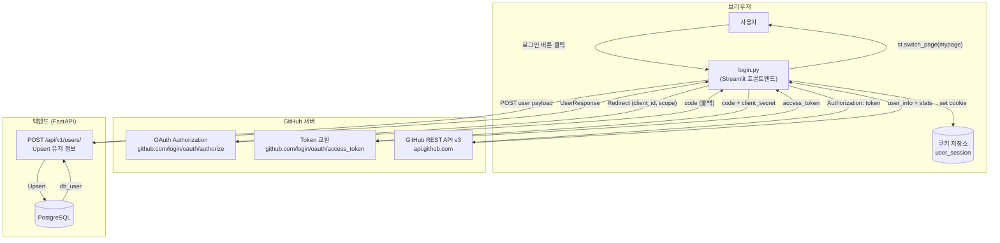
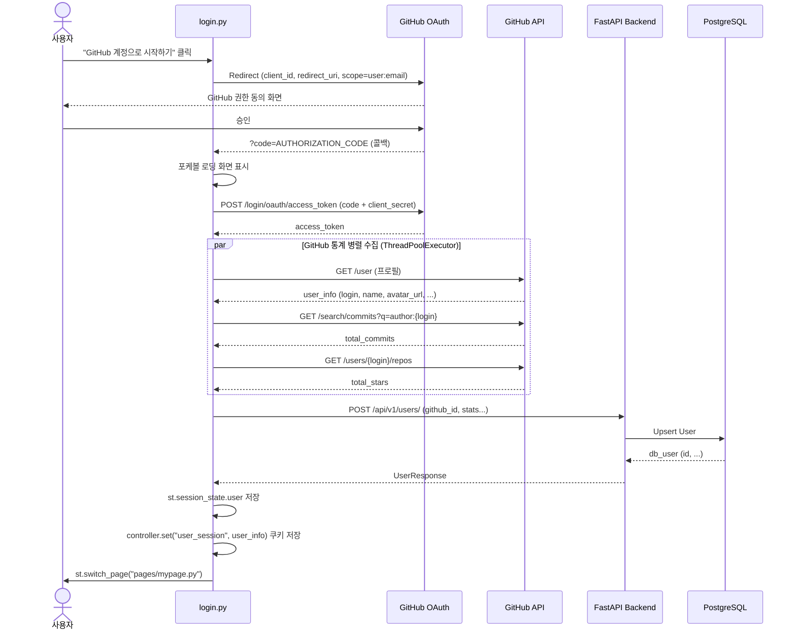
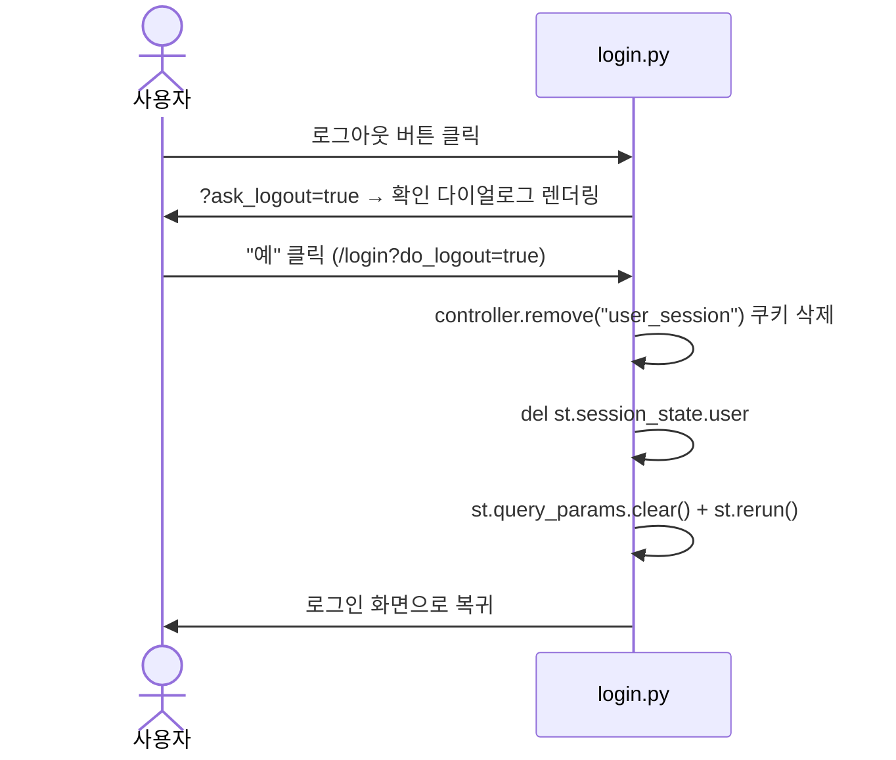

# 로그인 (Login) — GitHub OAuth 2.0 기반 트레이너 인증 시스템

> GitHub 계정 하나로 포켓몬 월드의 정식 트레이너가 되어 팀 저장·배틀 기록·AI 챗 기능을 이용할 수 있습니다.

---

## 1. 프로젝트 개요 (Introduction)

**트레이너 인증 시스템**은 GitHub OAuth 2.0 프로토콜을 기반으로 한 소셜 로그인 기능입니다.  
별도의 회원가입 없이 GitHub 계정으로 즉시 로그인하며, 인증 완료 시 GitHub 공개 통계(커밋 수, 스타 수, 팔로워 수)를 자동으로 수집해 사용자 프로필에 반영합니다.

| 항목 | 내용 |
|---|---|
| 인증 방식 | GitHub OAuth 2.0 Authorization Code Flow |
| 세션 관리 | `st.session_state` + `streamlit-cookies-controller` |
| 대상 독자 | 개발자, 프로젝트 이해관계자, 서비스 사용자 |
| 주요 파일 | `frontend/pages/login.py`, `frontend/pages/style/login_styles.py` |

---

## 2. 기술 스택 (Tech Stack)

### 프론트엔드

| 기술 | 용도 |
|---|---|
| **Streamlit** | 페이지 렌더링 및 세션 상태 관리 |
| **streamlit-cookies-controller** | 브라우저 쿠키 기반 세션 영속화 |
| **HTML/CSS (st.markdown)** | Glassmorphism 로그인 카드, 포케볼 SVG 애니메이션 |
| **python-dotenv** | `.env` 파일에서 OAuth 자격증명 로드 |

### 백엔드 / 외부 API

| 기술 | 용도 |
|---|---|
| **GitHub OAuth API** | Authorization Code 발급 및 Access Token 교환 |
| **GitHub REST API v3** | 사용자 프로필·레포지토리·커밋 통계 조회 |
| **FastAPI** (`/api/v1/users/`) | 사용자 정보 DB 동기화 (Upsert) |
| **PostgreSQL** | 사용자 데이터 영구 저장 |

### 환경 변수

| 변수명 | 설명 |
|---|---|
| `GITHUB_CLIENT_ID` | GitHub OAuth App의 Client ID |
| `GITHUB_CLIENT_SECRET` | GitHub OAuth App의 Client Secret |
| `GITHUB_REDIRECT_URI` | OAuth 콜백 URI (기본값: `http://localhost:8501/login`) |
| `BACKEND_URL` | 백엔드 API 주소 (기본값: `http://localhost:8000`) |

---

## 3. 시스템 아키텍처 (Architecture)

### 3-1. 컴포넌트 구성도



### 3-2. 시퀀스 다이어그램 — 로그인 전체 흐름



### 3-3. 시퀀스 다이어그램 — 로그아웃 흐름



---

## 4. 핵심 기능 상세 (Key Features)

### 4-1. GitHub OAuth 2.0 인증

**Authorization URL 생성** (`login.py:42-48`)

```python
params = {
    "client_id": CLIENT_ID,
    "redirect_uri": REDIRECT_URI,
    "scope": "user:email",     # 이메일 접근 권한만 요청 (최소 권한)
}
auth_url = f"https://github.com/login/oauth/authorize?{urlencode(params)}"
```

- `scope: user:email` — 공개 이메일만 요청하는 최소 권한 원칙 적용
- Authorization Code를 받으면 `query_params["code"]`로 즉시 감지

### 4-2. GitHub 통계 병렬 수집

`ThreadPoolExecutor(max_workers=2)`로 커밋 수·스타 수를 동시에 조회합니다. (`login.py:83-115`)

| 수집 항목 | API 엔드포인트 | 비고 |
|---|---|---|
| `public_repos` | `GET /user` | user_info에서 직접 추출 |
| `total_commits` | `GET /search/commits?q=author:{login}` | Preview Accept 헤더 필요 |
| `total_stars` | `GET /users/{login}/repos?per_page=100` | 레포별 stargazers_count 합산 |
| `followers` | `GET /user` | user_info에서 직접 추출 |

### 4-3. 백엔드 DB 동기화 (Upsert)

인증 완료 후 `POST /api/v1/users/`로 사용자 정보를 전송합니다. (`login.py:117-135`)

**요청 페이로드**

```json
{
  "github_id": 12345678,
  "login": "octocat",
  "name": "The Octocat",
  "avatar_url": "https://avatars.githubusercontent.com/...",
  "email": "octocat@github.com",
  "public_repos": 42,
  "total_commits": 1234,
  "total_stars": 56
}
```

- DB 저장 성공 시: `db_user.id`를 `user_info["db_id"]`에 병합
- DB 저장 실패 시: GitHub에서 수집한 통계로 세션 구성 (서비스 장애 무중단)

### 4-4. 세션 이중 영속화

| 저장소 | 키 | 용도 |
|---|---|---|
| `st.session_state` | `user` | Streamlit 재렌더링 간 상태 유지 |
| 브라우저 쿠키 | `user_session` | 탭·새로고침 후에도 로그인 상태 복구 |

### 4-5. UI 화면 상태별 렌더링

| 상태 | 표시 내용 |
|---|---|
| **비로그인** | 포케볼 SVG + "GitHub 계정으로 시작하기" 버튼 + 혜택 배지(팀 저장, 배틀 기록, AI 챗) |
| **OAuth 콜백 처리 중** | 포케볼 스핀 로딩 화면 (`loader-spin` 애니메이션) |
| **로그인 완료** | 프로필 카드 (아바타, 이름, `@login`, 마이페이지 이동 버튼) |
| **로그아웃 확인** | "정말 로그아웃 하시겠습니까?" 2버튼 다이얼로그 |

### 4-6. 디자인 시스템

`login_styles.py`에 정의된 CSS 변수와 주요 컴포넌트:

```css
:root {
    --poke-red:    #ff4b4b;
    --poke-yellow: #ffcb05;
    --poke-blue:   #2a75bb;
    --glass-bg:    rgba(8, 4, 22, 0.85);  /* Glassmorphism 카드 배경 */
    --neon-blue:   #00d2ff;
    --neon-purple: #9d50bb;
}
```

| 컴포넌트 | 클래스 | 특징 |
|---|---|---|
| 로그인 카드 | `.login-card` | backdrop-filter blur(12px), card-reveal 애니메이션 |
| 포케볼 아이콘 | `.card-logo` | SVG 인라인, logo-bounce 상하 부유 효과 |
| GitHub 버튼 | `.github-btn` | hover 시 translateY(-4px) + scale(1.02) |
| 아바타 | `.avatar-wrap` | neon-blue→neon-purple 그라디언트 테두리 |
| 로딩 화면 | `.loading-screen` | 전체 화면 블러 오버레이 + 포케볼 스핀 |

---

## 5. 설치 및 실행 방법 (Installation)

### Step 1 — GitHub OAuth App 생성

1. [github.com/settings/developers](https://github.com/settings/developers) 접속
2. **New OAuth App** 클릭
3. 아래 값 입력 후 등록

   | 필드 | 값 |
   |---|---|
   | Application name | Pokemon Battle (또는 원하는 이름) |
   | Homepage URL | `http://localhost:8501` |
   | Authorization callback URL | `http://localhost:8501/login` |

4. 생성된 **Client ID**와 **Client Secret** 복사

### Step 2 — 환경 변수 설정

`.env.sample`을 `.env`로 복사하고 OAuth 자격증명을 입력합니다.

```bash
cp .env.sample .env
```

```dotenv
# .env
GITHUB_CLIENT_ID=your_client_id_here
GITHUB_CLIENT_SECRET=your_client_secret_here
GITHUB_REDIRECT_URI=http://localhost:8501/login
BACKEND_URL=http://localhost:8000
```

### Step 3 — 실행

**Docker (권장)**

```bash
docker-compose up
```

**로컬 개발**

```bash
# 백엔드
cd backend
pip install -r requirements.txt
uvicorn main:app --host 0.0.0.0 --port 8000 --reload

# 프론트엔드 (별도 터미널)
cd frontend
pip install -r requirements.txt
streamlit run app.py --server.port 8501 --server.address 0.0.0.0
```

### Step 4 — 로그인 테스트

1. `http://localhost:8501/login` 접속
2. **GitHub 계정으로 시작하기** 클릭
3. GitHub 권한 동의 후 자동 리다이렉트
4. 마이페이지로 이동되면 로그인 완료

---

## 6. 백엔드 API 명세 (Backend API)

### `POST /api/v1/users/` — 유저 생성 또는 업데이트

**Request Body**

```json
{
  "github_id": 12345678,
  "login": "octocat",
  "name": "The Octocat",
  "avatar_url": "https://avatars.githubusercontent.com/u/583231",
  "email": "octocat@github.com",
  "public_repos": 42,
  "total_commits": 1234,
  "total_stars": 56
}
```

**Response** `200 OK`

```json
{
  "id": 1,
  "github_id": 12345678,
  "login": "octocat",
  "name": "The Octocat",
  "avatar_url": "...",
  "public_repos": 42,
  "total_commits": 1234,
  "total_stars": 56,
  "followers": 0
}
```

### `GET /api/v1/users/{github_id}` — 유저 조회

| 파라미터 | 타입 | 설명 |
|---|---|---|
| `github_id` | `int` | GitHub 사용자 고유 ID |

- `404 Not Found` — 존재하지 않는 유저

---

## 7. 기여 가이드 (Contributing) 및 라이선스

### 새 OAuth 공급자 추가

현재 GitHub만 지원합니다. 새 공급자(Google, Kakao 등)를 추가할 때:

1. `login.py`에 공급자별 `get_auth_url()`, `get_access_token()`, `get_user_info()` 함수 추가
2. `schemas.UserCreate`에 공급자 식별자 필드 추가
3. `crud.create_or_update_user()`에서 공급자별 Upsert 키 분기 처리

### 세션 만료 처리

현재 쿠키에 만료 시간이 설정되어 있지 않습니다. 보안 강화를 위해:

- `controller.set()`에 `expires` 파라미터 추가 권장
- 백엔드에서 JWT 기반 토큰 검증 도입 검토

### 라이선스

본 기능은 SKN27-3rd-3TEAM 내부 프로젝트용으로 제작되었습니다.
