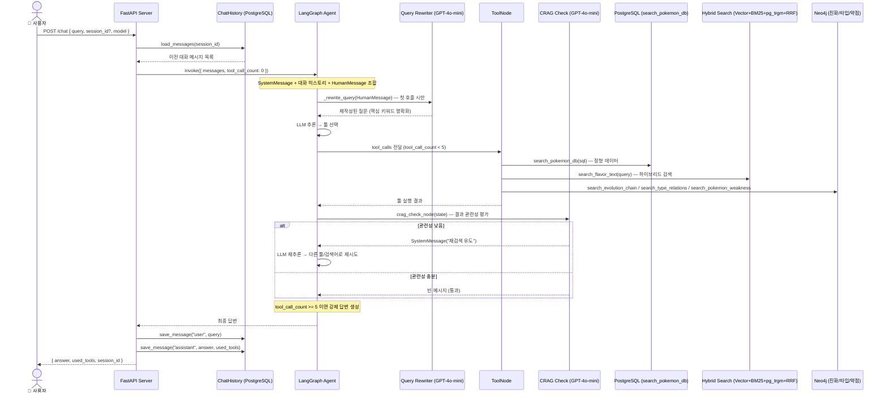
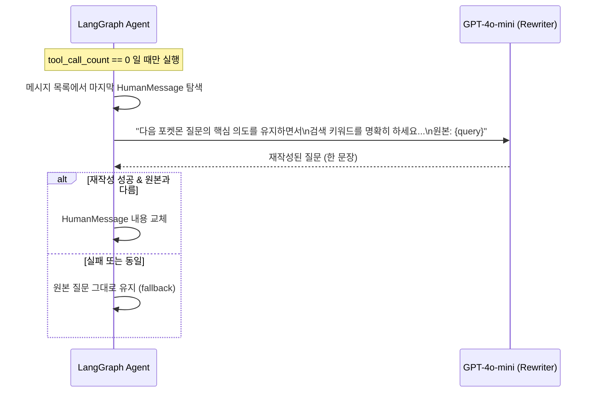
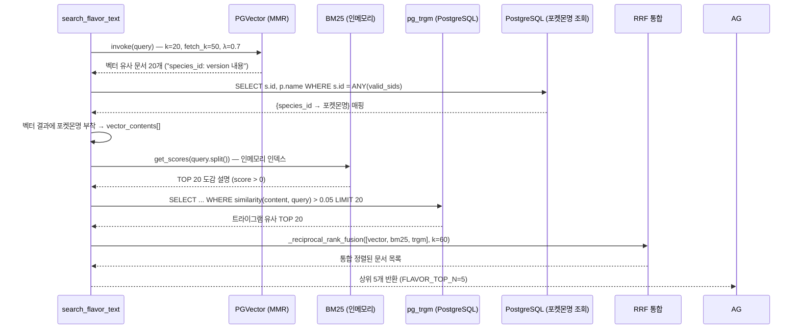
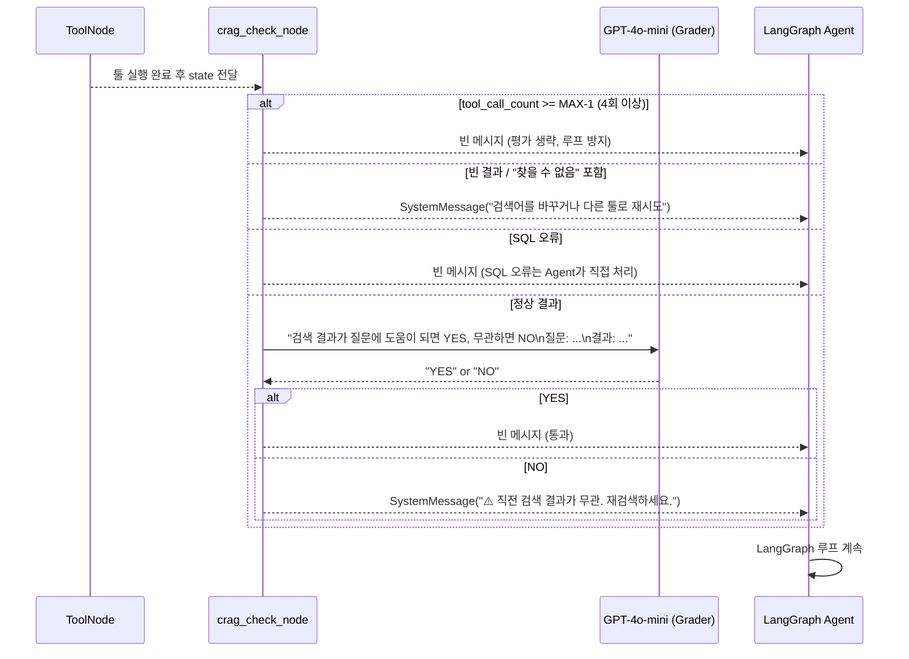
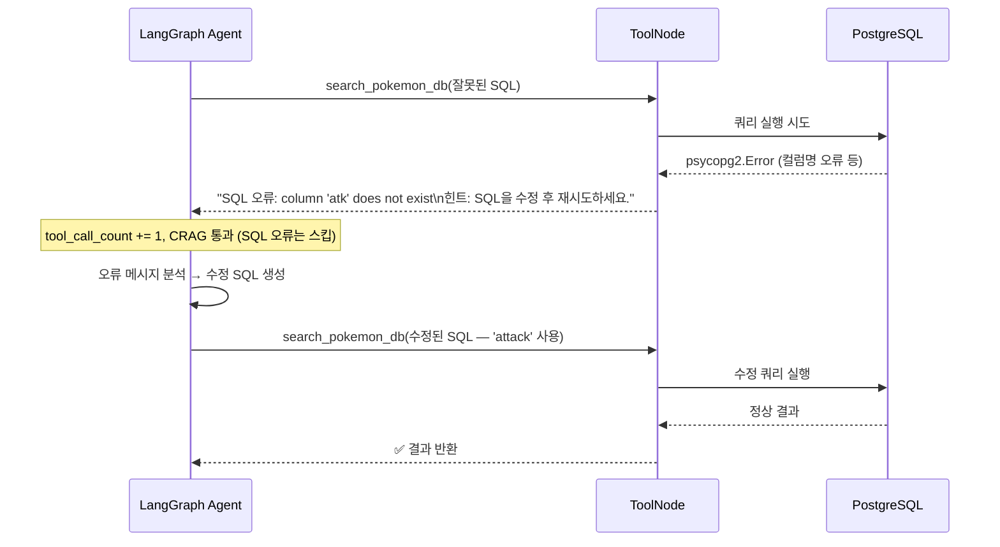
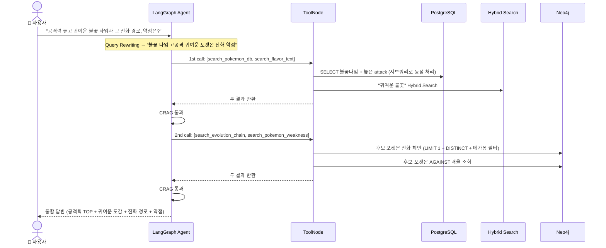
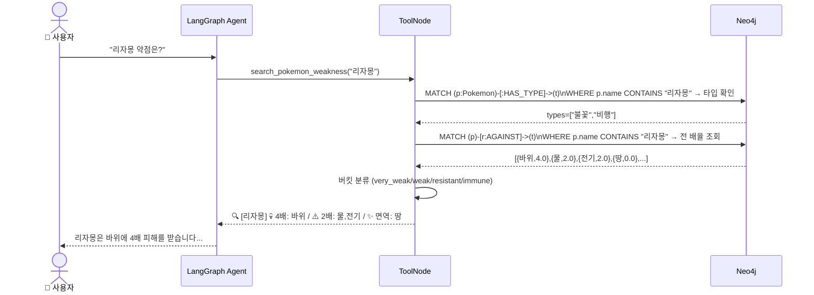
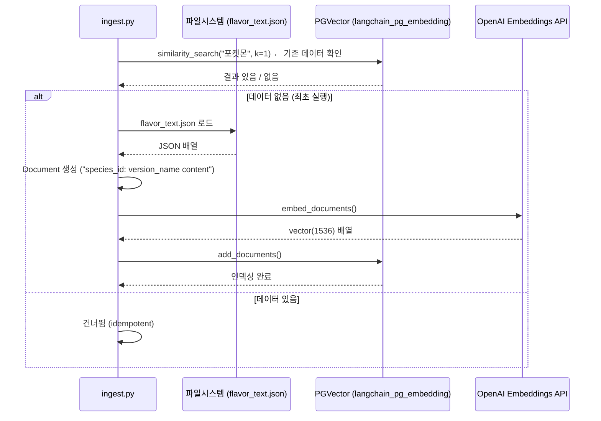
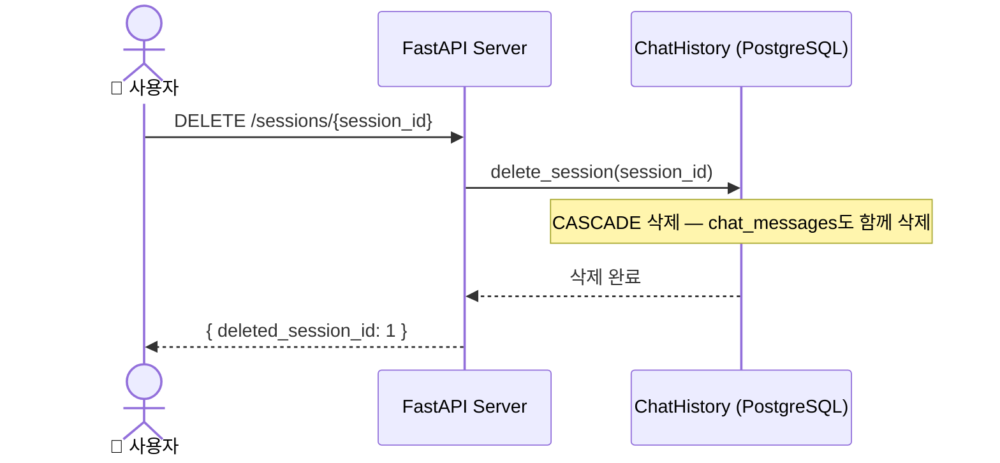

# 시퀀스 다이어그램 (Sequence Diagram)

**프로젝트명:** 포켓몬 AI 챗봇  
**문서 버전:** v1.2  
**작성일:** 2025-05-14  
**최종 수정:** 2025-05-14 (CRAG 노드 추가, Query Rewriting 추가, Hybrid Search 반영, web_search 제거, MAX_TOOL_CALLS 5 반영)

---

## 1. 전체 채팅 요청 흐름

---

## 2. Query Rewriting 상세 흐름

---

## 3. Hybrid Search (search_flavor_text) 상세 흐름

---

## 4. CRAG 흐름 (Corrective RAG)

---

## 5. SQL 오류 자동 복구 흐름

---

## 6. 복합 질문 처리 흐름

---

## 7. 포켓몬 약점 조회 흐름

---

## 8. 임베딩 초기화 흐름 (ingest.py)

---

## 9. 세션 삭제 흐름

