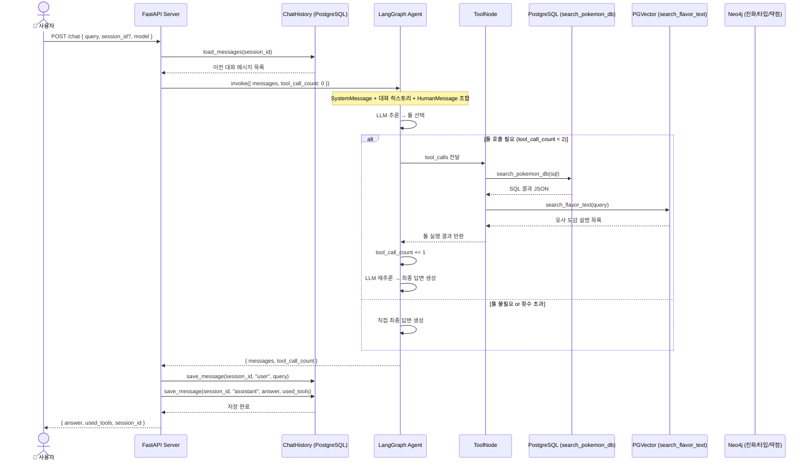
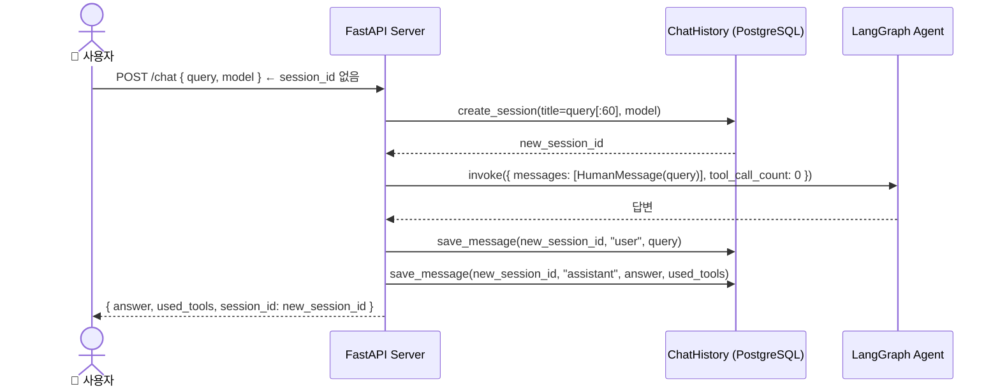
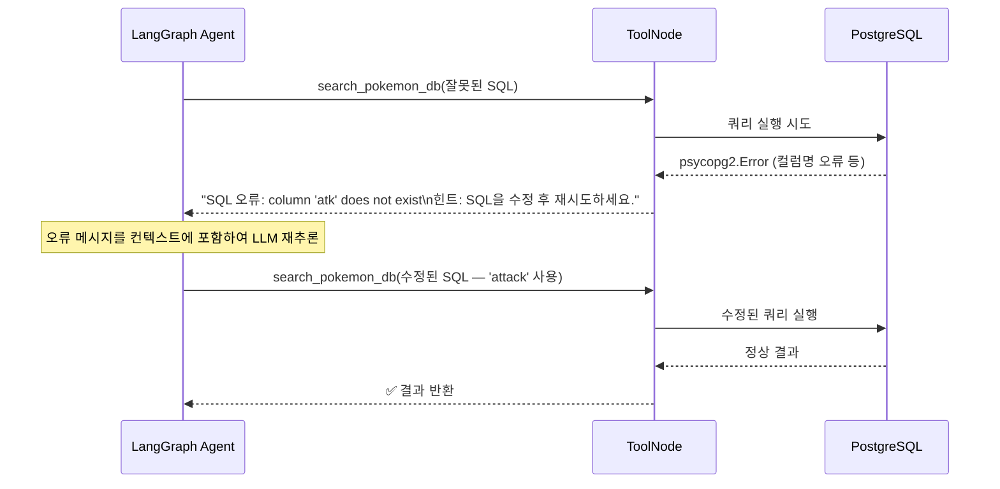
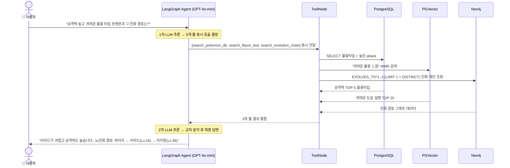
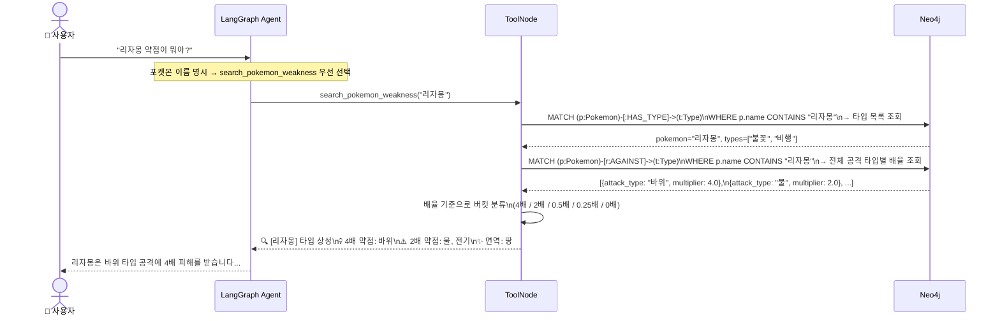
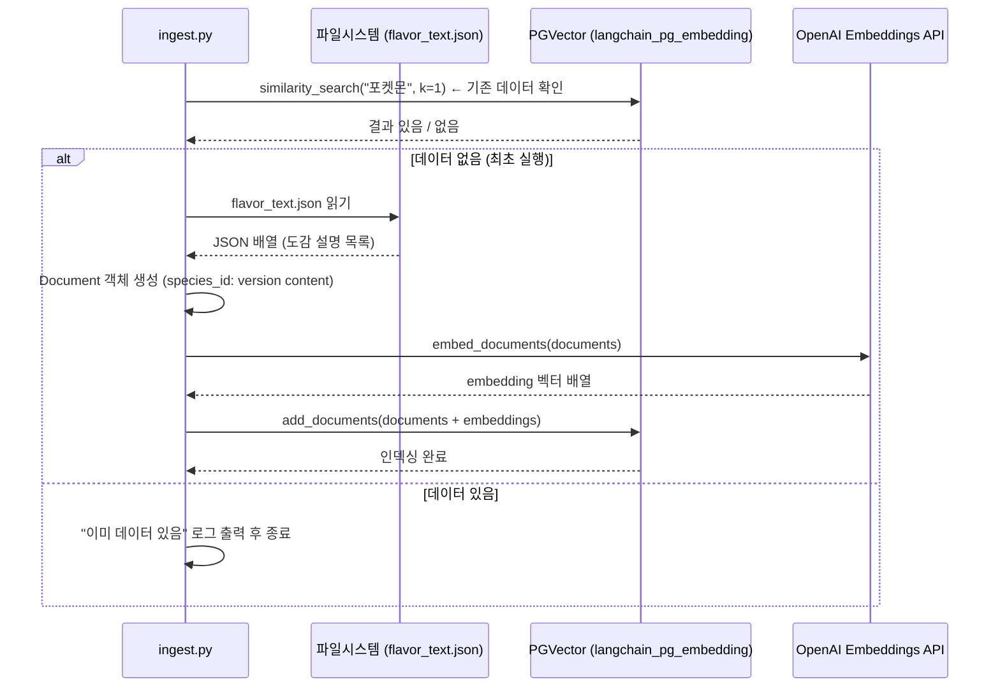
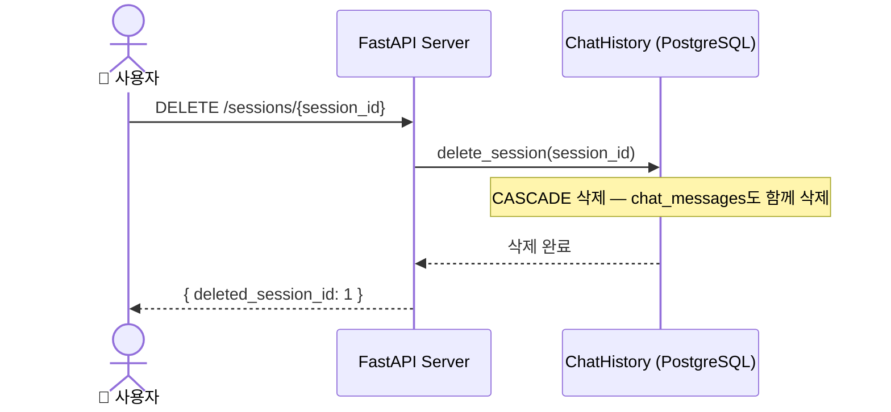

# 시퀀스 다이어그램 (Sequence Diagram)

**프로젝트명:** 포켓몬 AI 챗봇  
**문서 버전:** v1.1  
**작성일:** 2025-05-14  
**최종 수정:** 2025-05-14 (search_pokemon_weakness 툴 추가, Neo4j 툴 변경사항 반영)

---

## 1. 전체 채팅 요청 흐름

---

## 2. 신규 세션 생성 흐름

---

## 3. SQL 오류 자동 복구 흐름

---

## 4. 복합 질문 처리 흐름 (SQL + 벡터 + 그래프 동시 활용)

---

## 5. 포켓몬 약점 조회 흐름 (search_pokemon_weakness) ✨ NEW

듀얼 타입 복합 배율을 `AGAINST` 관계에서 직접 읽어 정확한 배율을 반환하는 흐름이다.

---

## 6. 임베딩 초기화 흐름 (ingest.py)

---

## 7. 세션 삭제 흐름

