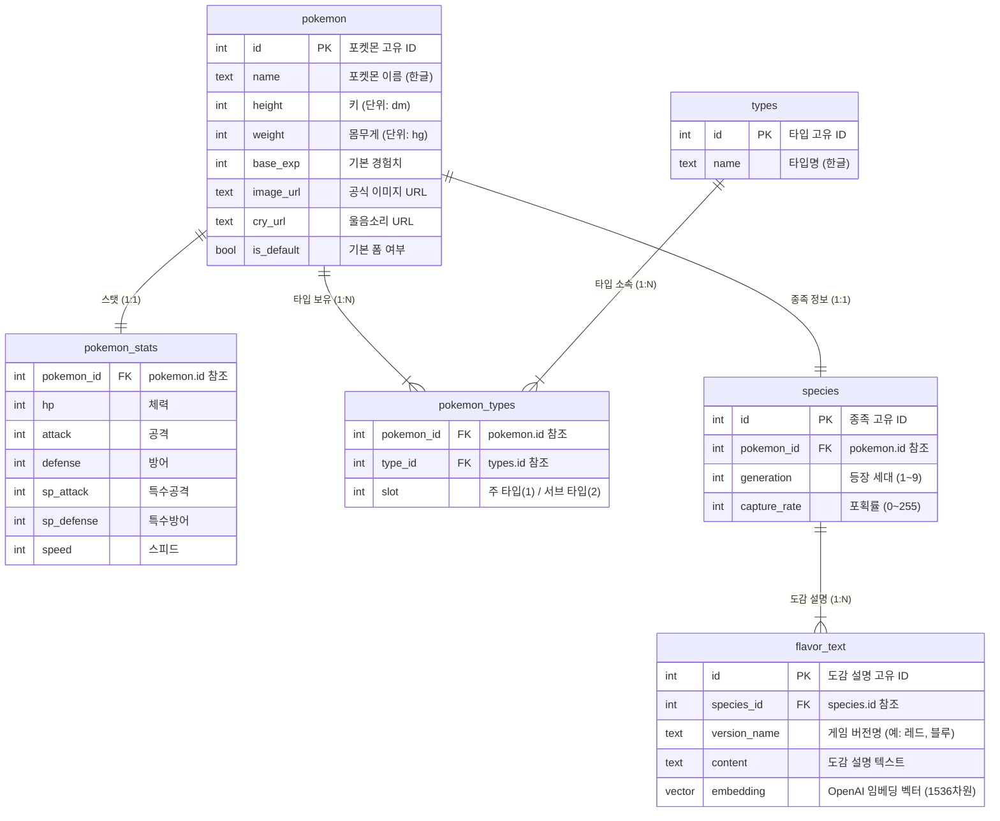
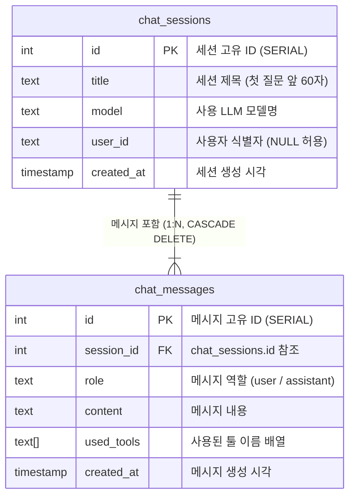

# ERD (Entity-Relationship Diagram)

**프로젝트명:** 포켓몬 AI 챗봇  
**문서 버전:** v1.0  
**작성일:** 2025-05-14  
**대상 DB:** PostgreSQL 15 + pgvector

---

## 1. 포켓몬 도메인 ERD



---

## 2. 채팅 도메인 ERD



---

## 3. 테이블 상세 명세

### 3.1 pokemon

| 컬럼명 | 데이터 타입 | NULL | 기본값 | 설명 |
|--------|-----------|------|--------|------|
| `id` | INTEGER | NO | - | PK, 포켓몬 국가도감 번호 |
| `name` | TEXT | NO | - | 한글 이름 |
| `height` | INTEGER | YES | NULL | dm 단위 키 |
| `weight` | INTEGER | YES | NULL | hg 단위 몸무게 |
| `base_exp` | INTEGER | YES | NULL | 기본 획득 경험치 |
| `image_url` | TEXT | YES | NULL | 공식 스프라이트 URL |
| `cry_url` | TEXT | YES | NULL | 울음소리 MP3 URL |
| `is_default` | BOOLEAN | YES | true | 기본 폼 여부 |

### 3.2 pokemon_stats

| 컬럼명 | 데이터 타입 | NULL | 기본값 | 설명 |
|--------|-----------|------|--------|------|
| `pokemon_id` | INTEGER | NO | - | FK → pokemon.id |
| `hp` | INTEGER | YES | NULL | 체력 스탯 |
| `attack` | INTEGER | YES | NULL | 물리 공격 |
| `defense` | INTEGER | YES | NULL | 물리 방어 |
| `sp_attack` | INTEGER | YES | NULL | 특수 공격 |
| `sp_defense` | INTEGER | YES | NULL | 특수 방어 |
| `speed` | INTEGER | YES | NULL | 스피드 |

### 3.3 types

| 컬럼명 | 데이터 타입 | NULL | 설명 |
|--------|-----------|------|------|
| `id` | INTEGER | NO | PK |
| `name` | TEXT | NO | 타입명 (노말, 불꽃, 물, 풀 등) |

### 3.4 pokemon_types

| 컬럼명 | 데이터 타입 | NULL | 설명 |
|--------|-----------|------|------|
| `pokemon_id` | INTEGER | NO | FK → pokemon.id, 복합 PK |
| `type_id` | INTEGER | NO | FK → types.id, 복합 PK |
| `slot` | INTEGER | NO | 1 = 주 타입, 2 = 서브 타입 |

### 3.5 species

| 컬럼명 | 데이터 타입 | NULL | 설명 |
|--------|-----------|------|------|
| `id` | INTEGER | NO | PK |
| `pokemon_id` | INTEGER | NO | FK → pokemon.id |
| `generation` | INTEGER | YES | 등장 세대 번호 |
| `capture_rate` | INTEGER | YES | 포획률 0~255 |

### 3.6 flavor_text

| 컬럼명 | 데이터 타입 | NULL | 설명 |
|--------|-----------|------|------|
| `id` | INTEGER | NO | PK (SERIAL) |
| `species_id` | INTEGER | NO | FK → species.id |
| `version_name` | TEXT | NO | 게임 버전명 |
| `content` | TEXT | YES | 도감 설명 원문 |
| `embedding` | VECTOR(1536) | YES | OpenAI text-embedding-ada-002 벡터 |

> `embedding` 컬럼은 `pgvector` 확장이 활성화된 경우에만 사용 가능합니다.

### 3.7 chat_sessions

| 컬럼명 | 데이터 타입 | NULL | 기본값 | 설명 |
|--------|-----------|------|--------|------|
| `id` | SERIAL | NO | 자동 증가 | PK |
| `title` | TEXT | NO | - | 세션 제목 (max 60자) |
| `model` | TEXT | NO | - | 사용 LLM |
| `user_id` | TEXT | YES | NULL | 사용자 구분자 |
| `created_at` | TIMESTAMP | NO | NOW() | 생성 시각 |

### 3.8 chat_messages

| 컬럼명 | 데이터 타입 | NULL | 기본값 | 설명 |
|--------|-----------|------|--------|------|
| `id` | SERIAL | NO | 자동 증가 | PK |
| `session_id` | INTEGER | NO | - | FK → chat_sessions.id (CASCADE) |
| `role` | TEXT | NO | - | `user` 또는 `assistant` |
| `content` | TEXT | NO | - | 메시지 본문 |
| `used_tools` | TEXT[] | YES | `{}` | 사용 툴 이름 배열 |
| `created_at` | TIMESTAMP | NO | NOW() | 생성 시각 |

---

## 4. 인덱스 정의

| 테이블 | 인덱스명 | 컬럼 | 타입 | 목적 |
|--------|---------|------|------|------|
| `flavor_text` | `idx_flavor_text_embedding` | `embedding` | IVFFlat / HNSW | 벡터 유사도 검색 |
| `flavor_text` | `idx_flavor_text_species_id` | `species_id` | B-Tree | 종족 기반 조인 |
| `chat_messages` | `idx_chat_messages_session_id` | `session_id` | B-Tree | 세션별 메시지 조회 |
| `chat_sessions` | `idx_chat_sessions_user_id` | `user_id` | B-Tree | 사용자별 세션 필터 |
| `pokemon_types` | `idx_pokemon_types_type_id` | `type_id` | B-Tree | 타입별 포켓몬 조회 |

---

## 5. 제약조건 및 참조 무결성

```sql
-- cascade 삭제: 세션 삭제 시 메시지도 자동 삭제
ALTER TABLE chat_messages
  ADD CONSTRAINT fk_messages_session
  FOREIGN KEY (session_id) REFERENCES chat_sessions(id)
  ON DELETE CASCADE;

-- 복합 PK: 포켓몬당 타입 중복 방지
ALTER TABLE pokemon_types
  ADD CONSTRAINT pk_pokemon_types PRIMARY KEY (pokemon_id, type_id);
```
