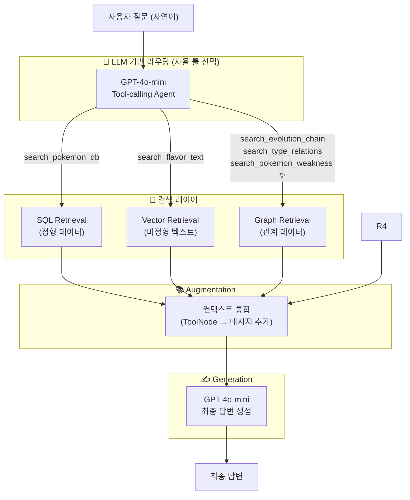
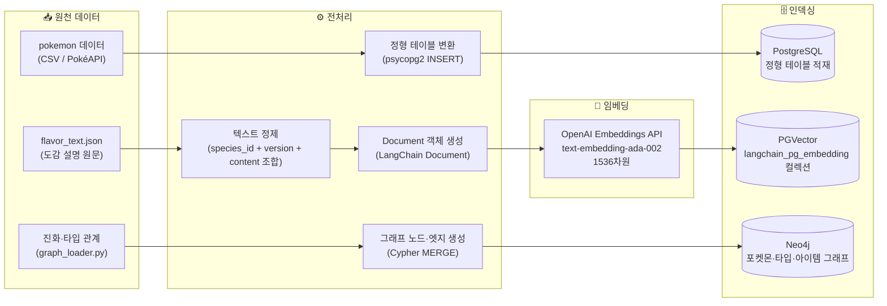
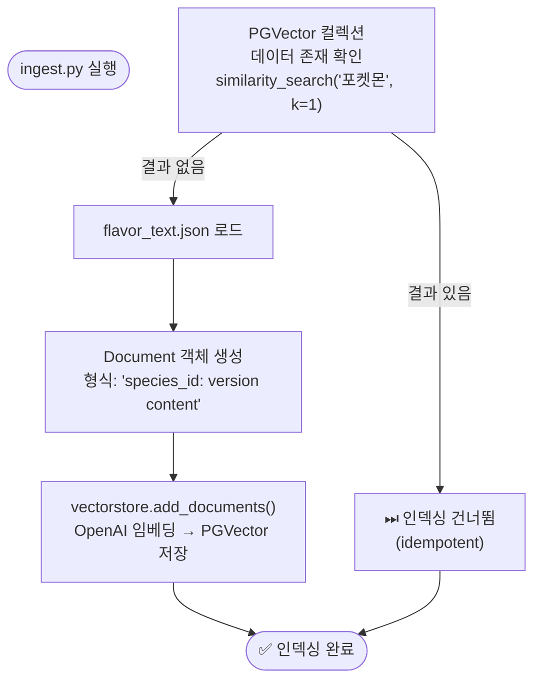
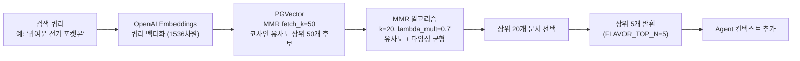
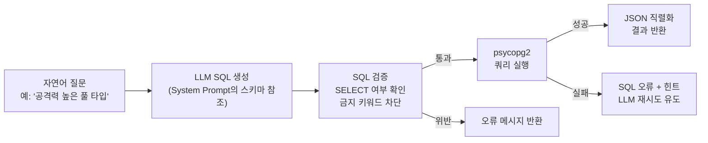
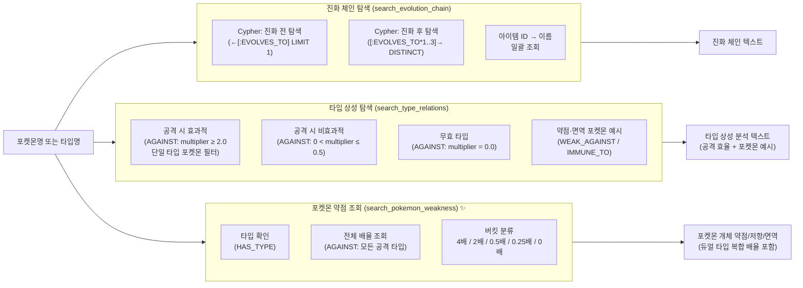

# RAG / 데이터 파이프라인 설계도

**프로젝트명:** 포켓몬 AI 챗봇  
**문서 버전:** v1.1  
**작성일:** 2025-05-14  
**최종 수정:** 2025-05-14 (search_pokemon_weakness 툴 추가, Graph RAG 경로 업데이트)

---

## 1. RAG 아키텍처 개요

본 시스템은 단일 벡터 검색 RAG가 아닌, **멀티-소스 RAG + Graph RAG** 구조를 채택한다.  
LLM이 질문의 의도에 따라 최적의 검색 경로를 자율 선택한다.



---

## 2. 오프라인 데이터 파이프라인 (Indexing Pipeline)

데이터를 수집·가공하여 각 DB에 적재하는 사전 파이프라인이다.



### 2.1 ingest.py 실행 흐름 (상세)



---

## 3. 온라인 RAG 파이프라인 (Inference Pipeline)

사용자 질문이 들어올 때 실시간으로 동작하는 RAG 흐름이다.

### 3.1 벡터 검색 파이프라인 (search_flavor_text)



**MMR 파라미터 설명:**

| 파라미터 | 값 | 의미 |
|---------|-----|------|
| `k` | 20 | 최종 반환 문서 수 |
| `fetch_k` | 50 | 유사도 기반 초기 후보 풀 |
| `lambda_mult` | 0.7 | 1.0에 가까울수록 유사도 중시, 0.0에 가까울수록 다양성 중시 |

### 3.2 SQL 검색 파이프라인 (search_pokemon_db)



### 3.3 그래프 RAG 파이프라인 (Neo4j)



---

## 4. 컨텍스트 윈도우 관리 전략

LangGraph의 메시지 기반 상태 관리에서 컨텍스트를 효율적으로 구성한다.

```
┌────────────────────────────────────────────────────────┐
│  LLM 컨텍스트 윈도우                                   │
│                                                        │
│  [SystemMessage]  ← SYSTEM_PROMPT + DB 스키마 정의     │
│  [HumanMessage]   ← 사용자 이전 메시지 1               │
│  [AIMessage]      ← AI 이전 응답 1                     │
│  [HumanMessage]   ← 사용자 이전 메시지 2               │
│  [AIMessage]      ← AI 이전 응답 2                     │
│  ...              ← 대화 히스토리 (멀티턴)              │
│  [HumanMessage]   ← 현재 사용자 질문                   │
│  [AIMessage]      ← tool_calls 포함 응답               │
│  [ToolMessage]    ← 툴 실행 결과 (search_pokemon_db)   │
│  [ToolMessage]    ← 툴 실행 결과 (search_flavor_text)  │
│                                                        │
└────────────────────────────────────────────────────────┘
```

**툴 호출 제한 정책:**

| 조건 | 동작 |
|------|------|
| `tool_call_count < 2` | 정상 툴 호출 허용 |
| `tool_call_count >= 2` | SystemMessage로 강제 종료 유도 |
| LLM이 여전히 tool_calls 반환 시 | `response.tool_calls = []` 강제 초기화 |

---

## 5. 임베딩 모델 사양

| 항목 | 값 |
|------|-----|
| 모델명 | `text-embedding-ada-002` |
| 벡터 차원 | 1536 |
| 최대 입력 토큰 | 8,191 |
| 인덱스 타입 (PGVector) | IVFFlat 또는 HNSW |
| 유사도 측정 | 코사인 유사도 |
| 적용 테이블 | `flavor_text.embedding` |
| 적용 컬렉션 | `langchain_pg_embedding` (`collection_name="flavor_text"`) |

---

## 6. 데이터 품질 관리

| 항목 | 처리 방식 |
|------|---------|
| 중복 임베딩 방지 | `similarity_search` 사전 확인 후 건너뜀 |
| NULL 콘텐츠 | `WHERE content IS NOT NULL` 조건으로 필터링 |
| SQL 인젝션 방지 | SELECT 전용 허용 + 금지 키워드 차단 |
| 벡터 결과 품질 | MMR으로 중복 유사 문서 억제 |
| 웹 검색 결과 신뢰도 | 최후 수단으로만 사용, 출처 명시 필수 |
