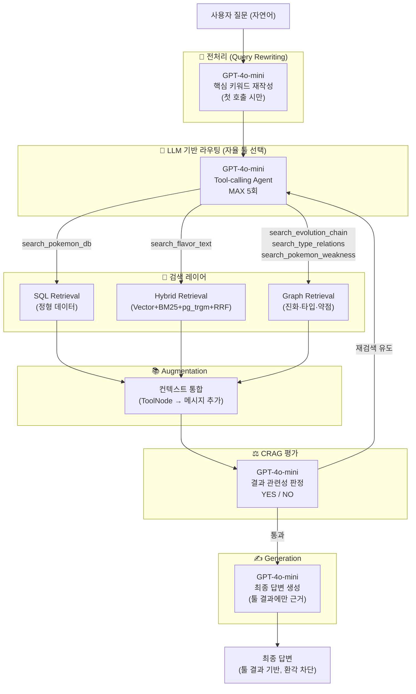
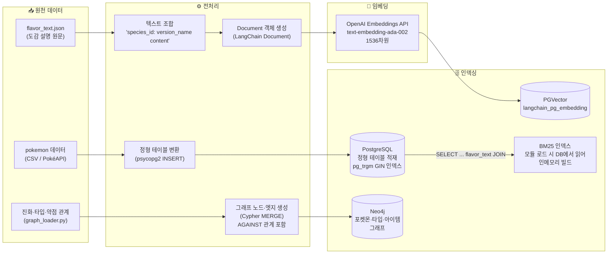
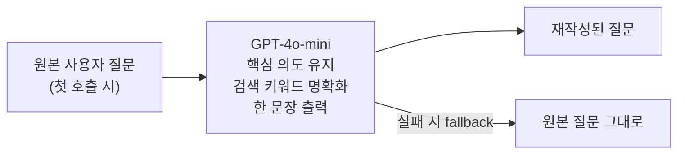
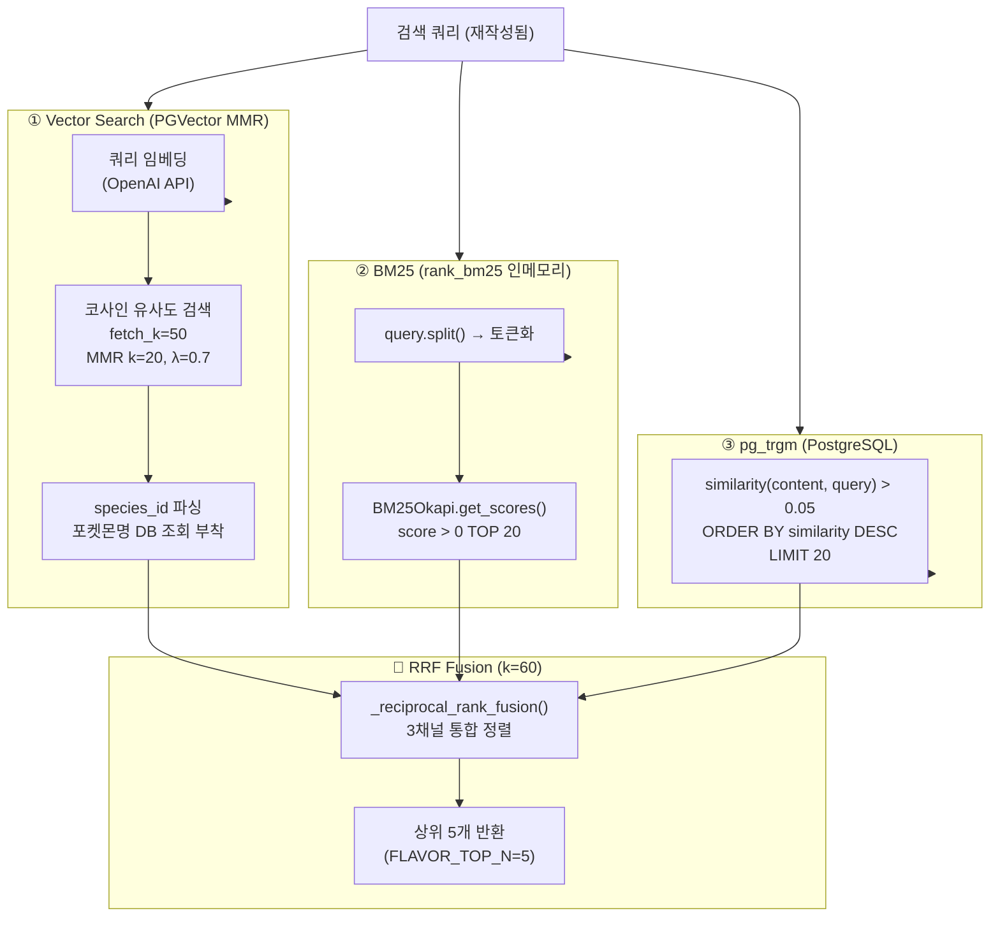
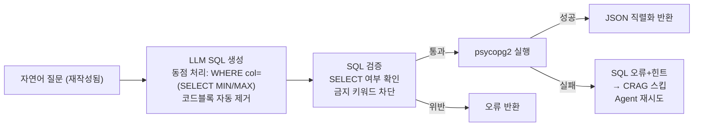
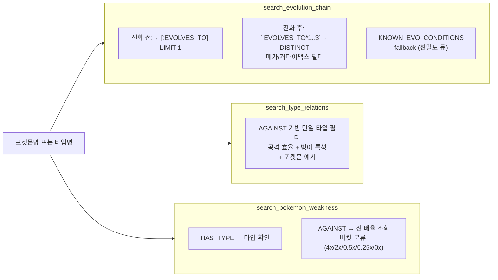
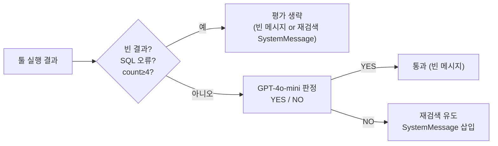

# RAG / 데이터 파이프라인 설계도

**프로젝트명:** 포켓몬 AI 챗봇  
**문서 버전:** v1.2  
**작성일:** 2025-05-14  
**최종 수정:** 2025-05-14 (Hybrid Search 전면 도입, CRAG 추가, Query Rewriting 추가, web_search 제거)

---

## 1. RAG 아키텍처 개요

본 시스템은 **멀티-소스 RAG + Graph RAG + CRAG(Corrective RAG)** 구조를 채택한다.  
LLM이 질문의 의도에 따라 최적의 검색 경로를 자율 선택하며, Query Rewriting으로 검색 품질을 사전 향상하고, CRAG로 결과 관련성을 사후 보정한다.



---

## 2. 오프라인 데이터 파이프라인 (Indexing Pipeline)



---

## 3. 온라인 RAG 파이프라인 (Inference Pipeline)

### 3.1 Query Rewriting



### 3.2 Hybrid Search 파이프라인 (search_flavor_text)



**채널 실패 처리:**
- 각 채널은 독립적으로 `try-except` 처리
- 실패한 채널은 빈 리스트로 대체
- 1개 채널만 성공해도 해당 채널 결과 반환

**MMR 파라미터:**

| 파라미터 | 값 | 의미 |
|---------|-----|------|
| `k` | 20 | 최종 반환 벡터 문서 수 |
| `fetch_k` | 50 | 유사도 기반 초기 후보 풀 |
| `lambda_mult` | 0.7 | 유사도(1.0) ↔ 다양성(0.0) 가중치 |

### 3.3 SQL 검색 파이프라인 (search_pokemon_db)



### 3.4 그래프 RAG 파이프라인 (Neo4j)



### 3.5 CRAG 평가 파이프라인



---

## 4. 컨텍스트 윈도우 관리 전략

```
┌────────────────────────────────────────────────────────┐
│  LLM 컨텍스트 윈도우                                   │
│                                                        │
│  [SystemMessage]  ← SYSTEM_PROMPT (환각 방지 강화)     │
│  [HumanMessage]   ← 재작성된 사용자 질문               │
│  [AIMessage]      ← tool_calls 포함 응답               │
│  [ToolMessage]    ← 툴 실행 결과                       │
│  [SystemMessage]  ← CRAG 재검색 유도 (관련 없을 때)    │
│  [AIMessage]      ← 재시도 tool_calls                  │
│  [ToolMessage]    ← 재시도 툴 결과                     │
│  ...              ← 최대 5회 반복                      │
│  [SystemMessage]  ← "5회 초과, 지금 바로 답변하세요"   │
│                                                        │
└────────────────────────────────────────────────────────┘
```

**툴 호출 제한 정책:**

| 조건 | 동작 |
|------|------|
| `tool_call_count < 5` | 정상 툴 호출 허용 |
| `tool_call_count >= 5` | 강제 종료 SystemMessage 삽입 |
| LLM이 여전히 tool_calls 반환 시 | `response.tool_calls = []` 강제 초기화 |
| CRAG 평가 시점 | `tool_call_count >= 4` 이면 평가 생략 |

---

## 5. 임베딩 모델 사양

| 항목 | 값 |
|------|-----|
| 모델명 | `text-embedding-ada-002` |
| 벡터 차원 | 1536 |
| 최대 입력 토큰 | 8,191 |
| 인덱스 타입 (PGVector) | IVFFlat 또는 HNSW |
| 유사도 측정 | 코사인 유사도 |
| 적용 컬렉션 | `langchain_pg_embedding` (`collection_name="flavor_text"`) |

---

## 6. 데이터 품질 관리

| 항목 | 처리 방식 |
|------|---------|
| 중복 임베딩 방지 | `similarity_search` 사전 확인 → 있으면 건너뜀 (idempotent) |
| NULL 콘텐츠 | `WHERE content IS NOT NULL` 조건으로 필터링 |
| SQL 인젝션 방지 | SELECT 전용 + 금지 키워드 차단 |
| 벡터 결과 중복 억제 | MMR (lambda_mult=0.7) |
| 키워드 결과 다양성 | BM25 + pg_trgm 채널 추가 → RRF로 통합 |
| 관련 없는 결과 보정 | CRAG 평가 후 재검색 유도 |
| 환각 방지 | System Prompt에 "결과에 없는 내용 절대 생성 금지" 명시 |
| 동점 처리 | 서브쿼리 `WHERE col = (SELECT MIN/MAX ...)` 강제 |
| 진화 조건 누락 보완 | `KNOWN_EVO_CONDITIONS` fallback 맵 적용 |
