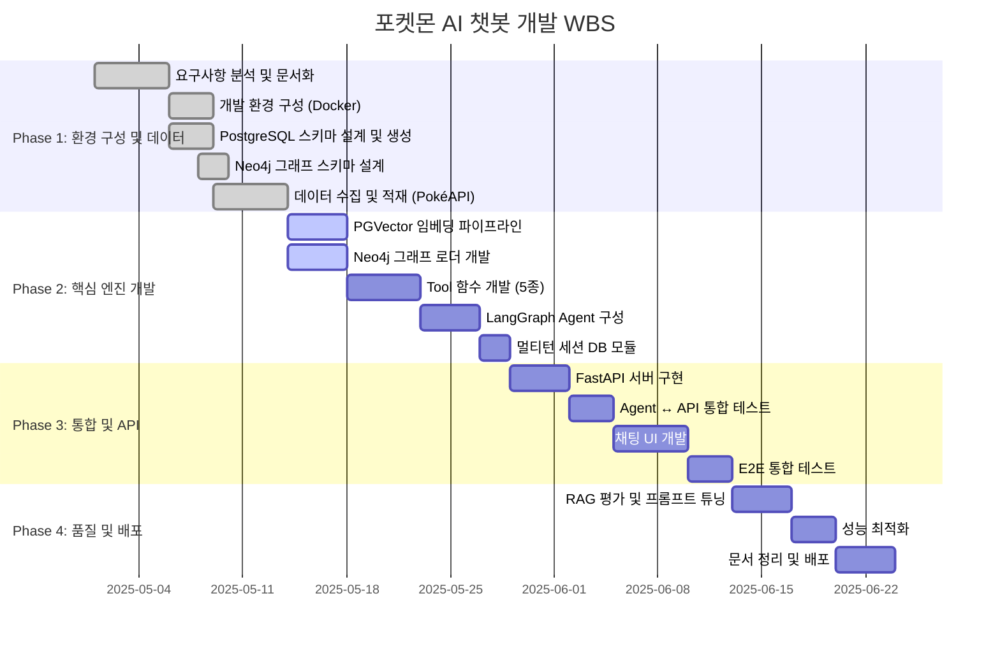

# WBS (Work Breakdown Structure)

**프로젝트명:** 포켓몬 AI 챗봇  
**문서 버전:** v1.0  
**작성일:** 2025-05-14  
**총 기간:** 8주 (Phase 1~4)

---

## 1. WBS 전체 구조

---

## 2. 상세 작업 분류

### Phase 1: 환경 구성 및 데이터 (1~2주차)

| ID | 작업명 | 담당 | 기간 | 산출물 | 상태 |
|----|--------|------|------|--------|------|
| 1.1 | 요구사항 분석 | 전체 | 5일 | 요구사항명세서 | ✅ 완료 |
| 1.2 | Docker Compose 환경 구성 | 인프라 | 3일 | docker-compose.yml | ✅ 완료 |
| 1.3 | PostgreSQL 스키마 설계 및 DDL 작성 | DB | 3일 | schema.sql | ✅ 완료 |
| 1.4 | Neo4j 그래프 스키마 설계 | DB | 2일 | 그래프 스키마 문서 | ✅ 완료 |
| 1.5 | PokéAPI 데이터 수집 스크립트 | 백엔드 | 3일 | data_collector.py | ✅ 완료 |
| 1.6 | 정형 데이터 적재 (pokemon 테이블) | DB | 2일 | 적재 완료 확인서 | ✅ 완료 |

### Phase 2: 핵심 엔진 개발 (3~5주차)

| ID | 작업명 | 담당 | 기간 | 산출물 | 상태 |
|----|--------|------|------|--------|------|
| 2.1 | flavor_text.json 전처리 | 백엔드 | 2일 | flavor_text.json | 🔄 진행 |
| 2.2 | ingest.py — PGVector 임베딩 파이프라인 | 백엔드 | 2일 | ingest.py | 🔄 진행 |
| 2.3 | graph_loader.py — Neo4j 적재 스크립트 | 백엔드 | 4일 | graph_loader.py | 🔄 진행 |
| 2.4 | search_pokemon_db Tool 개발 | 백엔드 | 2일 | pokemon_agent.py | ⏳ 예정 |
| 2.5 | search_flavor_text Tool 개발 | 백엔드 | 1일 | pokemon_agent.py | ⏳ 예정 |
| 2.6 | search_evolution_chain Tool 개발 | 백엔드 | 2일 | pokemon_neo4j.py | ⏳ 예정 |
| 2.7 | search_type_relations Tool 개발 | 백엔드 | 1일 | pokemon_neo4j.py | ⏳ 예정 |
| 2.8 | LangGraph AgentState 설계 | AI | 2일 | pokemon_agent.py | ⏳ 예정 |
| 2.9 | Agent 노드 (agent_node, tools_node) 구현 | AI | 2일 | pokemon_agent.py | ⏳ 예정 |
| 2.10 | 툴 호출 제한 로직 (MAX_TOOL_CALLS=2) | AI | 1일 | pokemon_agent.py | ⏳ 예정 |
| 2.11 | chat_history.py — 세션 CRUD 구현 | 백엔드 | 2일 | chat_history.py | ⏳ 예정 |
| 2.12 | System Prompt 초안 작성 및 튜닝 | AI | 2일 | 프롬프트 명세서 | ⏳ 예정 |

### Phase 3: 통합 및 API (6~7주차)

| ID | 작업명 | 담당 | 기간 | 산출물 | 상태 |
|----|--------|------|------|--------|------|
| 3.1 | FastAPI 서버 기본 구조 설정 | 백엔드 | 1일 | main.py | ⏳ 예정 |
| 3.2 | POST /chat 엔드포인트 구현 | 백엔드 | 2일 | routers/chat.py | ⏳ 예정 |
| 3.3 | GET/POST/DELETE /sessions 구현 | 백엔드 | 2일 | routers/sessions.py | ⏳ 예정 |
| 3.4 | Agent-API 통합 테스트 | QA | 3일 | 테스트 결과서 | ⏳ 예정 |
| 3.5 | 채팅 UI 메인 화면 개발 (SCR-01) | 프론트 | 3일 | ChatPage.tsx | ⏳ 예정 |
| 3.6 | 세션 사이드바 개발 (SCR-02) | 프론트 | 1일 | SessionSidebar.tsx | ⏳ 예정 |
| 3.7 | 툴 뱃지 컴포넌트 개발 (SCR-04) | 프론트 | 1일 | ToolBadge.tsx | ⏳ 예정 |
| 3.8 | E2E 시나리오 테스트 (10개) | QA | 3일 | E2E 테스트 결과서 | ⏳ 예정 |

### Phase 4: 품질 및 배포 (8주차)

| ID | 작업명 | 담당 | 기간 | 산출물 | 상태 |
|----|--------|------|------|--------|------|
| 4.1 | RAG 평가 (정확도, 관련성, 충실도) | AI | 3일 | RAG 평가 보고서 | ⏳ 예정 |
| 4.2 | System Prompt 최종 튜닝 | AI | 1일 | 프롬프트 v1.0 | ⏳ 예정 |
| 4.3 | 쿼리 응답 시간 측정 및 인덱스 최적화 | DB | 2일 | 성능 보고서 | ⏳ 예정 |
| 4.4 | Docker 이미지 빌드 및 배포 스크립트 | 인프라 | 2일 | Dockerfile, CI/CD | ⏳ 예정 |
| 4.5 | 최종 문서 정리 (README, API 문서) | 전체 | 2일 | 전체 문서 패키지 | ⏳ 예정 |

---

## 3. 마일스톤

| 마일스톤 | 목표일 | 완료 기준 |
|---------|--------|---------|
| M1: 데이터 적재 완료 | 2주차 말 | 모든 DB에 데이터 적재, ingest.py 실행 성공 |
| M2: Agent 동작 확인 | 4주차 말 | 5개 Tool 호출 성공, 멀티턴 대화 동작 |
| M3: API 통합 완료 | 6주차 말 | /chat, /sessions 전 엔드포인트 통합 테스트 통과 |
| M4: 서비스 배포 | 8주차 말 | Docker Compose 배포, 전체 테스트 통과 |

---

## 4. 리스크 및 대응 방안

| 리스크 | 발생 확률 | 영향도 | 대응 방안 |
|--------|---------|--------|---------|
| OpenAI API 비용 초과 | 중 | 중 | 개발 중 `gpt-4o-mini` 사용, 토큰 사용량 모니터링 |
| Neo4j 쿼리 성능 저하 | 낮 | 중 | 인덱스 추가, 쿼리 최적화, 배치 조회 |
| PGVector 인덱싱 시간 초과 | 중 | 낮 | 배치 처리, 이미 있으면 건너뜀 로직 |
| 임베딩 비용 과다 발생 | 낮 | 중 | 최초 1회 ingest, 이후 재사용 |
| LangGraph 버전 호환성 | 낮 | 고 | requirements.txt 버전 고정 |
