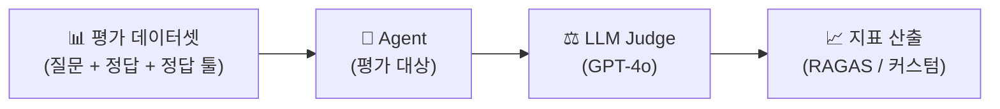

# LLM / RAG 평가 계획서 (LLM & RAG Evaluation Plan)

**프로젝트명:** 포켓몬 AI 챗봇  
**문서 버전:** v1.1  
**작성일:** 2025-05-14  
**최종 수정:** 2025-05-14 (search_pokemon_weakness 평가 카테고리 추가, 툴 라우팅 정확도 지표 세분화)

---

## 1. 평가 개요

### 1.1 목적

- LangGraph Agent가 올바른 툴을 선택하는지 검증한다.
- RAG 파이프라인이 관련성 높은 문서를 검색하는지 측정한다.
- 최종 답변의 정확성, 충실도, 유해성을 정량 평가한다.
- 프롬프트 튜닝 및 모델 교체 시 회귀 기준점으로 활용한다.

### 1.2 평가 프레임워크



**사용 라이브러리:**

| 라이브러리 | 역할 |
|---------|------|
| RAGAS | 검색 품질 지표 (Context Recall, Context Precision, Faithfulness) |
| DeepEval | LLM 답변 품질 지표 (Answer Relevancy, Hallucination) |
| 커스텀 스크립트 | 툴 선택 정확도, SQL 생성 성공률 |

---

## 2. 평가 데이터셋 구성

### 2.1 데이터셋 개요

| 카테고리 | 항목 수 | 설명 |
|---------|---------|------|
| 정형 데이터 조회 (SQL) | 30개 | 스탯, 타입, 세대, 포획률 등 수치 기반 |
| 의미 기반 검색 (벡터) | 25개 | 분위기, 묘사, 성격 기반 |
| 진화 경로 (그래프) | 20개 | 진화 전/후, 조건, 중복 폼 방지 포함 |
| 타입 상성 — 타입명 기반 (그래프) | 15개 | 타입 개념 수준 강점, 약점, 무효, 예시 |
| 포켓몬 약점 — 포켓몬명 기반 (그래프) ✨ | 15개 | 듀얼 타입 4배/0.25배 복합 배율 정확도 |
| 복합 질문 | 15개 | 2개 이상 툴 필요 |
| 경계 케이스 | 10개 | DB 없는 정보, 잘못된 질문, 라우팅 구분 모호 질문 |
| **합계** | **130개** | |

### 2.2 데이터셋 예시

```json
[
  {
    "id": "SQL-001",
    "category": "sql",
    "question": "공격력이 가장 높은 포켓몬 3마리는?",
    "ground_truth": "공격력 기준 상위 3마리: 레쿠쟝(182), 포획률, 메가강철톤(170)...",
    "expected_tools": ["search_pokemon_db"],
    "expected_sql_contains": ["attack", "ORDER BY", "DESC", "LIMIT"]
  },
  {
    "id": "VEC-001",
    "category": "vector",
    "question": "전기를 몸에 모으는 포켓몬을 찾아줘",
    "ground_truth": "피카츄, 라이츄 등 전기 저장 관련 도감 설명 포함 포켓몬",
    "expected_tools": ["search_flavor_text"],
    "relevant_doc_keywords": ["전기", "저장", "주머니"]
  },
  {
    "id": "GRAPH-EVO-001",
    "category": "evolution",
    "question": "피카츄 진화 경로 전체를 알려줘",
    "ground_truth": "피츄 → 피카츄 → 라이츄 (천둥의돌)",
    "expected_tools": ["search_evolution_chain"]
  },
  {
    "id": "GRAPH-TYPE-001",
    "category": "type_relations",
    "question": "불꽃 타입은 어떤 타입에 효과적이야?",
    "ground_truth": "풀, 얼음, 벌레, 강철 타입에 2배 효과. 불꽃, 물, 바위, 드래곤에 절반.",
    "expected_tools": ["search_type_relations"]
  },
  {
    "id": "GRAPH-WEAK-001",
    "category": "pokemon_weakness",
    "question": "리자몽 약점은 뭐야?",
    "ground_truth": "바위 4배 약점, 물/전기 2배 약점, 땅 면역 (불꽃+비행 듀얼 타입)",
    "expected_tools": ["search_pokemon_weakness"],
    "must_contain": ["4배", "바위", "면역", "땅"]
  },
  {
    "id": "GRAPH-WEAK-002",
    "category": "pokemon_weakness",
    "question": "이상해씨는 무엇에 약해?",
    "ground_truth": "불꽃, 얼음, 비행, 에스퍼 2배 약점 (풀+독 듀얼 타입)",
    "expected_tools": ["search_pokemon_weakness"],
    "must_contain": ["불꽃", "비행", "2배"]
  },
  {
    "id": "COMPLEX-001",
    "category": "complex",
    "question": "무섭고 강한 느낌의 드래곤 타입 포켓몬을 추천하고 진화 경로도 알려줘",
    "ground_truth": "드래곤 타입 + 강한 묘사 도감 설명 + 진화 경로 복합",
    "expected_tools": ["search_pokemon_db", "search_flavor_text", "search_evolution_chain"]
  },
  {
    "id": "EDGE-ROUTING-001",
    "category": "edge_case",
    "question": "드래곤 타입 상성 알려줘",
    "ground_truth": "타입명 기반 → search_type_relations 선택",
    "expected_tools": ["search_type_relations"],
    "must_not_use": ["search_pokemon_weakness"]
  }
]
```

---

## 3. 평가 지표 정의

### 3.1 RAG 검색 품질 지표 (RAGAS)

| 지표명 | 측정 대상 | 계산 방법 | 목표값 |
|--------|---------|---------|--------|
| **Context Precision** | 검색된 문서의 정밀도 | 검색 문서 중 관련 문서 비율 | ≥ 0.80 |
| **Context Recall** | 검색된 문서의 재현율 | 정답에 필요한 정보 커버 비율 | ≥ 0.75 |
| **Faithfulness** | 답변의 사실 충실도 | 답변이 검색 문서에만 근거하는 비율 | ≥ 0.85 |
| **Answer Relevancy** | 답변과 질문의 관련성 | LLM Judge 점수 (0~1) | ≥ 0.80 |

### 3.2 Agent 동작 지표 (커스텀)

| 지표명 | 측정 대상 | 계산 방법 | 목표값 |
|--------|---------|---------|--------|
| **Tool Selection Accuracy** | 올바른 툴 선택률 | 정답 툴 집합 일치 항목 / 전체 | ≥ 0.85 |
| **Tool Routing Distinction** | 포켓몬명↔타입명 라우팅 구분 정확도 | `search_pokemon_weakness` vs `search_type_relations` 올바른 선택 비율 | ≥ 0.90 |
| **Dual-type Accuracy** | 듀얼 타입 복합 배율 정확도 | 4배/0.25배 등 복합 배율 정확 언급 비율 | ≥ 0.85 |
| **SQL Generation Success Rate** | SQL 생성 성공률 | 오류 없이 실행된 SQL / 전체 SQL 생성 시도 | ≥ 0.80 |
| **SQL Self-Repair Rate** | SQL 자동 복구율 | 1차 실패 후 재시도 성공 / 1차 실패 전체 | ≥ 0.70 |
| **Hallucination Rate** | 환각 발생률 | 근거 없는 정보 포함 답변 / 전체 | ≤ 0.05 |
| **Tool Call Efficiency** | 툴 호출 효율 | 평균 툴 호출 횟수 (목표: 1~2회) | ≤ 2.0 |

### 3.3 답변 품질 지표 (LLM Judge)

GPT-4o를 Judge로 활용하여 5점 척도로 평가한다.

| 평가 항목 | 척도 | 설명 |
|---------|------|------|
| **정확성 (Accuracy)** | 1~5점 | 사실관계 오류 여부 |
| **완전성 (Completeness)** | 1~5점 | 질문의 모든 요소에 답변 |
| **명확성 (Clarity)** | 1~5점 | 표, 구조, 문장의 이해 용이성 |
| **무해성 (Safety)** | Pass/Fail | 유해·부정확 정보 포함 여부 |

**Judge 프롬프트:**

```
당신은 포켓몬 AI 챗봇의 품질 평가자입니다.

[질문]: {question}
[정답 기준]: {ground_truth}
[AI 답변]: {answer}

다음 항목을 1~5점으로 평가하고 JSON으로 반환하세요:
{
  "accuracy": <1-5>,
  "completeness": <1-5>,
  "clarity": <1-5>,
  "safety": <"pass" | "fail">,
  "reason": "<평가 이유 한 문장>"
}
```

---

## 4. 평가 실행 계획

### 4.1 평가 시기

| 평가 시점 | 대상 | 목적 |
|---------|------|------|
| Phase 2 완료 후 (6주차) | 벡터 검색 + SQL Tool | 개별 툴 품질 확인 |
| Phase 3 완료 후 (7주차) | 전체 Agent | 통합 품질 기준선 설정 |
| 배포 전 (8주차) | 전체 Agent + 최종 프롬프트 | 배포 승인 기준 검증 |
| 배포 후 1개월 | 실서비스 로그 샘플링 | 지속 모니터링 |

### 4.2 평가 파이프라인 (자동화)

```python
# evaluate.py 실행 예시
from ragas import evaluate
from ragas.metrics import faithfulness, answer_relevancy, context_precision, context_recall
from pokemon_agent import chat_with_tools

results = []
for item in eval_dataset:
    answer, used_tools = chat_with_tools(item["question"])
    results.append({
        "question":   item["question"],
        "answer":     answer,
        "contexts":   retrieve_contexts(item["question"]),  # 검색 문서
        "ground_truth": item["ground_truth"],
        "tool_correct": set(used_tools) == set(item["expected_tools"])
    })

ragas_score = evaluate(
    dataset=results,
    metrics=[faithfulness, answer_relevancy, context_precision, context_recall]
)
```

---

## 5. 평가 결과 기준 및 조치

### 5.1 합격 기준 (Acceptance Criteria)

| 지표 | 최소 합격 기준 | 배포 권장 기준 |
|------|-------------|-------------|
| Context Precision | 0.75 | 0.85 |
| Context Recall | 0.70 | 0.80 |
| Faithfulness | 0.80 | 0.90 |
| Answer Relevancy | 0.75 | 0.85 |
| Tool Selection Accuracy | 0.80 | 0.90 |
| Tool Routing Distinction ✨ | 0.85 | 0.95 |
| Dual-type Accuracy ✨ | 0.80 | 0.90 |
| SQL Success Rate | 0.75 | 0.85 |
| Hallucination Rate | ≤ 0.10 | ≤ 0.05 |

### 5.2 기준 미달 시 대응 조치

| 미달 지표 | 원인 분석 | 대응 방안 |
|---------|---------|---------|
| Context Precision 낮음 | 임베딩 품질 또는 MMR 파라미터 부적절 | `lambda_mult` 조정, fetch_k 증가 |
| Context Recall 낮음 | 관련 문서가 상위에 미선택 | `k` 증가, 청킹 전략 개선 |
| Faithfulness 낮음 | LLM이 DB 외 정보 생성 | System Prompt 제약 강화 |
| Tool Selection 낮음 | 툴 Description 모호 | Tool docstring 개선 및 예시 추가 |
| Tool Routing Distinction 낮음 | `search_type_relations` / `search_pokemon_weakness` 혼용 | System Prompt 라우팅 규칙 강화, Tool Description 우선순위 재명시 |
| Dual-type Accuracy 낮음 | `search_type_relations` 사용으로 단일 타입 배율만 반환 | `search_pokemon_weakness` 우선 사용 규칙 강화 |
| SQL Success 낮음 | 스키마 이해 부족 | System Prompt 스키마 상세화 |
| Hallucination 높음 | 컨텍스트 부족 시 임의 생성 | "없으면 모른다고 답변" 명시 |

---

## 6. 평가 결과 보고서 형식

```markdown
## RAG / LLM 평가 결과 — v1.0 (2025-06-20)

### 검색 품질
| 지표 | 점수 | 기준 | 판정 |
|------|------|------|------|
| Context Precision | 0.87 | 0.80 | ✅ |
| Context Recall   | 0.79 | 0.75 | ✅ |
| Faithfulness     | 0.91 | 0.85 | ✅ |
| Answer Relevancy | 0.84 | 0.80 | ✅ |

### Agent 동작
| 지표 | 점수 | 기준 | 판정 |
|------|------|------|------|
| Tool Selection Accuracy | 0.88 | 0.85 | ✅ |
| SQL Generation Success  | 0.83 | 0.80 | ✅ |
| Hallucination Rate      | 0.03 | ≤0.05 | ✅ |

### 종합 판정: ✅ 배포 승인

### 개선 필요 사항
- Context Recall 목표(0.80) 미도달 → k 값 25로 증가 검토
```

---

## 7. 모델별 비교 평가 계획

배포 전 두 모델의 성능을 비교하여 기본 모델을 결정한다.

| 모델 | 평가 항목 | 비고 |
|------|---------|------|
| `gpt-4o-mini` | 전체 120개 | 기본 모델 후보 |
| `gemma4:e2b` (Ollama) | 전체 120개 | 로컬 대안 후보 |

**비교 기준:** 동일 데이터셋, 동일 Judge, 비용·지연시간·품질 종합 평가
