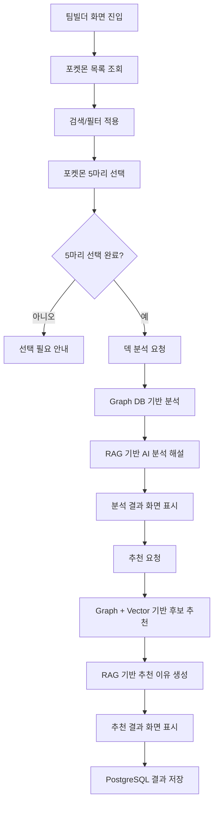

# 팀빌더 요구사항 명세서

## 1. 문서 개요

### 1.1 목적

본 문서는 포켓몬 팀빌더 기능의 사용자 요구사항과 시스템 요구사항을 정의한다.  
팀빌더는 사용자가 포켓몬 5마리를 선택하면 팀의 타입 약점, 방어 안정성, 기술 타입 커버리지를 분석하고, 부족한 부분을 보완할 수 있는 6번째 포켓몬을 추천하는 기능이다.

### 1.2 범위

본 문서의 범위는 **팀빌더 기능**으로 한정한다.

| 구분 | 포함 여부 | 설명 |
|---|---:|---|
| 포켓몬 선택 화면 | 포함 | 사용자가 5마리 포켓몬을 검색, 필터링, 선택하는 화면 |
| 덱 분석 | 포함 | 선택한 5마리의 약점, 강점, 기술 커버리지 분석 |
| 포켓몬 추천 | 포함 | 6번째 포켓몬 후보 1~3순위 추천 |
| AI 종합 해설 | 포함 | RAG 기반 분석/추천 설명 생성 |
| 분석/추천 결과 저장 | 포함 | PostgreSQL에 팀빌더 결과 저장 |
| 배틀 기능 | 제외 | 팀빌더 문서 범위 아님 |
| 포켓몬 도감 기능 | 제외 | 팀빌더 화면에서 참고 UI는 가능하나 문서 범위 아님 |

### 1.3 이해관계자

| 역할 | 관심사 |
|---|---|
| 사용자 | 팀 조합을 쉽게 선택하고, 약점과 추천 이유를 이해하고 싶음 |
| 프론트엔드 개발자 | 선택 UI, 분석 결과, 추천 결과를 안정적으로 표시해야 함 |
| 백엔드 개발자 | Graph DB, RAG, 저장 API를 안정적으로 제공해야 함 |
| 데이터/DB 담당자 | Neo4j 및 PostgreSQL 데이터 구조가 분석/추천 요구를 만족해야 함 |
| 프로젝트 팀 | 기능 단위 문서를 통해 발표, 유지보수, 역할 분담을 명확히 해야 함 |

## 2. 요구사항 요약표

| RQ-ID | 화면명 | 요구사항명 | 요구사항 내용 | 중요도 | 진행상태 | 비고 |
|---|---|---|---|---:|---|---|
| TB-RQ-001 | 팀빌더 | 포켓몬 목록 조회 | 팀빌더 화면은 선택 가능한 포켓몬 목록을 조회할 수 있어야 한다. | 5 | 진행 | `pokemon_id < 10000` 기준 |
| TB-RQ-002 | 팀빌더 | 포켓몬 검색 | 사용자는 이름 또는 도감번호로 포켓몬을 검색할 수 있어야 한다. | 4 | 진행 | 프론트 필터 또는 API 조회 |
| TB-RQ-003 | 팀빌더 | 조건 필터링 | 사용자는 세대/지방, 타입, 특성 조건으로 목록을 필터링할 수 있어야 한다. | 4 | 진행 | 도감형 필터 UI |
| TB-RQ-004 | 팀빌더 | 5마리 선택 제한 | 사용자는 정확히 5마리 포켓몬을 선택해야 분석/추천을 진행할 수 있어야 한다. | 5 | 진행 | 초과 선택 방지 |
| TB-RQ-005 | 팀빌더 | 덱 분석 실행 | 사용자는 선택한 5마리의 타입 약점과 팀 커버리지를 분석할 수 있어야 한다. | 5 | 진행 | Graph DB 기반 |
| TB-RQ-006 | 팀빌더 | AI 분석 해설 | 시스템은 분석 결과를 바탕으로 두괄식 AI 해설을 제공해야 한다. | 4 | 진행 | RAG 기반 |
| TB-RQ-007 | 팀빌더 | 추천 실행 조건 | 추천은 덱 분석 이후에 실행되도록 제한해야 한다. | 4 | 진행 | 분석 없는 추천 방지 |
| TB-RQ-008 | 팀빌더 | 6번째 포켓몬 추천 | 시스템은 부족한 방어/공격 커버리지를 보완할 포켓몬을 1~3순위로 추천해야 한다. | 5 | 진행 | Graph + Vector 근거 |
| TB-RQ-009 | 팀빌더 | 추천 이유 제공 | 시스템은 추천 포켓몬별 보완 약점, 대표 기술, 기대 역할을 설명해야 한다. | 5 | 진행 | AI 종합 해설 포함 |
| TB-RQ-010 | 팀빌더 | 결과 저장 | 분석 및 추천 결과는 PostgreSQL에 저장되어야 한다. | 4 | 진행 | `team_build_logs` |
| TB-RQ-011 | 팀빌더 | 로그인 사용자 연결 | 로그인 사용자의 결과는 `user_id`와 연결되어 저장되어야 한다. | 3 | 진행 | 비로그인 시 nullable |
| TB-RQ-012 | 팀빌더 | 오류 안내 | API 실패, 선택 개수 부족, 추천 조건 미충족 시 사용자에게 안내 메시지를 제공해야 한다. | 4 | 진행 | Streamlit 알림 |

## 3. 일반 요구사항

### 3.1 기능 요구사항

- 시스템은 포켓몬 목록을 카드 형태로 표시해야 한다.
- 시스템은 메가진화, 거다이맥스 등 특수폼을 기본 선택 목록에서 제외할 수 있어야 한다.
- 시스템은 사용자가 선택한 포켓몬을 별도 선택 영역에 표시해야 한다.
- 시스템은 5마리 선택이 완료되기 전까지 덱 분석 및 추천 버튼을 제한해야 한다.
- 시스템은 덱 분석 결과와 추천 결과를 화면 하단에 순차적으로 표시해야 한다.

### 3.2 데이터 요구사항

- 포켓몬 기본 정보, 타입, 특성, 이미지 URL은 팀빌더 목록 표시를 위해 제공되어야 한다.
- 타입 상성, 약점 보완, 기술 타입 커버리지 계산은 Neo4j Graph DB 관계를 기반으로 수행되어야 한다.
- 분석 및 추천 결과는 PostgreSQL의 팀빌더 로그 테이블에 저장되어야 한다.
- AI 해설의 전체 결과와 결론 문장은 분리 저장되어야 한다.

### 3.3 인터페이스 요구사항

- 프론트엔드는 FastAPI 팀빌더 API를 호출해야 한다.
- 백엔드는 팀빌더 전용 API prefix를 사용해야 한다.

```text
/api/v1/team-builder
```

- 팀빌더 API는 JSON 형식으로 요청과 응답을 처리해야 한다.
- AI 해설이 포함된 요청은 일반 조회보다 오래 걸릴 수 있으므로 프론트엔드는 충분한 timeout을 적용해야 한다.

### 3.4 성능 요구사항

- 포켓몬 목록 조회는 사용자가 필터와 검색을 반복해도 화면 사용성이 크게 저하되지 않아야 한다.
- Graph DB 기반 분석/추천은 사용자가 기다릴 수 있는 범위 내에서 응답해야 한다.
- LLM 기반 RAG 해설은 응답 시간이 길어질 수 있으므로 별도 timeout과 사용자 안내가 필요하다.

### 3.5 보안 및 개인정보 요구사항

- `OPENAI_API_KEY`, `HUGGINGFACEHUB_API_TOKEN`, `LANGSMITH_API_KEY` 등 외부 API 키는 코드에 직접 작성하지 않아야 한다.
- 로그인 사용자의 저장 결과는 가능한 경우 `user_id`와 연결되어야 한다.
- 비로그인 사용자도 기능 테스트가 가능하도록 `user_id`는 nullable을 허용할 수 있다.

## 4. 상세 요구사항

### 4.1 포켓몬 선택

| 항목 | 내용 |
|---|---|
| ID | TB-RQ-001 ~ TB-RQ-004 |
| 화면명 | 팀빌더 |
| 요구사항명 | 포켓몬 선택 |
| 내용 | 사용자는 검색, 도감번호, 타입, 특성, 지방 조건으로 포켓몬을 찾고 최대 5마리를 선택할 수 있어야 한다. |
| 중요도 | 5 |
| 예외 | 이미 선택된 포켓몬은 중복 선택되지 않아야 하며, 5마리 초과 선택은 제한되어야 한다. |

### 4.2 덱 분석

| 항목 | 내용 |
|---|---|
| ID | TB-RQ-005 ~ TB-RQ-006 |
| 화면명 | 팀빌더 |
| 요구사항명 | 덱 분석 |
| 내용 | 시스템은 선택한 5마리의 방어 약점, 안정적인 방어 타입, 기술 타입 커버리지를 계산하고 화면에 표시해야 한다. |
| 중요도 | 5 |
| 처리 기준 | Graph DB의 타입 관계와 포켓몬 관계를 사용한다. |
| 출력 | 핵심 위험, 팀 강점, 6번째 추천 방향, AI 종합 해설 |

### 4.3 포켓몬 추천

| 항목 | 내용 |
|---|---|
| ID | TB-RQ-007 ~ TB-RQ-009 |
| 화면명 | 팀빌더 |
| 요구사항명 | 6번째 포켓몬 추천 |
| 내용 | 시스템은 현재 팀의 약점을 보완할 수 있는 포켓몬 후보를 1~3순위로 추천해야 한다. |
| 중요도 | 5 |
| 처리 기준 | Graph DB 계산 결과와 Vector/RAG 근거를 결합한다. |
| 출력 | 추천 순위, 추천 점수, 타입, 보완 약점, 대표 기술, 추천 이유 |

### 4.4 결과 저장

| 항목 | 내용 |
|---|---|
| ID | TB-RQ-010 ~ TB-RQ-011 |
| 화면명 | 팀빌더 |
| 요구사항명 | 팀빌더 결과 저장 |
| 내용 | 추천 결과가 생성되면 선택 포켓몬, 분석 결과, 분석 결론, 추천 포켓몬, 추천 결과, 추천 결론을 저장해야 한다. |
| 중요도 | 4 |
| 저장소 | PostgreSQL |
| 테이블 | `team_build_logs` |

저장 대상 컬럼은 다음과 같다.

| 컬럼 | 설명 |
|---|---|
| `id` | 팀빌더 저장 기록 고유 ID |
| `user_id` | 로그인 사용자 ID |
| `selected_pokemon_ids` | 사용자가 선택한 5마리 포켓몬 ID |
| `analysis_result` | 덱 분석 전체 JSON 결과 |
| `analysis_conclusion` | 덱 분석 AI 해설의 결론 문장 |
| `recommended_pokemon_ids` | 추천된 포켓몬 ID 목록 |
| `recommendation_result` | 추천 전체 JSON 결과 |
| `recommendation_conclusion` | 추천 AI 해설의 결론 문장 |

### 4.5 오류 및 상태 안내

| 항목 | 내용 |
|---|---|
| ID | TB-RQ-012 |
| 화면명 | 팀빌더 |
| 요구사항명 | 사용자 안내 |
| 내용 | 시스템은 기능 진행이 불가능한 상태를 사용자에게 명확히 안내해야 한다. |
| 중요도 | 4 |

대표 안내 조건은 다음과 같다.

- 포켓몬을 5마리 선택하지 않은 상태에서 분석 버튼을 누른 경우
- 덱 분석을 먼저 수행하지 않고 추천 버튼을 누른 경우
- 백엔드 API 호출에 실패한 경우
- LLM 또는 RAG 응답 시간이 초과된 경우

## 5. 요구사항 흐름



## 6. 용어 사전

| 용어 | 설명 |
|---|---|
| 팀빌더 | 포켓몬 5마리를 선택하고 팀을 분석한 뒤 6번째 포켓몬을 추천받는 기능 |
| 덱 분석 | 선택한 포켓몬 조합의 약점, 강점, 기술 커버리지를 분석하는 과정 |
| Graph DB | 포켓몬, 타입, 기술, 상성 관계를 그래프 형태로 저장한 Neo4j 데이터베이스 |
| Vector DB | 문장 임베딩 기반으로 설명 근거를 검색하기 위한 벡터 저장소 |
| RAG | 검색된 근거를 LLM 입력에 포함해 답변 품질을 높이는 방식 |
| AI 종합 해설 | Graph/Vector 결과를 바탕으로 LLM이 생성한 분석 또는 추천 설명 |
| `team_build_logs` | 팀빌더 분석/추천 결과를 저장하는 PostgreSQL 테이블 |

## 7. 참조 문서

| 문서 | 위치 |
|---|---|
| 팀빌더 프론트엔드 페이지 | `frontend/pages/teambuilding.py` |
| 팀빌더 API 라우터 | `backend/routers/team_builder.py` |
| 팀빌더 서비스 | `backend/build_services/` |
| 팀빌더 RAG 모듈 | `backend/team_build_rag/` |
| Graph DB 설계 | `database/graph/graph_schema.md` |

## 8. 검토 기준

- 요구사항이 팀빌더 기능에만 집중되어 있는가?
- 사용자가 5마리를 선택하고 분석/추천을 받는 흐름이 명확한가?
- Graph DB, Vector DB, RAG, PostgreSQL 저장 역할이 구분되어 있는가?
- 각 요구사항에 RQ-ID가 있어 추적 가능한가?
- 향후 API 명세서, 시퀀스 다이어그램, ERD 문서로 확장 가능한가?
