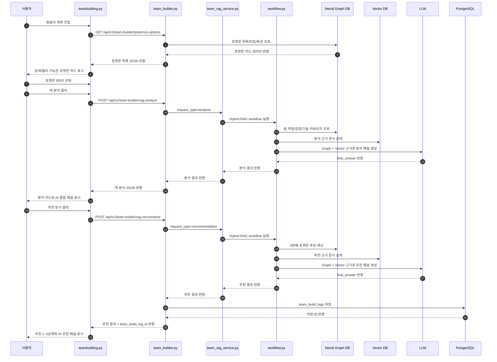
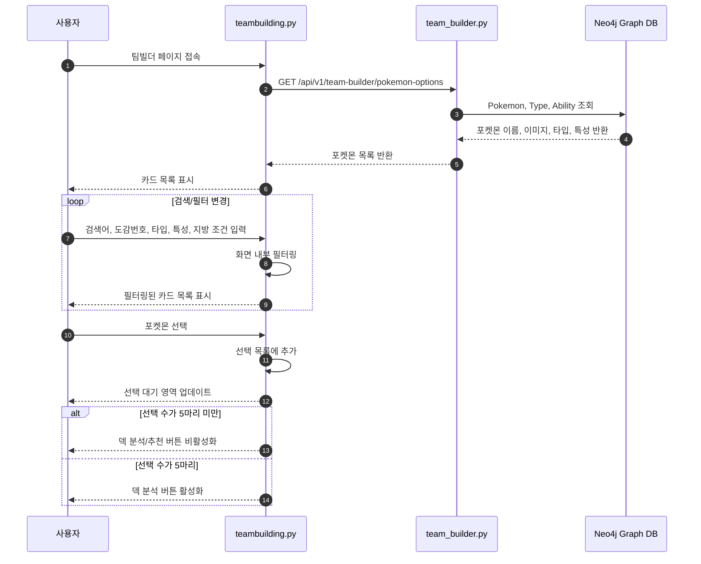
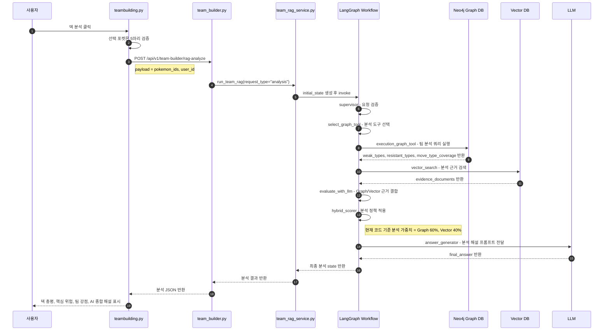
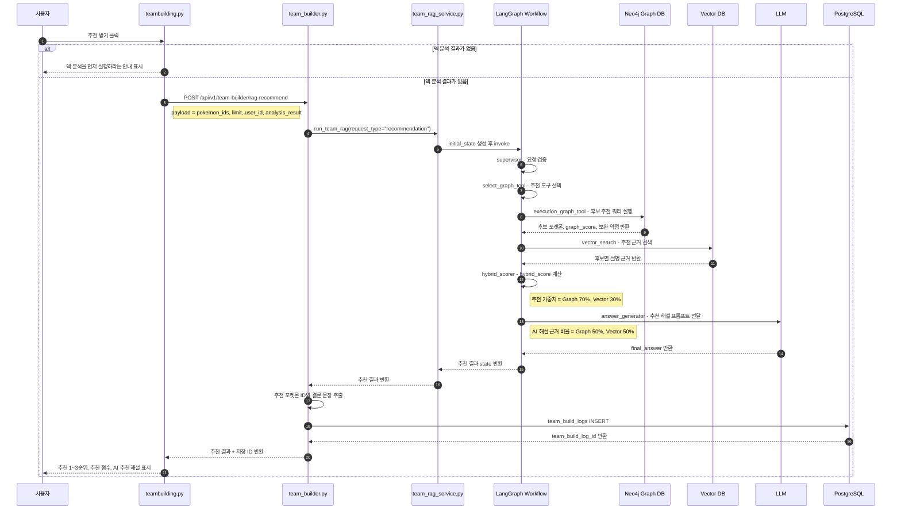
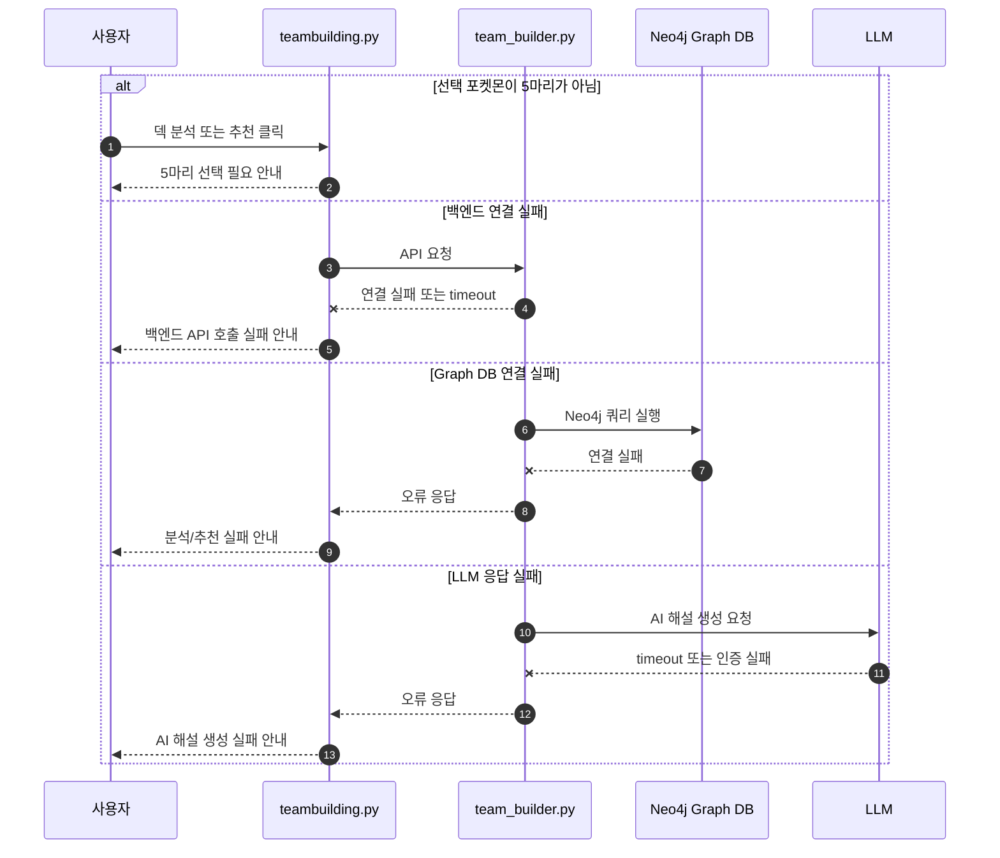

# 팀빌더 시퀀스 다이어그램

## 1. 문서 개요

본 문서는 **팀빌더 기능**에서 사용자의 화면 조작이 프론트엔드, 백엔드 API, Graph DB, Vector DB, LLM, PostgreSQL 저장까지 어떤 순서로 이어지는지 정의한다.

팀빌더의 핵심 흐름은 다음과 같다.

1. 사용자가 팀빌더 화면에 진입한다.
2. 포켓몬 목록을 조회하고 검색/필터를 적용한다.
3. 포켓몬 5마리를 선택한다.
4. 덱 분석 버튼을 눌러 Hybrid RAG 기반 분석 결과를 받는다.
5. 추천 받기 버튼을 눌러 6번째 포켓몬 후보를 추천받는다.
6. 추천 결과가 생성되면 분석/추천 결과를 PostgreSQL에 저장한다.

## 2. 참여 객체

| 객체 | 역할 |
|---|---|
| 사용자 | 팀빌더 화면에서 포켓몬을 선택하고 분석/추천을 요청한다. |
| `teambuilding.py` | Streamlit 기반 팀빌더 화면이다. |
| `team_builder.py` | FastAPI 팀빌더 라우터이다. |
| `team_rag_service.py` | LangGraph 기반 Hybrid RAG 실행 진입점이다. |
| `workflow.py` | supervisor, graph tool, vector search, hybrid scorer, answer generator를 순차 실행한다. |
| Neo4j Graph DB | 포켓몬, 타입, 기술, 상성 관계를 조회한다. |
| Vector DB | 포켓몬 설명/근거 문서를 검색한다. |
| LLM | Graph + Vector 근거를 바탕으로 AI 종합 해설을 생성한다. |
| PostgreSQL | 팀빌더 분석/추천 결과를 `team_build_logs`에 저장한다. |

## 3. 전체 처리 흐름

## 4. 포켓몬 목록 조회 및 선택 흐름

## 5. 덱 분석 시퀀스

## 6. 포켓몬 추천 및 저장 시퀀스

## 7. 예외 처리 시퀀스

## 8. 가중치 적용 위치

| 단계 | 적용 위치 | Graph DB | Vector DB | 설명 |
|---|---|---:|---:|---|
| 덱 분석 | `hybrid_scorer.py` | 60% | 40% | 분석 결과와 근거 문서 결합 |
| 포켓몬 추천 | `hybrid_scorer.py` | 70% | 30% | 추천 후보 순위 산정 |
| AI 해설 | `answer_generator.py` | 50% | 50% | 설명 문장 생성 시 근거 균형 |

## 9. 구현 파일 매핑

| 흐름 | 주요 파일 |
|---|---|
| 화면 표시 및 버튼 처리 | `frontend/pages/teambuilding.py` |
| 팀빌더 API | `backend/routers/team_builder.py` |
| RAG 실행 진입점 | `backend/build_services/team_rag_service.py` |
| LangGraph workflow | `backend/team_build_rag/workflow.py` |
| Graph DB 조회 | `backend/team_build_rag/graph_tools.py` |
| Vector 검색 | `backend/team_build_rag/vector_search.py` |
| Hybrid 점수 계산 | `backend/team_build_rag/hybrid_scorer.py` |
| AI 해설 생성 | `backend/team_build_rag/answer_generator.py` |
| 결과 저장 | `backend/crud.py`, `backend/models.py`, `backend/schemas.py` |

## 10. 검토 포인트

- 사용자는 반드시 포켓몬 5마리를 선택한 뒤 덱 분석을 실행해야 한다.
- 추천은 덱 분석 결과가 존재하는 상태에서만 실행되어야 한다.
- 분석 API는 화면 표시용 결과만 반환하고, 최종 저장은 추천 완료 시점에 수행한다.
- 추천 결과에는 1~3순위 포켓몬, 추천 점수, 추천 이유, AI 종합 해설이 포함되어야 한다.
- 저장 결과에는 선택 포켓몬, 분석 결과, 분석 결론, 추천 포켓몬, 추천 결과, 추천 결론이 포함되어야 한다.
