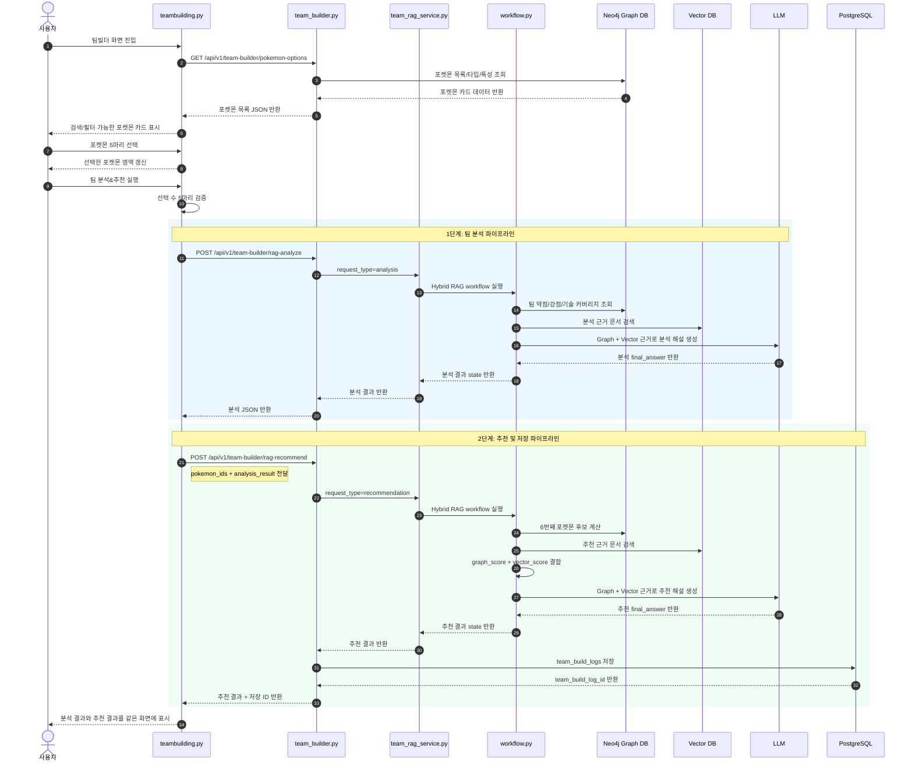
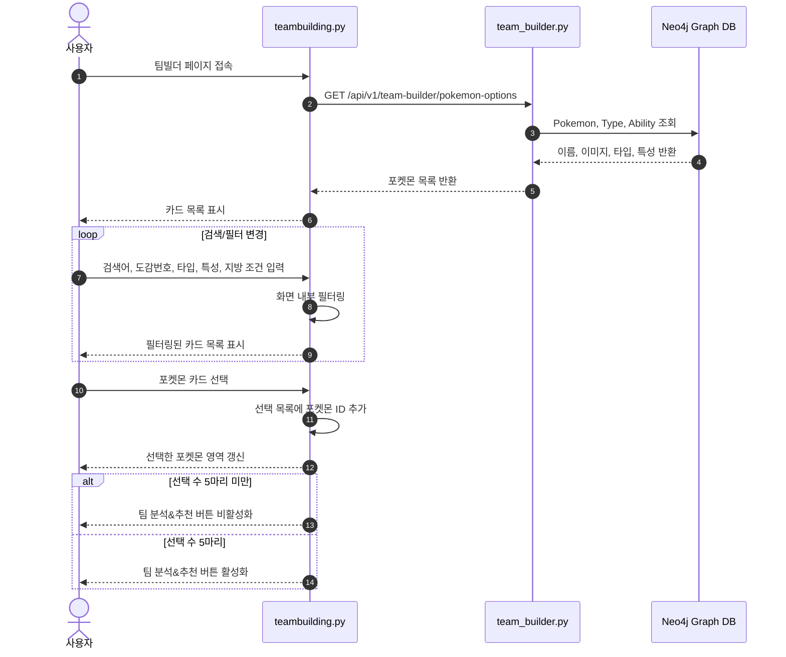
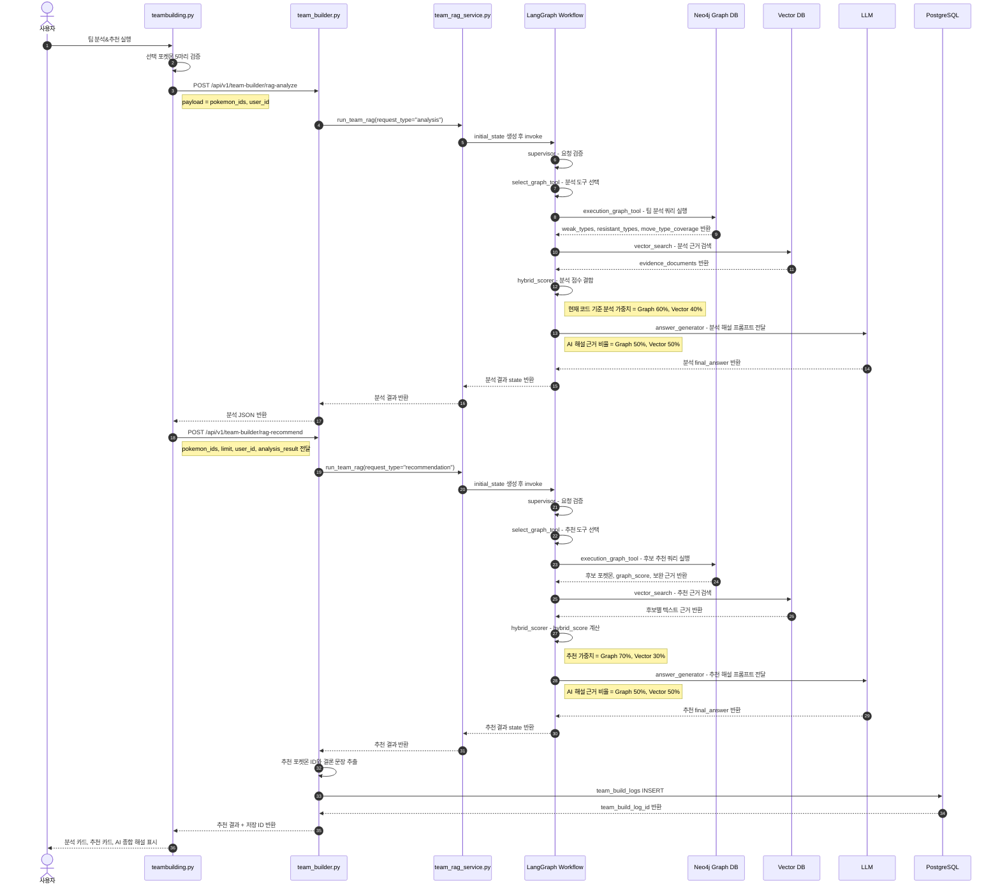
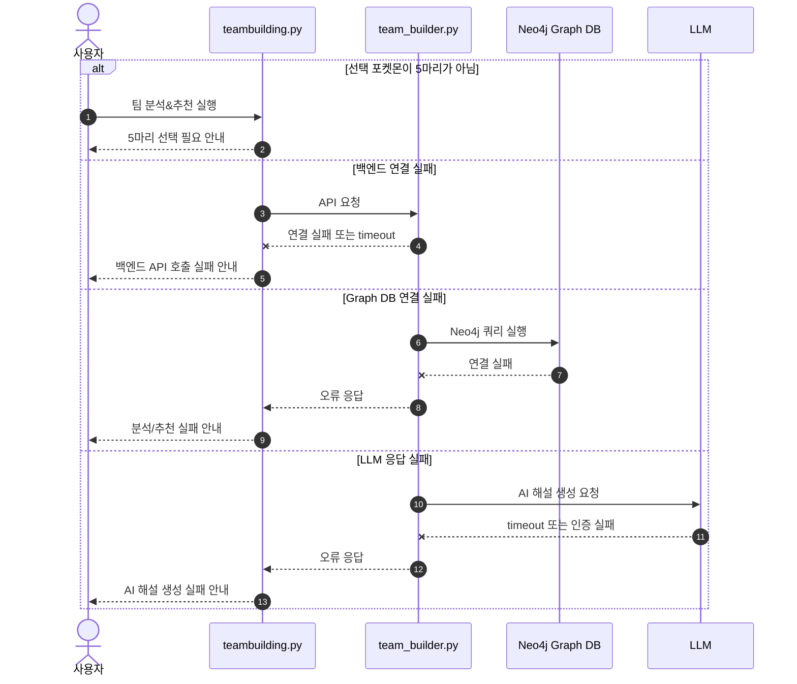

# 팀빌더 시퀀스 다이어그램

## 1. 문서 개요

본 문서는 **팀빌더(Team Builder)** 기능에서 사용자가 포켓몬 5마리를 선택한 뒤, `팀 분석&추천` 버튼을 실행했을 때 화면, API, Graph DB, Vector DB, LLM, PostgreSQL이 어떤 순서로 상호작용하는지 정의한다.

화면에서는 버튼이 하나로 보이지만, 시스템 내부에서는 다음 두 단계가 분리되어 실행된다.

1. 팀 분석 파이프라인: 선택한 5마리 포켓몬의 약점, 방어 안정성, 기술 타입 커버리지를 분석한다.
2. 추천 파이프라인: 분석 결과를 바탕으로 6번째 포켓몬 후보를 추천하고 결과를 저장한다.

## 2. 참여 객체

| 객체 | 역할 |
|---|---|
| 사용자 | 팀빌더 화면에서 포켓몬 5마리를 선택하고 `팀 분석&추천`을 실행한다. |
| `teambuilding.py` | Streamlit 기반 팀빌더 화면이다. 선택 상태, 필터, 결과 렌더링을 담당한다. |
| `team_builder.py` | FastAPI 팀빌더 라우터이다. 분석/추천 요청을 서비스 계층으로 전달한다. |
| `team_rag_service.py` | LangGraph 기반 Hybrid RAG 실행 진입점이다. |
| `workflow.py` | Graph 조회, Vector 검색, Hybrid Score 계산, LLM 해설 생성을 순차 실행한다. |
| Neo4j Graph DB | 포켓몬 타입, 약점, 저항, 기술 커버리지, 추천 후보 계산에 필요한 관계 데이터를 제공한다. |
| Vector DB | 포켓몬 설명, 기술 설명, 특성 설명 등 텍스트 근거를 검색한다. |
| LLM | Graph 근거와 Vector 근거를 바탕으로 자연어 분석/추천 해설을 생성한다. |
| PostgreSQL | 최종 팀 분석 및 추천 결과를 `team_build_logs` 테이블에 저장한다. |

## 3. 전체 처리 흐름

## 4. 포켓몬 목록 조회 및 선택 흐름

## 5. 팀 분석&추천 실행 시퀀스

## 6. 예외 처리 시퀀스

## 7. 가중치 적용 위치

| 단계 | 적용 위치 | Graph DB | Vector DB | 설명 |
|---|---|---:|---:|---|
| 팀 분석 | `hybrid_scorer.py` | 60% | 40% | 팀 약점/강점 분석 결과와 텍스트 근거를 결합한다. |
| 포켓몬 추천 | `hybrid_scorer.py` | 70% | 30% | 추천 후보 순위를 산정한다. |
| AI 해설 | `answer_generator.py` | 50% | 50% | 최종 설명 문장 생성 시 두 근거를 균형 있게 사용한다. |

## 8. 구현 파일 매핑

| 흐름 | 주요 파일 |
|---|---|
| 화면 표시 및 버튼 처리 | `frontend/pages/teambuilding.py` |
| 팀빌더 API | `backend/routers/team_builder.py` |
| RAG 실행 진입점 | `backend/build_services/team_rag_service.py` |
| LangGraph workflow | `backend/team_build_rag/workflow.py` |
| Graph DB 조회 | `backend/team_build_rag/graph_tools.py` |
| Vector 검색 | `backend/team_build_rag/vector_search.py` |
| Hybrid 점수 계산 | `backend/team_build_rag/hybrid_scorer.py` |
| AI 해설 생성 | `backend/team_build_rag/answer_generator.py` |
| 결과 저장 | `backend/crud.py`, `backend/models.py`, `backend/schemas.py` |

## 9. 검토 포인트

- 화면 버튼명은 `팀 분석&추천` 하나로 표현한다.
- 내부 API는 분석과 추천을 분리하여 호출할 수 있다.
- 분석 결과는 추천 요청의 입력 근거로 재사용한다.
- 최종 저장은 추천 결과까지 생성된 뒤 `team_build_logs`에 한 번 수행한다.
- 저장 결과에는 선택 포켓몬, 분석 결과, 분석 결론, 추천 포켓몬, 추천 결과, 추천 결론이 포함되어야 한다.
