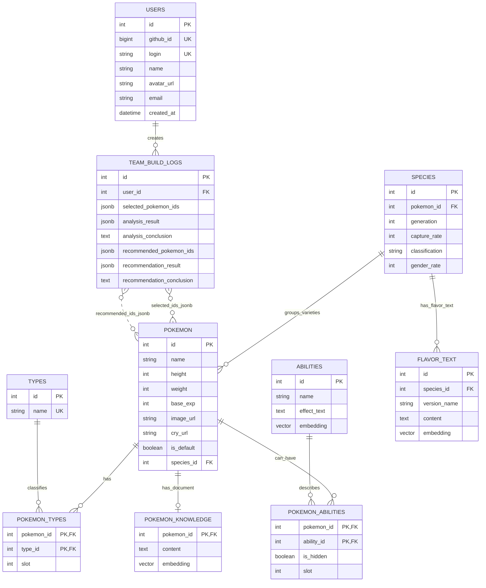
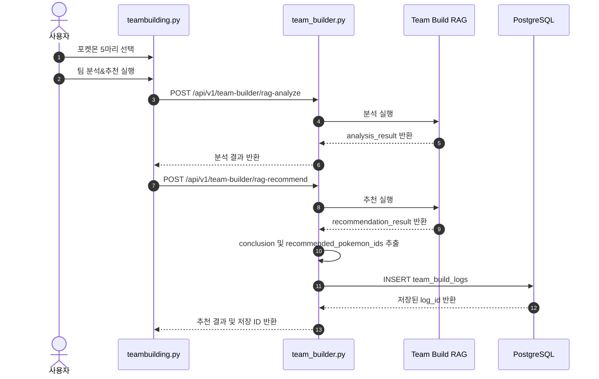

# 팀 빌더 ERD

## 1. 문서 개요

본 문서는 **팀 빌더(Team Builder)** 기능에서 사용하는 PostgreSQL 저장 구조를 정의한다.
팀 빌더는 사용자가 선택한 포켓몬 5마리를 기반으로 팀을 분석하고, Hybrid RAG 기반으로 6번째 추천 포켓몬과 추천 근거를 생성한다.

ERD의 중심 테이블은 `team_build_logs`이다. 이 테이블은 사용자가 실행한 팀 분석 및 추천 결과를 하나의 기록으로 저장한다.

> Neo4j Graph DB는 타입 상성, 추천 후보 탐색, 그래프 기반 계산에 사용된다.
> 본 ERD는 PostgreSQL 기준의 저장 구조를 설명한다.

## 2. ERD 범위

| 구분 | 테이블 | 팀 빌더에서의 역할 |
|---|---|---|
| 결과 저장 | `team_build_logs` | 선택 포켓몬, 분석 결과, 추천 결과, AI 결론 저장 |
| 사용자 참조 | `users` | 로그인 사용자의 팀 빌딩 기록 소유자 식별 |
| 포켓몬 참조 | `pokemon` | 선택/추천 포켓몬 ID의 기준 테이블 |
| 타입 참조 | `types`, `pokemon_types` | 카드 타입 표시, 타입 필터, 팀 분석 근거 |
| 특성 참조 | `abilities`, `pokemon_abilities` | 특성 필터 및 설명 근거 |
| RAG 근거 | `pokemon_knowledge`, `flavor_text`, `moves`, `abilities` | Vector 검색에서 AI 해설 근거로 활용 |

## 3. 논리 ERD



## 4. 핵심 저장 테이블

### 4.1 `team_build_logs`

`team_build_logs`는 팀 빌더 실행 결과를 저장하는 핵심 테이블이다.
사용자가 5마리 포켓몬을 선택하고 `팀 분석&추천`을 실행하면 분석 결과와 추천 결과가 함께 저장된다.

| 컬럼 | 타입 | 필수 | 설명 |
|---|---|---:|---|
| `id` | `INTEGER` | Y | 팀 빌딩 저장 기록의 고유 ID |
| `user_id` | `INTEGER` | N | 로그인 사용자의 `users.id`. 비로그인 또는 사용자 정보가 없으면 `NULL` 허용 |
| `selected_pokemon_ids` | `JSONB` | Y | 사용자가 선택한 5마리 포켓몬 ID 배열 |
| `analysis_result` | `JSONB` | N | 팀 분석 화면에 표시되는 전체 분석 결과 |
| `analysis_conclusion` | `TEXT` | N | 분석 AI 해설 중 `결론:` 문장만 추출한 요약 |
| `recommended_pokemon_ids` | `JSONB` | N | 추천된 1~3순위 포켓몬 ID 배열 |
| `recommendation_result` | `JSONB` | N | 추천 화면에 표시되는 전체 추천 결과 |
| `recommendation_conclusion` | `TEXT` | N | 추천 AI 해설 중 `결론:` 문장만 추출한 요약 |

### 4.2 저장 예시

```json
{
  "user_id": 1,
  "selected_pokemon_ids": [3, 6, 9, 25, 448],
  "analysis_result": {
    "request_type": "analysis",
    "final_answer": "결론: 현재 팀은 ...",
    "graph_result": {},
    "llm_evaluation": {}
  },
  "analysis_conclusion": "결론: 현재 팀은 바위 타입 공격에 취약합니다.",
  "recommended_pokemon_ids": [791, 485, 483],
  "recommendation_result": {
    "request_type": "recommendation",
    "final_answer": "결론: 6번째 포켓몬으로 ...",
    "reranked_result": {}
  },
  "recommendation_conclusion": "결론: 6번째 포켓몬으로 솔가레오를 추천합니다."
}
```

## 5. 참조 테이블

### 5.1 `users`

팀 빌딩 기록이 어떤 사용자의 기록인지 연결한다.
`team_build_logs.user_id`는 `users.id`를 참조한다.

| 컬럼 | 타입 | 설명 |
|---|---|---|
| `id` | `INTEGER` | 내부 사용자 식별자 |
| `github_id` | `BIGINT` | GitHub 로그인 기준 사용자 식별자 |
| `login` | `VARCHAR(100)` | GitHub 로그인명 |
| `name` | `VARCHAR(100)` | 사용자 표시 이름 |
| `avatar_url` | `VARCHAR(255)` | 사용자 프로필 이미지 |
| `email` | `VARCHAR(100)` | 이메일 |
| `created_at` | `TIMESTAMP` | 사용자 생성 시각 |

### 5.2 `pokemon`

팀 빌더 화면의 포켓몬 카드, 선택 목록, 추천 결과의 기준 테이블이다.
`team_build_logs.selected_pokemon_ids`와 `team_build_logs.recommended_pokemon_ids`는 물리 FK가 아니라 JSONB 배열로 `pokemon.id` 값을 저장한다.

| 컬럼 | 타입 | 설명 |
|---|---|---|
| `id` | `INTEGER` | 포켓몬 ID |
| `name` | `VARCHAR(100)` | 포켓몬 이름 |
| `image_url` | `VARCHAR(255)` | 카드에 표시할 이미지 URL |
| `cry_url` | `VARCHAR(255)` | 울음소리 URL |
| `is_default` | `BOOLEAN` | 기본 폼 여부 |
| `species_id` | `INTEGER` | 종 정보 참조 ID |

### 5.3 `types`, `pokemon_types`

포켓몬의 타입 표시와 타입 필터에 사용된다.
팀 분석에서는 선택된 포켓몬의 타입 구성을 기반으로 팀의 방어/공격 커버리지를 해석한다.

| 테이블 | 주요 컬럼 | 설명 |
|---|---|---|
| `types` | `id`, `name` | 타입 마스터 테이블 |
| `pokemon_types` | `pokemon_id`, `type_id`, `slot` | 포켓몬과 타입의 다대다 관계 |

### 5.4 `abilities`, `pokemon_abilities`

팀 빌더의 특성 필터에 사용된다.
`abilities.effect_text`와 `embedding`은 RAG 근거 문서로도 활용될 수 있다.

| 테이블 | 주요 컬럼 | 설명 |
|---|---|---|
| `abilities` | `id`, `name`, `effect_text`, `embedding` | 특성 정보 및 Vector 검색 근거 |
| `pokemon_abilities` | `pokemon_id`, `ability_id`, `is_hidden`, `slot` | 포켓몬과 특성의 다대다 관계 |

### 5.5 `pokemon_knowledge`, `flavor_text`, `moves`

팀 분석 및 추천 해설에서 Vector DB 검색 근거로 사용할 수 있는 문서성 데이터이다.

| 테이블 | 역할 |
|---|---|
| `pokemon_knowledge` | 포켓몬별 설명/요약 문서 |
| `flavor_text` | 포켓몬 도감 설명 텍스트 |
| `moves` | 기술명, 타입, 위력, 분류 등 추천 근거 |
| `abilities` | 특성 효과 설명 근거 |

## 6. 저장 흐름



## 7. 설계 근거

### 7.1 결과 저장을 `team_build_logs` 하나로 통합한 이유

사용자 관점에서 팀 빌더의 한 번의 실행 결과는 `선택한 5마리`, `팀 분석`, `포켓몬 추천`, `AI 해설`이 하나의 묶음이다.
따라서 분석 결과와 추천 결과를 분리 저장하기보다 하나의 로그로 저장하는 편이 이력 조회와 재현에 유리하다.

### 7.2 포켓몬 ID 목록을 JSONB로 저장한 이유

선택 포켓몬과 추천 포켓몬은 고정된 개수의 결과 스냅샷에 가깝다.
현재 요구사항에서는 “이 조합으로 어떤 분석과 추천이 나왔는지”를 보존하는 것이 중요하므로, 별도 조인 테이블보다 JSONB 배열 저장이 단순하고 구현 부담이 낮다.

다만 추후 “특정 포켓몬이 포함된 모든 팀 빌딩 기록 검색”이 중요해지면 조인 테이블 분리를 검토할 수 있다.

### 7.3 결과 전체를 JSONB로 저장한 이유

`analysis_result`와 `recommendation_result`는 Graph DB 결과, Vector 검색 근거, Hybrid Score, LLM 해설 등 구조가 확장될 가능성이 높다.
JSONB를 사용하면 응답 구조가 조금 바뀌어도 테이블 컬럼을 계속 추가하지 않고 결과 스냅샷을 보존할 수 있다.

### 7.4 결론 문장을 별도 컬럼으로 둔 이유

전체 RAG 결과는 JSONB에 저장하지만, 목록 화면이나 이력 화면에서는 긴 결과보다 짧은 결론이 먼저 필요하다.
따라서 `analysis_conclusion`, `recommendation_conclusion`을 별도 `TEXT` 컬럼으로 분리하여 빠르게 조회하고 표시할 수 있게 했다.

### 7.5 `user_id`를 nullable로 둔 이유

팀 빌더는 로그인 사용자에게는 개인 이력 저장 기능을 제공할 수 있고, 비로그인 상태에서도 기능 테스트나 임시 실행이 가능해야 한다.
따라서 `user_id`는 `NULL`을 허용한다.

## 8. 제약사항 및 개선 가능성

| 항목 | 현재 설계 | 개선 가능성 |
|---|---|---|
| 선택 포켓몬 저장 | JSONB 배열 | `team_build_log_pokemons` 조인 테이블 분리 |
| 추천 포켓몬 저장 | JSONB 배열 | 추천 순위, 점수, 이유를 별도 테이블로 정규화 |
| 결과 저장 | JSONB 스냅샷 | 자주 조회하는 점수는 별도 컬럼화 |
| 사용자 연결 | `user_id` nullable | 로그인 필수 정책 적용 시 `NOT NULL` 전환 |
| 생성 시각 | 현재 모델에는 별도 컬럼 없음 | `created_at`, `updated_at` 추가 권장 |
| 검색 성능 | 기본 PK/FK 중심 | JSONB GIN Index 또는 별도 이력 조회 인덱스 추가 |

## 9. 구현 파일 매핑

| 역할 | 파일 |
|---|---|
| SQLAlchemy 모델 | `backend/models.py` |
| API 요청/응답 스키마 | `backend/schemas.py` |
| DB 저장 함수 | `backend/crud.py` |
| 팀 빌더 API 라우터 | `backend/routers/team_builder.py` |
| 팀 빌더 화면 | `frontend/pages/teambuilding.py` |
| PostgreSQL 초기 스키마 | `database/postgre/utils/schema.sql` |

## 10. 검토 포인트

| 검토 항목 | 확인 내용 |
|---|---|
| 저장 시점 | 추천 결과까지 생성된 뒤 `team_build_logs`에 1회 저장되는지 확인 |
| 사용자 연결 | 로그인 사용자의 `user_id`가 정상 저장되는지 확인 |
| 분석 결과 | `analysis_result`, `analysis_conclusion`이 함께 저장되는지 확인 |
| 추천 결과 | `recommended_pokemon_ids`, `recommendation_result`, `recommendation_conclusion`이 함께 저장되는지 확인 |
| JSONB 재현성 | 저장된 JSONB만으로 당시 화면 결과를 재현할 수 있는지 확인 |
