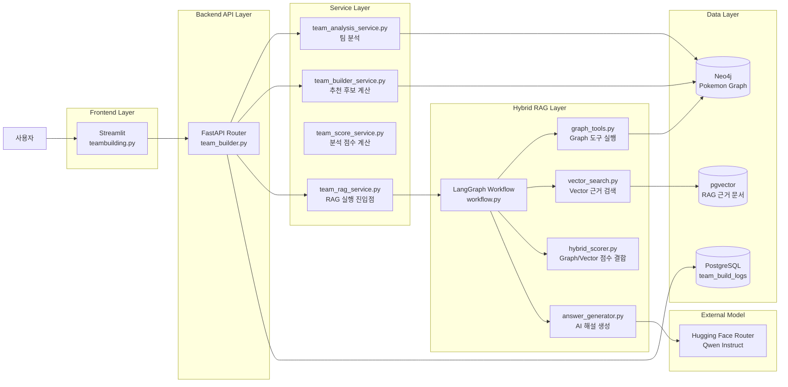
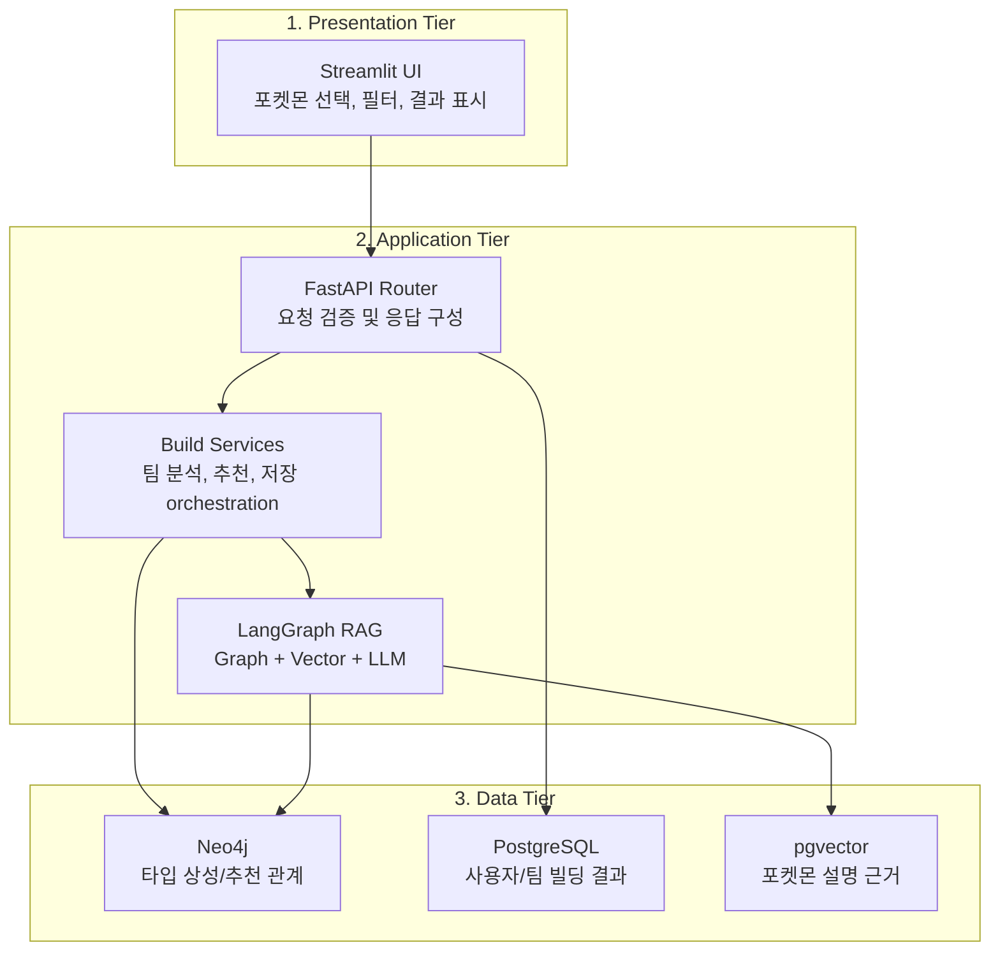
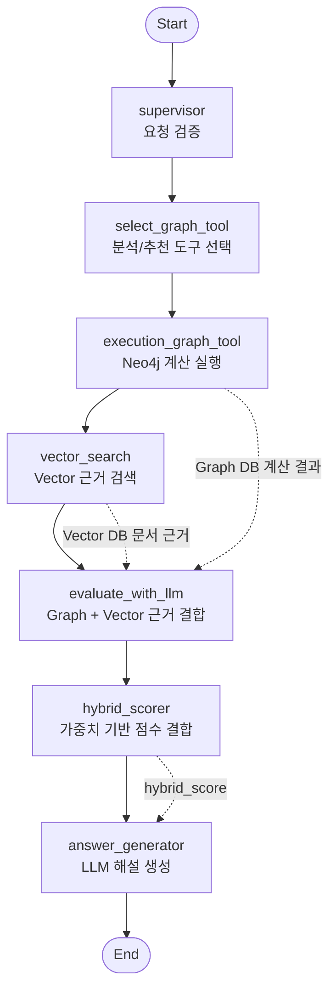
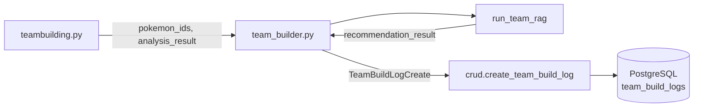
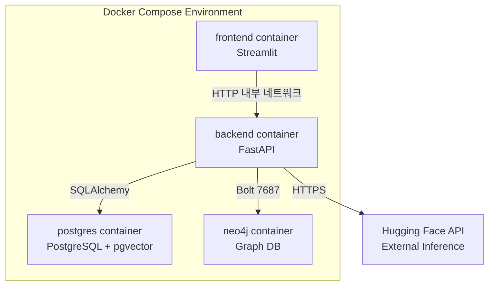

# 팀 빌더 시스템 아키텍처 구성도

## 1. 문서 개요

본 문서는 **팀 빌더(Team Builder)** 기능의 시스템 구성 요소와 데이터 흐름을 정의한다.
범위는 사용자가 포켓몬 5마리를 선택하고, 팀 분석 및 추천 결과를 확인하며, 결과가 PostgreSQL에 저장되는 과정까지이다.

팀 빌더는 단순 CRUD 화면이 아니라 다음 요소가 결합된 기능이다.

| 구분 | 설명 |
|---|---|
| Frontend | Streamlit 기반 팀 선택/필터/결과 표시 화면 |
| Backend API | FastAPI 기반 팀 빌더 전용 API |
| Graph DB | Neo4j 기반 타입 상성, 팀 분석, 추천 후보 계산 |
| Vector DB | PostgreSQL pgvector 기반 설명 근거 검색 |
| RAG Workflow | LangGraph 기반 Graph + Vector 결합 흐름 |
| LLM | Hugging Face Qwen 모델 기반 자연어 해설 생성 |
| Result Store | PostgreSQL `team_build_logs`에 분석/추천 결과 저장 |

## 2. 아키텍처 목표

| 목표 | 내용 |
|---|---|
| 기능 분리 | 화면, API, 계산 서비스, RAG, DB 저장 책임을 분리한다. |
| 근거 기반 추천 | Neo4j의 타입/관계 계산과 Vector 문서 근거를 함께 활용한다. |
| 설명 가능성 | 추천 결과만 보여주지 않고 AI 해설과 근거를 함께 제공한다. |
| 이력 저장 | 사용자의 선택 포켓몬, 분석 결과, 추천 결과를 PostgreSQL에 저장한다. |
| 확장 가능성 | 추후 추천 점수 정책, LLM 모델, Vector 검색 방식을 교체하기 쉽게 구성한다. |

## 3. 전체 시스템 구성도

## 4. 3-Tier 관점 구성

팀 빌더는 기본적으로 3-Tier 구조를 따른다.
다만 일반적인 3-Tier 구조에 Graph DB, Vector DB, LLM 호출 계층이 추가되어 있다.

## 5. 주요 컴포넌트 설명

### 5.1 Frontend Layer

| 컴포넌트 | 파일 | 역할 |
|---|---|---|
| 팀 빌더 화면 | `frontend/pages/teambuilding.py` | 포켓몬 검색, 타입/특성/지방 필터, 5마리 선택, 분석/추천 결과 표시 |
| 결과 화면 | `frontend/pages/team_result.py` | 팀 분석 및 추천 결과를 별도 화면에서 표시하는 경우 사용 |

Frontend는 직접 DB에 접근하지 않는다.
모든 데이터 조회와 분석 요청은 FastAPI를 통해 수행한다.

### 5.2 Backend API Layer

| API | 메서드 | 역할 |
|---|---|---|
| `/api/v1/team-builder/pokemon-options` | GET | 팀 빌더 카드 목록 조회 |
| `/api/v1/team-builder/analyze` | POST | Graph DB 기반 기본 팀 분석 |
| `/api/v1/team-builder/recommend` | POST | Graph DB 기반 기본 추천 |
| `/api/v1/team-builder/rag-analyze` | POST | Hybrid RAG 기반 팀 분석 해설 생성 |
| `/api/v1/team-builder/rag-recommend` | POST | Hybrid RAG 기반 추천 해설 생성 및 결과 저장 |

라우터는 요청 값을 검증하고, 실제 계산은 `build_services`와 `team_build_rag` 계층에 위임한다.

### 5.3 Service Layer

| 파일 | 역할 |
|---|---|
| `backend/build_services/team_analysis_service.py` | 선택 포켓몬 5마리의 약점, 방어 안정성, 타입 커버리지 분석 |
| `backend/build_services/team_builder_service.py` | 6번째 추천 후보 계산 및 추천 점수 산출 |
| `backend/build_services/team_score_service.py` | 팀 분석 점수와 타입별 위험/안정 지표 계산 |
| `backend/build_services/team_insight_service.py` | 분석 결과를 화면에서 읽기 쉬운 인사이트 구조로 변환 |
| `backend/build_services/team_rag_service.py` | LangGraph RAG 앱 실행 진입점 |

Service Layer는 화면이나 라우터가 복잡한 계산 로직을 직접 갖지 않도록 분리한 계층이다.

### 5.4 Hybrid RAG Layer

| 파일 | 역할 |
|---|---|
| `backend/team_build_rag/workflow.py` | LangGraph 워크플로우 정의 |
| `backend/team_build_rag/graph_tools.py` | 분석/추천 요청에 맞는 Neo4j Graph 도구 선택 및 실행 |
| `backend/team_build_rag/vector_search.py` | Vector DB에서 설명 근거 검색 |
| `backend/team_build_rag/vector_scorer.py` | Vector 근거 점수 계산 |
| `backend/team_build_rag/hybrid_scorer.py` | Graph 점수와 Vector 점수를 결합 |
| `backend/team_build_rag/scoring_policy.py` | 분석/추천/답변 생성 가중치 정책 관리 |
| `backend/team_build_rag/answer_generator.py` | LLM 호출 및 최종 AI 해설 생성 |

## 6. Hybrid RAG 내부 구성도

## 7. 가중치 정책

팀 빌더는 요청 목적에 따라 Graph DB와 Vector DB의 비중을 다르게 적용한다.

| 단계 | Graph DB | Vector DB | 이유 |
|---|---:|---:|---|
| 팀 분석 | 60% | 40% | 타입 상성 계산이 핵심이며, 문서 근거는 설명 보강 역할 |
| 포켓몬 추천 | 70% | 30% | 추천 순위는 약점 보완, 타입 저항, 종족값, 기술 커버리지 계산이 중요 |
| AI 해설 생성 | 50% | 50% | 사용자가 납득할 수 있는 설명을 위해 계산 근거와 문서 근거를 균형 있게 반영 |

정책 위치는 `backend/team_build_rag/scoring_policy.py`이다.

## 8. 데이터 저장 구조

`team_build_logs`에는 다음 정보가 저장된다.

| 컬럼 | 저장 내용 |
|---|---|
| `user_id` | 로그인 사용자 ID |
| `selected_pokemon_ids` | 선택한 5마리 포켓몬 ID |
| `analysis_result` | 팀 분석 전체 결과 |
| `analysis_conclusion` | 분석 AI 해설의 결론 문장 |
| `recommended_pokemon_ids` | 추천 포켓몬 1~3순위 ID |
| `recommendation_result` | 추천 전체 결과 |
| `recommendation_conclusion` | 추천 AI 해설의 결론 문장 |

## 9. 배포 및 실행 관점 구성

팀 빌더 실행 시 Docker 내부에서는 `frontend`가 `backend` 서비스명을 통해 API를 호출한다.
백엔드는 PostgreSQL과 Neo4j에 각각 접근하며, AI 해설 생성 시 외부 Hugging Face API를 호출한다.

## 10. 주요 설계 근거

### 10.1 Graph DB를 사용하는 이유

팀 추천은 단순 텍스트 검색보다 관계 계산이 중요하다.
선택된 5마리의 타입 조합, 약점 타입, 저항 타입, 추천 후보의 보완 가능성을 그래프 관계로 탐색하면 추천 근거를 명확히 만들 수 있다.

### 10.2 Vector DB를 사용하는 이유

Graph DB는 관계 계산에는 강하지만, “왜 이 포켓몬이 유용한지”를 자연어로 설명하기 위한 문서 근거는 부족하다.
Vector DB는 포켓몬 설명, 기술 설명, 특성 설명을 검색하여 AI 해설의 근거를 보강한다.

### 10.3 LangGraph를 사용하는 이유

팀 빌더 RAG는 단일 함수 호출보다 단계가 많다.
요청 검증, Graph 도구 선택, Graph 실행, Vector 검색, 점수 결합, LLM 해설 생성을 노드로 분리하면 흐름을 추적하고 수정하기 쉽다.

### 10.4 PostgreSQL에 결과를 저장하는 이유

분석과 추천 결과는 사용자의 이력으로 남길 가치가 있다.
PostgreSQL에 저장하면 마이페이지, 추천 이력 조회, 테스트 결과 비교, RAG 품질 평가에 재사용할 수 있다.

## 11. 장애 및 예외 지점

| 지점 | 가능한 문제 | 대응 방향 |
|---|---|---|
| Frontend → Backend | 백엔드 컨테이너 미실행, 서비스명 오류 | `backend:8000` 연결 확인 |
| Backend → Neo4j | 인증 실패, Bolt 포트 오류, 그래프 미적재 | `NEO4J_AUTH`, `bolt://neo4j:7687`, graph_loader 실행 확인 |
| Backend → PostgreSQL | 테이블 미생성, DB 연결 실패 | 마이그레이션 또는 schema.sql 실행 확인 |
| RAG → Hugging Face | 토큰 누락, 추론 크레딧 부족, 402 오류 | `HF_TOKEN`, Billing, 모델 호출 방식 확인 |
| Vector 검색 | embedding 누락, 검색 결과 부족 | pgvector 적재 상태 및 검색 fallback 확인 |

## 12. 구현 파일 매핑

| 영역 | 파일 |
|---|---|
| 팀 빌더 화면 | `frontend/pages/teambuilding.py` |
| 팀 빌더 API | `backend/routers/team_builder.py` |
| 팀 분석 서비스 | `backend/build_services/team_analysis_service.py` |
| 팀 추천 서비스 | `backend/build_services/team_builder_service.py` |
| RAG 실행 서비스 | `backend/build_services/team_rag_service.py` |
| LangGraph 워크플로우 | `backend/team_build_rag/workflow.py` |
| Graph 도구 | `backend/team_build_rag/graph_tools.py` |
| Vector 검색 | `backend/team_build_rag/vector_search.py` |
| Hybrid 점수 정책 | `backend/team_build_rag/scoring_policy.py` |
| AI 해설 생성 | `backend/team_build_rag/answer_generator.py` |
| Neo4j 연결 | `backend/graph/neo4j_client.py` |
| PostgreSQL 모델 | `backend/models.py` |
| DB 저장 함수 | `backend/crud.py` |

## 13. 검토 포인트

| 검토 항목 | 확인 내용 |
|---|---|
| 화면 책임 | `teambuilding.py`가 DB 계산을 직접 하지 않고 API만 호출하는가 |
| API 책임 | `team_builder.py`가 요청 검증과 서비스 호출 중심으로 구성되어 있는가 |
| RAG 책임 | Graph 계산, Vector 검색, LLM 해설 단계가 분리되어 있는가 |
| 저장 책임 | 추천 완료 시 `team_build_logs`에 분석/추천 결과가 함께 저장되는가 |
| 환경 의존성 | Neo4j, PostgreSQL, Hugging Face 토큰/크레딧 상태가 명확히 관리되는가 |
