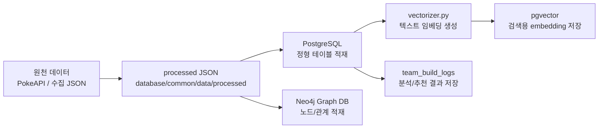
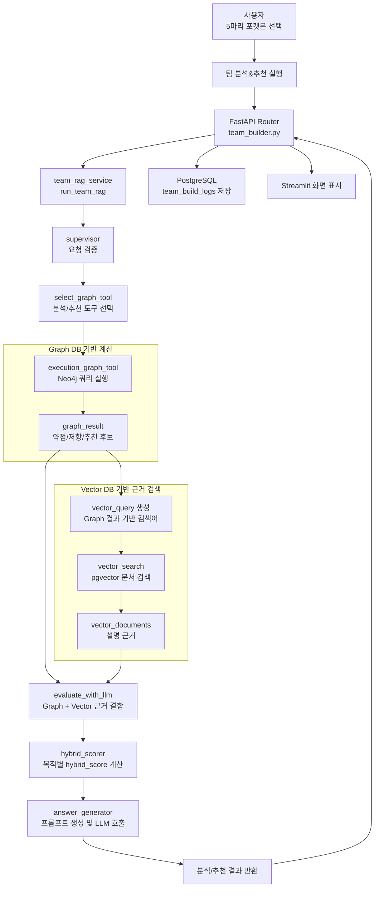
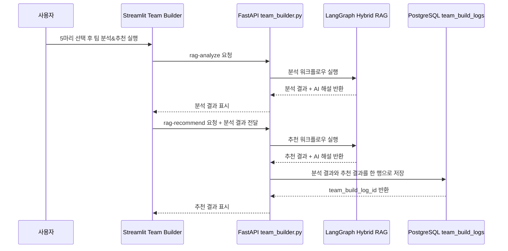

# 팀빌더 RAG / 데이터 파이프라인 설계도

## 1. 문서 개요

본 문서는 **팀빌더 기능**에서 사용하는 데이터 준비 흐름과 Hybrid RAG 실행 흐름을 정의한다.

팀빌더는 사용자가 선택한 포켓몬 5마리를 기준으로 팀을 분석하고, 6번째 포켓몬 후보를 추천한다. 이 과정에서 정량 계산은 Graph DB가 담당하고, 설명 근거 보강은 Vector DB가 담당하며, 최종 자연어 해설은 LLM이 생성한다.

| 항목 | 내용 |
|---|---|
| 문서 목적 | 팀빌더 RAG와 데이터 파이프라인 구조를 한눈에 이해할 수 있도록 정리 |
| 대상 화면 | `frontend/pages/teambuilding.py` |
| 대상 API | `backend/routers/team_builder.py` |
| 주요 저장소 | PostgreSQL, Neo4j Graph DB, pgvector |
| 주요 RAG 구조 | LangGraph 기반 Graph-guided Hybrid RAG |
| 제외 범위 | 배틀 기능, 도감 상세 기능, 미니게임 기능 |

---

## 2. 전체 설계 요약

팀빌더 데이터 흐름은 크게 두 단계로 나뉜다.

| 구분 | 목적 | 주요 파일 |
|---|---|---|
| 데이터 준비 파이프라인 | 원천 데이터를 PostgreSQL, Neo4j, pgvector에서 사용할 수 있게 적재 | `database/postgre/main_pipeline.py`, `database/postgre/utils/vectorizer.py`, `database/graph/graph_loader.py` |
| RAG 실행 파이프라인 | 사용자의 5마리 선택을 기반으로 분석/추천 결과와 AI 해설 생성 | `backend/build_services/team_rag_service.py`, `backend/team_build_rag/workflow.py` |

핵심 판단 기준은 다음과 같다.

| 저장소 | 팀빌더에서 맡는 역할 | 사용 이유 |
|---|---|---|
| PostgreSQL | 포켓몬 정형 데이터, 벡터 검색 대상 문서, 팀빌더 결과 로그 저장 | 테이블 기반 조회와 결과 보존에 적합 |
| Neo4j Graph DB | 타입 상성, 약점/저항, 기술 관계, 추천 후보 계산 | 포켓몬-타입-기술 관계 탐색에 적합 |
| pgvector | 포켓몬 설명, 기술 효과, 특성 효과 등 텍스트 근거 검색 | 자연어 설명 근거를 유사도 기반으로 찾기 적합 |
| LLM | 분석/추천 결과를 사용자가 이해하기 쉬운 한국어 해설로 변환 | 계산 결과를 설명 가능한 문장으로 정리 |

---

## 3. 데이터 준비 파이프라인

### 3.1 데이터 준비 흐름

### 3.2 데이터 저장소별 책임

| 데이터 저장소 | 적재 대상 | 팀빌더 활용 방식 |
|---|---|---|
| PostgreSQL | `pokemon`, `moves`, `abilities`, `flavor_text`, `pokemon_knowledge` 등 | 기본 정형 데이터와 RAG 근거 문서 저장 |
| Neo4j | `Pokemon`, `Type`, `Move`, `Ability`, `Generation` 등 노드와 관계 | 선택한 5마리의 약점, 저항, 기술 커버리지, 추천 후보 계산 |
| pgvector | `moves.embedding`, `abilities.embedding`, `flavor_text.embedding`, `pokemon_knowledge.embedding` | Graph 결과와 관련 있는 설명 문서를 검색 |
| PostgreSQL 로그 | `team_build_logs` | 사용자의 선택 팀, 분석 결과, 추천 결과, 결론 저장 |

### 3.3 데이터 적재 단계

| 단계 | 설명 | 대표 파일 |
|---|---|---|
| 1. JSON 준비 | 전처리된 포켓몬 데이터를 `database/common/data/processed`에 저장 | `database/common/data/processed/*.json` |
| 2. PostgreSQL 적재 | 정형 테이블에 포켓몬, 타입, 기술, 특성, 설명 데이터 저장 | `database/postgre/utils/db_loader.py` |
| 3. Graph DB 적재 | 포켓몬과 타입/기술/특성 관계를 Neo4j에 생성 | `database/graph/graph_loader.py` |
| 4. Vector 적재 | 설명 텍스트를 embedding으로 변환해 pgvector 검색 가능 상태로 저장 | `database/postgre/utils/vectorizer.py` |
| 5. 결과 로그 저장 | 분석/추천 완료 시 팀빌더 결과를 PostgreSQL에 저장 | `crud.py`, `schemas.py`, `backend/routers/team_builder.py` |

---

## 4. 팀빌더 RAG 실행 파이프라인

### 4.1 실행 흐름

팀빌더의 Hybrid RAG는 병렬형이 아니라 **Graph-guided 순차형 Hybrid RAG**이다.

즉, 먼저 Graph DB가 선택 팀의 약점/저항/추천 후보를 계산하고, 그 결과를 바탕으로 Vector DB 검색어를 만든다. 이후 Graph 계산 근거와 Vector 검색 근거를 결합해 LLM 해설을 생성한다.

### 4.2 LangGraph 노드 역할

| 노드 | 역할 | 입력 | 출력 |
|---|---|---|---|
| `supervisor` | 요청이 유효한지 확인 | `pokemon_ids`, `request_type` | 정규화된 요청 상태 |
| `select_graph_tool` | 분석/추천 중 사용할 Graph 도구 선택 | `request_type` | `selected_graph_tool` |
| `execution_graph_tool` | Neo4j 기반 분석 또는 추천 실행 | `pokemon_ids`, `graph` | `graph_result` |
| `vector_search` | Graph 결과로 검색어를 만들고 pgvector 검색 | `graph_result` | `vector_query`, `vector_documents` |
| `evaluate_with_llm` | Graph와 Vector 근거를 하나의 context로 결합 | `graph_result`, `vector_documents` | `llm_evaluation` |
| `hybrid_scorer` | Graph 점수와 Vector 근거 점수를 결합 | `graph_result`, `vector_documents` | `reranked_result` |
| `answer_generator` | 최종 프롬프트를 만들고 LLM 해설 생성 | `reranked_result`, `vector_documents` | `final_answer` |

> 현재 구현에서 `evaluate_with_llm`은 이름과 달리 별도 LLM 호출을 수행하지 않고, Graph/Vector 근거를 묶는 context 구성 단계로 동작한다.

---

## 5. Hybrid RAG 가중치 정책

가중치는 `backend/team_build_rag/scoring_policy.py`에서 관리한다.

| 목적 | Graph DB 비중 | Vector DB 비중 | 설계 근거 |
|---|---:|---:|---|
| 덱 분석 점수 | 70% | 30% | 타입 상성 계산은 Graph DB가 핵심이며, Vector DB는 설명 근거를 보강 |
| 포켓몬 추천 점수 | 80% | 20% | 추천 순위는 약점 보완, 종족값, 기술 커버리지 등 Graph 계산 신뢰도가 가장 중요 |
| AI 해설 생성 | 60% | 40% | 해설은 Graph 계산 근거를 우선하되, Vector 문서 근거로 설명의 풍부함을 보강 |

포켓몬 추천의 원본 `graph_score`는 최대 150점을 기준으로 0~100점으로 정규화한 뒤 `vector_score`와 결합한다. 150점은 약점 보완 125점, 기본 능력치 5점, 기술 타입 커버리지 20점을 합산한 기준이다.

### 5.1 왜 Graph DB 비중이 높은가?

팀빌더의 핵심 기능은 “선택한 5마리의 약점을 보완할 6번째 포켓몬 추천”이다. 이 판단은 단순 문장 검색보다 타입 상성, 기술 타입, 저항 관계처럼 명확한 구조 데이터가 중요하다.

따라서 추천 순위 계산에서는 Graph DB 비중을 더 높게 둔다.

### 5.2 왜 Vector DB가 필요한가?

Graph DB는 “무엇이 약점인지”, “어떤 후보가 보완하는지”를 잘 계산한다. 하지만 사용자가 이해하기 쉬운 설명을 만들려면 포켓몬 설명, 기술 효과, 특성 효과 같은 자연어 근거가 필요하다.

Vector DB는 이 설명 근거를 보강해 AI 해설이 단순 점수 나열이 되지 않도록 돕는다.

---

## 6. 주요 상태 데이터

LangGraph 워크플로우는 하나의 상태 객체를 단계별로 확장한다.

| 상태 키 | 의미 | 생성 단계 |
|---|---|---|
| `pokemon_ids` | 사용자가 선택한 포켓몬 ID 5개 | API 요청 |
| `request_type` | `analysis` 또는 `recommendation` | API 요청 / `supervisor` |
| `selected_graph_tool` | 실행할 Graph 도구 이름 | `select_graph_tool` |
| `graph_result` | Neo4j 기반 분석/추천 계산 결과 | `execution_graph_tool` |
| `vector_query` | Vector DB 검색용 문장 | `vector_search` |
| `vector_documents` | 검색된 설명 근거 문서 | `vector_search` |
| `llm_evaluation` | Graph/Vector 근거 결합 context | `evaluate_with_llm` |
| `reranked_result` | hybrid_score가 반영된 결과 | `hybrid_scorer` |
| `final_answer` | 사용자에게 보여줄 AI 종합 해설 | `answer_generator` |
| `team_build_log_id` | DB 저장 후 생성된 로그 ID | `team_builder.py` |

---

## 7. 결과 저장 파이프라인

팀빌더 결과는 추천까지 완료된 시점에 PostgreSQL `team_build_logs`에 저장한다.

저장 컬럼은 다음 목적을 가진다.

| 컬럼 | 저장 내용 |
|---|---|
| `user_id` | 로그인 사용자가 있는 경우 사용자 ID |
| `selected_pokemon_ids` | 사용자가 선택한 5마리 포켓몬 ID |
| `analysis_result` | 덱 분석 전체 JSON |
| `analysis_conclusion` | 덱 분석 AI 해설의 결론 문장 |
| `recommended_pokemon_ids` | 추천된 포켓몬 ID 목록 |
| `recommendation_result` | 추천 전체 JSON |
| `recommendation_conclusion` | 추천 AI 해설의 결론 문장 |

---

## 8. 예외 및 운영 고려사항

| 상황 | 영향 | 대응 방향 |
|---|---|---|
| Neo4j 연결 실패 | 분석/추천 계산 불가 | Docker Neo4j 상태와 `GRAPH_DB_*` 환경변수 확인 |
| Graph DB 데이터 미적재 | 타입/기술 관계 계산 누락 | `database/graph/graph_loader.py` 재실행 |
| Vector DB embedding 미적재 | 설명 근거 검색 품질 저하 | `database/postgre/utils/vectorizer.py` 실행 |
| LLM 호출 실패 | AI 종합 해설 생성 실패 | Hugging Face 토큰, 추론 크레딧, 모델 권한/설정 확인 |
| PostgreSQL 저장 실패 | 화면 표시는 가능하나 히스토리 저장 실패 | `team_build_logs` 테이블과 DB 연결 확인 |

---

## 9. 설계 근거

### 9.1 Graph DB를 먼저 실행하는 이유

팀빌더의 핵심 질문은 “이 5마리 팀의 약점은 무엇이고, 어떤 포켓몬이 그 약점을 보완하는가?”이다. 이 질문은 포켓몬, 타입, 기술, 상성 관계를 따라가야 하므로 Graph DB가 먼저 계산하는 것이 자연스럽다.

Graph 결과가 먼저 있어야 Vector DB 검색어도 구체화된다. 예를 들어 “바위 타입 공격에 취약하다”는 계산 결과가 있어야 “바위 약점 보완”, “바위 저항 후보”, “해당 후보의 대표 기술” 같은 검색어를 만들 수 있다.

### 9.2 순차형 Hybrid RAG를 선택한 이유

이 프로젝트의 Hybrid RAG는 Graph와 Vector를 무작정 병렬 검색하지 않는다. 먼저 Graph DB가 팀 상태를 계산하고, 그 계산 결과를 Vector 검색의 방향으로 사용한다.

이 방식은 다음 장점이 있다.

| 장점 | 설명 |
|---|---|
| 검색어가 명확해짐 | 선택 팀의 실제 약점과 추천 후보를 기반으로 검색하므로 불필요한 문서 검색이 줄어듦 |
| 설명 품질이 안정적임 | LLM이 임의로 약점을 추측하지 않고 Graph 계산 결과를 기준으로 설명함 |
| 추천 근거가 추적 가능함 | 추천 점수, 약점 보완, 문서 근거를 각각 분리해 확인할 수 있음 |
| 비용과 지연시간 관리가 쉬움 | 필요한 문서만 검색하고 LLM 호출은 마지막 단계에서 수행함 |

### 9.3 LLM의 역할을 제한한 이유

LLM은 최종 해설을 자연스럽게 만드는 역할을 맡는다. 타입 상성 계산, 추천 순위 계산, 점수 계산은 Graph DB와 서비스 로직이 담당한다.

이렇게 역할을 나누면 LLM이 잘못된 계산을 만들어내는 위험을 줄이고, 사용자는 근거 있는 추천 결과를 받을 수 있다.

---

## 10. 참고 파일

| 구분 | 파일 |
|---|---|
| 팀빌더 화면 | `frontend/pages/teambuilding.py` |
| 팀빌더 API | `backend/routers/team_builder.py` |
| RAG 서비스 호출 | `backend/build_services/team_rag_service.py` |
| LangGraph workflow | `backend/team_build_rag/workflow.py` |
| Graph 도구 | `backend/team_build_rag/graph_tools.py` |
| Vector 검색 | `backend/team_build_rag/vector_search.py` |
| Hybrid 점수 계산 | `backend/team_build_rag/hybrid_scorer.py` |
| 가중치 정책 | `backend/team_build_rag/scoring_policy.py` |
| 프롬프트 생성 | `backend/team_build_rag/answer_generator.py` |
| PostgreSQL 적재 | `database/postgre/main_pipeline.py` |
| Vector 적재 | `database/postgre/utils/vectorizer.py` |
| Neo4j 적재 | `database/graph/graph_loader.py` |
