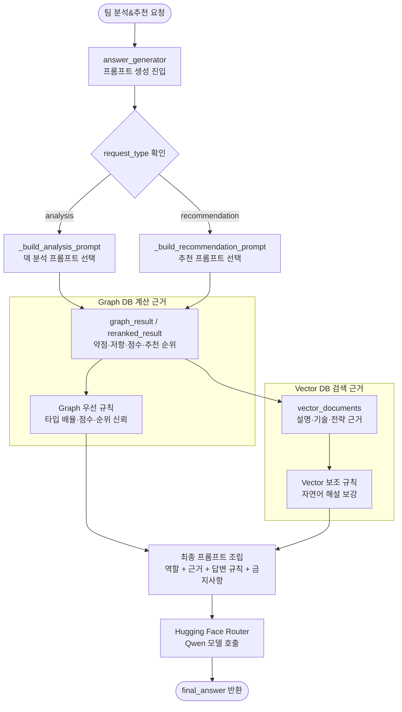

# 팀빌더 프롬프트 명세서

## 1. 문서 개요

### 1.1 목적

본 문서는 팀빌더 기능에서 Hybrid RAG 결과를 사용자에게 설명하기 위해 사용하는 LLM 프롬프트의 목적, 입력 데이터, 출력 형식, 제약 조건을 정의한다.

팀빌더는 사용자가 선택한 5마리 포켓몬을 기준으로 팀 약점과 강점을 분석하고, 6번째 포켓몬 후보를 추천한다. 이때 LLM은 새로운 계산을 수행하는 주체가 아니라, Graph DB와 Vector DB에서 얻은 근거를 사용자 친화적인 한국어 해설로 정리하는 역할을 담당한다.

### 1.2 적용 범위

| 구분 | 내용 |
|---|---|
| 대상 기능 | 팀빌더 덱 분석, 팀빌더 포켓몬 추천 |
| 주요 파일 | `backend/team_build_rag/answer_generator.py` |
| 호출 위치 | LangGraph 워크플로우의 `answer_generator` 노드 |
| 사용 모델 | Hugging Face Router 기반 Qwen 계열 모델 |
| 출력 대상 | Streamlit 팀빌더 화면의 AI 종합 해설 영역 |

## 2. 프롬프트 설계 원칙

| 원칙 | 설명 |
|---|---|
| 결론 우선 | 사용자가 긴 해설을 모두 읽지 않아도 핵심 판단을 먼저 이해할 수 있도록 첫 문단은 반드시 `결론:`으로 시작한다. |
| Graph DB 우선 | 타입 배율, 추천 순위, 점수처럼 계산 가능한 값은 Neo4j Graph DB 계산 결과와 `hybrid_score`를 우선 신뢰한다. |
| Vector DB 보조 | Vector DB 검색 근거는 포켓몬 설명, 기술 활용, 전략적 해설을 보강하는 용도로 사용한다. |
| 근거 기반 답변 | 입력 데이터에 없는 기술, 타입, 점수, 추천 이유를 확정적으로 생성하지 않는다. |
| 한국어 설명 | 사용자가 바로 이해할 수 있도록 자연스러운 한국어 문장으로 작성한다. |

## 3. 공통 입력 데이터

LLM 프롬프트는 LangGraph 상태(`HybridRagState`) 안에 저장된 Graph 결과와 Vector 검색 근거를 조합하여 구성한다.

| 입력 데이터 | 출처 | 설명 |
|---|---|---|
| `request_type` | Frontend/API | `analysis` 또는 `recommendation` 요청 타입 |
| `graph_result` | Neo4j Graph DB | 선택 포켓몬, 약점 타입, 저항 타입, 기술 커버리지, 추천 후보 계산 결과 |
| `reranked_result` | `hybrid_scorer` | 추천 후보에 `graph_score`, `vector_score`, `hybrid_score`를 반영한 정렬 결과 |
| `vector_documents` | Vector DB 검색 | 포켓몬 설명, 기술/전략 설명 등 자연어 해설 근거 |
| `answer_policy` | `scoring_policy.py` | AI 해설 시 Graph 근거와 Vector 근거를 설명에 반영하는 비중 |

## 4. 프롬프트 목록

### 4.1 덱 분석 프롬프트

| 항목 | 내용 |
|---|---|
| 프롬프트 ID | `TB-PROMPT-ANALYSIS-001` |
| 사용 함수 | `_build_analysis_prompt()` |
| 호출 시점 | 사용자가 팀 분석&추천 실행 후 덱 분석 결과를 생성할 때 |
| 목적 | 선택한 5마리 포켓몬의 약점, 방어 안정성, 기술 타입 커버리지, 6번째 포켓몬 방향을 설명한다. |
| 주요 입력 | `selected_pokemon`, `weak_types`, `resistant_types`, `move_type_coverage`, `insights`, `vector_documents` |
| 출력 형식 | 첫 문단 결론 + 세부 분석 문단 4~6개 |

#### 핵심 지시사항

- 한국어로 답변한다.
- 첫 문단은 반드시 `결론:`으로 시작한다.
- 현재 덱의 핵심 판단과 6번째 포켓몬 방향을 2~3문장으로 먼저 요약한다.
- 약점, 방어 안정성, 기술 커버리지 근거를 단순 나열이 아니라 원인 중심으로 설명한다.
- 설명 비중은 Graph DB 계산 근거 50%, Vector DB 검색 근거 50%로 둔다.
- 타입 배율과 점수는 Graph DB 결과를 우선 신뢰한다.

#### 입력 예시

```json
{
  "request_type": "analysis",
  "selected_pokemon": ["이상해꽃", "리자몽", "거북왕", "기라티나", "다크라이"],
  "weak_types": [
    {"type_name": "바위", "avg_multiplier": 1.6},
    {"type_name": "얼음", "avg_multiplier": 1.3}
  ],
  "resistant_types": [
    {"type_name": "노말", "avg_multiplier": 0.8}
  ],
  "move_type_coverage": [
    {"type_name": "노말", "count": 72},
    {"type_name": "물", "count": 25}
  ]
}
```

#### 출력 예시

```text
결론: 현재 덱은 고스트 포켓몬 중심의 공격형 팀으로, 가장 주의해야 할 약점은 바위 타입 공격입니다. 6번째 포켓몬은 바위 공격을 반감하거나 무효화할 수 있는 포켓몬을 고려하는 것이 좋습니다.

두 번째 문단부터 약점, 방어 안정성, 기술 커버리지 근거를 설명합니다...
```

### 4.2 포켓몬 추천 프롬프트

| 항목 | 내용 |
|---|---|
| 프롬프트 ID | `TB-PROMPT-RECOMMEND-001` |
| 사용 함수 | `_build_recommendation_prompt()` |
| 호출 시점 | 5마리 팀을 기준으로 6번째 포켓몬 후보를 추천할 때 |
| 목적 | 추천 후보 1~3순위의 추천 이유와 1순위 후보의 구체적인 보완 역할을 설명한다. |
| 주요 입력 | `analysis`, `recommendations`, `hybrid_policy`, `useful_moves`, `vector_documents` |
| 출력 형식 | 첫 문단 결론 + 1순위 상세 이유 + 2~3순위 비교 |

#### 핵심 지시사항

- 한국어로 답변한다.
- 첫 문단은 반드시 `결론:`으로 시작한다.
- 1순위 추천 포켓몬을 가장 먼저 말한다.
- 어떤 약점 타입을 어떤 저항/무효 관계로 보완하는지 구체적으로 설명한다.
- `useful_moves`에 있는 기술명을 활용해 주력기, 견제기, 보조 활용 상황을 설명한다.
- 추천 순위와 최종 점수는 `hybrid_score`를 우선 신뢰한다.
- 2~3순위 후보는 비교 관점으로 짧게 언급한다.

#### 입력 예시

```json
{
  "request_type": "recommendation",
  "recommendations": [
    {
      "pokemon_id": 791,
      "name": "솔가레오",
      "hybrid_score": 177.7,
      "covered_weaknesses": ["바위", "페어리", "비행"],
      "useful_moves": ["철제광선", "아이언헤드", "미래예지"]
    }
  ]
}
```

#### 출력 예시

```text
결론: 6번째 포켓몬으로는 솔가레오를 추천합니다. 솔가레오는 바위 타입 공격을 0.5배로 받아 현재 팀의 주요 약점을 줄이고, 철제광선과 아이언헤드로 페어리 타입 상대를 압박할 수 있습니다.

두 번째 문단부터 추천 이유, 기술 활용, 2~3순위 후보 비교를 설명합니다...
```

## 5. 프롬프트 생성 흐름



## 6. 품질 기준

| 평가 항목 | 기준 |
|---|---|
| 정확성 | 타입 배율, 점수, 추천 순위가 Graph DB 및 `hybrid_score` 결과와 일치해야 한다. |
| 근거성 | 추천 이유가 Graph 결과 또는 Vector 근거 문서에 기반해야 한다. |
| 구체성 | “약점을 보완한다”가 아니라 어떤 타입을 어떤 방식으로 보완하는지 설명해야 한다. |
| 가독성 | 첫 문단에 결론을 제시하고, 이후 문단에서 근거를 단계적으로 설명해야 한다. |
| 사용자 친화성 | 포켓몬 지식이 깊지 않은 사용자도 이해할 수 있는 문장으로 작성해야 한다. |

## 7. 금지사항

- Graph DB에 없는 타입 배율을 임의로 생성하지 않는다.
- 추천 순위를 LLM이 임의로 변경하지 않는다.
- `useful_moves`에 없는 기술을 확정적으로 추천하지 않는다.
- 근거가 부족한 내용을 “반드시”, “무조건”처럼 단정하지 않는다.
- 영어 중심의 답변을 생성하지 않는다.

## 8. 예외 처리 원칙

| 상황 | 처리 원칙 |
|---|---|
| HF 토큰 없음 | 명확한 오류 메시지로 토큰 설정 필요성을 알린다. |
| LLM API 실패 | 실패 원인을 숨기지 않고 백엔드 로그와 화면 오류로 확인할 수 있게 한다. |
| Vector 근거 없음 | Graph DB 계산 결과를 중심으로 답변하도록 프롬프트에 명시한다. |
| 추천 후보 없음 | 후보가 없다는 사실을 설명하고, 조건 완화가 필요함을 안내한다. |
