# 팀빌더 WBS

## 1. 문서 개요

이 문서는 포켓몬 팀빌더 기능에서 실제로 수행한 작업을 작업 분해 구조(WBS, Work Breakdown Structure)로 정리한 문서입니다.

팀빌더는 사용자가 포켓몬 5마리를 선택하면 Graph DB와 Vector DB 기반 근거를 함께 활용하여 덱 분석과 6번째 포켓몬 추천을 제공하는 기능입니다.

## 2. 작성 기준

| 항목 | 내용 |
|---|---|
| 문서 범위 | 팀빌더 기능 구현 및 문서화 작업 |
| 제외 범위 | 배틀 기능, 일반 포켓몬 도감 기능, 미니게임 등 팀빌더 외 기능 |
| 작성 기준 | 실제 생성 또는 수정된 산출물 기준 |
| 일정 기준 | Git 커밋 이력과 주요 파일 수정 이력을 기준으로 산정 |
| 상태 기준 | 완료, 검증 필요, 환경 의존 |
| 주요 산출물 | Streamlit 화면, FastAPI 라우터, Neo4j 연동, Hybrid RAG, PostgreSQL 저장, Markdown 문서 |

## 3. WBS 구조 요약

```mermaid
flowchart TD
    A["팀빌더 기능"] --> B["Graph DB 설계 및 적재"]
    A --> C["백엔드 API"]
    A --> D["팀 분석/추천 서비스"]
    A --> E["Hybrid RAG"]
    A --> F["프론트엔드 화면"]
    A --> G["결과 저장"]
    A --> H["문서화"]

    B --> B1["Neo4j 스키마"]
    B --> B2["Graph Loader"]

    C --> C1["team_builder Router"]
    C --> C2["Neo4j Client"]

    D --> D1["분석 서비스"]
    D --> D2["추천 서비스"]
    D --> D3["점수 정책"]

    E --> E1["Graph 근거"]
    E --> E2["Vector 근거"]
    E --> E3["Hybrid Score"]
    E --> E4["AI 해설"]

    F --> F1["5마리 선택 UI"]
    F --> F2["분석/추천 결과 UI"]

    G --> G1["team_build_logs"]

    H --> H1["요구사항"]
    H --> H2["시퀀스"]
    H --> H3["ERD"]
    H --> H4["아키텍처"]
    H --> H5["RAG 파이프라인"]
    H --> H6["프롬프트 명세"]
```

## 4. 일정 기반 WBS

| WBS ID | 작업 영역 | 작업명 | 시작일 | 완료일 | 주요 산출물 | 상태 |
|---|---|---|---|---|---|---|
| WBS-01 | Graph DB | 팀빌더용 Neo4j Graph DB 설계 및 적재 구조 작성 | 2026-05-07 | 2026-05-13 | `database/graph/graph_schema.md`, `database/graph/graph_loader.py`, `database/graph/constraints.cypher` | 완료 |
| WBS-02 | Backend Graph | 백엔드 Neo4j 연결 코드 및 Cypher 조회 구조 작성 | 2026-05-07 | 2026-05-13 | `backend/graph/neo4j_client.py`, `backend/graph/queries.py`, `backend/graph/README.md` | 완료 |
| WBS-03 | Backend API | 팀빌더 전용 FastAPI 라우터 및 엔드포인트 작성 | 2026-05-09 | 2026-05-14 | `backend/routers/team_builder.py`, `backend/main.py` | 완료 |
| WBS-04 | Backend Service | 팀 분석, 추천, 점수, 인사이트, RAG 실행 서비스 작성 | 2026-05-11 | 2026-05-13 | `backend/build_services/*.py`, `backend/build_services/team_services.md` | 완료 |
| WBS-05 | Hybrid RAG | LangGraph 기반 Graph + Vector Hybrid RAG 구조 작성 | 2026-05-12 | 2026-05-14 | `backend/team_build_rag/*.py`, `backend/team_build_rag/workflow_diagram.md` | 완료 |
| WBS-06 | Frontend | Streamlit 팀빌더 화면 및 포켓몬 선택 UI 작성 | 2026-05-09 | 2026-05-14 | `frontend/pages/teambuilding.py` | 완료 |
| WBS-07 | Frontend | 분석/추천 결과 UI 및 AI 해설 영역 개선 | 2026-05-12 | 2026-05-14 | `frontend/pages/teambuilding.py` | 완료 |
| WBS-08 | PostgreSQL 저장 | 팀빌더 분석/추천 결과 저장 테이블 및 CRUD 작성 | 2026-05-13 | 2026-05-14 | `backend/models.py`, `backend/schemas.py`, `backend/crud.py`, `backend/routers/team_builder.py` | 완료 |
| WBS-09 | Documentation | 요구사항, 시퀀스, ERD, 시스템 아키텍처 문서 작성 | 2026-05-13 | 2026-05-14 | `docs/팀빌딩/01_요구사항명세서.md`, `04_시퀀스다이어그램.md`, `05_ERD.md`, `06_시스템아키텍처구성도.md` | 완료 |
| WBS-10 | Documentation | RAG/데이터 파이프라인, 프롬프트 명세서, WBS 작성 | 2026-05-14 | 2026-05-14 | `docs/팀빌딩/07_RAG_데이터파이프라인설계도.md`, `08_프롬프트명세서.md`, `09_WBS.md` | 완료 |

## 5. 상세 산출물 목록

| WBS ID | 작업 영역 | 작업명 | 주요 작업 내용 | 산출물 | 상태 |
|---|---|---|---|---|---|
| TB-001 | Graph DB | 팀빌더용 Graph DB 설계 | 포켓몬, 타입, 기술, 특성, 타입 상성 중심의 그래프 구조 정의 | `database/graph/graph_schema.md` | 완료 |
| TB-002 | Graph DB | Neo4j 제약조건 정의 | 주요 노드의 식별자 기준 제약조건 및 인덱스 정의 | `database/graph/constraints.cypher` | 완료 |
| TB-003 | Graph DB | Graph Loader 구현 | JSON 가공 데이터를 Neo4j 노드/관계로 적재하는 로더 작성 | `database/graph/graph_loader.py` | 완료 |
| TB-004 | Graph DB | 팀빌더 선택 대상 정리 | 팀 선택 화면에서 일반 포켓몬 중심으로 노출되도록 `pokemon_id < 10000` 기준 적용 | `backend/routers/team_builder.py` | 완료 |
| TB-005 | Graph DB | 타입 상성 관계 활용 | `AGAINST`, `WEAK_AGAINST`, `RESISTANT_TO` 등 방어 상성 기반 분석/추천 근거 활용 | `database/graph/graph_loader.py` | 완료 |
| TB-006 | Backend Graph | Neo4j 연결 모듈 작성 | 백엔드에서 Neo4j에 접속하고 Cypher를 실행하는 클라이언트 구성 | `backend/graph/neo4j_client.py` | 완료 |
| TB-007 | Backend Graph | Cypher 쿼리 분리 | 팀 분석/추천에서 사용할 Graph DB 조회 쿼리 관리 | `backend/graph/queries.py` | 완료 |
| TB-008 | Backend Graph | Graph 연동 설명 문서 작성 | Neo4j client와 query 모듈의 목적 및 사용 흐름 문서화 | `backend/graph/README.md` | 완료 |
| TB-009 | Backend API | 팀빌더 라우터 작성 | 팀빌더 전용 API 엔드포인트 구성 | `backend/routers/team_builder.py` | 완료 |
| TB-010 | Backend API | 포켓몬 선택 옵션 API 작성 | 프론트에서 사용할 포켓몬 이름, 이미지, 타입, 특성 목록 제공 | `GET /api/v1/team-builder/pokemon-options` | 완료 |
| TB-011 | Backend API | 덱 분석 API 작성 | 선택한 5마리 포켓몬의 약점, 안정 타입, 기술 커버리지 분석 | `POST /api/v1/team-builder/analyze` | 완료 |
| TB-012 | Backend API | 추천 API 작성 | 선택한 5마리 기준 6번째 추천 후보 계산 | `POST /api/v1/team-builder/recommend` | 완료 |
| TB-013 | Backend API | RAG 분석 API 작성 | Graph 결과와 Vector 근거를 결합한 AI 덱 분석 실행 | `POST /api/v1/team-builder/rag-analyze` | 완료 |
| TB-014 | Backend API | RAG 추천 API 작성 | Graph 후보와 Vector 근거를 결합한 AI 추천 실행 | `POST /api/v1/team-builder/rag-recommend` | 완료 |
| TB-015 | Backend API | 라우터 등록 | FastAPI 애플리케이션에 팀빌더 라우터 등록 | `backend/main.py` | 완료 |
| TB-016 | Backend Service | 팀 분석 서비스 작성 | 선택 포켓몬의 방어 약점, 방어 안정성, 기술 타입 커버리지 계산 | `backend/build_services/team_analysis_service.py` | 완료 |
| TB-017 | Backend Service | 팀 추천 서비스 작성 | 약점 보완, 타입 중복, 종족값, 기술 커버리지를 고려한 추천 후보 생성 | `backend/build_services/team_builder_service.py` | 완료 |
| TB-018 | Backend Service | 팀 점수 서비스 작성 | 분석 카드와 추천 카드에 사용할 점수 및 문장 생성 정책 작성 | `backend/build_services/team_score_service.py` | 완료 |
| TB-019 | Backend Service | 팀 인사이트 서비스 작성 | 분석 결과를 UI에서 읽기 쉬운 요약 카드 형태로 변환 | `backend/build_services/team_insight_service.py` | 완료 |
| TB-020 | Backend Service | RAG 실행 서비스 작성 | LangGraph 기반 팀빌더 RAG 워크플로우 호출 래퍼 구성 | `backend/build_services/team_rag_service.py` | 완료 |
| TB-021 | Backend Service | 서비스 설명 문서 작성 | 팀 분석/추천/점수/RAG 서비스의 역할 문서화 | `backend/build_services/team_services.md` | 완료 |
| TB-022 | Hybrid RAG | RAG 상태 모델 정의 | LangGraph 노드 간 공유되는 상태 구조 정의 | `backend/team_build_rag/state.py` | 완료 |
| TB-023 | Hybrid RAG | RAG 워크플로우 구성 | supervisor, graph tool, vector search, scorer, answer generator 흐름 구성 | `backend/team_build_rag/workflow.py` | 완료 |
| TB-024 | Hybrid RAG | Graph Tool 작성 | 분석/추천 요청에 따라 Graph DB 기반 계산 결과 생성 | `backend/team_build_rag/graph_tools.py` | 완료 |
| TB-025 | Hybrid RAG | Vector Search 작성 | Graph 결과 기반 검색어로 Vector DB 문서 근거 검색 | `backend/team_build_rag/vector_search.py` | 완료 |
| TB-026 | Hybrid RAG | Vector Score 작성 | 검색 근거 문서의 관련도를 점수화하는 로직 작성 | `backend/team_build_rag/vector_scorer.py` | 완료 |
| TB-027 | Hybrid RAG | Hybrid Score 작성 | Graph Score와 Vector Score를 가중치 기반으로 결합 | `backend/team_build_rag/hybrid_scorer.py` | 완료 |
| TB-028 | Hybrid RAG | 점수 정책 분리 | 분석, 추천, AI 해설 단계별 가중치 정책 정의 | `backend/team_build_rag/scoring_policy.py` | 완료 |
| TB-029 | Hybrid RAG | 답변 생성기 작성 | 근거 기반 한국어 AI 해설 프롬프트 구성 및 Hugging Face Qwen 호출 | `backend/team_build_rag/answer_generator.py` | 완료 |
| TB-030 | Hybrid RAG | RAG 구조 문서화 | 팀빌더 RAG 모듈 목적, 구성, 실행 흐름 문서화 | `backend/team_build_rag/README.md` | 완료 |
| TB-031 | Hybrid RAG | 워크플로우 다이어그램 작성 | Graph Guided Hybrid RAG 흐름을 Mermaid 및 SVG로 시각화 | `backend/team_build_rag/workflow_diagram.md` | 완료 |
| TB-032 | Frontend | 팀빌더 화면 작성 | Streamlit 기반 팀빌더 페이지 구성 | `frontend/pages/teambuilding.py` | 완료 |
| TB-033 | Frontend | 포켓몬 검색/필터 UI 작성 | 이름, 번호, 세대/도감번호, 타입, 특성 필터 구성 | `frontend/pages/teambuilding.py` | 완료 |
| TB-034 | Frontend | 포켓몬 카드 UI 작성 | 포켓몬 이미지, 이름, 타입 배지, 선택 버튼 표시 | `frontend/pages/teambuilding.py` | 완료 |
| TB-035 | Frontend | 5마리 선택 UI 작성 | 사용자가 선택한 5마리를 별도 영역에 표시하고 선택 초기화 지원 | `frontend/pages/teambuilding.py` | 완료 |
| TB-036 | Frontend | 분석/추천 실행 UI 작성 | 5마리 선택 후 팀 분석 및 추천 결과를 실행하는 버튼 흐름 구성 | `frontend/pages/teambuilding.py` | 완료 |
| TB-037 | Frontend | 분석 결과 UI 작성 | 팀 총평, 핵심 위험, 팀 강점, 6번째 추천 방향, AI 해설 표시 | `frontend/pages/teambuilding.py` | 완료 |
| TB-038 | Frontend | 추천 결과 UI 작성 | 추천 후보 1~3순위, 점수, 타입, 추천 근거, AI 해설 표시 | `frontend/pages/teambuilding.py` | 완료 |
| TB-039 | Frontend | UI 가독성 개선 | 타입 색상, 카드 레이아웃, AI 해설 스크롤, 글자 크기 개선 | `frontend/pages/teambuilding.py` | 완료 |
| TB-040 | DB 저장 | 저장 테이블 설계 | 팀 분석/추천 결과 저장을 위한 `team_build_logs` 테이블 구조 정의 | `backend/models.py` | 완료 |
| TB-041 | DB 저장 | 저장 스키마 작성 | 분석 결과, 추천 결과, 결론, 선택 포켓몬 ID 저장 스키마 구성 | `backend/schemas.py` | 완료 |
| TB-042 | DB 저장 | CRUD 작성 | 팀빌더 결과 저장 및 사용자별 조회 함수 작성 | `backend/crud.py` | 완료 |
| TB-043 | DB 저장 | 추천 결과 저장 연동 | 추천 결과 생성 시 선택 포켓몬, 분석 결과, 추천 결과를 PostgreSQL에 저장 | `backend/routers/team_builder.py` | 완료 |
| TB-044 | DB 저장 | 저장 이력 조회 API 작성 | 사용자별 팀빌더 저장 이력 조회 API 구성 | `backend/routers/team_builder.py` | 완료 |
| TB-045 | Documentation | 요구사항 명세서 작성 | 팀빌더 기능 요구사항, 일반 요구사항, 상세 요구사항 정리 | `docs/팀빌딩/01_요구사항명세서.md` | 완료 |
| TB-046 | Documentation | 시퀀스 다이어그램 작성 | 포켓몬 선택, 분석/추천 실행, 저장 흐름을 Mermaid로 정리 | `docs/팀빌딩/04_시퀀스다이어그램.md` | 완료 |
| TB-047 | Documentation | ERD 작성 | 팀빌더 저장 테이블과 사용자/결과 데이터 관계 정리 | `docs/팀빌딩/05_ERD.md` | 완료 |
| TB-048 | Documentation | 시스템 아키텍처 구성도 작성 | 프론트, 백엔드, Neo4j, PostgreSQL, RAG 구성 요소 정리 | `docs/팀빌딩/06_시스템아키텍처구성도.md` | 완료 |
| TB-049 | Documentation | RAG/데이터 파이프라인 설계도 작성 | Graph DB 적재, Vector DB 준비, Hybrid RAG 실행 흐름 정리 | `docs/팀빌딩/07_RAG_데이터파이프라인설계도.md` | 완료 |
| TB-050 | Documentation | 프롬프트 명세서 작성 | 분석/추천 프롬프트 구성, 입력 근거, 답변 규칙 정리 | `docs/팀빌딩/08_프롬프트명세서.md` | 완료 |
| TB-051 | Documentation | WBS 작성 | 팀빌더에서 실제 수행한 작업만 작업 분해 구조로 정리 | `docs/팀빌딩/09_WBS.md` | 완료 |

## 6. 주요 마일스톤

| 마일스톤 | 완료 기준 | 시작일 | 완료일 | 관련 WBS |
|---|---|---|---|---|
| M1. Graph DB 기반 마련 | Neo4j에 팀빌더 분석/추천에 필요한 노드와 관계를 적재할 수 있다. | 2026-05-07 | 2026-05-13 | WBS-01 ~ WBS-02 |
| M2. 백엔드 API 연결 | Swagger에서 팀빌더 API를 호출할 수 있다. | 2026-05-09 | 2026-05-14 | WBS-03 |
| M3. 분석/추천 서비스 구현 | 5마리 기준 분석 결과와 추천 후보를 계산할 수 있다. | 2026-05-11 | 2026-05-13 | WBS-04 |
| M4. Hybrid RAG 구현 | Graph 근거와 Vector 근거를 결합하여 AI 해설을 생성할 수 있다. | 2026-05-12 | 2026-05-14 | WBS-05 |
| M5. 팀빌더 화면 구현 | 사용자가 화면에서 포켓몬을 선택하고 분석/추천 결과를 확인할 수 있다. | 2026-05-09 | 2026-05-14 | WBS-06 ~ WBS-07 |
| M6. 결과 저장 구현 | 추천 완료 시 PostgreSQL에 팀빌더 결과가 저장된다. | 2026-05-13 | 2026-05-14 | WBS-08 |
| M7. 산출 문서 작성 | 팀빌더 기준 요구사항, 시퀀스, ERD, 아키텍처, RAG, 프롬프트, WBS 문서가 존재한다. | 2026-05-13 | 2026-05-14 | WBS-09 ~ WBS-10 |

## 7. 역할별 산출물

| 구분 | 산출물 | 설명 |
|---|---|---|
| Frontend | `frontend/pages/teambuilding.py` | 사용자가 포켓몬을 선택하고 분석/추천 결과를 확인하는 화면 |
| Backend API | `backend/routers/team_builder.py` | 팀빌더 전용 API 엔드포인트 |
| Backend Service | `backend/build_services/*.py` | 분석, 추천, 점수, 인사이트, RAG 실행 서비스 |
| Graph DB | `database/graph/*.py`, `*.cypher`, `*.md` | Neo4j 스키마, 제약조건, 적재 로더 |
| Hybrid RAG | `backend/team_build_rag/*.py` | LangGraph 기반 Graph + Vector 결합 RAG |
| PostgreSQL 저장 | `backend/models.py`, `backend/schemas.py`, `backend/crud.py` | 팀빌더 결과 저장 테이블, 스키마, CRUD |
| Documentation | `docs/팀빌딩/*.md` | 팀빌더 기능 산출 문서 |

## 8. 검증 및 주의사항

| 항목 | 내용 |
|---|---|
| Docker 환경 | 백엔드, 프론트엔드, PostgreSQL, Neo4j 컨테이너가 정상 실행되어야 합니다. |
| Neo4j 데이터 | Graph DB 적재가 완료되어야 분석/추천 API가 정상 동작합니다. |
| Vector DB 데이터 | Vector 검색 품질은 `pokemon_knowledge`, `flavor_text`, `moves`, `abilities` 등 저장 데이터 품질에 영향을 받습니다. |
| LLM 호출 | Hugging Face Router 사용 시 계정 권한 또는 크레딧 상태에 따라 402 오류가 발생할 수 있습니다. |
| 저장 기능 | 추천 결과 저장은 PostgreSQL의 `team_build_logs` 테이블을 기준으로 확인합니다. |

## 9. 현재 WBS 기준 결론

팀빌더 기능은 화면, API, Graph DB, Hybrid RAG, 결과 저장, 문서화까지 주요 구현 흐름이 구성된 상태입니다.

다만 실제 실행 안정성은 Docker 환경, Neo4j 적재 상태, Vector DB 데이터 존재 여부, Hugging Face 호출 권한에 영향을 받으므로 배포 또는 시연 전에는 환경 검증이 필요합니다.
