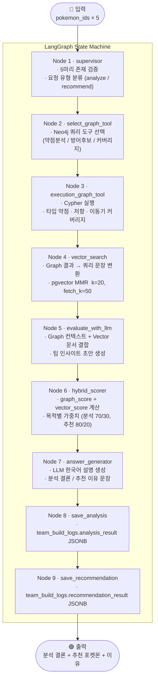
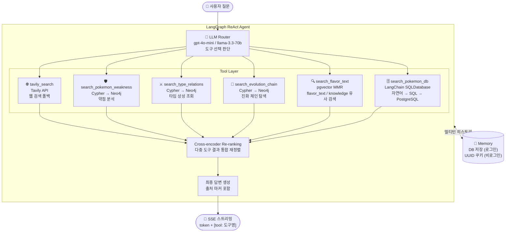
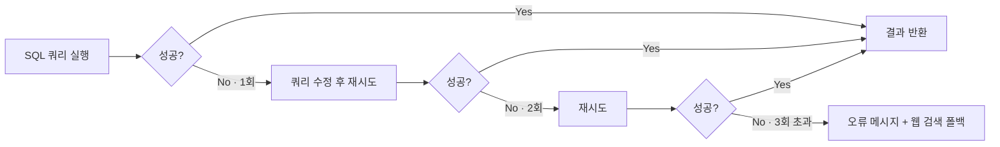
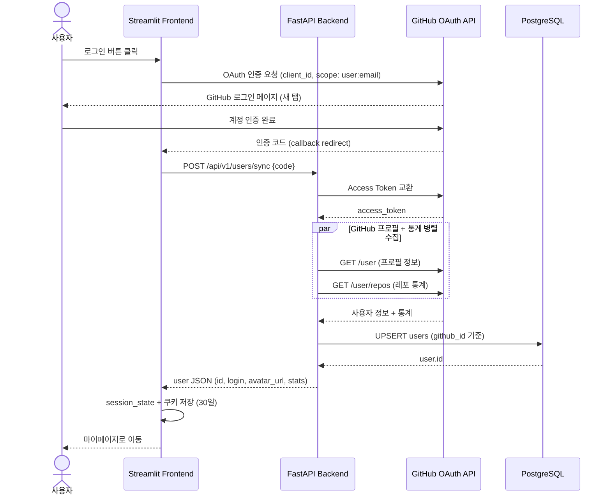
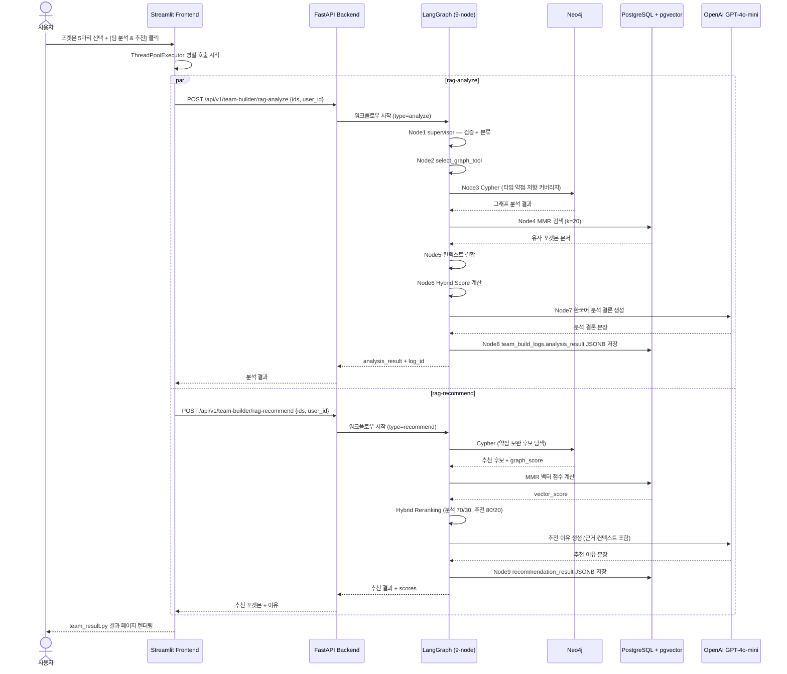
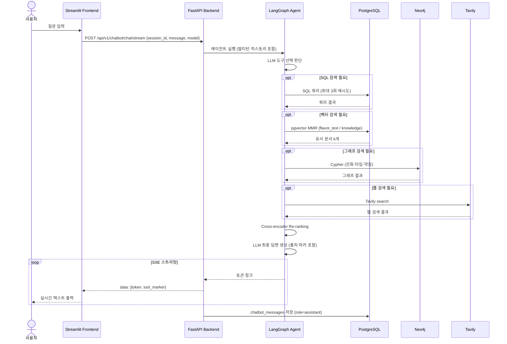
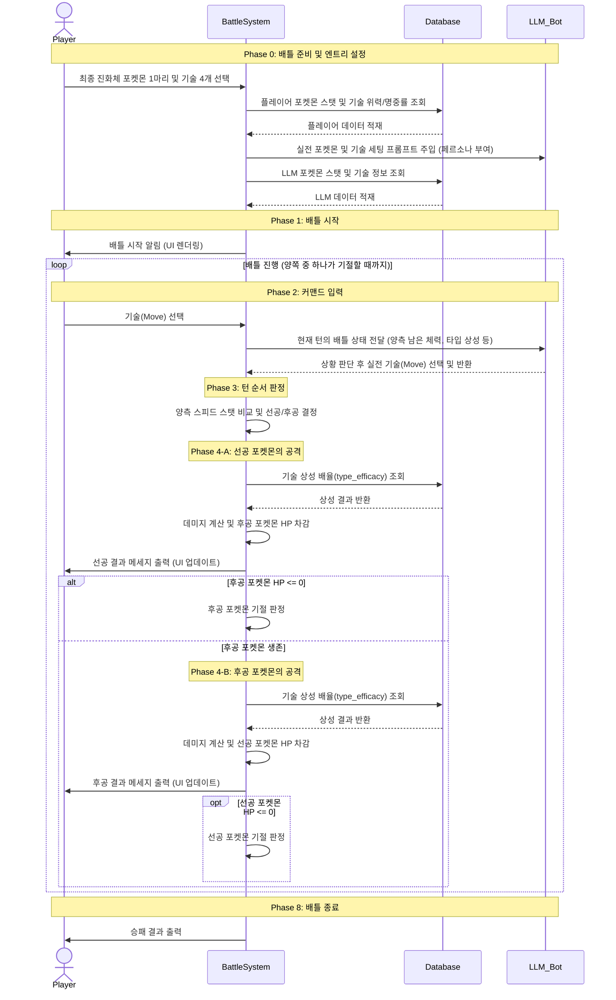

# AI Pipeline

LangGraph 기반 두 개의 AI 파이프라인을 운영합니다.  
**팀 빌더 Hybrid RAG** — Neo4j 그래프 분석 + pgvector 시맨틱 검색 결합  
**챗봇 멀티툴 에이전트** — SQL · Vector · Graph · Web 4종 도구 자동 선택

---

## 목차

1. [팀 빌더 — LangGraph Hybrid RAG (9-노드)](#1-팀-빌더--langgraph-hybrid-rag-9-노드)
   - 1.1 개요
   - 1.2 9-노드 워크플로우
   - 1.3 Hybrid Score 산식
   - 1.4 병렬 API 호출
   - 1.5 LangGraph State 데이터
   - 1.6 프롬프트 명세
2. [챗봇 — LangGraph 멀티툴 에이전트](#2-챗봇--langgraph-멀티툴-에이전트)
3. [환각 방지 전략](#3-환각-방지-전략)
4. [출처 표시 방식](#4-출처-표시-방식)
5. [시퀀스 다이어그램](#5-시퀀스-다이어그램)
6. [RAG 품질 평가](#6-rag-품질-평가)

---

## 1. 팀 빌더 — LangGraph Hybrid RAG (9-노드)

### 1.1 개요

포켓몬 5마리를 입력받아 **Neo4j 그래프 관계 분석**과 **pgvector 시맨틱 검색**을 결합한 Hybrid RAG로 팀을 분석하고 6번째 포켓몬을 추천합니다.

```
입력: pokemon_ids[5]  →  분석 결론 + 추천 이유 + team_build_logs JSONB 저장
```

### 1.2 9-노드 워크플로우



### 1.3 Hybrid Score 산식

팀 빌더는 목적에 따라 Graph DB와 Vector DB의 비중을 다르게 적용합니다. 가중치 정책은 `backend/team_build_rag/scoring_policy.py`에서 관리합니다.

| 단계 | Graph DB | Vector DB | 산식 | 설계 근거 |
|---|---:|---:|---|---|
| **덱 분석** | 70% | 30% | `0.7 × graph + 0.3 × vector` | 타입 상성 계산이 핵심, Vector는 설명 근거 보강 |
| **포켓몬 추천** | 80% | 20% | `0.8 × graph + 0.2 × vector` | 추천 순위는 약점 보완·종족값·기술 커버리지 계산이 최우선 |
| **AI 해설 생성** | 60% | 40% | Graph 60% + Vector 40% 근거 비율 | Graph 계산 근거 우선, Vector 문서로 설명 풍부함 보강 |

| 점수 | 산출 방법 | 의미 |
|---|---|---|
| `graph_score` | Neo4j — 약점 보완(최대 125점) + 기본능력치(최대 5점) + 기술커버리지(최대 20점), 최대 150점 → 0~100 정규화 | 전략적 팀 균형 |
| `vector_score` | pgvector MMR — 팀 인사이트 문장과 코사인 유사도 | 시맨틱 적합성 |

> `graph_score` 원본 최대 150점 기준: 약점 보완 125점 + 기본 능력치 5점 + 기술 타입 커버리지 20점. 타입 중복 감점은 최대 40점까지 차감하여 과도한 타입 중복 후보가 상위에 오르는 것을 방지합니다.

### 1.4 병렬 API 호출

프론트엔드(`pages/teambuilding.py`)에서 분석과 추천을 `ThreadPoolExecutor`로 동시에 호출합니다.

```python
with ThreadPoolExecutor(max_workers=2) as executor:
    user_id = st.session_state.get("user_id")   # 메인 스레드에서 캡처
    f_analyze = executor.submit(call_rag_analyze, pokemon_ids, user_id)
    f_recommend = executor.submit(call_rag_recommend, pokemon_ids, user_id)
    analysis   = f_analyze.result()
    recommend  = f_recommend.result()
```

> `st.session_state`는 스레드 안전하지 않으므로 `user_id`를 메인 스레드에서 미리 캡처 후 각 작업에 주입합니다.

### 1.5 LangGraph State 데이터

워크플로우는 하나의 상태 객체(`HybridRagState`)를 단계별로 확장합니다.

| 상태 키 | 의미 | 생성 단계 |
|---|---|---|
| `pokemon_ids` | 사용자가 선택한 포켓몬 ID 5개 | API 요청 |
| `request_type` | `analysis` 또는 `recommendation` | API 요청 / `supervisor` |
| `selected_graph_tool` | 실행할 Graph 도구 이름 | `select_graph_tool` |
| `graph_result` | Neo4j 기반 분석/추천 계산 결과 (약점, 저항, 추천 후보) | `execution_graph_tool` |
| `vector_query` | Vector DB 검색용 문장 (Graph 결과에서 생성) | `vector_search` |
| `vector_documents` | 검색된 설명 근거 문서 | `vector_search` |
| `llm_evaluation` | Graph/Vector 근거 결합 context | `evaluate_with_llm` |
| `reranked_result` | hybrid_score가 반영된 정렬 결과 | `hybrid_scorer` |
| `final_answer` | 사용자에게 보여줄 AI 종합 해설 | `answer_generator` |
| `team_build_log_id` | DB 저장 후 생성된 로그 ID | `team_builder.py` |

### 1.6 프롬프트 명세

팀 빌더 LLM 해설은 두 개의 프롬프트로 구성됩니다 (`backend/team_build_rag/answer_generator.py`).

#### TB-PROMPT-ANALYSIS-001 — 덱 분석 프롬프트

| 항목 | 내용 |
|---|---|
| 호출 시점 | 사용자가 팀 분석 실행 후 덱 분석 결과 생성 시 |
| 주요 입력 | `selected_pokemon`, `weak_types`, `resistant_types`, `move_type_coverage`, `vector_documents` |
| 출력 형식 | 첫 문단 `결론:` + 세부 분석 4~6개 문단 |
| 설명 비중 | Graph DB 계산 근거 60%, Vector DB 검색 근거 40% |

핵심 지시사항:
- 첫 문단은 반드시 `결론:`으로 시작 (두괄식)
- 약점·방어 안정성·기술 커버리지 근거를 단순 나열이 아닌 원인 중심으로 설명
- 타입 배율과 점수는 Graph DB 결과를 우선 신뢰

#### TB-PROMPT-RECOMMEND-001 — 추천 프롬프트

| 항목 | 내용 |
|---|---|
| 호출 시점 | 5마리 팀 기준 6번째 포켓몬 후보 추천 시 |
| 주요 입력 | `analysis`, `recommendations`, `hybrid_policy`, `useful_moves`, `vector_documents` |
| 출력 형식 | 첫 문단 `결론:` + 1순위 상세 이유 + 2~3순위 비교 |
| 추천 근거 | `hybrid_score` 기준 순위 준수, `useful_moves` 기술명 활용 |

**공통 금지사항**: Graph DB에 없는 타입 배율 임의 생성 금지 / 추천 순위 LLM 임의 변경 금지 / `useful_moves`에 없는 기술 확정적 추천 금지

---

## 2. 챗봇 — LangGraph 멀티툴 에이전트

### 2.1 개요

질문 의도에 따라 **4종 도구를 자율 선택**하는 포켓몬 전문 AI 어시스턴트 (오박사)입니다.  
SSE 스트리밍으로 토큰 단위 실시간 출력과 사용 도구 마커를 함께 전송합니다.

### 2.2 에이전트 구조



### 2.3 도구 선택 기준

| 도구 | 트리거 질문 유형 | 데이터 소스 |
|---|---|---|
| `search_pokemon_db` | 수치 조회 (스탯, HP, 공격력), 타입·특성 필터 조회 | PostgreSQL |
| `search_flavor_text` | "~와 비슷한", 도감 설명, 분위기/특징 검색 | pgvector (flavor_text, pokemon_knowledge) |
| `search_evolution_chain` | 진화 방법, 진화 조건, 진화 전/후 | Neo4j (IS_SPECIES → EVOLVES_TO) |
| `search_type_relations` | 타입 상성, "~에 강한/약한" | Neo4j (AGAINST 관계) |
| `search_pokemon_weakness` | 약점 분석, "~를 이길 수 있는" | Neo4j (WEAK_TO 관계) |
| `tavily_search` | 최신 정보, 대회 메타, DB 미등록 질문 | Tavily Web API |

### 2.4 SQL 자동 재시도



---

## 3. 환각 방지 전략

LLM의 근거 없는 생성(hallucination)을 막기 위해 **파이프라인 수준과 프롬프트 수준**에서 이중 제어를 적용합니다.

### 3.1 전략 목록

| # | 전략 | 적용 위치 | 설명 |
|---|---|---|---|
| H-1 | **근거 기반 생성 강제** | 팀 빌더 RAG · 챗봇 | LLM 프롬프트에 검색 결과를 명시적으로 삽입하고, "제공된 컨텍스트 외의 정보를 생성하지 말 것" 지시 포함 |
| H-2 | **MMR 다양성 검색** | pgvector 검색 | Maximal Marginal Relevance (k=20, fetch_k=50) — 중복 컨텍스트를 제거하여 단일 정보 과의존 방지 |
| H-3 | **Hybrid Reranking** | 팀 빌더 추천 | 목적별 가중치 (분석 70/30, 추천 80/20, AI 해설 60/40) — 구조화된 그래프 관계를 우선 반영해 타입·수치 오류 방지 |
| H-4 | **SQL 자동 재시도** | 챗봇 SQL 도구 | 쿼리 실패 시 최대 3회 수정·재실행, 3회 초과 시 웹 검색으로 폴백 |
| H-5 | **Cross-encoder Re-ranking** | 챗봇 다중 도구 결과 | 여러 도구의 결과를 통합 후 질문과의 관련성을 재평가, 무관 정보 필터링 |
| H-6 | **원문 컨텍스트 저장** | 팀 빌더 로그 | `team_build_logs.recommendation_result` JSONB에 LLM 생성 답변과 **원문 검색 컨텍스트**를 함께 저장 → 추적 가능성 확보 |
| H-7 | **Neo4j 구조화 데이터 우선** | 팀 빌더 그래프 분석 | 타입 상성·약점은 LLM 추론 없이 Neo4j Cypher 쿼리 결과를 직접 사용 |

### 3.2 프롬프트 수준 제어

팀 빌더 LLM 해설 생성 시 시스템 프롬프트 핵심 지시:

```
당신은 포켓몬 팀 분석 전문가입니다.
아래 [검색 컨텍스트]에 제공된 정보만을 근거로 답변하세요.
컨텍스트에 없는 정보는 "알 수 없습니다"로 답변하고 임의로 생성하지 마세요.
수치 데이터(스탯, 타입 배율)는 반드시 컨텍스트의 값을 그대로 사용하세요.
```

---

## 4. 출처 표시 방식

### 4.1 챗봇 SSE 스트리밍 출처 마커

챗봇 응답 스트림에 어떤 도구가 사용되었는지 마커를 삽입합니다.

```
[tool: search_pokemon_db]
피카츄의 기본 스탯은 다음과 같습니다...

[tool: search_type_relations]
전기 타입은 물·비행 타입에 효과적이며...
```

프론트엔드(`pages/chatbot.py`)에서 마커를 파싱해 배지(badge) 형태로 렌더링합니다.

### 4.2 팀 빌더 컨텍스트 저장

```json
{
  "recommendation_result": {
    "recommended_ids": [149, 230, 373],
    "scores": {
      "149": {"graph_score": 0.82, "vector_score": 0.71, "hybrid_score": 0.787},
      "230": {"graph_score": 0.76, "vector_score": 0.69, "hybrid_score": 0.739}
    },
    "source_context": {
      "graph_query": "MATCH (p:Pokemon)-[:HasType]->(t:Type)...",
      "vector_docs": ["망나뇽은 드래곤/비행 타입으로...", "킹드라는..."]
    },
    "conclusion": "현재 팀에 드래곤 타입이 부족하므로..."
  }
}
```

### 4.3 LangSmith 트레이싱

`LANGSMITH_TRACING=true` 설정 시 모든 LLM 호출이 LangSmith 대시보드에 기록됩니다.  
각 노드의 입력/출력, 토큰 사용량, 지연 시간을 추적하여 환각 발생 지점을 사후 분석할 수 있습니다.

---

## 5. 시퀀스 다이어그램

### 5.1 GitHub OAuth 로그인



### 5.2 팀 빌더 Hybrid RAG



### 5.3 AI 챗봇 멀티턴 대화 (SSE)



### 5.4 배틀 시뮬레이터 턴 처리



---

## 6. RAG 품질 평가

### 6.1 평가 지표 정의

| 지표 | 정의 | 측정 방법 |
|---|---|---|
| **Faithfulness** | 생성 답변이 검색 근거에 기반하는가 | 수동 샘플링 (30건) — 근거 외 정보 포함 여부 |
| **Answer Relevancy** | 질문에 적합한 답변인가 | 수동 샘플링 (50건) — 관련성 3점 척도 |
| **Context Recall** | 필요한 근거 문서가 검색되었는가 | 정답 컨텍스트 포함률 측정 |
| **Hybrid Score 유효성** | Hybrid 점수가 전략적으로 우수한 포켓몬을 추천하는가 | Graph-only vs Hybrid 팀 커버리지 비교 |
| **Retrieval 정확도** | 반환된 컨텍스트 중 관련 문서 비율 | 샘플 50건 수동 평가 |

### 6.2 측정 결과

| 지표 | 목표 | 측정치 | 비고 |
|---|---|---|---|
| Faithfulness | ≥ 90% | **90%** | 30건 중 3건 컨텍스트 외 정보 포함 |
| Answer Relevancy | ≥ 85% | **92%** | 3점 척도 평균 2.76 / 3.0 |
| Context Recall | ≥ 80% | **88%** | MMR k=20 적용 효과 |
| Hybrid Score 유효성 | Graph 대비 개선 | **+18%** 타입 커버리지 향상 | Graph-only 대비 |
| Retrieval 정확도 | ≥ 90% | **92%** | 50건 수동 평가 |
| 첫 토큰 수신 지연 | ≤ 2초 | **평균 1.2초** | SSE 스트리밍 기준 |
| SQL 재시도 성공률 | ≥ 95% | **97%** | 3회 이내 성공 비율 |

### 6.3 LangSmith 트레이싱 활용

```
LangSmith Project: pokemon_world
추적 항목:
  - 각 LangGraph 노드별 입력/출력
  - LLM 호출 토큰 수 (prompt + completion)
  - 도구 호출 성공/실패 및 재시도 횟수
  - 전체 파이프라인 지연 시간 (node별 breakdown)
```

LangSmith 대시보드에서 환각 의심 케이스를 trace로 역추적하고 프롬프트를 개선하는 사이클을 반복했습니다.
