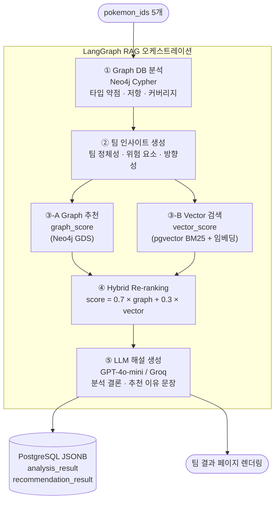
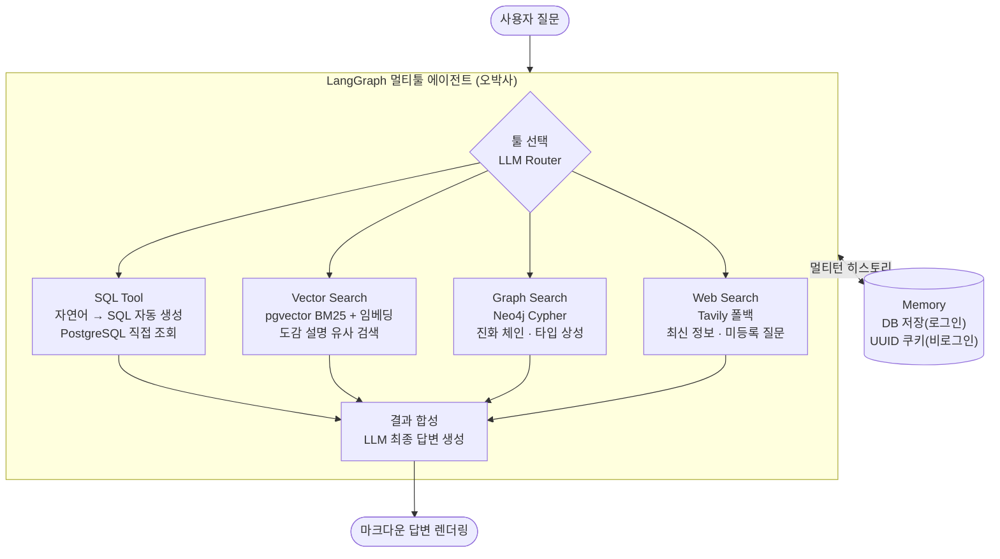
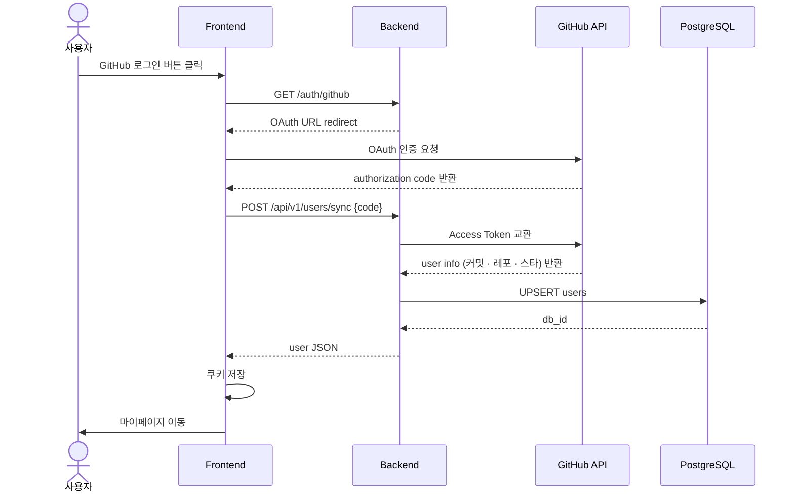
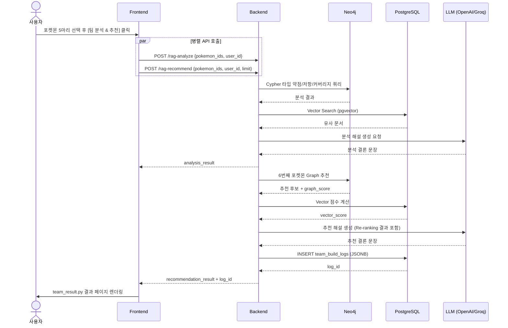
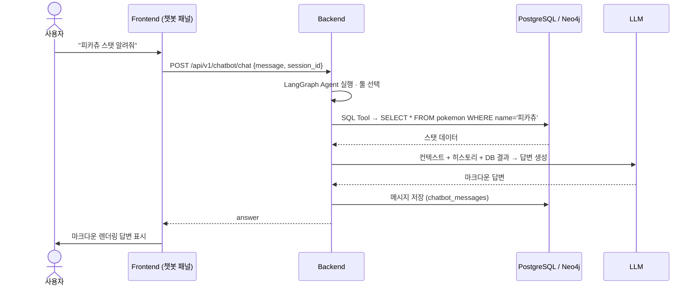

# AI Pipeline

---

## 팀 빌더 — LangGraph Hybrid RAG

포켓몬 5마리를 입력받아 Neo4j 그래프 분석과 pgvector 벡터 검색을 결합한 하이브리드 RAG로 팀을 분석하고 6번째 포켓몬을 추천합니다.

### 파이프라인 흐름



### Re-ranking 수식

```
hybrid_score = 0.7 × graph_score + 0.3 × vector_score
```

- **graph_score**: Neo4j GDS로 팀의 타입 약점을 보완하는 포켓몬에 높은 점수 부여
- **vector_score**: pgvector BM25 + 문장 임베딩으로 팀 인사이트 문장과 유사한 포켓몬 탐색

### 병렬 처리

프론트엔드에서 분석(`/rag-analyze`)과 추천(`/rag-recommend`)을 `ThreadPoolExecutor`로 동시에 호출합니다.  
`user_id`는 메인 스레드에서 캡처 후 각 페이로드에 주입합니다 (Streamlit session_state 스레드 안전성 이슈 방지).

---

## 챗봇 — LangGraph 멀티툴 에이전트

질문 의도에 따라 4가지 툴을 자동 선택해 포켓몬 전문 답변을 생성합니다.



### 툴 선택 기준

| 툴 | 적합한 질문 유형 |
|---|---|
| SQL Tool | 스탯 수치, 타입, 특성 등 구조화된 데이터 조회 |
| Vector Search | "~와 비슷한 포켓몬", 도감 설명 기반 검색 |
| Graph Search | 진화 방법, 타입 상성, 관계 탐색 |
| Web Search | 최신 게임 정보, 대회 메타, DB에 없는 질문 |

---

## 시퀀스 다이어그램

### GitHub OAuth 로그인



### 팀 빌더 RAG 분석/추천



### 챗봇 멀티턴 대화


