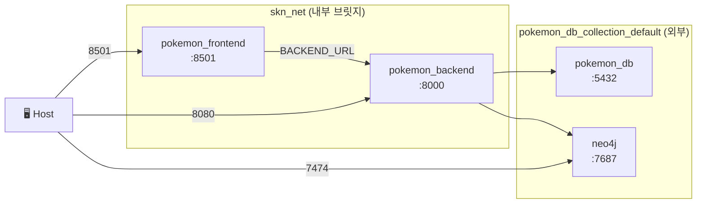

# Architecture

## 서비스 구성

| 서비스 | 내부 호스트 | 노출 포트 | 설명 |
|---|---|---|---|
| `pokemon_frontend` | `frontend:8501` | 8501 | Streamlit 앱 |
| `pokemon_backend` | `backend:8000` | 8080 | FastAPI 앱 |
| `pokemon_db` | `pokemon_db:5432` | — | PostgreSQL (외부 컨테이너) |
| `neo4j` | `neo4j:7687` | 7474 / 7687 | Neo4j 그래프 DB |

### Docker 네트워크



- `skn_net`: 프론트엔드 ↔ 백엔드 내부 통신 전용
- `pokemon_db_collection_default`: 백엔드 ↔ DB 통신 (외부 네트워크에 attach)
- 프론트엔드는 `BACKEND_URL` 환경변수로 백엔드 주소를 주입받습니다

---

## 프로젝트 파일 구조

```
SKN27-3rd-3TEAM/
├── backend/
│   ├── main.py                        # FastAPI 진입점 · CORS · 스키마 마이그레이션
│   ├── models.py                      # SQLAlchemy ORM 모델
│   ├── schemas.py                     # Pydantic 요청/응답 스키마
│   ├── crud.py                        # DB CRUD 함수
│   ├── database.py                    # SQLAlchemy 엔진 · 세션
│   ├── routers/
│   │   ├── pokemon.py                 # 포켓덱스 API
│   │   ├── users.py                   # 유저 · 게임 로그 · 배틀팀 API
│   │   ├── chatbot.py                 # 챗봇 세션 · 메시지 API
│   │   ├── chat.py                    # AI 랩 배틀 (동기 · 스트리밍)
│   │   └── team_builder.py            # 팀 분석 · 추천 · 히스토리 API
│   ├── build_services/
│   │   ├── team_analysis_service.py   # Neo4j 타입 약점/저항/커버리지 분석
│   │   ├── team_builder_service.py    # Graph DB 추천 후보 산출
│   │   ├── team_insight_service.py    # 팀 인사이트 요약 생성
│   │   ├── team_rag_service.py        # LangGraph RAG 오케스트레이션
│   │   └── team_score_service.py      # 하이브리드 점수 · Re-ranking
│   ├── chatbot/
│   │   ├── agent.py                   # LangGraph 멀티툴 에이전트
│   │   ├── tools.py                   # SQL · Vector · Graph · Web 툴 정의
│   │   └── pokemon_neo4j.py           # Neo4j 챗봇용 쿼리 함수
│   └── graph/
│       └── neo4j_client.py            # Neo4j 드라이버 클라이언트
│
├── frontend/
│   ├── app.py                         # 메인 랜딩 · 네비게이션 허브
│   ├── pages/
│   │   ├── login.py                   # GitHub OAuth 로그인/로그아웃
│   │   ├── mypage.py                  # 프로필 · 배지 · 히스토리
│   │   ├── pokedex.py                 # 포켓몬 목록 · 필터
│   │   ├── pokemon_detail.py          # 포켓몬 상세
│   │   ├── chatbot.py                 # AI 챗봇 (2패널)
│   │   ├── teambuilding.py            # 팀 구성 · 분석 트리거
│   │   ├── team_result.py             # 팀 분석/추천 결과
│   │   ├── battle.py                  # 1v1 배틀 시뮬레이터
│   │   ├── battle2.py                 # AI 랩 배틀 (스트리밍)
│   │   ├── mini_game.py               # 미니게임 허브
│   │   ├── game_1.py                  # 실루엣 퀴즈
│   │   └── game_2.py                  # 메모리 카드 게임
│   ├── teambuilding/
│   │   ├── constants.py               # 타입/지방 상수
│   │   ├── api.py                     # 백엔드 API 호출 함수
│   │   ├── filters.py                 # 필터 UI 컴포넌트
│   │   ├── components.py              # 팀 선택 · 분석 결과 컴포넌트
│   │   ├── styles.py                  # 팀 빌더 CSS
│   │   └── result_styles.py           # 결과 페이지 CSS
│   ├── mypage/
│   │   └── styles.py                  # 마이페이지 CSS
│   └── utils/
│       └── ui.py                      # 공통 헤더 · CSS 주입 · 세션 헬퍼
│
├── database/
│   ├── postgre/utils/schema.sql       # PostgreSQL 초기화 스키마
│   └── graph/neo4j/                   # Neo4j 데이터 로더 스크립트
│
├── docker-compose.yml
└── .env.sample
```
