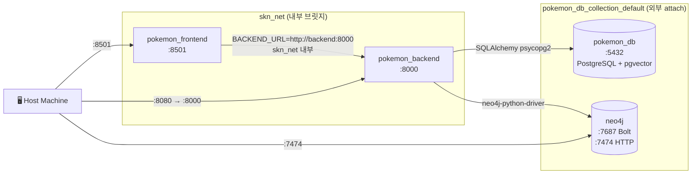
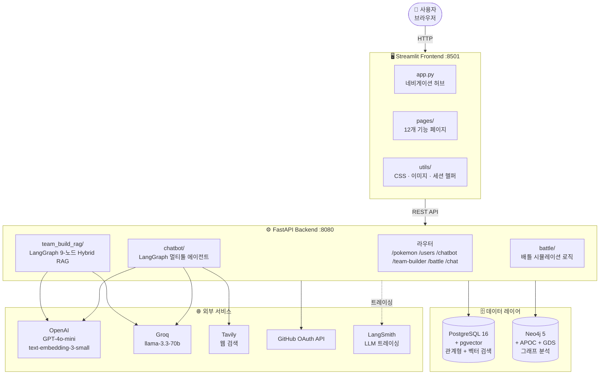

# Architecture

서비스 구성 · Docker 네트워크 · 프로젝트 파일 구조

---

## 목차

1. [서비스 구성](#1-서비스-구성)
2. [Docker 네트워크](#2-docker-네트워크)
3. [전체 시스템 흐름](#3-전체-시스템-흐름)
4. [프로젝트 파일 구조](#4-프로젝트-파일-구조)
5. [주요 모듈 설명](#5-주요-모듈-설명)

---

## 1. 서비스 구성

| 서비스 | 이미지 | 내부 호스트 | 노출 포트 | 역할 |
|---|---|---|---|---|
| `pokemon_frontend` | Python 3.11 (Streamlit) | `frontend:8501` | **8501** | UI 서버 |
| `pokemon_backend` | Python 3.11 (FastAPI) | `backend:8000` | **8080** | API 서버 |
| `pokemon_db` | `pgvector/pgvector:pg16` | `pokemon_db:5432` | 외부 컨테이너 | 관계형 + 벡터 DB |
| `neo4j` | `neo4j:5` + APOC + GDS | `neo4j:7687` | **7474** / **7687** | 그래프 DB |

---

## 2. Docker 네트워크



- **`skn_net`**: 프론트엔드 ↔ 백엔드 전용 내부 네트워크. 외부에서 직접 접근 불가
- **`pokemon_db_collection_default`**: 기존 운용 중인 PostgreSQL·Neo4j 컨테이너와 공유하는 외부 네트워크
- 프론트엔드는 `BACKEND_URL` 환경변수(docker-compose 주입)로 백엔드 주소를 받아 사용

---

## 3. 전체 시스템 흐름



---

## 4. 프로젝트 파일 구조

```
SKN27-3rd-3TEAM/
│
├── backend/
│   ├── main.py                        # FastAPI 진입점 · CORS · 스키마 마이그레이션
│   ├── models.py                      # SQLAlchemy ORM 모델
│   ├── schemas.py                     # Pydantic 요청/응답 스키마
│   ├── crud.py                        # DB CRUD 함수
│   ├── database.py                    # SQLAlchemy 엔진 · 세션 팩토리
│   │
│   ├── routers/
│   │   ├── pokemon.py                 # 포켓덱스 API (목록·상세·특성)
│   │   ├── users.py                   # 유저·게임로그·배틀팀 API
│   │   ├── chatbot.py                 # 챗봇 세션·메시지 API
│   │   ├── chat.py                    # AI 랩 배틀 (동기·SSE 스트리밍)
│   │   └── team_builder.py            # 팀 분석·추천·히스토리 API
│   │
│   ├── team_build_rag/                # LangGraph 9-노드 Hybrid RAG
│   │   ├── workflow.py                # StateGraph 정의 · 노드 연결
│   │   ├── nodes.py                   # 9개 노드 함수
│   │   └── state.py                   # LangGraph State 스키마
│   │
│   ├── chatbot/                       # LangGraph 멀티툴 에이전트
│   │   ├── agent.py                   # ReAct 에이전트 정의
│   │   ├── tools.py                   # SQL·Vector·Graph·Web 툴
│   │   └── pokemon_neo4j.py           # Neo4j 챗봇용 Cypher 함수
│   │
│   ├── build_services/                # 팀 빌더 서비스 레이어
│   │   ├── team_analysis_service.py   # 타입 약점·저항·커버리지 분석
│   │   ├── team_builder_service.py    # Graph DB 추천 후보 산출
│   │   ├── team_insight_service.py    # 팀 인사이트 요약 생성
│   │   ├── team_rag_service.py        # LangGraph RAG 오케스트레이션
│   │   └── team_score_service.py      # Hybrid 점수 · Re-ranking
│   │
│   ├── battle/                        # 배틀 시뮬레이션
│   │   ├── battle_service.py          # 배틀 로직 (데미지·상태이상·KO)
│   │   └── gym_leaders.py             # 체육관 리더 9인 정의
│   │
│   └── graph/
│       └── neo4j_client.py            # Neo4j 드라이버 클라이언트
│
├── frontend/
│   ├── app.py                         # 메인 랜딩 · 네비게이션 허브
│   │
│   ├── pages/                         # Streamlit 멀티페이지
│   │   ├── login.py                   # GitHub OAuth 로그인/로그아웃
│   │   ├── mypage.py                  # 프로필·배지·히스토리
│   │   ├── pokedex.py                 # 포켓몬 목록·필터
│   │   ├── pokemon_detail.py          # 포켓몬 상세
│   │   ├── chatbot.py                 # AI 챗봇 (2패널 SSE)
│   │   ├── teambuilding.py            # 팀 구성·분석 트리거
│   │   ├── team_result.py             # 팀 분석/추천 결과
│   │   ├── battle.py                  # 1v1 배틀 시뮬레이터
│   │   ├── battle2.py                 # AI 랩 배틀 (스트리밍)
│   │   ├── mini_game.py               # 미니게임 허브
│   │   ├── game_1.py                  # 실루엣 퀴즈
│   │   └── game_2.py                  # 메모리 카드 게임
│   │
│   ├── teambuilding/                  # 팀 빌더 모듈
│   │   ├── constants.py               # 타입·지방 상수
│   │   ├── api.py                     # 백엔드 API 호출 함수
│   │   ├── filters.py                 # 필터 UI 컴포넌트
│   │   ├── components.py              # 팀 선택·결과 컴포넌트
│   │   ├── styles.py                  # 팀 빌더 CSS
│   │   └── result_styles.py           # 결과 페이지 CSS
│   │
│   ├── landing/                       # 메인 랜딩 슬라이드
│   │   ├── sections.py                # 풀스크린 섹션 렌더러
│   │   └── styles.py                  # 랜딩 CSS (scroll-snap)
│   │
│   ├── mypage/                        # 마이페이지 모듈
│   │   └── styles.py
│   │
│   └── utils/
│       ├── ui.py                      # 공통 헤더·CSS·세션 헬퍼
│       └── images.py                  # Base64 이미지 번들링
│
├── database/
│   ├── common/                        # 데이터 수집·전처리
│   │   ├── fetch_pokemon.py
│   │   ├── fetch_species.py
│   │   └── processing/                # 정규화·클렌징 파이프라인
│   ├── postgre/
│   │   ├── utils/schema.sql           # PostgreSQL 초기화 DDL
│   │   ├── main_pipeline.py           # PostgreSQL 적재 실행
│   │   └── vectorize.py               # pgvector 임베딩 생성
│   └── graph/
│       └── neo4j/
│           └── db_loader.py           # Neo4j 노드·관계 적재
│
├── pokemon_pipigo/                    # Chrome 확장 프로그램
│   ├── manifest.json                  # Manifest v3 설정
│   ├── background.js                  # 서비스 워커 (Groq API 호출)
│   └── content.js                     # 콘텐츠 스크립트 (DOM 오버레이)
│
├── docker-compose.yml
└── .env.sample
```

---

## 5. 주요 모듈 설명

### Backend 핵심 모듈

| 모듈 | 역할 | 핵심 기술 |
|---|---|---|
| `team_build_rag/workflow.py` | LangGraph 9-노드 State Machine 정의 | LangGraph StateGraph |
| `chatbot/agent.py` | 멀티툴 ReAct 에이전트 | LangGraph · LangChain Tools |
| `chatbot/tools.py` | SQL·Vector·Graph·Web 도구 구현 | SQLDatabase · pgvector · Neo4j · Tavily |
| `build_services/team_score_service.py` | Hybrid Score 계산 (0.7×graph+0.3×vector) | NumPy |
| `graph/neo4j_client.py` | Neo4j 드라이버 세션 관리 | neo4j-python-driver |

### Frontend 핵심 모듈

| 모듈 | 역할 | 핵심 기술 |
|---|---|---|
| `pages/chatbot.py` | SSE 스트리밍 수신 + 도구 마커 파싱 렌더링 | requests (stream=True) |
| `pages/teambuilding.py` | 병렬 RAG API 호출 | ThreadPoolExecutor |
| `pages/pokedex.py` | 무한 스크롤 + 타입 SVG 필터 | IntersectionObserver (JS inject) |
| `utils/ui.py` | Streamlit session_state 기반 인증 상태 관리 | streamlit-cookies-controller |
| `landing/sections.py` | 풀스크린 슬라이드 랜딩 | scroll-snap CSS + JS |
