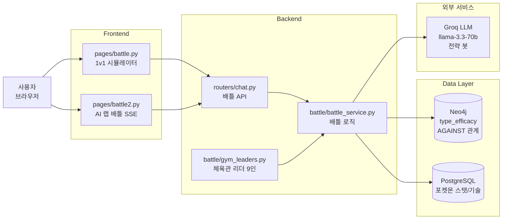
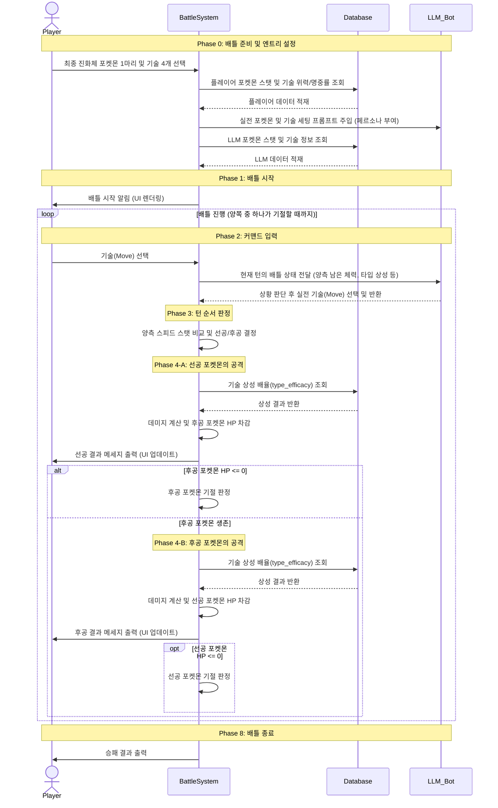
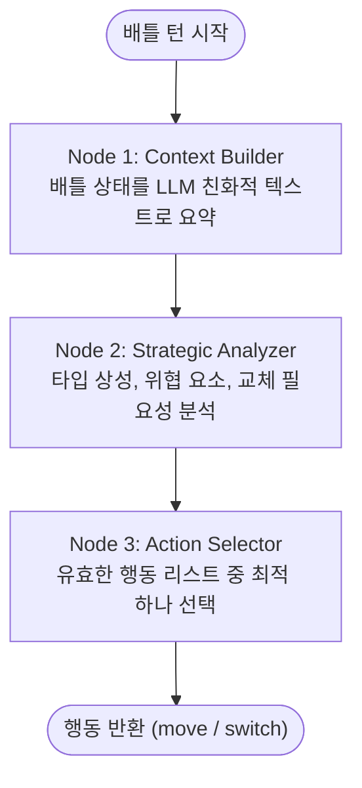
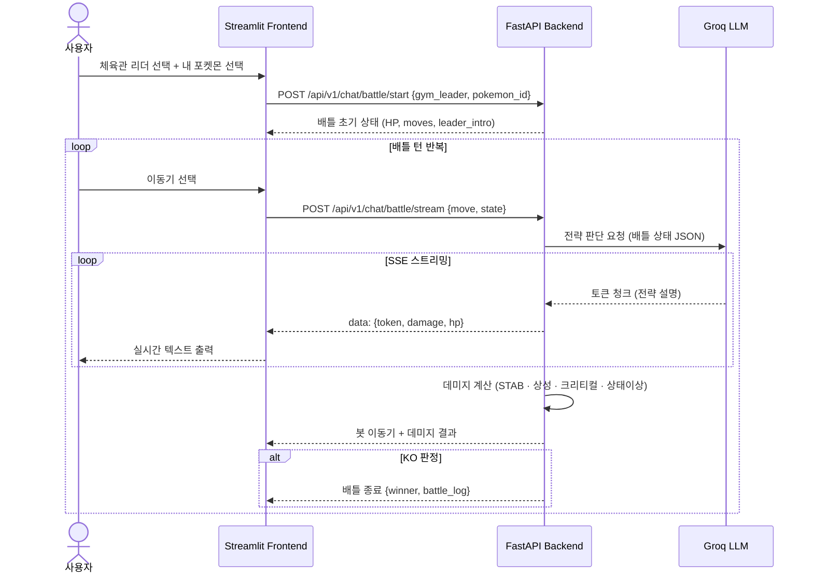

# 배틀 시스템 (Battle System)

포켓몬 1v1 턴제 배틀 시뮬레이터 — Groq LLM 기반 전략 봇과 체육관 리더 9인

---

## 목차

1. [개요](#1-개요)
2. [시스템 아키텍처](#2-시스템-아키텍처)
3. [시퀀스 다이어그램](#3-시퀀스-다이어그램)
4. [배틀 로직](#4-배틀-로직)
5. [LLM 배틀 봇](#5-llm-배틀-봇)
6. [AI 랩 배틀 (battle2.py)](#6-ai-랩-배틀-battle2py)
7. [체육관 리더](#7-체육관-리더)

---

## 1. 개요

배틀 시스템은 두 가지 배틀 모드를 제공합니다.

| 모드 | 화면 | 설명 |
|---|---|---|
| 1v1 배틀 시뮬레이터 | `pages/battle.py` | 포켓몬 1마리 선택 → 체육관 리더 9인과 1:1 배틀 |
| AI 랩 배틀 | `pages/battle2.py` | SSE 스트리밍으로 Groq LLM 봇의 전략 실시간 출력 |

| 항목 | 내용 |
|---|---|
| 배틀 엔진 | `backend/battle/battle_service.py` |
| 체육관 리더 정의 | `backend/battle/gym_leaders.py` |
| LLM 전략 봇 | Groq `llama-3.3-70b` |
| 타입 상성 데이터 | Neo4j `AGAINST` 관계 |
| 데미지 계산 | STAB · 타입 상성 · 크리티컬 · 상태이상 |

---

## 2. 시스템 아키텍처



---

## 3. 시퀀스 다이어그램

### 3-1. 전체 배틀 흐름 (Phase 0~8)



---

## 4. 배틀 로직

### 4-1. 데미지 계산 공식

```
damage = (attack_power × type_effectiveness × STAB × critical × random_factor) × (attack_stat / defense_stat) × 수식상수
```

| 요소 | 설명 |
|---|---|
| `type_effectiveness` | Neo4j `AGAINST` 관계에서 조회 (0.25 / 0.5 / 1 / 2 / 4배) |
| `STAB` | 자속 일치 보정 (Same Type Attack Bonus) — 1.5배 |
| `critical` | 급소 — 확률적으로 1.5배 |
| `random_factor` | 85~100% 범위 무작위 |

### 4-2. 타입 상성 조회 (Neo4j)

```cypher
MATCH (:Type {name: $attacker_type})-[r:AGAINST]->(:Type {name: $defender_type})
RETURN r.multiplier AS effectiveness
```

### 4-3. 상태이상 처리

배틀 턴마다 상태이상 조건을 처리합니다.

| 상태 | 효과 |
|---|---|
| 독 (Poison) | 매 턴 최대 HP의 1/8 감소 |
| 마비 (Paralysis) | 스피드 50% 감소, 25% 확률로 행동 불능 |
| 수면 (Sleep) | 1~3턴 행동 불능 |
| 화상 (Burn) | 매 턴 최대 HP의 1/16 감소, 물리 공격 50% 감소 |
| 얼음 (Freeze) | 20% 확률로 해동 전까지 행동 불능 |

---

## 5. LLM 배틀 봇

### 5-1. 현재 구현

현재 배틀 봇은 기본 상황 판단 + Groq LLM 전략 모드를 지원합니다.

- **기본 모드**: 15% 확률로 교체, 나머지는 4개 기술 중 무작위 선택
- **LLM 전략 모드**: 배틀 상태 JSON을 Groq에 전달하고 최적 기술 선택을 반환받음

```python
# Groq에 전달하는 배틀 상태 JSON 예시
{
    "my_pokemon": {"name": "리자몽", "hp": 0.6, "types": ["fire", "flying"]},
    "opponent": {"name": "가디안", "hp": 0.8, "types": ["fairy"]},
    "available_moves": ["불꽃방사", "에어슬래시", "드래곤클로", "아이언테일"],
    "turn": 3
}
```

### 5-2. LangGraph 고도화 계획 ⚠️ 미구현

> 아래는 프로젝트 기간 내 미구현된 향후 개선 로드맵입니다. 현재 봇은 기본 모드(랜덤 선택)와 Groq LLM 호출 모드만 동작합니다.

기존 랜덤 봇을 LangGraph 기반 지능형 전략 봇으로 고도화하는 계획입니다.



| 노드 | 역할 |
|---|---|
| Context Builder | `BattlePokemon` 객체 및 배틀 데이터를 JSON/Markdown으로 요약 |
| Strategic Analyzer | 타입 상성, HP 위협, 교체 필요성을 분석하는 추론 노드 |
| Action Selector | 분석된 내용을 바탕으로 최적 행동을 결정 |

**개발 로드맵**

| 단계 | 내용 |
|---|---|
| 1단계 | `frontend/battle/llm.py` 내 LangChain/LangGraph 설정, 배틀 상황 요약 프롬프트 설계 |
| 2단계 | 배틀 전용 `State` 정의, LLM 답변을 `dict` 형식으로 파싱하는 파서 구현 |
| 3단계 | `trainer_bot.py`와 LangGraph 워크플로우 연결, 실제 배틀 테스트 |
| 4단계 | 관장마다 서로 다른 전략(페르소나) 부여, RAG 기반 상성·도감 정보 활용 고도화 |

---

## 6. AI 랩 배틀 (battle2.py)

AI 랩 배틀은 SSE(Server-Sent Events) 스트리밍으로 Groq LLM 봇의 전략 판단 과정을 실시간으로 출력합니다.



---

## 7. 체육관 리더

관동지방 9인의 체육관 리더가 각자의 전략으로 대전합니다 (`backend/battle/gym_leaders.py`).

| # | 리더 | 전문 타입 | 대표 포켓몬 |
|---|---|---|---|
| 1 | 브록 | 바위 | 롱스톤 |
| 2 | 미스티 | 물 | 스타유 |
| 3 | 마티스 | 전기 | 라이츄 |
| 4 | 에리카 | 풀 | 나시 |
| 5 | 분홍이 | 독 | 독파리 |
| 6 | 블레인 | 불꽃 | 마그마 |
| 7 | 가이오스 | 물 | 왕수 |
| 8 | 사카키 | 땅 | 갸라도스 |
| 9 | (라이벌) | 혼합 | 리자몽 |

각 리더는 고유한 팀 구성과 전략 패턴을 가지며, LLM 전략 모드에서는 리더별 페르소나가 프롬프트에 주입됩니다.
