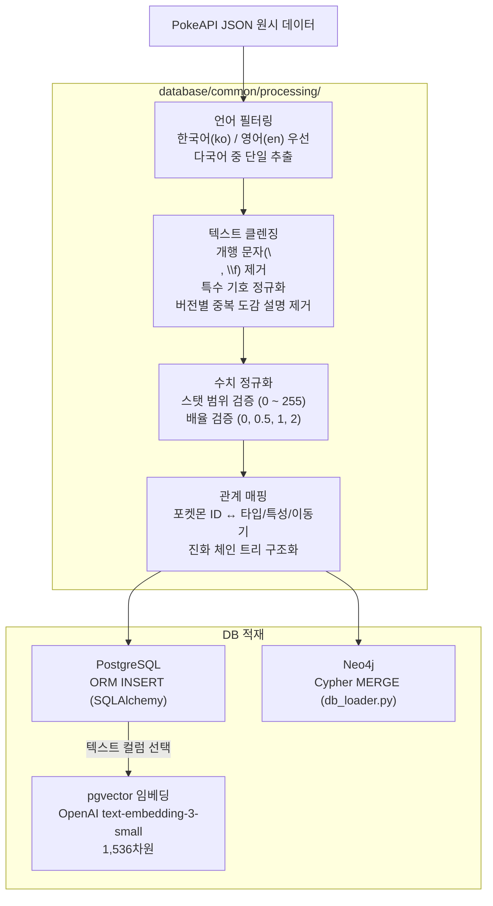
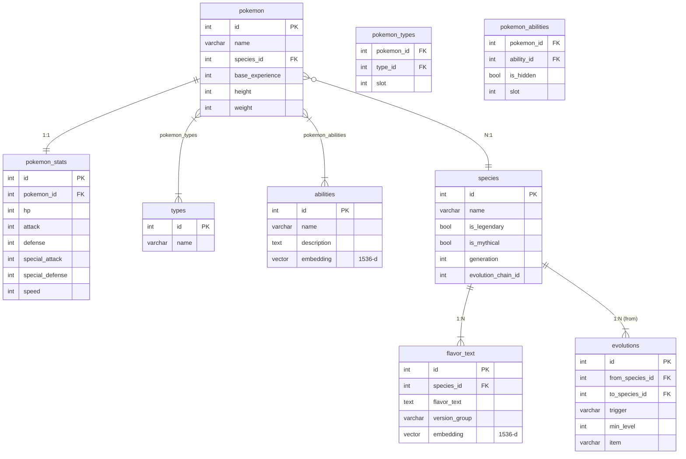
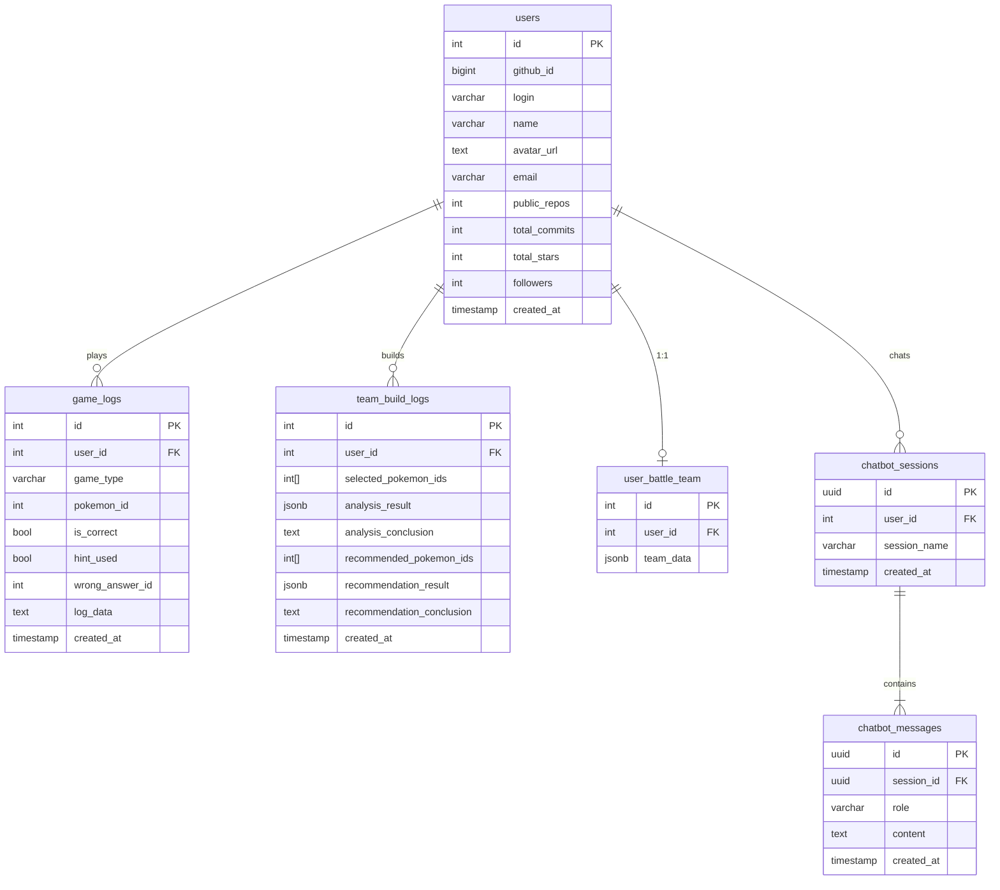
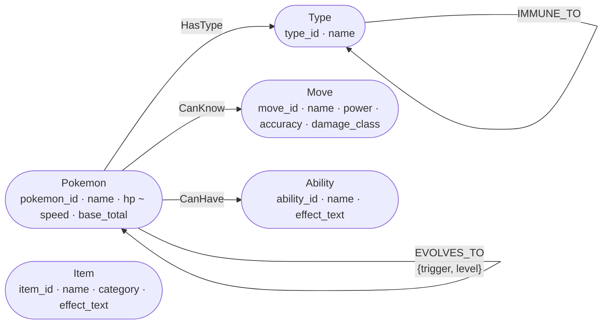

# Database

PostgreSQL(관계형 + 벡터 검색)과 Neo4j(그래프 분석)를 역할에 따라 병행 운용합니다.

---

## 목차

1. [데이터 수집](#1-데이터-수집)
2. [데이터 전처리 파이프라인](#2-데이터-전처리-파이프라인)
3. [PostgreSQL 스키마](#3-postgresql-스키마)
4. [VectorDB 구축 및 청킹 기준](#4-vectordb-구축-및-청킹-기준)
5. [Neo4j 그래프 스키마](#5-neo4j-그래프-스키마)
6. [DB 역할 분담 요약](#6-db-역할-분담-요약)

---

## 1. 데이터 수집

### 1.1 수집 소스

| 소스 | 엔드포인트 | 수집 내용 | 건수 |
|---|---|---|---|
| **PokeAPI** | `/api/v2/pokemon/{id}` | 포켓몬 기본 정보, 스탯, 타입, 특성, 이동기 목록 | 1,025종 |
| **PokeAPI** | `/api/v2/pokemon-species/{id}` | 도감 설명(flavor_text), 진화 체인 ID, 전설/희귀 여부 | 1,025종 |
| **PokeAPI** | `/api/v2/ability/{id}` | 특성 이름, 효과 설명, 발동 조건 | ~900개 |
| **PokeAPI** | `/api/v2/move/{id}` | 이동기 이름, 타입, 위력, 명중률, 효과 | ~800개 |
| **PokeAPI** | `/api/v2/type/{id}` | 18×18 타입 상성 배율 테이블 | 18종 |
| **PokeAPI** | `/api/v2/evolution-chain/{id}` | 진화 체인 트리 (조건, 분기 포함) | ~540체인 |

### 1.2 수집 스크립트 위치

```
database/
├── common/
│   ├── fetch_pokemon.py          # 포켓몬 기본 데이터 수집
│   ├── fetch_species.py          # 도감 설명 + 진화 체인 수집
│   ├── fetch_abilities.py        # 특성 데이터 수집
│   └── processing/               # 전처리 파이프라인
├── postgre/
│   ├── utils/schema.sql          # 테이블 DDL
│   ├── main_pipeline.py          # PostgreSQL 적재 실행
│   └── vectorize.py              # 임베딩 생성 + pgvector 저장
└── graph/
    └── neo4j/
        └── db_loader.py          # Neo4j 노드/관계 적재
```

---

## 2. 데이터 전처리 파이프라인

### 2.1 처리 흐름



### 2.2 주요 전처리 규칙

| 항목 | 원시 데이터 문제 | 처리 방법 |
|---|---|---|
| 도감 설명 다국어 | 한국어·영어·일본어 혼재 | `language.name == 'ko'` 우선, 없으면 `'en'` |
| 버전별 중복 설명 | 동일 문장이 여러 게임 버전에 등장 | 동일 텍스트 중복 제거 후 대표 1건 유지 |
| 개행 특수문자 | `\n`, `\f`, `\r` 포함 | `re.sub(r'[\n\f\r]+', ' ', text)` |
| 숫자 수치 범위 | 간헐적 이상값 존재 | 범위 벗어난 경우 기본값으로 대체 |
| 진화 조건 다양성 | level_up, use_item, trade, etc. | 조건 유형 분류 후 JSON 구조화 |
| 특성 효과 텍스트 | `flavor_text_entries`에서 `ko` + `scarlet-violet` 버전 추출 | 빈 문자열 항목 존재 — 해당 특성 effect_text는 빈값으로 저장 |
| 이동기 한국어 이름 | PokeAPI moves API에서 번역 미제공 | 영어 이름 그대로 사용 |
| 이동기 meta 필드 | raw에 있으나 전처리에서 누락 (기술 ID 827+ 이후는 raw에도 없음) | pp, priority, stat_changes, meta 미적재 — 향후 고도화 필요 |

---

## 3. PostgreSQL 스키마

### 3.1 포켓몬 도메인 ERD



### 3.2 사용자 도메인 ERD



### 3.3 주요 컬럼 상세

**`team_build_logs`**

| 컬럼 | 타입 | 설명 |
|---|---|---|
| `selected_pokemon_ids` | `int[]` | 선택한 포켓몬 5마리 ID 배열 |
| `analysis_result` | `jsonb` | LangGraph 분석 전체 JSON (타입 약점/저항/커버리지 + 원문 컨텍스트) |
| `analysis_conclusion` | `text` | LLM 한국어 분석 결론 문장 |
| `recommended_pokemon_ids` | `int[]` | 추천 포켓몬 1~3순위 ID 배열 |
| `recommendation_result` | `jsonb` | Hybrid 점수 + 원문 컨텍스트 + 이유 전체 JSON |
| `recommendation_conclusion` | `text` | LLM 한국어 추천 이유 문장 |

**`chatbot_sessions`**

- 로그인 유저: `user_id` FK로 PostgreSQL 저장
- 비로그인: UUID 쿠키(30일 유효)로 클라이언트 식별, `user_id = NULL`

---

## 4. VectorDB 구축 및 청킹 기준

### 4.1 임베딩 모델

| 항목 | 설정값 |
|---|---|
| 모델 | OpenAI `text-embedding-3-small` |
| 차원 | 1,536 |
| pgvector 인덱스 | `ivfflat` (lists=100, probes=10) |
| 거리 함수 | 코사인 유사도 |

### 4.2 청킹 단위

| 컬럼 | 청킹 단위 | 평균 토큰 수 | 임베딩 방식 |
|---|---|---|---|
| `flavor_text.flavor_text` | 버전별 도감 설명 **1건 = 1 chunk** | 30~80 토큰 | 레코드 단위 |
| `pokemon_knowledge.content` | 포켓몬 종합 지식 **1항목 = 1 chunk** | 150~300 토큰 | 레코드 단위 |
| `abilities.description` | 특성 설명 **1개 = 1 chunk** | 50~100 토큰 | 레코드 단위 |

### 4.3 청킹 전략 선택 근거

> **왜 슬라이딩 윈도우를 사용하지 않았는가?**

포켓몬·특성 데이터는 **개체 단위로 독립적인 의미 경계**를 가집니다.  
"피카츄는 전기 타입입니다" 라는 도감 설명을 임의로 분할하면 맥락이 깨집니다.  
각 레코드가 하나의 완결된 사실 단위이므로, **레코드 = 청크** 방식이 검색 품질 최적화에 적합합니다.

```
❌ 슬라이딩 윈도우 방식 (chunk_size=512, overlap=50)
   → 한 포켓몬 설명이 여러 chunk로 분리됨
   → 검색 시 동일 포켓몬의 부분 정보만 반환

✅ 레코드 단위 청킹
   → 각 포켓몬/특성/설명이 1개의 완결된 chunk
   → MMR 검색 시 의미있는 완전한 정보 반환
```

### 4.4 검색 파라미터

```python
# pgvector MMR 검색 설정
retriever = vectorstore.as_retriever(
    search_type="mmr",
    search_kwargs={
        "k": 20,           # 최종 반환 문서 수
        "fetch_k": 50,     # MMR 후보 풀 크기
        "lambda_mult": 0.7 # 관련성(1.0) ↔ 다양성(0.0) 균형
    }
)
```

MMR `lambda_mult=0.7`은 관련성과 다양성의 균형점입니다.  
동일 포켓몬의 여러 버전 도감 설명이 중복 반환되는 것을 방지합니다.

---

## 5. Neo4j 그래프 스키마

### 5.1 노드 정의 (실제 적재 프로퍼티)

| 노드 레이블 | 실제 프로퍼티 | 설명 |
|---|---|---|
| `Type` | `type_id`, `name` | 18종 타입 (불꽃·물·풀 ...) |
| `Pokemon` | `pokemon_id`, `name`, `height`, `weight`, `base_exp`, `image_url`, `cry_url`, `is_default`, `hp`, `attack`, `defense`, `sp_attack`, `sp_defense`, `speed`, `base_total` | 포켓몬 개체 (폼 포함) |
| `Move` | `move_id`, `name`, `type_id`, `power`, `accuracy`, `damage_class`, `effect_text` | 이동기 (pp·priority·meta는 raw에 있으나 미적재) |
| `Ability` | `ability_id`, `name`, `effect_text` | 특성 |
| `Item` | `item_id`, `name`, `category`, `effect_text` | 아이템 |

### 5.2 관계 정의

| 관계 | 방향 | 프로퍼티 | 설명 |
|---|---|---|---|
| `HasType` | Pokemon → Type | — | 포켓몬 타입 (1~2개) |
| `CanKnow` | Pokemon → Move | — | 이동기 습득 가능 여부 |
| `CanHave` | Pokemon → Ability | — | 특성 보유 여부 |
| `Efficacy` | Type → Type | `multiplier` (0, 0.25, 0.5, 1, 2, 4) | 타입 공격 배율 |
| `AGAINST` | Type → Type | `multiplier` | 타입 공격 배율 (AGAINST 관계명으로 사용되기도 함) |
| `RESISTANT_TO` | Type → Type | — | 저항 (×0.5) |
| `IMMUNE_TO` | Type → Type | — | 무효 (×0) |
| `EVOLVES_TO` | Pokemon → Pokemon | `trigger`, `level`, `item` | 진화 체인 |

### 5.3 그래프 스키마 다이어그램



### 5.4 raw 데이터 전처리 이슈

실제 수집·전처리 과정에서 확인된 데이터 누락 및 처리 현황:

| 데이터 | 원인 | 처리 현황 |
|---|---|---|
| Ability `effect_text` | `flavor_text_entries` 중 `language.name == 'ko'` + `version_group: scarlet-violet` 조건으로 추출 | 완료 |
| Ability 한국어 이름 | `names` 목록에서 `language.name == 'ko'` 필터링 | 완료 |
| Move `flavor_text` | PokeAPI moves 응답에 미포함 | **누락** |
| Move 한국어 이름 | 번역 미제공 | **미번역** |
| Move `priority` | raw 데이터에 있으나 전처리 과정에서 누락 | **미적재** |
| Move `pp` | raw 데이터에 있으나 전처리 과정에서 누락 | **미적재** |
| Move `stat_changes` | raw 데이터에 있으나 전처리 과정에서 누락 | **미적재** |
| Move `meta` (상태이상·급소율 등) | raw에 있으나 미처리, 기술 ID 827+ 이상은 raw에도 누락 | **미적재** |
| Item `flavor_text` | `language.name == 'ko'` + `version_group: scarlet-violet`으로 추출 | 완료 |
| Item 한국어 이름 | `names` 목록에서 `language.name == 'ko'` 필터링 | 완료 |

> Move의 meta 정보 (카테고리: damage/ailment/heal/damage-ailment 등, flinch_chance, drain, healing, max_hits, max_turns, stat_chance)는 향후 고도화 시 추가 적재가 필요합니다.

### 5.5 팀 빌더 핵심 Cypher 쿼리

**팀 전체 타입 약점 집계**

```cypher
MATCH (p:Pokemon)-[:HasType]->(t:Type)-[:Efficacy {multiplier: 2}]->(weak:Type)
WHERE p.pokemon_id IN $pokemon_ids
RETURN weak.name AS weakness, count(*) AS exposed_count
ORDER BY exposed_count DESC
```

**팀 커버리지 분석 (팀이 공격 가능한 타입)**

```cypher
MATCH (p:Pokemon)-[:CanKnow]->(m:Move)-[:HasType]->(mt:Type)
WHERE p.pokemon_id IN $pokemon_ids
WITH mt, count(DISTINCT p) AS coverage
RETURN mt.name AS type, coverage
ORDER BY coverage DESC
```

**약점 보완 후보 추천**

```cypher
MATCH (candidate:Pokemon)-[:HasType]->(ct:Type)
WHERE NOT candidate.pokemon_id IN $pokemon_ids
  AND ct.name IN $weak_types
WITH candidate, count(ct) AS weakness_coverage
RETURN candidate.pokemon_id, candidate.name, weakness_coverage
ORDER BY weakness_coverage DESC
LIMIT 10
```

---

## 6. DB 역할 분담 요약

| 기능 | PostgreSQL + pgvector | Neo4j |
|---|---|---|
| 포켓몬 기본 데이터 | ✅ 저장 + CRUD | — |
| 도감 설명 벡터 검색 | ✅ pgvector MMR | — |
| 타입 상성 배율 | — | ✅ AGAINST 관계 |
| 진화 체인 탐색 | — | ✅ EVOLVES_TO 관계 |
| 팀 약점/커버리지 분석 | — | ✅ Cypher 집계 |
| 추천 후보 graph_score | — | ✅ GDS 알고리즘 |
| 사용자/세션/로그 | ✅ 전담 | — |
| 팀 빌더 JSONB 저장 | ✅ JSONB 컬럼 | — |
