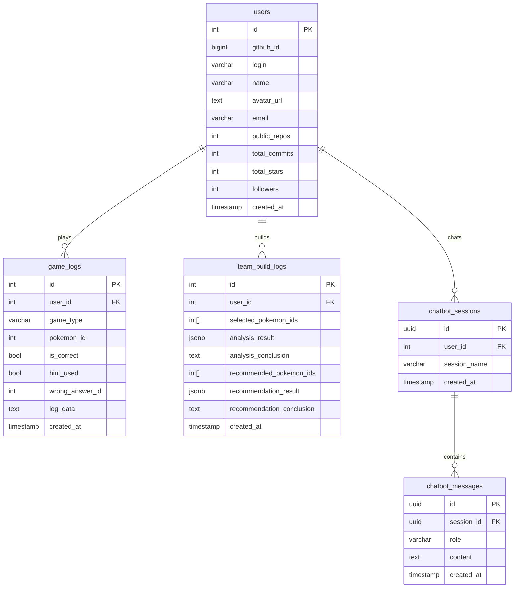
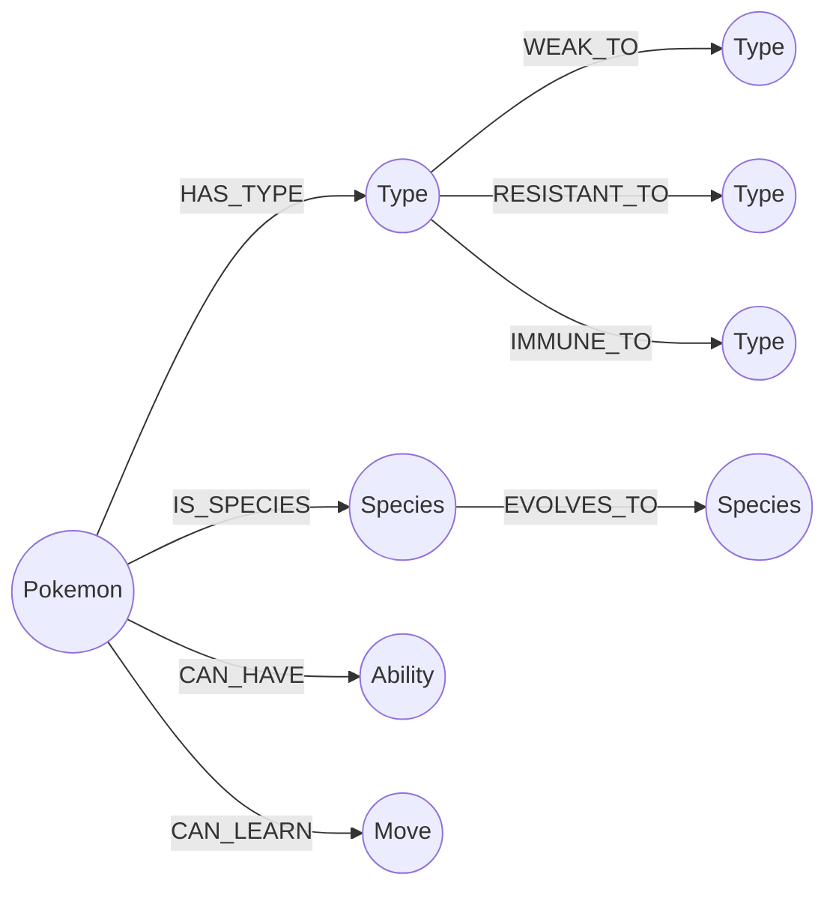

# Database

PostgreSQL(관계형 + 벡터 검색)과 Neo4j(그래프)를 병행 운용합니다.

---

## PostgreSQL ERD



### 주요 컬럼 설명

**`team_build_logs`**
| 컬럼 | 타입 | 설명 |
|---|---|---|
| `selected_pokemon_ids` | `int[]` | 선택한 포켓몬 5마리 ID 배열 |
| `analysis_result` | `jsonb` | LangGraph 분석 전체 JSON (타입 약점/저항/커버리지) |
| `analysis_conclusion` | `text` | LLM 분석 결론 문장 |
| `recommended_pokemon_ids` | `int[]` | 추천 포켓몬 1~3순위 ID 배열 |
| `recommendation_result` | `jsonb` | Re-ranking 전체 결과 JSON |
| `recommendation_conclusion` | `text` | LLM 추천 이유 문장 |

**`chatbot_sessions`**
- 로그인 유저: `user_id` FK로 DB 저장
- 비로그인: UUID 쿠키(30일 유효)로 클라이언트 측 식별

---

## Neo4j 그래프 스키마

포켓몬 · 타입 · 특성 · 기술 · 종족 간의 관계를 그래프로 모델링합니다.



### 노드 종류

| 노드 | 주요 프로퍼티 |
|---|---|
| `Pokemon` | `id`, `name`, `base_stat_total`, `generation` |
| `Type` | `name` (불꽃, 물, 풀 ...) |
| `Species` | `name`, `generation`, `is_legendary` |
| `Ability` | `name`, `description` |
| `Move` | `name`, `type`, `power`, `accuracy` |

### 관계 종류

| 관계 | 방향 | 설명 |
|---|---|---|
| `HAS_TYPE` | Pokemon → Type | 포켓몬 타입 (1~2개) |
| `IS_SPECIES` | Pokemon → Species | 폼 → 종족 연결 |
| `CAN_HAVE` | Pokemon → Ability | 특성 보유 가능 여부 |
| `CAN_LEARN` | Pokemon → Move | 기술 습득 가능 여부 |
| `WEAK_TO` | Type → Type | 타입 약점 (×2, ×4) |
| `RESISTANT_TO` | Type → Type | 타입 저항 (×0.5, ×0.25) |
| `IMMUNE_TO` | Type → Type | 타입 무효 (×0) |
| `EVOLVES_TO` | Species → Species | 진화 체인 |

### 팀 빌더에서의 활용

```cypher
-- 팀 전체 약점 집계 (예시)
MATCH (p:Pokemon)-[:HAS_TYPE]->(t:Type)-[:WEAK_TO]->(weak:Type)
WHERE p.id IN $pokemon_ids
RETURN weak.name AS weakness, count(*) AS count
ORDER BY count DESC
```

Neo4j GDS(Graph Data Science)를 활용해 타입 커버리지 점수와 추천 후보 graph_score를 산출합니다.
