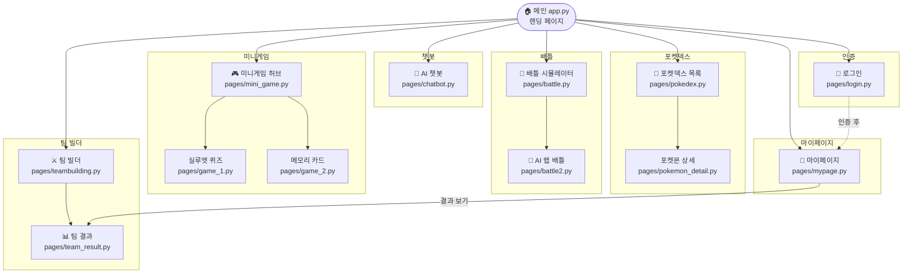

# Features

주요 기능 상세 · 화면 설계 · 페이지 내비게이션 흐름

---

## 목차

1. [GitHub OAuth 로그인](#1-github-oauth-로그인)
2. [포켓덱스](#2-포켓덱스)
3. [AI 챗봇 (오박사)](#3-ai-챗봇-오박사)
4. [팀 빌더](#4-팀-빌더)
5. [배틀 시뮬레이터](#5-배틀-시뮬레이터)
6. [미니게임](#6-미니게임)
7. [마이페이지](#7-마이페이지)
8. [피피고 확장 프로그램](#8-피피고-확장-프로그램)
9. [화면 설계서](#9-화면-설계서)
10. [페이지 내비게이션 흐름](#10-페이지-내비게이션-흐름)

---

## 1. GitHub OAuth 로그인

### 기능 설명

| 항목 | 내용 |
|---|---|
| 인증 방식 | GitHub OAuth 2.0 Authorization Code Flow |
| 권한 범위 | `scope: user:email` (최소 권한 원칙) |
| 세션 영속화 | `session_state` + `streamlit-cookies-controller` 쿠키 (30일) |
| 수집 데이터 | GitHub 프로필, 커밋 수, 레포 수, 스타 수, 팔로워 수 |
| 비로그인 접근 | 포켓덱스·챗봇·배틀 이용 가능 / 팀 빌더 히스토리·마이페이지 배지 비활성 |

### 핵심 구현 포인트

- `ThreadPoolExecutor(max_workers=2)` — 커밋 수·스타 수 GitHub API 병렬 수집으로 로딩 시간 단축
- OAuth 콜백 `?code=` 파라미터를 Streamlit 재실행 사이클 내에서 안정적으로 감지
- 배포 환경 iframe 샌드박스 정책 충돌 → 로그인 버튼을 `target="_blank"` 새 탭으로 처리
- DB 저장 실패 시에도 GitHub 통계로 세션 구성하는 Fallback 처리

---

## 2. 포켓덱스

### 기능 설명

| 항목 | 내용 |
|---|---|
| 대상 | 전국 1,025마리 포켓몬 |
| 페이지네이션 | 50마리씩 무한 스크롤 (IntersectionObserver 자동 클릭) |
| 복합 필터 | 이름/번호 텍스트 · 타입 멀티셀렉트(18종) · 특성 · 지방(10지방) · 도감번호 범위 슬라이더 |
| 상세 페이지 | 기본 스탯 레이더 · 타입 상성표 · 도감 설명 · 분기 진화 트리 · 형태 전환 |

### 핵심 구현 포인트

- 타입 아이콘 SVG 동적 로드 → 각 타입 버튼에 인라인 삽입
- `window.parent.document` 참조로 Streamlit iframe 경계를 넘어 무한 스크롤 처리
- 분기 진화 트리(이브이 8방향 등) 재귀 렌더링

---

## 3. AI 챗봇 (오박사)

### 기능 설명

| 항목 | 내용 |
|---|---|
| 모델 선택 | GPT-4o-mini / llama-3.3-70b (Groq) 전환 가능 |
| 도구 | SQL · Vector · Graph · Web 4종 자동 선택 |
| 응답 방식 | SSE 스트리밍 + 사용 도구 출처 마커 |
| 히스토리 | 세션 기반 멀티턴 (로그인: PostgreSQL / 비로그인: UUID 쿠키) |
| UI | 2패널 — 왼쪽 세션 목록 · 오른쪽 대화창 |

### 출처 표시 예시

```
[도구: search_pokemon_db]
피카츄의 스탯은 HP 35, 공격 55, 방어 40, 특공 50, 특방 50, 속도 90입니다.

[도구: search_type_relations]
전기 타입은 물·비행 타입에 2배 효과가 있으며, 땅 타입에는 무효입니다.
```

---

## 4. 팀 빌더

### 기능 설명 (단계별)

| 단계 | 화면 | 내용 |
|---|---|---|
| ① 포켓몬 선택 | `teambuilding.py` | 타입·지방·특성 필터 + 카드 클릭 선택 (최대 5마리) |
| ② 팀 분석 요청 | `teambuilding.py` | [팀 분석 & 추천] 버튼 → 병렬 API 호출 시작 |
| ③ RAG 분석 결과 | `team_result.py` | Neo4j 타입 약점·저항·커버리지 + LLM 해설 |
| ④ 6번째 추천 | `team_result.py` | Hybrid Reranking 1~3순위 + 추천 이유 |
| ⑤ 결과 저장 | DB | `team_build_logs` JSONB 저장 (로그인 시 user_id 포함) |
| ⑥ 히스토리 | `mypage.py` | 날짜·선택팀·분석요약 가로 카드 · [결과 보기] 복원 |

---

## 5. 배틀 시뮬레이터

### 5.1 일반 배틀 (`battle.py`)

| 항목 | 내용 |
|---|---|
| 방식 | 1v1 턴제 배틀 |
| 체육관 리더 | 9인 (웅이·이슬이·민화·순무·풍란·채두·아이리스·지우·N) |
| 데미지 공식 | `move_power × (Atk/Def) × STAB × type_eff × status × crit(×1.5)` |
| 타입 상성 | Neo4j AGAINST 관계 실시간 조회 |
| 봇 AI | 랜덤 전략 또는 Groq LLM 실시간 전략 판단 |
| 상태이상 | 화상(물리 데미지 ×0.5), 독(매 턴 데미지) 구현 |

### 5.2 AI 랩 배틀 (`battle2.py`)

| 항목 | 내용 |
|---|---|
| 방식 | 두 포켓몬을 선택해 GPT-4o-mini가 랩 가사 생성 |
| 응답 | SSE 스트리밍 출력 |
| 엔드포인트 | `POST /api/v1/chat/rap-battle/stream` |

---

## 6. 미니게임

### 6.1 실루엣 퀴즈 (`game_1.py`)

| 항목 | 내용 |
|---|---|
| 방식 | 검은 실루엣 이미지 → 포켓몬 이름 맞추기 |
| 힌트 | 타입 힌트 제공 가능 (hint_used 기록) |
| 저장 | `game_logs` (user_id, pokemon_id, is_correct, hint_used) |

### 6.2 메모리 카드 게임 (`game_2.py`)

| 항목 | 내용 |
|---|---|
| 방식 | 포켓몬 카드 짝 맞추기 |
| 타이머 | 제한 시간 내 완성 점수 계산 |
| 저장 | `game_logs` (game_type, log_data) |

---

## 7. 마이페이지

### 섹션 구성

| 섹션 | 내용 |
|---|---|
| 프로필 카드 | GitHub 아바타 · 트레이너 이름 · 등급(Rookie → Legendary Developer) |
| GitHub 통계 | 커밋 수 · 레포 수 · 스타 수 · 팔로워 수 |
| 게임 통계 | 실루엣 퀴즈 정답률 · 메모리 게임 결과 · 도감 수집 수 |
| 배지 시스템 | 간토 8개 체육관 배지 + 관장 배지 8개 (활동 미션 달성 시 획득) |
| 팀 빌더 히스토리 | 날짜·선택팀·분석 요약 가로 카드 · [결과 보기] 클릭 시 복원 |

### 트레이너 등급 기준

| 등급 | 조건 |
|---|---|
| Rookie | 기본 |
| Gym Challenger | 커밋 100+ 또는 레포 5+ |
| Elite Four | 커밋 500+ 또는 레포 20+ |
| Legendary Developer | 커밋 1000+ 또는 스타 50+ |

### 배지 획득 조건

| 배지 | 획득 조건 |
|---|---|
| 바위 배지 | 마이페이지 최초 방문 |
| 물 배지 | 퀴즈 1회 도전 |
| 풀 배지 | 팀 빌더 1회 분석 |
| 불꽃 배지 | 배틀 1회 완료 |
| 비행 배지 | 챗봇 1회 질문 |
| 격투 배지 | 퀴즈 정답률 70%+ |
| 드래곤 배지 | 팀 빌더 5회 분석 |
| 에스퍼 배지 | 전체 활동 달성 |

---

## 8. 피피고 확장 프로그램

Chrome Manifest v3 확장 프로그램으로 선택한 포켓몬 GIF 캐릭터가 모든 웹 페이지 위를 이동하며, 클릭 시 Groq AI(LLaMA 3.1 8B)를 통한 번역·질의응답을 제공합니다.

| 항목 | 내용 |
|---|---|
| 캐릭터 | 피카츄·야돈·리자몽·꼬부기 선택 가능 |
| AI 기능 | 한↔영 번역 + 질의응답 (Groq LLaMA 3.1 8B) |
| 이동 | `requestAnimationFrame` 60fps 물리 루프 |
| 저장 | `chrome.storage.local` 설정 영구 저장 |
| 구조 | `background.js`(서비스 워커) → Groq API → `content.js` 메시지 패싱 |

---

## 9. 화면 설계서

### 9.1 메인 홈 (`app.py`)

```
┌─────────────────────────────────────────────┐
│  🎮 너로 정했다! LLM                          │
│  [Pokemon World 풀스크린 랜딩]                 │
│                                               │
│  ┌──────┐ ┌──────┐ ┌──────┐ ┌──────┐        │
│  │포켓덱스│ │ 챗봇 │ │팀빌더│ │ 배틀 │        │
│  └──────┘ └──────┘ └──────┘ └──────┘        │
│                                               │
│  [스크롤 스냅 — 각 섹션 풀스크린 슬라이드]     │
│  장식 포켓몬 클릭 → 랜덤 GIF 교체 인터랙션     │
└─────────────────────────────────────────────┘
```

### 9.2 포켓덱스 (`pages/pokedex.py`)

```
┌─────────────────────────────────────────────┐
│  🔍 [검색창]  [타입▼] [지방▼] [특성▼]        │
│  도감번호: [──●────────────] 1 ~ 1025        │
├─────────────────────────────────────────────┤
│  ┌───┐ ┌───┐ ┌───┐ ┌───┐ ┌───┐ ┌───┐       │
│  │001│ │002│ │003│ │004│ │005│ │006│  ...   │
│  │🌿 │ │🌿 │ │🌿🔥│ │🔥 │ │🔥 │ │🔥🌀│       │
│  │이상해씨│불꽃...│리자몽│                     │
│  └───┘ └───┘ └───┘ └───┘ └───┘ └───┘       │
│                  [무한 스크롤]                 │
└─────────────────────────────────────────────┘
```

### 9.3 포켓몬 상세 (`pages/pokemon_detail.py`)

```
┌───────────────────────────────────────────────────┐
│  ← 목록으로                        #006 리자몽     │
├──────────────┬────────────────────────────────────┤
│              │  🔥 불꽃   🌀 비행                  │
│  [스프라이트] │                                    │
│              │  스탯 레이더 차트                    │
│              │  HP ██████████ 78                  │
│              │  공격 ████████████ 84              │
├──────────────┴────────────────────────────────────┤
│  [도감 설명]  [타입 상성]  [특성]  [진화 트리]      │
│                                                   │
│  진화 트리:  이상해씨 → 이상해풀 → 이상해꽃        │
└───────────────────────────────────────────────────┘
```

### 9.4 AI 챗봇 (`pages/chatbot.py`)

```
┌──────────────┬────────────────────────────────────┐
│ 세션 목록     │  🤖 오박사 AI 챗봇                  │
│              │                                    │
│ + 새 대화    │  [도구: search_pokemon_db]          │
│ ─────────── │  피카츄 스탯: HP 35 / 공격 55...     │
│ 피카츄 스탯  │                                    │
│ 리자드 진화  │  [도구: search_evolution_chain]     │
│ ...          │  리자드 → 16레벨 이상해씨 진화 →... │
│              │                                    │
│              │  [GPT-4o-mini ▼] [질문 입력창 📤]   │
└──────────────┴────────────────────────────────────┘
```

### 9.5 팀 빌더 (`pages/teambuilding.py`)

```
┌─────────────────────────────────────────────┐
│  ⚔️ 팀 빌더  — 포켓몬 5마리를 선택하세요      │
│                                               │
│  필터: [타입▼] [지방▼] [특성▼]  🔍[검색]     │
│                                               │
│  ┌──┐ ┌──┐ ┌──┐ ┌──┐ ┌──┐                   │
│  │①│ │②│ │③│ │④│ │⑤│  ← 선택된 팀         │
│  └──┘ └──┘ └──┘ └──┘ └──┘                   │
│                                               │
│  포켓몬 카드 그리드 (클릭으로 선택)            │
│                                               │
│         [팀 분석 & 추천 ▶]                    │
└─────────────────────────────────────────────┘
```

### 9.6 팀 결과 (`pages/team_result.py`)

```
┌─────────────────────────────────────────────┐
│  📊 팀 분석 결과                              │
│                                               │
│  약점: 바위×3, 비행×2   저항: 불꽃×4          │
│  [분석 결론 텍스트 카드]                       │
│  "현재 팀은 바위 타입에 취약합니다..."          │
├─────────────────────────────────────────────┤
│  🎯 추천 포켓몬                               │
│  ┌──────────┐ ┌──────────┐ ┌──────────┐    │
│  │ 1위 망나뇽│ │ 2위 킹드라│ │3위 보만다 │    │
│  │ 추천 이유│ │ 추천 이유│ │ 추천 이유│    │
│  └──────────┘ └──────────┘ └──────────┘    │
└─────────────────────────────────────────────┘
```

### 9.7 배틀 시뮬레이터 (`pages/battle.py`)

```
┌─────────────────────────────────────────────┐
│  🥊 배틀 시뮬레이터                           │
│                                               │
│  체육관 선택: [웅이▼]  내 포켓몬: [피카츄▼]   │
│                                               │
│  상대: 입치 (HP ████████ 80/80)              │
│  나:   피카츄(HP ██████ 65/70)               │
│                                               │
│  이동기 선택:                                  │
│  [번개] [전기충격] [쾌속이동] [꼬리치기]       │
│                                               │
│  배틀 로그:                                    │
│  > 피카츄가 번개를 사용! 효과가 굉장했다!       │
└─────────────────────────────────────────────┘
```

### 9.8 마이페이지 (`pages/mypage.py`)

```
┌─────────────────────────────────────────────┐
│  👤 [GitHub 아바타]  사용자명                  │
│  등급: Elite Four | 커밋 752 | 레포 23        │
├─────────────────────────────────────────────┤
│  🏅 배지 케이스                               │
│  [바위✅][물✅][풀✅][불꽃✅][비행✅][격투✅][드래곤⬜][에스퍼⬜] │
├─────────────────────────────────────────────┤
│  📊 게임 통계                                  │
│  퀴즈 정답률 78% | 메모리 게임 완료 5회        │
├─────────────────────────────────────────────┤
│  📋 팀 빌더 히스토리                           │
│  ┌──────────────┐ ┌──────────────┐           │
│  │2025-05-10    │ │2025-05-08    │  →        │
│  │[팀 5마리]    │ │[팀 5마리]    │           │
│  │[결과 보기]   │ │[결과 보기]   │           │
│  └──────────────┘ └──────────────┘           │
└─────────────────────────────────────────────┘
```

---

## 10. 페이지 내비게이션 흐름


