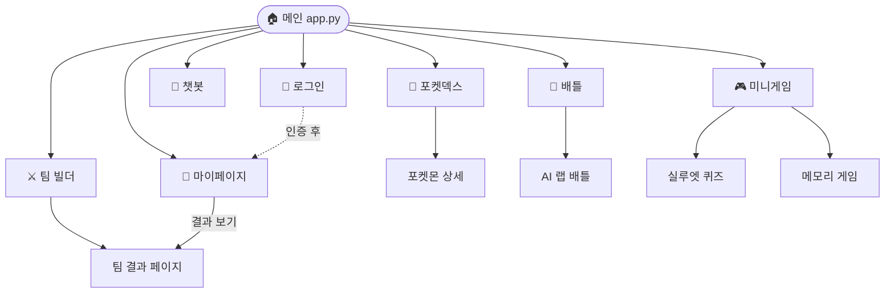

# Features

---

## GitHub OAuth 로그인

- GitHub OAuth 2.0 소셜 로그인
- 로그인 시 커밋 수 · 레포 수 · 스타 · 팔로워 자동 수집 후 DB 저장
- `streamlit-cookies-controller` 쿠키 기반 세션 영속화
- 비로그인 사용자도 포켓덱스 · 챗봇 · 배틀 이용 가능
- 로그인 상태에서만 팀 빌더 히스토리 저장 · 마이페이지 배지 업데이트

---

## 포켓덱스

- 1,025마리 전체 목록 페이지네이션
- **복합 필터**: 이름/번호 텍스트 · 타입 멀티셀렉트 · 특성 · 도감번호 범위 슬라이더
- **상세 페이지**: 기본 스탯 레이더 · 타입 상성표 · 도감 설명 · 분기 진화 트리 · 형태 전환

---

## AI 챗봇 (오박사)

포켓몬 전문 AI 어시스턴트와의 멀티턴 대화

| 툴 | 설명 |
|---|---|
| SQL Tool | 자연어 → SQL 자동 생성 후 PostgreSQL 조회 |
| Vector Search | pgvector BM25 + 임베딩 하이브리드 검색 |
| Graph Search | Neo4j 진화 체인 · 타입 상성 탐색 |
| Web Search | Tavily 폴백 검색 |

- LangGraph Memory 기반 멀티턴 히스토리 유지
- 세션 저장/불러오기 — 로그인: PostgreSQL 저장 / 비로그인: UUID 쿠키 30일
- LLM 선택: GPT-4o-mini / Gemma (Groq)
- 2패널 UI: 왼쪽 세션 목록 · 오른쪽 대화창

---

## 팀 빌더

5마리 선택 → LangGraph Hybrid RAG 분석 → 6번째 추천

| 단계 | 내용 |
|---|---|
| ① 포켓몬 선택 | 타입 · 지방 · 특성 · 이름 필터 + 카드 클릭 선택 (최대 5마리) |
| ② 덱 분석 | Neo4j 타입 약점 · 저항 · 커버리지 분석 |
| ③ RAG 해설 | LangGraph Graph + Vector 결합 AI 분석 문장 |
| ④ 6번째 추천 | 하이브리드 Re-ranking 1~3순위 추천 + 이유 해설 |
| ⑤ 결과 저장 | 분석 · 추천 결과 PostgreSQL JSONB 저장 (로그인 시 user_id 포함) |
| ⑥ 히스토리 | 마이페이지에서 과거 분석 결과 가로 카드로 확인 · 복원 |

---

## 배틀 시뮬레이터

- **일반 배틀**: 1v1 타입 상성 기반 데미지 계산 · 포켓몬 교체 시스템
- **AI 랩 배틀**: GPT-4o-mini가 두 포켓몬의 배틀을 랩 가사로 생성 (스트리밍 출력)

---

## 미니게임

- **실루엣 퀴즈**: 포켓몬 실루엣 맞추기 · 힌트 시스템 · 정답 시 도감 수집 반영
- **메모리 카드**: 포켓몬 카드 짝 맞추기 · 결과 저장

---

## 마이페이지

GitHub 연동 트레이너 프로필 · 배지 · 통계 · 팀 빌더 히스토리

| 섹션 | 내용 |
|---|---|
| 프로필 카드 | GitHub 아바타 · 이름 · 커밋 수 · 레포 수 · 팔로워 |
| 게임 통계 | 실루엣 퀴즈 정답률 · 메모리 게임 결과 · 도감 수집 수 |
| 배지 시스템 | 간토 체육관 배지 8개 + 관장 배지 8개 (조건 달성 시 획득) |
| 팀 빌더 히스토리 | 날짜 · 선택 팀 · 분석 요약 · 추천 포켓몬 가로 카드 · [결과 보기] |

---

## 페이지 목록

| 경로 | 파일 | 기능 |
|---|---|---|
| `/` | `app.py` | 메인 네비게이션 허브 |
| `/login` | `pages/login.py` | GitHub OAuth 로그인/로그아웃 |
| `/mypage` | `pages/mypage.py` | 프로필 · 통계 · 배지 · 히스토리 |
| `/pokedex` | `pages/pokedex.py` | 포켓몬 목록 · 검색 · 필터 |
| `/pokemon_detail` | `pages/pokemon_detail.py` | 포켓몬 상세 뷰 |
| `/chatbot` | `pages/chatbot.py` | AI 챗봇 (2패널) |
| `/teambuilding` | `pages/teambuilding.py` | 팀 구성 · 분석 트리거 |
| `/team_result` | `pages/team_result.py` | 팀 분석/추천 결과 |
| `/battle` | `pages/battle.py` | 1v1 배틀 시뮬레이터 |
| `/battle2` | `pages/battle2.py` | AI 랩 배틀 (스트리밍) |
| `/mini_game` | `pages/mini_game.py` | 미니게임 허브 |
| `/game_1` | `pages/game_1.py` | 실루엣 퀴즈 |
| `/game_2` | `pages/game_2.py` | 메모리 카드 게임 |

## 페이지 내비게이션 흐름

