# Pokemon World — Wiki

> **SKN27-3rd-3TEAM** · SKN AI 캠프 27기 3차 프로젝트 · 2025.04.30 ~ 2025.05.15

LangGraph 기반 Hybrid RAG · Neo4j + pgvector 이중 DB · 멀티툴 AI 챗봇 · 타입 상성 배틀 시뮬레이터를 갖춘 포켓몬 풀스택 AI 플랫폼입니다.

---

## 문서 구조

```
Wiki
├── 아키텍처 & 설정
│   ├── Architecture        서비스 구성 · Docker 네트워크 · 파일 구조
│   └── Setup               환경 변수 · 실행 방법 · 데이터 초기화
│
├── 데이터
│   └── Database            PostgreSQL ERD · Neo4j 스키마 · 데이터 수집/전처리 · 청킹 기준
│
├── AI & 백엔드
│   ├── AI-Pipeline         LangGraph RAG · 챗봇 에이전트 · 환각 방지 · RAG 평가
│   └── API-Reference       전체 엔드포인트 · 요청/응답 명세
│
├── 기능별 상세
│   ├── TeamBuilder         팀 빌더 — Graph-guided Hybrid RAG · 요구사항 · 시퀀스 · ERD · 프롬프트
│   ├── Login               GitHub OAuth 2.0 로그인 · 통계 병렬 수집 · 세션 이중 영속화
│   ├── Mypage              트레이너 대시보드 · 등급 산출 · 관동 배지 · 스코어 계산
│   ├── Battle              배틀 시뮬레이터 · LLM 전략 봇 · 체육관 리더 9인
│   └── Pipigo              Chrome 확장 프로그램 · Groq 번역 봇 · 물리 엔진
│
└── 기획 & QA
    ├── Features            주요 기능 · 화면 설계 · 페이지 흐름
    └── Requirements-and-Testing  요구사항 · WBS · 테스트 시나리오 · 결과
```

---

## 문서 목차

### 아키텍처 & 설정

| 문서 | 핵심 내용 |
|---|---|
| [Architecture](Architecture) | 서비스 구성 · Docker 네트워크 · 프로젝트 파일 구조 |
| [Setup](Setup) | 환경 변수 전체 목록 · Docker 실행 · 로컬 개발 · 데이터 초기화 |

### 데이터 & AI

| 문서 | 핵심 내용 |
|---|---|
| [Database](Database) | PostgreSQL ERD · Neo4j 실제 노드/관계 스키마 · 데이터 수집·전처리 · 벡터 청킹 기준 |
| [AI-Pipeline](AI-Pipeline) | LangGraph RAG 9-노드 · 챗봇 멀티툴 에이전트 · 환각 방지 전략 · RAG 품질 평가 |
| [API-Reference](API-Reference) | 전체 REST 엔드포인트 · 파라미터 · 요청/응답 스키마 |

### 기능별 상세

| 문서 | 핵심 내용 |
|---|---|
| [TeamBuilder](TeamBuilder) | 요구사항 · Graph-guided Hybrid RAG · 가중치 정책 · 시퀀스 다이어그램 · 프롬프트 명세 · ERD |
| [Login](Login) | GitHub OAuth 2.0 · ThreadPoolExecutor 병렬 통계 수집 · 세션 이중 영속화 · 디자인 시스템 |
| [Mypage](Mypage) | 트레이너 등급 산출 · 관동 배지 8개 성취 시스템 · 스코어 계산 공식 · API 명세 |
| [Battle](Battle) | 턴제 배틀 시스템 · Phase 0~8 시퀀스 · Groq LLM 봇 · LangGraph 고도화 계획 |
| [Pipigo](Pipigo) | Chrome 확장 (Manifest v3) · LLaMA 3.1 번역봇 · 60fps 물리 엔진 · 보안 |

### 기획 & QA

| 문서 | 핵심 내용 |
|---|---|
| [Features](Features) | 기능별 상세 · 화면 설계서 · 페이지 내비게이션 흐름 |
| [Requirements-and-Testing](Requirements-and-Testing) | 기능·비기능 요구사항 · WBS · 테스트 시나리오 및 결과 · RAG 품질 지표 |

---

## 기술 스택 한눈에 보기

```mermaid
mindmap
  root((Pokemon World))
    Frontend
      Streamlit
      streamlit-cookies-controller
    Backend
      FastAPI
      SQLAlchemy
      LangChain / LangGraph
    AI
      OpenAI GPT-4o-mini
      Groq llama-3.3-70b
      Tavily 웹 검색
    Database
      PostgreSQL 16 + pgvector
      Neo4j 5 + APOC + GDS
    Infrastructure
      Docker / Compose
      LangSmith
      GitHub OAuth
```



---

## 빠른 시작

```bash
cp .env.sample .env          # API 키 설정
docker compose up --build    # 전체 스택 실행
```

| 서비스 | URL |
|---|---|
| Frontend (Streamlit) | http://localhost:8501 |
| Backend (FastAPI Docs) | http://localhost:8080/docs |
| Neo4j Browser | http://localhost:7474 |

→ 상세 설치 가이드: [Setup](Setup)
