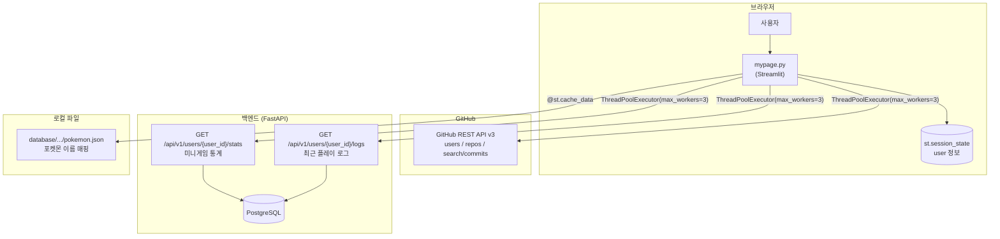
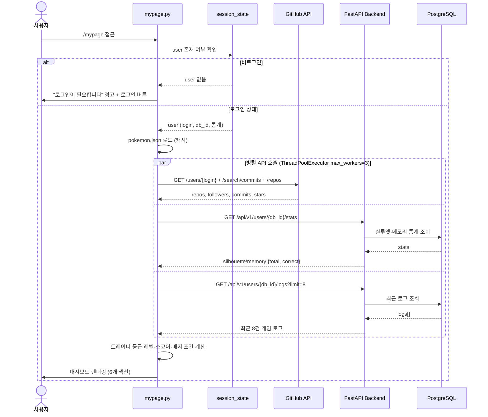
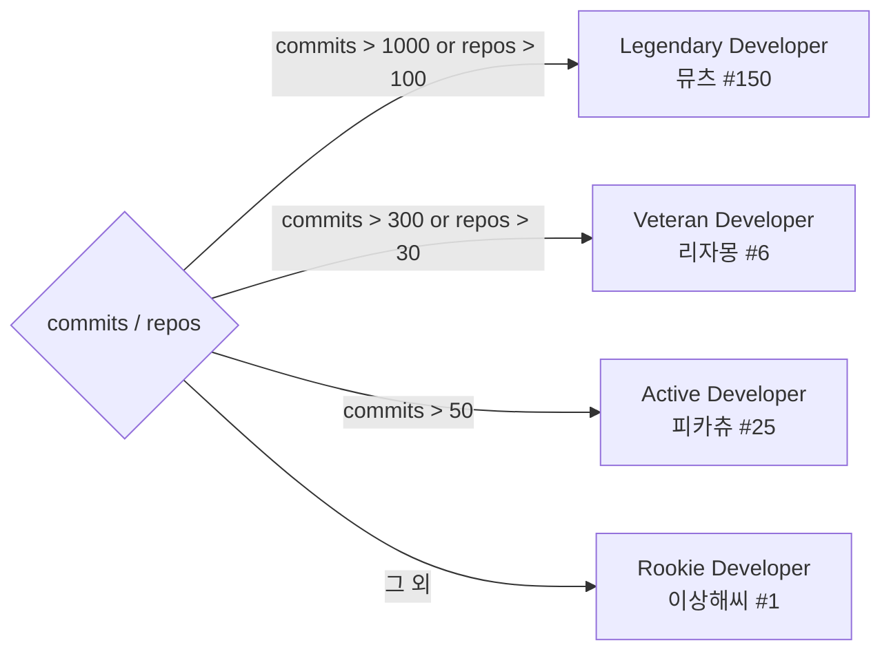

# 마이페이지 (My Page) — 트레이너 대시보드

GitHub 통계·미니게임 전적·관동 배지·포켓몬 컬렉션을 한 화면에서 확인하는 개인화 트레이너 대시보드

---

## 목차

1. [개요](#1-개요)
2. [기술 스택](#2-기술-스택)
3. [시스템 아키텍처](#3-시스템-아키텍처)
4. [핵심 기능 상세](#4-핵심-기능-상세)
5. [백엔드 API 명세](#5-백엔드-api-명세)
6. [UI 섹션 구성 및 디자인](#6-ui-섹션-구성-및-디자인)

---

## 1. 개요

**마이페이지**는 로그인한 트레이너의 모든 활동 데이터를 집계·시각화하는 개인 대시보드입니다.  
GitHub 공개 통계와 미니게임 플레이 기록을 결합하여 트레이너 등급·레벨·스코어를 산출하고, 관동지방 8대 체육관 배지를 성취 시스템으로 구현합니다.

| 항목 | 내용 |
|---|---|
| 페이지 경로 | `/mypage` (`frontend/pages/mypage.py`) |
| 접근 조건 | GitHub OAuth 로그인 필수 |

---

## 2. 기술 스택

| 구분 | 기술 | 용도 |
|---|---|---|
| Frontend | Streamlit | 페이지 렌더링 및 세션 상태 관리 |
| Frontend | HTML/CSS (st.markdown) | Glassmorphism 카드, 배지 케이스, 도감 그리드 |
| Frontend | Python `concurrent.futures` | GitHub API + 백엔드 API 병렬 호출 |
| Frontend | `@st.cache_data` | 포켓몬 이름 JSON 파일 캐싱 |
| Backend/외부 | GitHub REST API v3 | commits, repos, stars, followers 실시간 조회 |
| Backend/외부 | FastAPI `/api/v1/users/` | 미니게임 통계·로그 조회 |
| Backend/외부 | PostgreSQL | 게임 플레이 로그 영구 저장 |
| Backend/외부 | PokeAPI Sprites CDN | 등급별 포켓몬 애니메이션 GIF |

---

## 3. 시스템 아키텍처

### 3-1. 컴포넌트 구성도



### 3-2. 마이페이지 로드 흐름 시퀀스



### 3-3. 트레이너 등급 산출 로직



---

## 4. 핵심 기능 상세

### 4-1. 트레이너 프로필 히어로 카드

| 표시 요소 | 데이터 소스 |
|---|---|
| 프로필 아바타 | GitHub `avatar_url` |
| 트레이너 이름 / 핸들 | GitHub `name` / `login` |
| 트레이너 등급 배지 | 커밋·레포 수 기반 계산 |
| 레벨 (`Lv.N Master`) | `min(99, commits/10 + correct/5 + 1)` |
| 등급 대표 포켓몬 + 친구 포켓몬 | PokeAPI Showdown GIF |
| 로그아웃 버튼 | `/login?do_logout=true` 링크 |

**등급별 포켓몬 매핑**

| 등급 | 조건 | 대표 포켓몬 | 친구 포켓몬 |
|---|---|---|---|
| Legendary Developer | commits > 1000 또는 repos > 100 | 뮤츠 (#150) | 뮤 (#151) |
| Veteran Developer | commits > 300 또는 repos > 30 | 리자몽 (#6) | 파이리 (#4) |
| Active Developer | commits > 50 | 피카츄 (#25) | 피츄 (#172) |
| Rookie Developer | 그 외 | 이상해씨 (#1) | 꼬부기 (#7) |

### 4-2. Developer Stats

GitHub API를 `ThreadPoolExecutor(max_workers=3)`로 병렬 호출하여 수집합니다.

| 지표 | API | 설명 |
|---|---|---|
| **Commits** | `GET /search/commits?q=author:{login}` | 전체 커밋 수 (Preview 헤더 필요) |
| **Repos** | `GET /users/{login}` | 공개 레포지토리 수 |
| **Stars** | `GET /users/{login}/repos?per_page=100` | 레포별 `stargazers_count` 합산 |
| **Followers** | `GET /users/{login}` | 팔로워 수 |
| **Overall Rank** | 로컬 계산 | 위 지표 기반 등급 문자열 |

> **캐시 전략**: 세션 내 GitHub 통계가 이미 존재하면 `st.session_state[f"_gh_{username}"]`에서 읽어 API 호출 생략

### 4-3. Kanto Badge Case (관동 배지 케이스)

관동지방 8개 체육관 배지를 성취 목표로 구현한 게이미피케이션 시스템입니다.

| 배지 | 체육관 | 해금 조건 |
|---|---|---|
| 볼더 배지 (회색) | 회색시티 · 브록 | 마이페이지 방문 (항상 해금) |
| 캐스케이드 배지 (블루) | 하늘색시티 · 미스티 | 실루엣 퀴즈 1회 이상 플레이 |
| 썬더 배지 (골드) | 연분홍시티 · 덴류 | GitHub 커밋 50개 이상 |
| 레인보우 배지 (무지개) | 무지개시티 · 마티스 | 포켓몬 10마리 이상 수집 |
| 소울 배지 (핑크) | 셀라돈시티 · 강연 | 메모리 게임 5회 이상 플레이 |
| 볼케이노 배지 (진홍) | 홍련섬 · 강석 | 실루엣 퀴즈 정답률 70% 이상 |
| 마쉬 배지 (오렌지) | 상록시티 · 사빈나 | GitHub 레포 10개 이상 |
| 어스 배지 (그린) | 크리스탈 · 라이벌 | 트레이너 레벨 10 이상 |

- 잠긴 배지: 흑백 필터 (`grayscale(1) brightness(0.22)`) + 미션 텍스트
- 해금된 배지: 배지별 고유 색상 Glow 효과 + hover 시 `scale(1.12)`
- 8개 모두 해금 시: "관동 챔피언! 모든 배지를 획득했습니다!" 메시지

### 4-4. Game Performance (스코어 계산)

미니게임 통계를 백엔드 `GET /api/v1/users/{user_id}/stats`로 조회합니다.

```python
game_score  = total_correct * 10
gh_score    = (repos * 100) + (followers * 20) + (commits * 10) + (stars * 50)
total_score = game_score + gh_score

level   = min(99, int(commits / 10) + int(total_correct / 5) + 1)
xp_pct  = (level % 10) * 10   # 현재 레벨 내 XP 진행률 (%)
```

| 지표 | 설명 |
|---|---|
| Quiz Accuracy | 실루엣 퀴즈 정답 수 / 전체 시도 수 × 100 |
| Memory Record | 메모리 게임 정답 수 / 전체 시도 수 × 100 |
| Trainer Score | game_score + gh_score 합산 (단위: PTS) |
| XP Progress Bar | `level % 10 * 10`% — 노란→주황 그라디언트 |

### 4-5. My Pokemon Collection (포켓몬 컬렉션)

미니게임 플레이 로그에서 `is_correct=True`인 항목의 `pokemon_id`를 추출합니다.

- 중복 제거 후 오름차순 정렬 (`sorted(set(...))`)
- 스프라이트 URL: `https://raw.githubusercontent.com/PokeAPI/sprites/master/sprites/pokemon/{id}.png`
- 한국어 이름은 로컬 `database/.../pokemon.json`에서 `{id: name}` 매핑
- 전체 1,025종 기준 포획률(%) + 진행 바 표시

### 4-6. Recent Activity Log

`GET /api/v1/users/{user_id}/logs?limit=8`으로 최근 8건 로그를 조회합니다.

| 필드 | 표시 방식 |
|---|---|
| `game_type` | `silhouette` → "실루엣 퀴즈" / 그 외 → "메모리 게임" |
| `is_correct` | `SUCCESS` (초록) / `FAILED` (빨강) 태그 |
| `pokemon_id` | 한국어 이름 매핑 → 없으면 `No. {id}` |
| `created_at` | ISO 8601 → `MM/DD HH:MM` 포맷 변환 |

---

## 5. 백엔드 API 명세

### `GET /api/v1/users/{user_id}/stats` — 미니게임 통계 조회

**Response `200 OK`**

```json
{
  "silhouette": { "total": 20, "correct": 15 },
  "memory":     { "total": 10, "correct": 7  }
}
```

### `GET /api/v1/users/{user_id}/logs` — 최근 플레이 로그 조회

| Query 파라미터 | 기본값 | 설명 |
|---|---|---|
| `limit` | `10` | 반환할 최대 로그 수 (마이페이지는 `8` 사용) |

**Response `200 OK`**

```json
[
  {
    "id": 1,
    "game_type": "silhouette",
    "pokemon_id": 25,
    "pokemon_name": "피카츄",
    "is_correct": true,
    "created_at": "2026-05-13T10:30:00Z"
  }
]
```

---

## 6. UI 섹션 구성 및 디자인

### 섹션별 카드 구성

| 섹션 | CSS 클래스 | 상단 보더 색상 |
|---|---|---|
| Profile Hero | `.card-profile` | `#FFCB05` (포켓몬 골드) |
| Developer Stats | `.card-dev` | `#6c5ce7` (퍼플) |
| Kanto Badge Case | `.card-badge` | `#fd9644` (오렌지) |
| Game Performance | `.card-game` | `#ff4757` (레드) |
| Pokemon Collection | `.card-dex` | `#27ae60` (그린) |
| Activity Log | `.card-activity` | `#b2bec3` (그레이) |

### Glassmorphism 카드 공통 스타일

```css
.mp-card {
    background: rgba(255, 255, 255, 0.4);
    backdrop-filter: blur(25px) saturate(180%);
    border-radius: 28px;
    border: 1px solid rgba(255, 255, 255, 0.5);
    box-shadow: 0 15px 45px rgba(0, 0, 0, 0.12);
}
.mp-card:hover {
    transform: translateY(-4px);
    background: rgba(255, 255, 255, 0.55);
}
```

### 반응형 브레이크포인트

| 해상도 | 처리 방식 |
|---|---|
| `≤ 1100px` | `.mp-hero-friends` (친구 포켓몬) 숨김 |
| `≤ 900px` | `.mp-hero-creature-wrap` (대표 포켓몬 전체) 숨김 |
| `≤ 768px` | `.mp-hero` 레이아웃 세로 방향 전환 |
