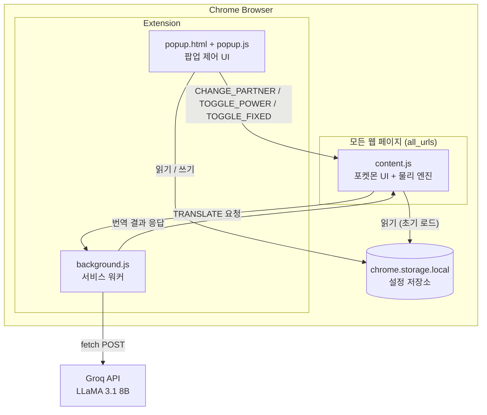
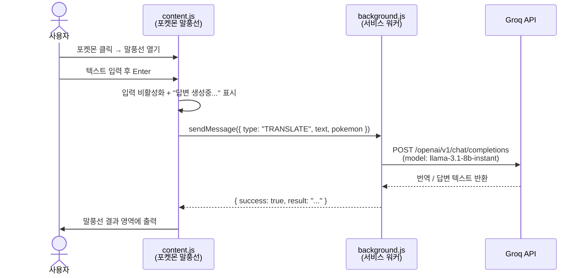
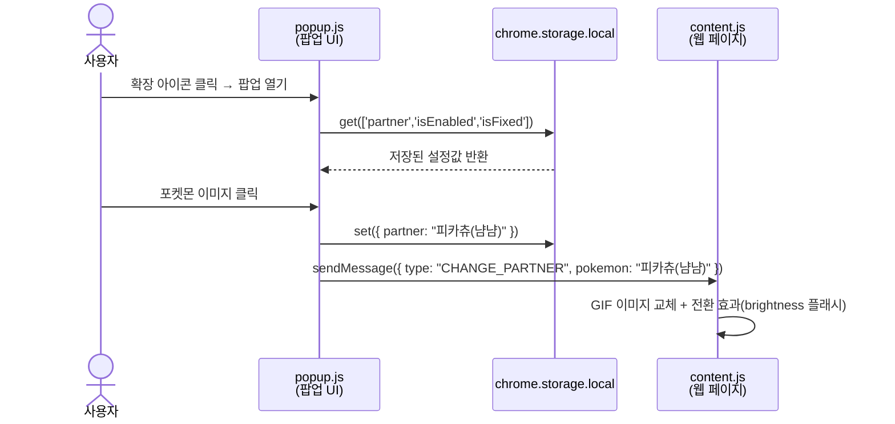

# 피피고 (Pipigo) — 포켓몬 가상 펫 AI 번역기 Chrome 확장 프로그램

화면을 자유롭게 돌아다니는 포켓몬 파트너와 함께하는 스마트 양방향 번역기

---

## 목차

1. [개요](#1-개요)
2. [기술 스택](#2-기술-스택)
3. [시스템 아키텍처](#3-시스템-아키텍처)
4. [핵심 기능 상세](#4-핵심-기능-상세)
5. [파일 구조](#5-파일-구조)
6. [설치 방법](#6-설치-방법)
7. [보안 및 프라이버시](#7-보안-및-프라이버시)

---

## 1. 개요

**피피고(Pipigo)**는 Chrome 브라우저에 설치하는 Manifest v3 확장 프로그램입니다.  
선택한 포켓몬 캐릭터가 모든 웹 페이지 위에서 살아 움직이며, 클릭 한 번으로 말풍선을 열어 텍스트를 입력하면 Groq AI(LLaMA 3.1 8B)가 한국어↔영어 번역 또는 질문 답변을 즉시 돌려줍니다.

| 항목 | 내용 |
|---|---|
| 프로젝트명 | 피피고 (Pipigo) |
| 버전 | 1.0 |
| 타입 | Chrome 브라우저 확장 프로그램 (Manifest v3) |
| AI 모델 | Groq LLaMA 3.1 8B Instant |
| 물리 엔진 | requestAnimationFrame 기반 60fps 자동 산책 |

---

## 2. 기술 스택

| 구분 | 기술 | 파일 | 역할 |
|---|---|---|---|
| Frontend (확장) | HTML5 | `popup.html` | 확장 아이콘 클릭 시 나타나는 제어 팝업 UI |
| Frontend (확장) | CSS3 | `content.css` | 포켓몬 컨테이너·말풍선·로딩 애니메이션 스타일 |
| Frontend (확장) | Vanilla JavaScript | `content.js` | 웹 페이지에 주입되는 포켓몬 UI + 물리 엔진 |
| Frontend (확장) | Vanilla JavaScript | `popup.js` | 팝업 UI 이벤트 처리 및 설정 저장 |
| Frontend (확장) | Vanilla JavaScript | `background.js` | 서비스 워커 — Groq API 호출 담당 |
| 외부 API | Groq AI API | — | LLaMA 3.1 8B Instant 모델 번역·질의응답 |
| 플랫폼 | Chrome Extension API | — | `chrome.storage.local`, `chrome.runtime`, `chrome.tabs` |

---

## 3. 시스템 아키텍처

### 3-1. 컴포넌트 구성도



### 3-2. 번역 요청 흐름



### 3-3. 파트너 변경 흐름



---

## 4. 핵심 기능 상세

### 4-1. AI 양방향 번역 및 질의응답

포켓몬을 클릭하면 말풍선이 열립니다. 텍스트를 입력하고 Enter를 누르면 `background.js`가 Groq API를 호출합니다.

**시스템 프롬프트**

```
You are 'Pipigo', a brilliant Pokemon AI assistant.
1) If the input is a sentence/phrase, provide the most natural and context-aware translation (KO<->EN).
2) If the input is a question, answer it intelligently.
3) Keep your response concise, helpful, and friendly.
```

| 설정 | 값 | 이유 |
|---|---|---|
| 모델 | `llama-3.1-8b-instant` | 빠른 응답 속도 우선 |
| Temperature | `0.3` | 일관되고 정확한 번역 우선 |
| 언어 감지 | 자동 | 한국어 입력 시 영어로, 영어 입력 시 한국어로 자동 변환 |

### 4-2. 포켓몬 가상 펫 — 물리 엔진

`content.js`에서 `requestAnimationFrame` 기반 물리 루프가 60fps로 동작합니다.

| 파라미터 | 값 |
|---|---|
| `walkSpeed` | 1.2 px/frame |
| 목표 좌표 범위 | 현재 위치 ± (랜덤 600px, 500px) |
| 화면 경계 처리 | `max(50, min(innerWidth - 150, targetX))` |

- 목표 지점 도착 시 즉시 새 목표 좌표 설정 → 무한 산책
- 마우스 커서 방향에 따라 `scaleX(1)` / `scaleX(-1)`로 좌우 시선 처리
- 말풍선이 열리거나 드래그 중일 때는 이동 정지

### 4-3. GIF 무한 반복 보장

브라우저에 따라 GIF가 멈추는 문제를 방지하기 위해 8초마다 `src`를 강제 재할당합니다.

```javascript
// content.js:82-86
setInterval(() => {
    if (container.style.display !== 'none' && !isDragging) {
        refreshGif(); // src에 ?t=타임스탬프 추가하여 재로드
    }
}, 8000);
```

### 4-4. 포켓몬 파트너 선택 (4종)

| 파트너 | 파일 | 특징 |
|---|---|---|
| 피카츄(냠냠) | `img/1.gif` | 기본 파트너 (45KB, 경쾌한 동작) |
| 야돈(콧물) | `img/2.gif` | 느긋한 성격 (109KB) |
| 리자몽(비행) | `img/3.gif` | 박력있는 비행 애니메이션 (4.2MB) |
| 꼬부기(당당) | `img/4.gif` | 자신감 넘치는 포즈 (419KB) |

### 4-5. 사용자 제어 (팝업 UI)

| 기능 | 저장 키 | 기본값 | 동작 |
|---|---|---|---|
| 포켓몬 활성화 | `isEnabled` | `true` | 포켓몬 표시/숨김 |
| 위치 고정 모드 | `isFixed` | `false` | 자동 산책 정지, 현재 위치 고정 |
| 파트너 선택 | `partner` | `피카츄(냠냠)` | GIF 교체 + 전환 효과 |

설정은 `chrome.storage.local`에 영구 저장되어 브라우저를 재시작해도 유지됩니다.

### 4-6. 드래그 앤 드롭

포켓몬 이미지를 마우스로 클릭·드래그하면 화면 어디든 자유롭게 이동할 수 있습니다.  
드래그 해제 후에는 해당 위치를 새 기준점으로 삼아 산책을 재개합니다.

---

## 5. 파일 구조

```
pokemon_papago/
├── manifest.json          # 확장 프로그램 메타 설정 (Manifest v3)
├── background.js          # 서비스 워커 — Groq API 번역 처리
├── content.js             # 콘텐츠 스크립트 — 포켓몬 UI + 물리 엔진
├── popup.js               # 팝업 UI 이벤트 처리
├── popup.html             # 팝업 마크업 + 인라인 스타일
├── content.css            # 포켓몬 컨테이너·말풍선 스타일
├── icon.png               # 확장 프로그램 아이콘
└── img/
    ├── 1.gif              # 피카츄(냠냠)
    ├── 2.gif              # 야돈(콧물)
    ├── 3.gif              # 리자몽(비행)
    └── 4.gif              # 꼬부기(당당)
```

---

## 6. 설치 방법

Chrome 웹 스토어 미등록 상태이므로 개발자 모드로 로드합니다.

**Step 1 — API 키 설정**

`background.js` 상단의 `GROQ_API_KEY` 값을 실제 키로 교체합니다.

```javascript
// background.js:8
const GROQ_API_KEY = "gsk_여기에_실제_키_입력";
```

**Step 2 — Chrome에 확장 프로그램 로드**

1. Chrome 주소창에 `chrome://extensions` 입력
2. 우측 상단 **개발자 모드(Developer mode)** 토글 활성화
3. **압축해제된 확장 프로그램을 로드합니다(Load unpacked)** 버튼 클릭
4. `pokemon_papago/` 폴더 선택

**Step 3 — 사용**

1. 임의의 웹 페이지를 열면 화면 우측 하단에 피카츄가 나타납니다
2. 포켓몬을 클릭하면 말풍선이 열립니다
3. 번역하거나 질문할 텍스트를 입력하고 Enter를 누릅니다
4. 확장 아이콘을 클릭하면 파트너 변경·전원 토글·위치 고정 등을 설정할 수 있습니다

---

## 7. 보안 및 프라이버시

### 최소 권한 원칙

`manifest.json`에 선언된 권한은 두 가지뿐입니다.

```json
"permissions": ["storage"],
"host_permissions": ["https://api.groq.com/*"]
```

- 브라우저 기록, 쿠키, 탭 URL 등 민감 정보 **수집하지 않음**
- 모든 캐릭터 리소스는 **로컬 번들** (원격 CDN 없음)
- 번역 텍스트는 Groq API 전송 후 **즉시 폐기**

### 주의사항

| 항목 | 내용 |
|---|---|
| API 키 노출 | `background.js`에 평문 저장됨 — 팀 공유 시 `.gitignore` 처리 권장 |
| 키 관리 스크립트 | `update_pokemon_env.py`(별도)로 자동 교체 가능 (`@ENV_START`~`@ENV_END` 블록) |
