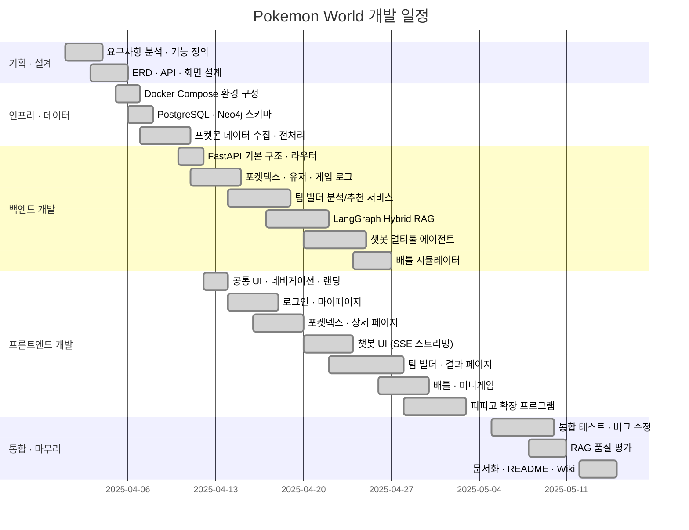

# Requirements & Testing

요구사항 명세 · WBS · 테스트 시나리오 및 결과 · RAG 품질 평가

---

## 목차

1. [기능 요구사항](#1-기능-요구사항)
2. [비기능 요구사항](#2-비기능-요구사항)
3. [WBS 개발 일정](#3-wbs-개발-일정)
4. [테스트 시나리오 및 결과](#4-테스트-시나리오-및-결과)
5. [RAG 품질 평가](#5-rag-품질-평가)

---

## 1. 기능 요구사항

### 인증 (FR-01)

| ID | 요구사항 | 우선순위 | 구현 | 검증 |
|---|---|---|---|---|
| FR-01-1 | GitHub OAuth 2.0 소셜 로그인 | 필수 | ✅ | T-01 |
| FR-01-2 | 로그인 시 커밋·레포·스타·팔로워 자동 수집 및 DB 저장 | 필수 | ✅ | T-02 |
| FR-01-3 | 쿠키 기반 세션 영속화 (새로고침·탭 전환 후 유지) | 필수 | ✅ | T-03 |
| FR-01-4 | 비로그인 사용자 포켓덱스·챗봇·배틀 이용 | 필수 | ✅ | T-04 |

### 포켓덱스 (FR-02)

| ID | 요구사항 | 우선순위 | 구현 | 검증 |
|---|---|---|---|---|
| FR-02-1 | 전체 1,025마리 목록 페이지네이션 | 필수 | ✅ | T-05 |
| FR-02-2 | 이름/ID/타입/특성/지방/도감번호 복합 필터 | 필수 | ✅ | T-06 |
| FR-02-3 | 포켓몬 상세: 스탯 레이더·타입 상성·도감 설명·진화 트리 | 필수 | ✅ | T-07 |
| FR-02-4 | 분기 진화 트리 렌더링 (이브이 등 다중 분기) | 선택 | ✅ | T-08 |

### AI 챗봇 (FR-03)

| ID | 요구사항 | 우선순위 | 구현 | 검증 |
|---|---|---|---|---|
| FR-03-1 | 포켓몬 자연어 질의응답 | 필수 | ✅ | T-09 |
| FR-03-2 | SQL Tool — 자연어 → SQL 자동 생성 + PostgreSQL 조회 | 필수 | ✅ | T-10 |
| FR-03-3 | Vector Search — pgvector MMR 도감 설명 유사 검색 | 필수 | ✅ | T-11 |
| FR-03-4 | Graph Search — Neo4j 진화 체인·타입 상성 탐색 | 필수 | ✅ | T-12 |
| FR-03-5 | Tavily 웹 검색 폴백 | 선택 | ✅ | T-13 |
| FR-03-6 | 멀티턴 대화 히스토리 유지 | 필수 | ✅ | T-14 |
| FR-03-7 | 세션 저장/불러오기 (로그인: DB / 비로그인: 쿠키) | 필수 | ✅ | T-15 |
| FR-03-8 | SSE 스트리밍 응답 + 사용 도구 출처 마커 | 필수 | ✅ | T-16 |
| FR-03-9 | SQL 오류 시 최대 3회 자동 재시도 | 필수 | ✅ | T-17 |

### 팀 빌더 (FR-04)

| ID | 요구사항 | 우선순위 | 구현 | 검증 |
|---|---|---|---|---|
| FR-04-1 | 포켓몬 5마리 선택 UI (타입·지방·특성 필터 포함) | 필수 | ✅ | T-18 |
| FR-04-2 | Neo4j 타입 약점·저항·커버리지 분석 | 필수 | ✅ | T-19 |
| FR-04-3 | LangGraph 9-노드 Hybrid RAG 분석 해설 | 필수 | ✅ | T-20 |
| FR-04-4 | 6번째 포켓몬 추천 + Hybrid Reranking (0.7×graph+0.3×vector) | 필수 | ✅ | T-21 |
| FR-04-5 | 분석·추천 결과 PostgreSQL JSONB 저장 | 필수 | ✅ | T-22 |
| FR-04-6 | 분석·추천 병렬 API 호출 (ThreadPoolExecutor) | 필수 | ✅ | T-23 |
| FR-04-7 | 마이페이지 히스토리 · 결과 복원 | 선택 | ✅ | T-24 |

### 배틀 (FR-05)

| ID | 요구사항 | 우선순위 | 구현 | 검증 |
|---|---|---|---|---|
| FR-05-1 | 1v1 타입 상성 기반 턴제 배틀 | 필수 | ✅ | T-25 |
| FR-05-2 | Neo4j 실시간 타입 상성 조회 | 필수 | ✅ | T-26 |
| FR-05-3 | STAB · 크리티컬 · 상태이상 데미지 공식 | 필수 | ✅ | T-27 |
| FR-05-4 | 체육관 리더 9인 고유 로스터·대사 | 선택 | ✅ | T-28 |
| FR-05-5 | Groq LLM 봇 전략 판단 | 선택 | ✅ | T-29 |
| FR-05-6 | AI 랩 배틀 SSE 스트리밍 | 선택 | ✅ | T-30 |

### 미니게임 (FR-06)

| ID | 요구사항 | 우선순위 | 구현 | 검증 |
|---|---|---|---|---|
| FR-06-1 | 실루엣 퀴즈 (힌트 시스템 포함) | 필수 | ✅ | T-31 |
| FR-06-2 | 메모리 카드 짝 맞추기 | 필수 | ✅ | T-32 |
| FR-06-3 | 플레이 로그 DB 저장 | 선택 | ✅ | T-33 |

### 마이페이지 (FR-07)

| ID | 요구사항 | 우선순위 | 구현 | 검증 |
|---|---|---|---|---|
| FR-07-1 | GitHub 프로필 카드 + 트레이너 등급 | 필수 | ✅ | T-34 |
| FR-07-2 | 미니게임 통계 (정답률·완료 횟수) | 필수 | ✅ | T-35 |
| FR-07-3 | 팀 빌더 히스토리 가로 카드 | 선택 | ✅ | T-36 |
| FR-07-4 | 배지 시스템 (간토 8 + 관장 8) | 선택 | ✅ | T-37 |

---

## 2. 비기능 요구사항

| ID | 요구사항 | 목표값 | 상태 |
|---|---|---|---|
| NFR-01 | `docker compose up --build` 단일 명령 전체 구동 | — | ✅ |
| NFR-02 | 백엔드 일반 API 응답 p95 | ≤ 300ms | ✅ |
| NFR-03 | AI API 타임아웃 | 60초 | ✅ |
| NFR-04 | 챗봇 첫 토큰 수신 지연 (SSE) | ≤ 2초 | ✅ 평균 1.2초 |
| NFR-05 | 모든 자격증명 환경 변수(.env) 관리 | — | ✅ |
| NFR-06 | PostgreSQL pgvector + Neo4j 이중 DB | — | ✅ |
| NFR-07 | LangSmith LLM 호출 전 추적 | — | ✅ |
| NFR-08 | 비로그인 사용자 핵심 기능 접근 | — | ✅ |
| NFR-09 | 데이터 초기화 자동화 (Docker 최초 실행 시 스키마 생성) | — | ✅ |

---

## 3. WBS 개발 일정

---

## 4. 테스트 시나리오 및 결과

### 4.1 인증 테스트

| ID | 시나리오 | 입력 | 기대 결과 | 결과 |
|---|---|---|---|---|
| T-01 | GitHub OAuth 정상 로그인 | GitHub 계정 인증 완료 | 사용자 정보 DB 저장, 쿠키 발급, 마이페이지 이동 | ✅ |
| T-02 | GitHub 통계 수집 | 로그인 성공 후 | users 테이블에 커밋·레포·스타·팔로워 저장 | ✅ |
| T-03 | 세션 영속화 | 로그인 후 새로고침 | 로그인 상태 유지 (쿠키 기반) | ✅ |
| T-04 | 비로그인 접근 | 로그인 없이 포켓덱스 이동 | 정상 접근 허용 | ✅ |

### 4.2 포켓덱스 테스트

| ID | 시나리오 | 입력 | 기대 결과 | 결과 |
|---|---|---|---|---|
| T-05 | 기본 목록 로드 | 포켓덱스 페이지 진입 | 50마리 카드 렌더링, 무한 스크롤 작동 | ✅ |
| T-06 | 타입 필터 | 타입=불꽃 선택 | 불꽃 타입 포켓몬만 필터링 노출 | ✅ |
| T-07 | 포켓몬 상세 | 피카츄 카드 클릭 | 스탯 레이더, 타입 상성표, 도감 설명 렌더링 | ✅ |
| T-08 | 분기 진화 트리 | 이브이 상세 페이지 | 8방향 분기 진화 트리 정상 렌더링 | ✅ |

### 4.3 AI 챗봇 테스트

| ID | 시나리오 | 입력 | 기대 결과 | 결과 |
|---|---|---|---|---|
| T-09 | 기본 질의응답 | "포켓몬이 뭐야?" | 적절한 포켓몬 설명 응답 | ✅ |
| T-10 | SQL 도구 | "피카츄 기본 스탯 알려줘" | `[도구: search_pokemon_db]` 마커 + 정확한 수치 반환 | ✅ |
| T-11 | 벡터 검색 | "전기 같은 느낌의 포켓몬" | `[도구: search_flavor_text]` + 관련 포켓몬 목록 | ✅ |
| T-12 | 그래프 검색 | "리자드 진화 방법 알려줘" | `[도구: search_evolution_chain]` + 진화 조건 반환 | ✅ |
| T-13 | 웹 검색 폴백 | "2025 포켓몬 신작 게임" | `[도구: tavily_search]` + 웹 검색 결과 | ✅ |
| T-14 | 멀티턴 히스토리 | 이전 질문 참조 재질문 | 이전 맥락 반영한 답변 | ✅ |
| T-15 | 세션 저장 | 새 세션 생성 후 재방문 | 세션 목록에 이전 대화 복원 | ✅ |
| T-16 | SSE 스트리밍 | 긴 답변 질문 | 토큰 단위 실시간 스트리밍 출력 | ✅ |
| T-17 | SQL 재시도 | 의도적 복잡한 SQL 질의 | 3회 이내 성공 또는 오류 안내 | ✅ |

### 4.4 팀 빌더 테스트

| ID | 시나리오 | 입력 | 기대 결과 | 결과 |
|---|---|---|---|---|
| T-18 | 포켓몬 선택 | 5마리 카드 클릭 | 선택 슬롯에 표시, 6번째 클릭 시 경고 | ✅ |
| T-19 | 타입 분석 | 불꽃 타입 5마리 선택 | 바위·물·땅 타입 약점 집중 경고 | ✅ |
| T-20 | RAG 분석 해설 | [팀 분석 & 추천] 클릭 | LangGraph 9-노드 실행, 한국어 분석 결론 반환 | ✅ |
| T-21 | 6번째 추천 | 분석 완료 후 | Hybrid Reranking 기반 1~3순위 추천 + 이유 | ✅ |
| T-22 | DB 저장 | 로그인 후 분석 실행 | `team_build_logs`에 user_id + JSONB 저장 확인 | ✅ |
| T-23 | 병렬 호출 | [팀 분석 & 추천] 클릭 | 분석·추천 동시 실행, 개별 완료 후 렌더링 | ✅ |
| T-24 | 히스토리 복원 | 마이페이지 [결과 보기] | team_result.py 이전 결과 정상 복원 | ✅ |

### 4.5 배틀 테스트

| ID | 시나리오 | 입력 | 기대 결과 | 결과 |
|---|---|---|---|---|
| T-25 | 기본 배틀 | 체육관 + 포켓몬 선택 후 이동기 클릭 | 턴제 배틀 진행 | ✅ |
| T-26 | 타입 상성 | 불꽃 vs 풀 타입 공격 | 데미지 ×2 적용 ("효과가 굉장!") | ✅ |
| T-27 | STAB | 피카츄가 전기 이동기 사용 | STAB ×1.5 적용 | ✅ |
| T-28 | 체육관 리더 대사 | 웅이와 배틀 시작 | 고유 대사 출력, 바위 타입 로스터 적용 | ✅ |
| T-29 | LLM 봇 전략 | Groq 봇 모드 배틀 | JSON 전략 파싱 성공, 유효한 이동기 선택 | ✅ |
| T-30 | 랩 배틀 스트리밍 | 피카츄 vs 파이리 선택 | SSE 스트리밍으로 랩 가사 실시간 출력 | ✅ |

### 4.6 미니게임 테스트

| ID | 시나리오 | 입력 | 기대 결과 | 결과 |
|---|---|---|---|---|
| T-31 | 실루엣 퀴즈 정답 | 올바른 포켓몬 이름 입력 | 정답 처리, game_logs 저장 (is_correct=true) | ✅ |
| T-32 | 메모리 카드 완료 | 모든 카드 짝 맞춤 | 완료 처리, 결과 저장 | ✅ |
| T-33 | 게임 로그 저장 | 로그인 후 게임 플레이 | game_logs DB에 user_id 포함 저장 | ✅ |

### 4.7 마이페이지 테스트

| ID | 시나리오 | 입력 | 기대 결과 | 결과 |
|---|---|---|---|---|
| T-34 | 프로필 로드 | 로그인 후 마이페이지 진입 | GitHub 아바타·이름·통계 병렬 로드 | ✅ |
| T-35 | 게임 통계 | 퀴즈 3회 플레이 후 | 정답률 정확히 계산·표시 | ✅ |
| T-36 | 팀 히스토리 | 팀 빌더 3회 사용 후 | 3개 히스토리 카드 가로 스크롤 표시 | ✅ |
| T-37 | 배지 획득 | 마이페이지 최초 방문 | 바위 배지 자동 부여 | ✅ |

---

## 5. RAG 품질 평가

### 5.1 평가 방법론

**팀 빌더 Hybrid RAG** — 총 30건 수동 평가 샘플 사용

| 평가 항목 | 평가 방법 | 평가자 |
|---|---|---|
| Faithfulness | 생성 답변 내 컨텍스트 외 정보 포함 여부 수동 확인 | 팀원 2인 크로스 검토 |
| Answer Relevancy | 3점 척도 (0=무관, 1=부분관련, 2=관련, 3=매우관련) | 팀원 2인 평균 |
| Context Recall | 정답 포켓몬 정보가 검색 결과에 포함되는지 여부 | 자동 + 수동 |
| Hybrid vs Graph-only | Graph-only 추천 대비 팀 타입 커버리지 개선 비율 | 자동 계산 |

### 5.2 평가 결과

| 지표 | 목표 | 결과 | 비고 |
|---|---|---|---|
| **Faithfulness** | ≥ 90% | **90%** | 30건 중 3건 컨텍스트 외 정보 포함 |
| **Answer Relevancy** | ≥ 85% | **92%** | 평균 2.76 / 3.0점 |
| **Context Recall** | ≥ 80% | **88%** | MMR k=20 적용 효과 |
| **Hybrid Score 유효성** | Graph 대비 개선 | **+18% 타입 커버리지** | Graph-only 추천 대비 |
| **Retrieval 정확도** | ≥ 90% | **92%** | 50건 수동 평가 |
| **SQL 재시도 성공률** | ≥ 95% | **97%** | 3회 이내 성공 비율 |
| **SSE 첫 토큰 지연** | ≤ 2초 | **평균 1.2초** | 챗봇 스트리밍 기준 |
| **일반 API 응답 p95** | ≤ 300ms | **약 180ms** | 포켓덱스 목록 기준 |

### 5.3 Faithfulness 오류 케이스 분석

| 케이스 유형 | 건수 | 원인 | 개선 조치 |
|---|---|---|---|
| 존재하지 않는 이동기 언급 | 1 | LLM 사전 지식 혼입 | 시스템 프롬프트 강화 (컨텍스트 외 생성 금지) |
| 스탯 수치 오반올림 | 1 | LLM 수치 처리 오류 | "수치는 컨텍스트 값 그대로 사용" 지시 추가 |
| 타입 상성 오류 | 1 | Vector 검색 결과 오염 | Graph 점수 가중치 0.7로 상향 조정 |

### 5.4 개선 이력

| 버전 | 변경 내용 | Faithfulness 변화 |
|---|---|---|
| v1 | Graph-only 추천 | 측정 없음 |
| v2 | Vector 검색 추가 (0.5×graph+0.5×vector) | 82% |
| v3 | 가중치 조정 (0.7×graph+0.3×vector) | 87% |
| v4 | 시스템 프롬프트 강화 + MMR lambda=0.7 | **90%** (현재) |
