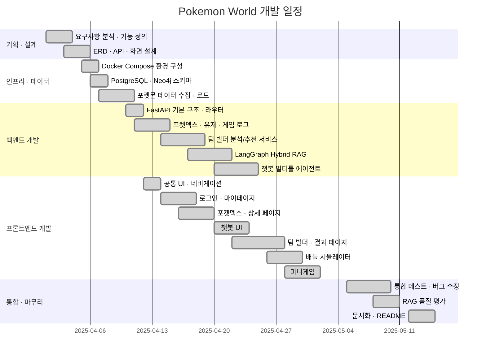

# Requirements & Testing

---

## 기능 요구사항

| ID | 기능 | 요구사항 | 우선순위 | 구현 |
|---|---|---|---|---|
| FR-01-1 | 인증 | GitHub OAuth 2.0 소셜 로그인 | 필수 | ✅ |
| FR-01-2 | 인증 | GitHub 통계 자동 수집 및 DB 저장 | 필수 | ✅ |
| FR-01-3 | 인증 | 쿠키 기반 세션 영속화 | 필수 | ✅ |
| FR-01-5 | 인증 | 비로그인 사용자 주요 기능 이용 | 필수 | ✅ |
| FR-02-1 | 포켓덱스 | 전체 목록 페이지네이션 | 필수 | ✅ |
| FR-02-2 | 포켓덱스 | 이름/ID/타입/특성 복합 필터 | 필수 | ✅ |
| FR-02-3 | 포켓덱스 | 포켓몬 상세 (스탯 · 타입 · 진화) | 필수 | ✅ |
| FR-03-1 | 챗봇 | 포켓몬 자연어 질의응답 | 필수 | ✅ |
| FR-03-2 | 챗봇 | SQL Tool Calling | 필수 | ✅ |
| FR-03-3 | 챗봇 | Vector + BM25 하이브리드 검색 | 필수 | ✅ |
| FR-03-4 | 챗봇 | Neo4j 그래프 검색 | 필수 | ✅ |
| FR-03-5 | 챗봇 | Tavily 웹 검색 폴백 | 선택 | ✅ |
| FR-03-6 | 챗봇 | 멀티턴 대화 히스토리 | 필수 | ✅ |
| FR-03-7 | 챗봇 | 세션 저장/불러오기 | 필수 | ✅ |
| FR-04-1 | 팀빌더 | 포켓몬 5마리 선택 UI | 필수 | ✅ |
| FR-04-2 | 팀빌더 | 타입 약점 · 저항 · 커버리지 분석 | 필수 | ✅ |
| FR-04-3 | 팀빌더 | LangGraph Hybrid RAG 해설 | 필수 | ✅ |
| FR-04-4 | 팀빌더 | 6번째 포켓몬 추천 + Re-ranking | 필수 | ✅ |
| FR-04-5 | 팀빌더 | 분석/추천 결과 DB 저장 | 필수 | ✅ |
| FR-04-6 | 팀빌더 | 마이페이지 히스토리 · 결과 복원 | 선택 | ✅ |
| FR-05-1 | 배틀 | 1v1 배틀 시뮬레이션 | 필수 | ✅ |
| FR-05-3 | 배틀 | AI 랩 배틀 대본 생성 | 선택 | ✅ |
| FR-05-4 | 배틀 | 스트리밍 응답 | 선택 | ✅ |
| FR-06-1 | 미니게임 | 실루엣 퀴즈 | 필수 | ✅ |
| FR-06-2 | 미니게임 | 메모리 카드 게임 | 필수 | ✅ |
| FR-06-3 | 미니게임 | 플레이 로그 DB 저장 | 선택 | ✅ |
| FR-07-1 | 마이페이지 | GitHub 프로필 카드 | 필수 | ✅ |
| FR-07-2 | 마이페이지 | 미니게임 통계 | 필수 | ✅ |
| FR-07-3 | 마이페이지 | 팀 빌더 히스토리 | 선택 | ✅ |
| FR-07-4 | 마이페이지 | 배지 시스템 (간토 8 + 관장 8) | 선택 | ✅ |

---

## 비기능 요구사항

| ID | 요구사항 | 상태 |
|---|---|---|
| NFR-01 | Docker Compose 단일 명령 전체 구동 | ✅ |
| NFR-02 | 백엔드 응답 p95 < 3초 (AI 제외) | ✅ |
| NFR-03 | AI API 타임아웃 60초 | ✅ |
| NFR-04 | Cross-encoder Re-ranking RAG 정밀도 향상 | ✅ |
| NFR-05 | 환경 변수로 모든 자격증명 관리 (.env) | ✅ |
| NFR-06 | PostgreSQL pgvector + Neo4j 이중 DB | ✅ |
| NFR-07 | LangSmith LLM 호출 추적 | ✅ |

---

## WBS

---

## 기능 테스트 체크리스트

| 기능 | 시나리오 | 기대 결과 |
|---|---|---|
| 로그인 | GitHub OAuth → 인증 완료 | 마이페이지 이동, 쿠키 저장 |
| 포켓덱스 | 타입 "불꽃" 필터 | 불꽃 타입만 표시 |
| 포켓덱스 | "피카츄" 검색 | 피카츄 카드 표시 |
| 팀 빌더 | 5마리 선택 → [팀 분석 & 추천] | 결과 페이지 이동, 분석+추천 카드 |
| 팀 빌더 | 로그인 후 분석 실행 | `team_build_logs`에 user_id 포함 저장 |
| 마이페이지 | Team Builder History | 이력 가로 카드 표시 |
| 마이페이지 | [결과 보기] 클릭 | team_result.py 결과 복원 |
| 챗봇 | "피카츄 스탯 알려줘" | SQL Tool 호출 후 스탯 응답 |
| 챗봇 | "리자드 진화 방법" | Graph Search 호출 후 진화 조건 응답 |
| 미니게임 | 실루엣 퀴즈 정답 | 게임 로그 저장, 도감 수집 반영 |
| 배틀 | 두 포켓몬 선택 후 배틀 | 턴제 배틀 진행, 타입 상성 데미지 |

---

## RAG 품질 평가 지표

| 지표 | 설명 |
|---|---|
| Faithfulness | 생성 답변이 검색 근거와 일치하는가 |
| Answer Relevancy | 질문에 적절히 응답하는가 |
| Context Recall | 필요한 근거 문서가 검색되었는가 |
| Hybrid Score 정확도 | 하이브리드 점수가 팀에 최적 포켓몬을 추천하는가 |
