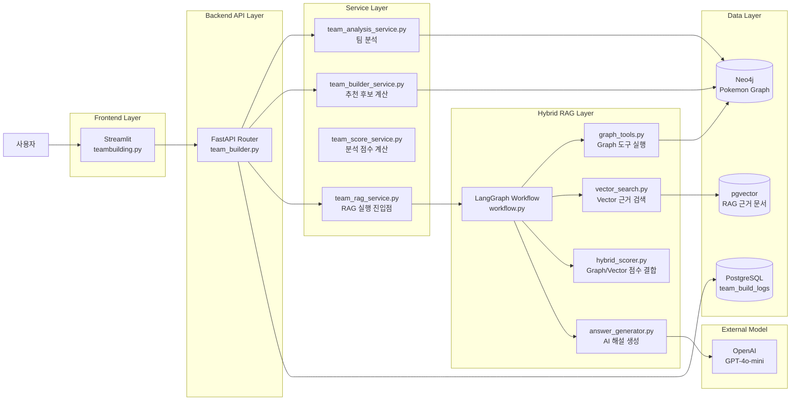
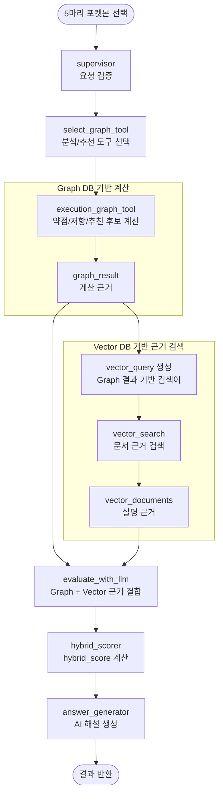
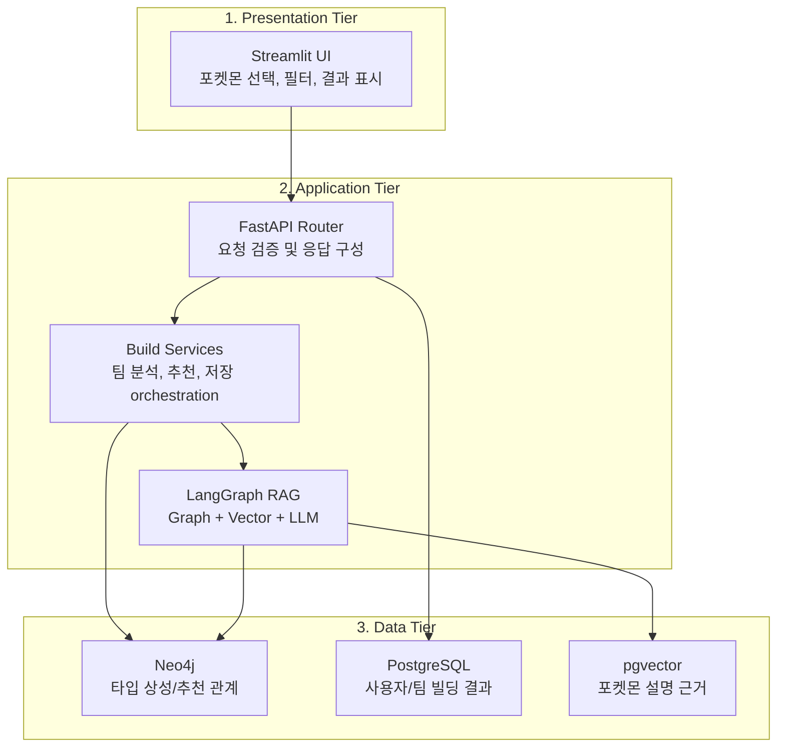
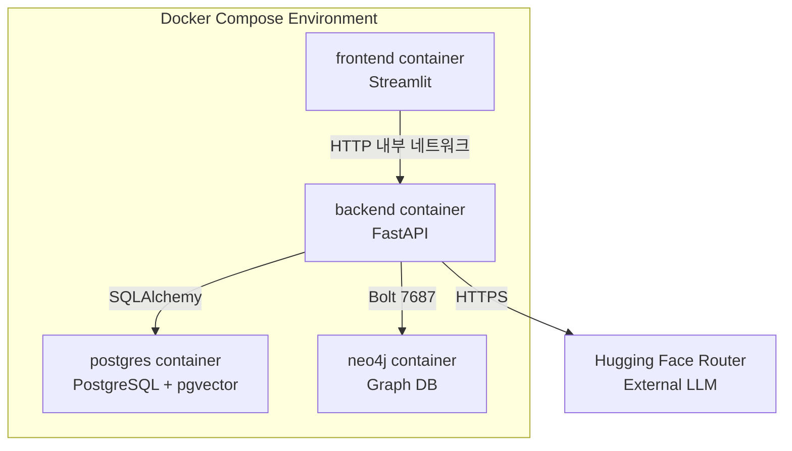
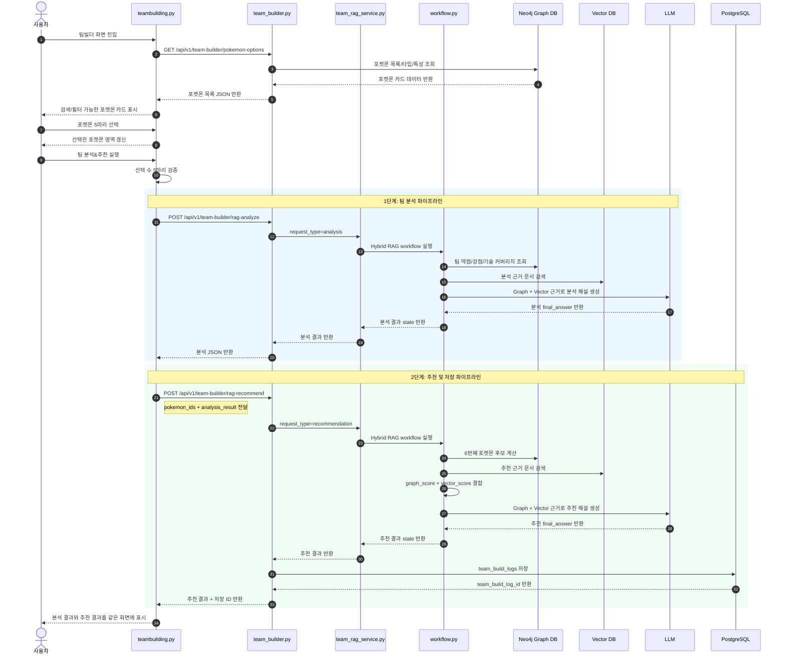
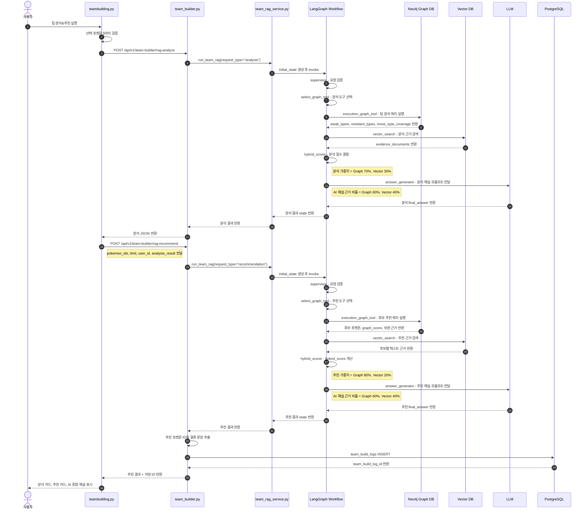
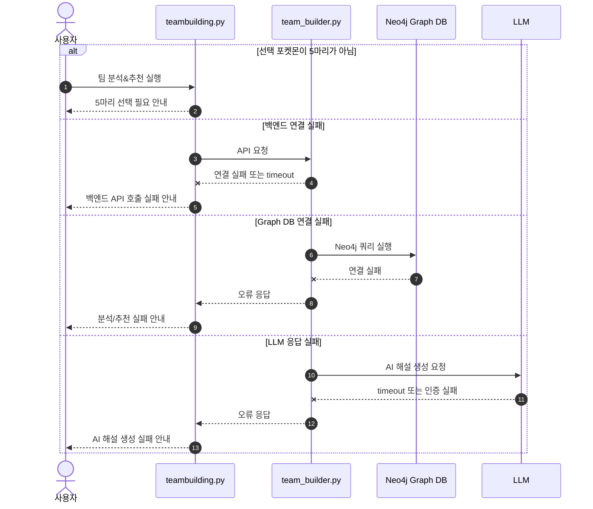
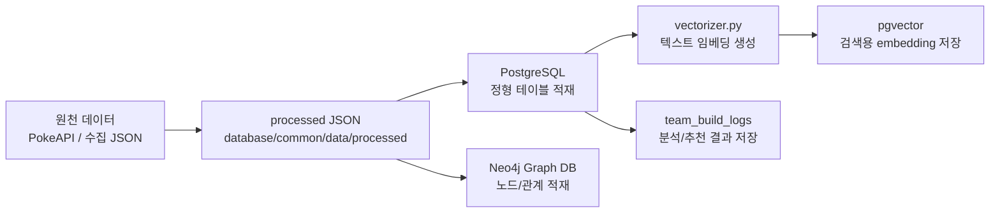
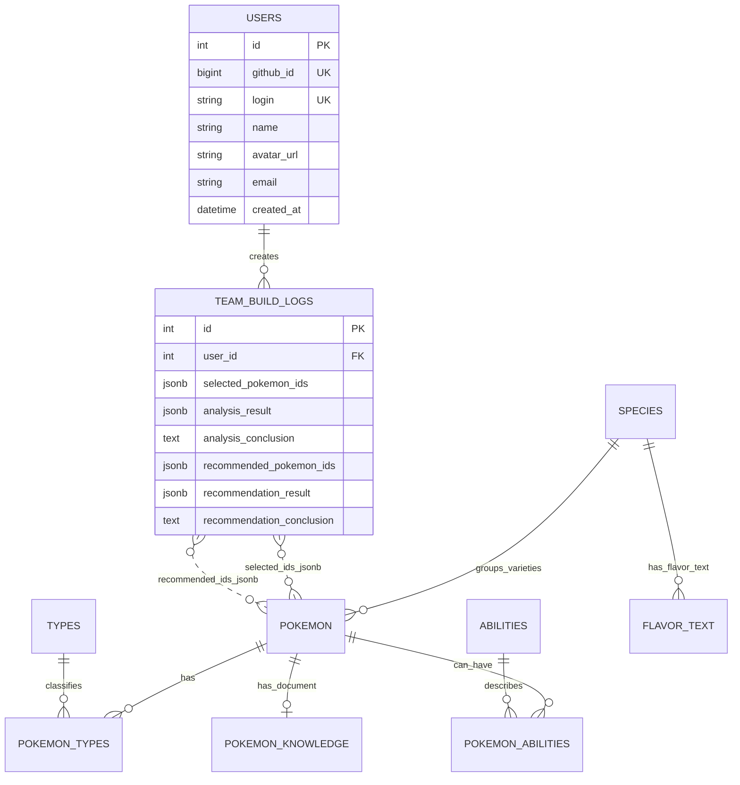

# 팀 빌더 (Team Builder)

LangGraph 기반 Graph-guided Hybrid RAG로 포켓몬 팀을 분석하고 6번째 포켓몬을 추천하는 기능

---

## 목차

1. [개요](#1-개요)
2. [요구사항](#2-요구사항)
3. [시스템 아키텍처](#3-시스템-아키텍처)
4. [시퀀스 다이어그램](#4-시퀀스-다이어그램)
5. [RAG 데이터 파이프라인](#5-rag-데이터-파이프라인)
6. [Hybrid RAG 가중치 정책](#6-hybrid-rag-가중치-정책)
7. [프롬프트 명세](#7-프롬프트-명세)
8. [ERD — team_build_logs](#8-erd--team_build_logs)
9. [API 명세](#9-api-명세)
10. [예외 처리](#10-예외-처리)

---

## 1. 개요

팀 빌더는 사용자가 포켓몬 5마리를 선택하면:
1. **덱 분석** — 선택 팀의 타입 약점, 방어 안정성, 기술 타입 커버리지를 분석
2. **6번째 추천** — Hybrid RAG(Graph + Vector)로 부족한 부분을 보완할 포켓몬 1~3순위 추천
3. **AI 해설** — Graph/Vector 근거를 바탕으로 LLM이 사용자 친화적 한국어 해설 생성

| 구분 | 내용 |
|---|---|
| 화면 | `frontend/pages/teambuilding.py` |
| API | `backend/routers/team_builder.py` |
| RAG 워크플로우 | `backend/team_build_rag/workflow.py` |
| Graph DB | Neo4j — 타입 상성, 약점 보완, 기술 커버리지 계산 |
| Vector DB | pgvector — 포켓몬 설명, 기술/특성 효과 근거 |
| LLM | OpenAI GPT-4o-mini |
| 결과 저장 | PostgreSQL `team_build_logs` |

---

## 2. 요구사항

| RQ-ID | 요구사항명 | 내용 | 중요도 |
|---|---|---|---:|
| TB-RQ-001 | 포켓몬 목록 조회 | 선택 가능한 포켓몬 목록 조회 (`pokemon_id < 10000`) | 5 |
| TB-RQ-002 | 포켓몬 검색 | 이름·도감번호로 포켓몬 검색 | 4 |
| TB-RQ-003 | 조건 필터링 | 세대/지방·타입·특성 조건으로 목록 필터링 | 4 |
| TB-RQ-004 | 5마리 선택 제한 | 정확히 5마리 선택 시에만 분석/추천 진행 가능 | 5 |
| TB-RQ-005 | 덱 분석 실행 | 선택 5마리의 타입 약점과 팀 커버리지 분석 (Graph DB 기반) | 5 |
| TB-RQ-006 | AI 분석 해설 | 분석 결과를 두괄식 AI 해설로 제공 (RAG 기반) | 4 |
| TB-RQ-007 | 추천 실행 조건 | 추천은 덱 분석 이후에만 실행 | 4 |
| TB-RQ-008 | 6번째 포켓몬 추천 | 부족한 방어/공격 커버리지 보완 포켓몬 1~3순위 추천 | 5 |
| TB-RQ-009 | 추천 이유 제공 | 보완 약점, 대표 기술, 기대 역할 설명 포함 | 5 |
| TB-RQ-010 | 결과 저장 | 분석/추천 결과를 `team_build_logs`에 저장 | 4 |
| TB-RQ-011 | 로그인 사용자 연결 | 로그인 사용자 결과는 `user_id`와 연결 저장 | 3 |
| TB-RQ-012 | 오류 안내 | API 실패·선택 부족·추천 조건 미충족 시 안내 | 4 |
| TB-RQ-013 | Hybrid RAG 가중치 정책 | 분석·추천·AI 해설 단계별 Graph/Vector 가중치 목적별 적용 | 4 |

---

## 3. 시스템 아키텍처

### 3-1. 전체 구성도



### 3-2. Graph-guided Hybrid RAG 내부 구성도

팀 빌더의 Hybrid RAG는 **병렬형이 아닌 Graph-guided 순차형**입니다. Graph DB가 먼저 계산하고, 그 결과로 Vector 검색어를 만듭니다.



### 3-3. 3-Tier 관점



### 3-4. 배포 구성



---

## 4. 시퀀스 다이어그램

### 4-1. 전체 처리 흐름



### 4-2. 팀 분석&추천 실행 상세 시퀀스 (가중치 포함)



### 4-3. 예외 처리 시퀀스



---

## 5. RAG 데이터 파이프라인

### 5-1. 데이터 준비 파이프라인



| 단계 | 설명 | 대표 파일 |
|---|---|---|
| 1. JSON 준비 | 전처리된 포켓몬 데이터를 processed/ 에 저장 | `database/common/data/processed/*.json` |
| 2. PostgreSQL 적재 | 포켓몬, 타입, 기술, 특성, 설명 데이터 저장 | `database/postgre/utils/db_loader.py` |
| 3. Graph DB 적재 | 포켓몬과 타입/기술/특성 관계를 Neo4j에 생성 | `database/graph/graph_loader.py` |
| 4. Vector 적재 | 설명 텍스트를 embedding으로 변환해 pgvector에 저장 | `database/postgre/utils/vectorizer.py` |
| 5. 결과 로그 저장 | 분석/추천 완료 시 팀빌더 결과를 PostgreSQL에 저장 | `crud.py`, `schemas.py` |

### 5-2. 저장소별 역할

| 저장소 | 팀빌더에서 맡는 역할 | 사용 이유 |
|---|---|---|
| PostgreSQL | 포켓몬 정형 데이터, 벡터 검색 대상 문서, 팀빌더 결과 로그 저장 | 테이블 기반 조회와 결과 보존에 적합 |
| Neo4j Graph DB | 타입 상성, 약점/저항, 기술 관계, 추천 후보 계산 | 포켓몬-타입-기술 관계 탐색에 적합 |
| pgvector | 포켓몬 설명, 기술 효과, 특성 효과 등 텍스트 근거 검색 | 자연어 설명 근거를 유사도 기반으로 검색 |
| LLM | 분석/추천 결과를 사용자 친화적인 한국어 해설로 변환 | 계산 결과를 설명 가능한 문장으로 정리 |

### 5-3. LangGraph 노드 역할

| 노드 | 역할 | 입력 | 출력 |
|---|---|---|---|
| `supervisor` | 요청이 유효한지 확인 | `pokemon_ids`, `request_type` | 정규화된 요청 상태 |
| `select_graph_tool` | 분석/추천 중 사용할 Graph 도구 선택 | `request_type` | `selected_graph_tool` |
| `execution_graph_tool` | Neo4j 기반 분석 또는 추천 실행 | `pokemon_ids`, `graph` | `graph_result` |
| `vector_search` | Graph 결과로 검색어를 만들고 pgvector 검색 | `graph_result` | `vector_query`, `vector_documents` |
| `evaluate_with_llm` | Graph와 Vector 근거를 하나의 context로 결합 | `graph_result`, `vector_documents` | `llm_evaluation` |
| `hybrid_scorer` | Graph 점수와 Vector 근거 점수를 결합 | `graph_result`, `vector_documents` | `reranked_result` |
| `answer_generator` | 최종 프롬프트를 만들고 LLM 해설 생성 | `reranked_result`, `vector_documents` | `final_answer` |

> `evaluate_with_llm`은 현재 구현에서 별도 LLM 호출 없이 Graph/Vector 근거를 묶는 context 구성 단계로 동작합니다.

### 5-4. LangGraph State 데이터

| 상태 키 | 의미 | 생성 단계 |
|---|---|---|
| `pokemon_ids` | 사용자가 선택한 포켓몬 ID 5개 | API 요청 |
| `request_type` | `analysis` 또는 `recommendation` | API 요청 / `supervisor` |
| `selected_graph_tool` | 실행할 Graph 도구 이름 | `select_graph_tool` |
| `graph_result` | Neo4j 기반 분석/추천 계산 결과 | `execution_graph_tool` |
| `vector_query` | Vector DB 검색용 문장 | `vector_search` |
| `vector_documents` | 검색된 설명 근거 문서 | `vector_search` |
| `llm_evaluation` | Graph/Vector 근거 결합 context | `evaluate_with_llm` |
| `reranked_result` | hybrid_score가 반영된 결과 | `hybrid_scorer` |
| `final_answer` | 사용자에게 보여줄 AI 종합 해설 | `answer_generator` |
| `team_build_log_id` | DB 저장 후 생성된 로그 ID | `team_builder.py` |

---

## 6. Hybrid RAG 가중치 정책

가중치 정책은 `backend/team_build_rag/scoring_policy.py`에서 관리합니다.

| 단계 | Graph DB | Vector DB | 적용 위치 | 설계 근거 |
|---|---:|---:|---|---|
| 덱 분석 | 70% | 30% | `hybrid_scorer.py` | 타입 상성 계산이 핵심이며, Vector는 설명 근거 보강 역할 |
| 포켓몬 추천 | 80% | 20% | `hybrid_scorer.py` | 추천 순위는 약점 보완·타입 저항·종족값·기술 커버리지 계산이 최우선 |
| AI 해설 생성 | 60% | 40% | `answer_generator.py` | 계산 근거를 우선 신뢰하되, 문서 근거로 설명의 풍부함 보강 |

**graph_score 정규화 기준**

추천 후보의 원본 `graph_score`는 최대 150점을 기준으로 0~100점으로 정규화한 뒤 `vector_score`와 결합합니다.

| 항목 | 최대 점수 |
|---|---:|
| 약점 보완 | 125점 |
| 기본 능력치 | 5점 |
| 기술 타입 커버리지 | 20점 |
| 합계 | 150점 |
| 타입 중복 감점 | 최대 -40점 |

---

## 7. 프롬프트 명세

팀 빌더 LLM 해설은 `backend/team_build_rag/answer_generator.py`에서 두 가지 프롬프트를 사용합니다.

### 설계 원칙

| 원칙 | 설명 |
|---|---|
| 결론 우선 | 첫 문단은 반드시 `결론:`으로 시작 (두괄식) |
| Graph DB 우선 | 타입 배율, 추천 순위, 점수는 Graph DB 계산 결과와 `hybrid_score`를 우선 신뢰 |
| Vector DB 보조 | Vector 검색 근거는 설명을 보강하는 용도로만 사용 |
| 근거 기반 답변 | 입력 데이터에 없는 타입·기술·점수를 확정적으로 생성하지 않음 |
| 한국어 설명 | 사용자가 바로 이해할 수 있는 자연스러운 한국어 |

### 7-1. TB-PROMPT-ANALYSIS-001 — 덱 분석 프롬프트

| 항목 | 내용 |
|---|---|
| 함수 | `_build_analysis_prompt()` |
| 호출 시점 | 사용자가 팀 분석&추천 실행 후 덱 분석 결과 생성 시 |
| 주요 입력 | `selected_pokemon`, `weak_types`, `resistant_types`, `move_type_coverage`, `insights`, `vector_documents` |
| 출력 형식 | 첫 문단 `결론:` + 세부 분석 4~6개 문단 |
| 설명 비중 | Graph DB 근거 60% + Vector DB 근거 40% |

핵심 지시사항:
- 첫 문단은 반드시 `결론:`으로 시작
- 현재 덱의 핵심 판단과 6번째 포켓몬 방향을 2~3문장으로 먼저 요약
- 약점·방어 안정성·기술 커버리지 근거를 단순 나열이 아닌 원인 중심으로 설명
- 타입 배율과 점수는 Graph DB 결과를 우선 신뢰

**출력 예시**

```
결론: 현재 덱은 고스트 포켓몬 중심의 공격형 팀으로, 가장 주의해야 할 약점은 바위 타입 공격입니다.
6번째 포켓몬은 바위 공격을 반감하거나 무효화할 수 있는 포켓몬을 고려하는 것이 좋습니다.
```

### 7-2. TB-PROMPT-RECOMMEND-001 — 추천 프롬프트

| 항목 | 내용 |
|---|---|
| 함수 | `_build_recommendation_prompt()` |
| 호출 시점 | 5마리 팀 기준 6번째 포켓몬 후보 추천 시 |
| 주요 입력 | `analysis`, `recommendations`, `hybrid_policy`, `useful_moves`, `vector_documents` |
| 출력 형식 | 첫 문단 `결론:` + 1순위 상세 이유 + 2~3순위 비교 |

핵심 지시사항:
- 첫 문단은 반드시 `결론:`으로 시작
- 1순위 추천 포켓몬을 가장 먼저 명시
- 어떤 약점 타입을 어떤 저항/무효 관계로 보완하는지 구체적 설명
- `useful_moves`에 있는 기술명을 활용해 주력기, 견제기, 보조 활용 상황 설명
- 추천 순위와 최종 점수는 `hybrid_score`를 우선 신뢰

**금지사항**

| 금지 | 이유 |
|---|---|
| Graph DB에 없는 타입 배율 임의 생성 | 오류 정보 전달 방지 |
| 추천 순위 LLM 임의 변경 | Hybrid Score 기반 순위 무결성 유지 |
| `useful_moves`에 없는 기술 확정적 추천 | 사실이 아닌 기술 정보 차단 |
| "반드시", "무조건" 같은 단정 표현 | 근거 없는 과잉 확언 방지 |
| 영어 중심 답변 | 사용자 친화성 |

---

## 8. ERD — team_build_logs

### 8-1. 논리 ERD



### 8-2. team_build_logs 컬럼 상세

| 컬럼 | 타입 | 필수 | 설명 |
|---|---|---:|---|
| `id` | `INTEGER` | Y | 팀 빌딩 저장 기록의 고유 ID |
| `user_id` | `INTEGER` | N | 로그인 사용자의 `users.id`. 비로그인 시 `NULL` 허용 |
| `selected_pokemon_ids` | `JSONB` | Y | 사용자가 선택한 5마리 포켓몬 ID 배열 |
| `analysis_result` | `JSONB` | N | 팀 분석 화면에 표시되는 전체 분석 결과 |
| `analysis_conclusion` | `TEXT` | N | 분석 AI 해설 중 `결론:` 문장만 추출한 요약 |
| `recommended_pokemon_ids` | `JSONB` | N | 추천된 1~3순위 포켓몬 ID 배열 |
| `recommendation_result` | `JSONB` | N | 추천 화면에 표시되는 전체 추천 결과 |
| `recommendation_conclusion` | `TEXT` | N | 추천 AI 해설 중 `결론:` 문장만 추출한 요약 |

### 8-3. 설계 근거

| 결정 | 이유 |
|---|---|
| 분석+추천을 하나의 로그로 통합 | 사용자 관점에서 한 번의 실행 결과는 하나의 묶음 — 이력 조회·재현에 유리 |
| 포켓몬 ID를 JSONB 배열로 저장 | 결과 스냅샷 보존이 목적 — 별도 조인 테이블보다 구현 부담이 낮음 |
| 전체 결과를 JSONB로 저장 | 응답 구조 확장에 유연하게 대응 — 컬럼 추가 없이 스냅샷 보존 |
| 결론 문장을 별도 TEXT 컬럼으로 분리 | 목록·이력 화면에서 빠른 조회를 위해 JSONB 파싱 없이 결론만 표시 |
| `user_id`를 nullable로 설정 | 비로그인 사용자도 기능 테스트 가능하도록 허용 |

---

## 9. API 명세

| API | 메서드 | 역할 |
|---|---|---|
| `/api/v1/team-builder/pokemon-options` | GET | 팀 빌더 카드 목록 조회 |
| `/api/v1/team-builder/analyze` | POST | Graph DB 기반 기본 팀 분석 |
| `/api/v1/team-builder/recommend` | POST | Graph DB 기반 기본 추천 |
| `/api/v1/team-builder/rag-analyze` | POST | Hybrid RAG 기반 팀 분석 해설 생성 |
| `/api/v1/team-builder/rag-recommend` | POST | Hybrid RAG 기반 추천 해설 생성 및 결과 저장 |

---

## 10. 예외 처리

| 지점 | 가능한 문제 | 대응 방향 |
|---|---|---|
| Frontend → Backend | 백엔드 컨테이너 미실행, 서비스명 오류 | `backend:8000` 연결 확인 |
| Backend → Neo4j | 인증 실패, Bolt 포트 오류, 그래프 미적재 | `NEO4J_AUTH`, `bolt://neo4j:7687`, graph_loader 실행 확인 |
| Backend → PostgreSQL | 테이블 미생성, DB 연결 실패 | 마이그레이션 또는 schema.sql 실행 확인 |
| RAG → Hugging Face | 토큰 누락, 추론 크레딧 부족, 모델 권한 오류 | Hugging Face 토큰, Billing, 모델 설정 확인 |
| Vector 검색 | embedding 누락, 검색 결과 부족 | pgvector 적재 상태 및 검색 fallback 확인 |
| Graph DB 데이터 미적재 | 타입/기술 관계 계산 누락 | `database/graph/graph_loader.py` 재실행 |
