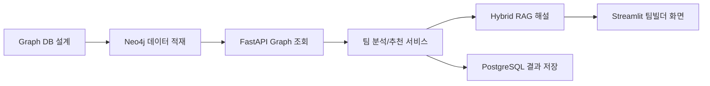
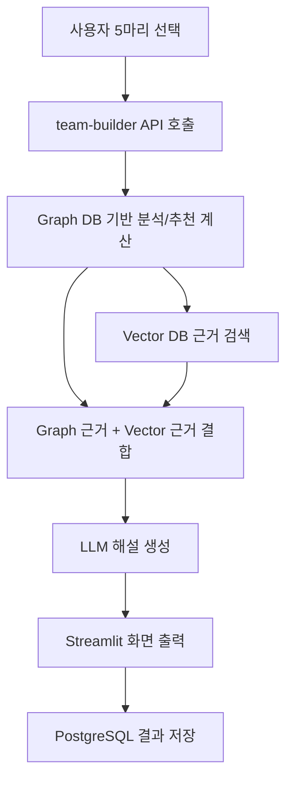
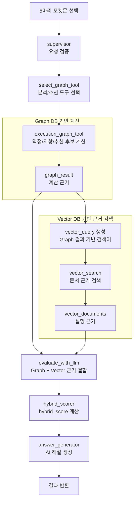

# SKN27기 3조 포켓몬 AI 어시스턴트 프로젝트 기여 내용
 
> 주요 담당 범위는 **Graph DB 설계 및 적재**와 **팀빌더 분석/추천 기능 구현**입니다.

---

## 담당 영역 한눈에 보기

| 파일 / 모듈 | 분류 | 한 줄 설명 |
|---|---|---|
| `database/graph/graph_schema.md` | Graph DB 설계 | 팀빌더 분석/추천에 필요한 노드, 관계, 설계 근거 정리 |
| `database/graph/constraints.cypher` | Graph DB 제약조건 | Neo4j 노드 중복 방지 및 주요 조회 기준 정의 |
| `database/graph/graph_loader.py` | Graph DB 적재 | JSON 기반 포켓몬 데이터를 Neo4j 노드와 엣지로 적재 |
| `backend/graph/neo4j_client.py` | Graph DB 연결 | FastAPI 백엔드에서 Neo4j에 접근하기 위한 클라이언트 구성 |
| `backend/graph/queries.py` | Graph DB 쿼리 | 팀 분석/추천에 필요한 Cypher 쿼리 초안 및 조회 기준 관리 |
| `backend/routers/team_builder.py` | API 라우터 | 팀빌더 포켓몬 목록, 분석, 추천, RAG 분석/추천 API 제공 |
| `backend/build_services/` | 서비스 로직 | 팀 분석, 추천 점수 계산, 인사이트 생성, RAG 실행, 결과 저장 처리 |
| `backend/team_build_rag/` | Hybrid RAG | Graph DB 근거와 Vector DB 근거를 결합해 AI 해설 생성 |
| `frontend/pages/teambuilding.py` | 프론트엔드 | 포켓몬 선택, 필터, 분석/추천 결과 화면 구현 |
| `backend/models.py`, `backend/schemas.py`, `backend/crud.py` | DB 저장 | 팀빌더 분석/추천 결과를 PostgreSQL에 저장하는 구조 추가 |

---

## 담당 범위 요약

팀빌더 기능은 단순히 포켓몬을 고르고 추천하는 화면이 아니라, 선택한 5마리의 타입 조합과 약점, 기술 폭, 추천 후보의 보완 능력을 계산한 뒤 AI 해설까지 제공하는 기능입니다.

따라서 작업 범위는 크게 다음 두 가지로 나뉩니다.

- **Graph DB 설계 및 적재**: 팀 추천에 필요한 포켓몬, 타입, 기술, 특성, 타입 상성 관계를 Neo4j 그래프로 구성
- **팀빌더 구현**: 사용자가 5마리를 선택하면 덱 분석과 6번째 포켓몬 추천 결과를 화면과 API로 제공

---

## 1. Graph DB 설계 및 적재

### 주요 구현 내용

- 포켓몬 팀 분석에 필요한 핵심 노드와 관계를 정의했습니다.
- `Pokemon`, `Type`, `Move`, `Ability`, `Generation`, `Item` 등 팀빌더에서 활용 가능한 데이터를 Graph DB 기준으로 정리했습니다.
- 포켓몬의 타입, 배울 수 있는 기술, 타입 상성, 기술 타입 커버리지, 약점/저항 관계를 추천 근거로 사용할 수 있도록 설계했습니다.
- `AGAINST` 원본 관계와 `WEAK_AGAINST`, `RESISTANT_TO`, `IMMUNE_TO` 같은 파생 관계를 함께 두어 원본 데이터 보존과 빠른 조회를 모두 고려했습니다.
- `graph_loader.py`를 통해 `database/common/data/processed`의 JSON 데이터를 Neo4j에 자동 적재하도록 구현했습니다.
- `constraints.cypher`를 작성해 주요 노드의 중복 생성을 방지하고, 조회 안정성을 확보했습니다.

### 핵심 기술 포인트

- **Neo4j + Cypher 기반 관계형 탐색**
  - 포켓몬과 타입, 기술, 상성 정보를 관계 중심으로 탐색할 수 있게 구성했습니다.
  - 예를 들어 “현재 팀이 약한 타입을 어떤 후보 포켓몬이 저항/무효로 받을 수 있는가?” 같은 질문을 Cypher로 계산할 수 있게 했습니다.

- **원본 관계와 파생 관계 분리**
  - `AGAINST`는 타입 상성 원본 배율 데이터를 유지하는 관계입니다.
  - 파생 관계는 추천/분석에서 자주 쓰는 조건을 빠르게 찾기 위한 관계입니다.
  - 이 구조 덕분에 원본 데이터 검증과 서비스용 빠른 조회를 동시에 가져갈 수 있었습니다.

- **팀빌더 기준 데이터 정제**
  - 팀 선택 화면에서는 일반적인 팀 빌딩 상황을 고려해 특수 폼, 메가 진화, 거다이맥스 포켓몬 노출을 제한하는 방향으로 정리했습니다.
  - 실서비스 기준으로 사용자가 선택 가능한 후보군과 분석 가능한 데이터 범위를 분리하려고 했습니다.

### 아쉬웠던 점

- 초기에 `Species`, `Nature`, `Team`, `TeamMember` 등 팀빌더 범위를 넘어서는 노드까지 함께 고민하면서 스키마가 다소 복잡해졌습니다.
- `EVOLVES_TO`, `FROM`, `IS_SPECIES` 같은 관계는 실제 서비스 목적과 맞는지 다시 검토하는 과정이 필요했습니다.
- Neo4j Browser에서 노드가 삭제되어도 라벨 토큰이 남아 보이는 경우가 있어, 실제 데이터 삭제 여부와 화면 표시를 구분하는 데 시간이 걸렸습니다.
- Graph DB는 “데이터를 연결하는 것”보다 “어떤 질문을 빠르게 답하게 만들 것인가”가 더 중요하다는 점을 많이 체감했습니다.

---

## 2. 팀빌더 기능 구현

### 주요 구현 내용

- `frontend/pages/teambuilding.py`에서 팀빌더 화면을 구현했습니다.
- 사용자는 포켓몬을 검색하고, 타입/세대/특성/도감번호 기준으로 필터링한 뒤 5마리를 선택할 수 있습니다.
- 선택한 5마리를 기준으로 다음 정보를 분석하도록 구현했습니다.
  - 팀의 주요 약점 타입
  - 방어 안정성이 좋은 타입
  - 기술 타입 커버리지
  - 6번째 포켓몬 추천 방향
- 추천 버튼 실행 시 6번째 후보 포켓몬 1~3순위를 계산하고, 추천 점수와 추천 이유를 함께 제공합니다.
- 분석 결과와 추천 결과를 PostgreSQL `team_build_logs` 테이블에 저장하도록 구성했습니다.

### 핵심 기술 포인트

- **FastAPI 기반 팀빌더 API**
  - `backend/routers/team_builder.py`에서 팀빌더 전용 API를 구성했습니다.
  - 포켓몬 선택 목록 조회, 덱 분석, 추천, RAG 분석/추천 엔드포인트를 분리했습니다.

- **서비스 레이어 분리**
  - `backend/build_services` 폴더에서 팀 분석, 추천 계산, 인사이트 생성, RAG 실행, 결과 저장 역할을 나눴습니다.
  - 라우터가 모든 계산을 직접 하지 않도록 구성해 유지보수성을 높였습니다.

- **추천 점수 계산**
  - 추천 후보는 약점 보완, 기본 능력치, 기술 커버리지, 타입 중복 감점 등을 기준으로 계산했습니다.
  - 이후 Graph Score와 Vector Score를 결합하는 Hybrid Score 구조로 확장했습니다.

- **Hybrid RAG 해설**
  - Graph DB 계산 결과를 먼저 만들고, 그 결과를 기반으로 Vector DB 문서 근거를 검색합니다.
  - LLM은 Graph 결과와 Vector 근거를 함께 받아 분석/추천 해설을 생성합니다.

### 팀빌더 처리 흐름

### 아쉬웠던 점

- 프론트와 백엔드 응답 키 이름이 맞지 않아 `score`, `hybrid_score`, `graph_score`, `vector_score` 관련 오류가 발생했습니다.
- 추천 점수 배율은 단순 구현보다 “왜 이런 점수를 주는가?”를 설명할 수 있어야 해서 문서화와 설계 근거 정리가 중요했습니다.

---

## 3. Hybrid RAG 구성

### 주요 구현 내용

- `backend/team_build_rag` 폴더에 팀빌더 전용 Hybrid RAG 구조를 구성했습니다.
- Graph DB 계산 결과를 중심으로 Vector DB 문서 근거를 결합하는 방식을 사용했습니다.
- 분석과 추천 모두 AI 해설을 제공하지만, LLM이 임의로 말하지 않도록 Graph DB와 Vector DB 근거를 함께 전달했습니다.

### RAG 처리 흐름

### 핵심 기술 포인트

- Graph DB는 “정량 계산”에 강점이 있습니다.
- Vector DB는 “설명 근거와 문맥 보강”에 강점이 있습니다.
- 팀빌더에서는 두 방식을 결합해 추천 순위와 해설의 신뢰도를 높이는 방향으로 설계했습니다.

---

## 4. 결과 저장 구조

### 주요 구현 내용

- 팀빌더 분석과 추천 결과를 PostgreSQL에 저장하는 구조를 추가했습니다.
- 저장 대상은 사용자가 선택한 포켓몬, 분석 결과, 분석 결론, 추천 포켓몬, 추천 결과, 추천 결론입니다.

### 저장 데이터 예시

| 컬럼 | 설명 |
|---|---|
| `id` | 팀빌더 로그 고유 ID |
| `user_id` | 로그인 사용자 ID |
| `selected_pokemon_ids` | 사용자가 선택한 5마리 포켓몬 ID |
| `analysis_result` | 덱 분석 전체 결과 JSON |
| `analysis_conclusion` | 분석 AI 해설 중 결론 문장 |
| `recommended_pokemon_ids` | 추천된 1~3순위 포켓몬 ID |
| `recommendation_result` | 추천 전체 결과 JSON |
| `recommendation_conclusion` | 추천 AI 해설 중 결론 문장 |

### 아쉬웠던 점

- 처음에는 분석과 추천 저장 시점을 어떻게 나눌지 기준이 명확하지 않았습니다.
- 분석만 실행한 경우와 추천까지 실행한 경우를 같은 테이블에서 관리해야 해서 저장 흐름을 다시 정리했습니다.
- 로그인 사용자 ID를 프론트에서 백엔드로 안정적으로 전달하는 구조를 확인해야 했습니다.

---

## 전체 회고

처음에는 “5마리 포켓몬을 고르면 6번째 포켓몬을 추천한다”는 단순한 기능처럼 보였지만, 실제로는 데이터 설계, Graph DB 모델링, 추천 점수 정책, RAG 해설, UI 상태 관리, 결과 저장까지 이어지는 꽤 큰 기능이었습니다.

특히 Graph DB를 설계하면서 가장 많이 느낀 점은, 그래프는 데이터를 많이 연결한다고 좋은 것이 아니라 **서비스에서 답해야 하는 질문을 기준으로 관계를 설계해야 한다**는 점이었습니다. 팀빌더에서는 “현재 팀이 어떤 타입에 약한가?”, “어떤 후보가 그 약점을 보완하는가?”, “추천 이유를 사용자에게 어떻게 설명할 것인가?”가 핵심 질문이었고, 이 질문에 맞춰 노드와 관계를 계속 다듬어야 했습니다.

또한 추천 점수는 단순히 숫자를 더하는 문제가 아니라, 사용자가 납득할 수 있는 근거가 있어야 했습니다. 그래서 약점 보완 점수, 능력치 점수, 기술 커버리지, 타입 중복 감점의 비중을 계속 조정했고, 최종적으로 문서에서도 설명 가능한 형태로 정리하려고 했습니다.

RAG 구현 과정에서는 Graph DB와 Vector DB의 역할을 분리하는 것이 중요했습니다. Graph DB는 계산과 순위 판단의 중심이고, Vector DB는 해설을 풍부하게 만드는 근거 역할을 맡도록 했습니다. 이 구조를 통해 추천 결과가 단순 점수표로 끝나지 않고, 사용자가 이해할 수 있는 자연어 설명으로 이어질 수 있었습니다.

Streamlit 기반 UI는 빠르게 만들 수 있었지만, 카드형 UI나 고정 버튼, 스크롤 영역 등 세밀한 화면 제어에서는 시행착오가 많았습니다.

그래도 이번 작업을 통해 Graph DB, FastAPI, Streamlit, RAG, PostgreSQL 저장까지 하나의 기능 안에서 연결해보는 경험을 할 수 있었습니다. 단순히 “돌아가는 기능”을 만드는 것보다, 왜 이렇게 설계했는지 설명할 수 있는 구조를 만드는 것이 훨씬 중요하다는 점을 배웠습니다.

---

## 다음 개선 방향

- DB 만들기 전에 도메인 공부를 더 상세히 분석하기기
- 추천 점수 정책을 실제 샘플 팀으로 더 많이 검증하기
- LLM 프롬프트 길이를 줄여 토큰 비용과 Payload 오류 줄이기
- Graph DB 스키마 문서와 실제 적재 결과를 지속적으로 동기화하기

